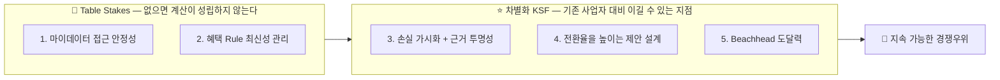

# 03. Top 5 핵심 성공 요인(KSF) — Evidence & Analysis

| 항목 | 내용 |
| --- | --- |
| 분석 대상 | 마이데이터 기반 미래지출 반영 카드조합 재설계 서비스의 성공 조건 |
| 정본 | `윤정/확정본/03_KSF.md` |
| Deck | p7 (`master-deck/p06-07_가치사슬_KSF.md`) |
| 확인일 기준 | 별도 표기 없으면 2026-08-20 |

---

## 0. 최종 판단

**5개 KSF는 두 종류로 갈린다.** 1·2번은 **Table Stakes**(없으면 계산 자체가 성립하지 않는 진입 전제조건 — 기존 사업자는 이미 갖고 있어 경쟁우위를 주지 않는다), 3~5번이 **실제 차별화 KSF**다.

**3번이 핵심 KSF다** — 기존 사업자 대비 실제로 이길 수 있는 유일한 지점이기 때문이다.

| 순위 | KSF | 구분 | 왜 이 순서인가 |
| :---: | --- | :---: | --- |
| 1 | 마이데이터 접근 안정성 | 🧱 Table Stakes | 인가 vs 제휴 결정을 가장 먼저 확정해야 나머지가 성립 |
| 2 | 혜택 Rule 최신성 관리 | 🧱 Table Stakes | 계산 결과 신뢰도를 직접 결정. 후발주자에게도 동일한 진입장벽 |
| 3 | **손실 가시화 + 계산 근거 투명성** | ⭐ **핵심 차별화** | 대체재("그냥 유지하기")를 이기는 **유일한 힘** |
| 4 | 전환율을 높이는 제안 설계 | ⭐ 차별화 | 계산 결과 제시만으로는 전환이 보장되지 않는다 |
| 5 | Beachhead 도달력 | ⭐ 차별화 | 트래픽 격차를 정면으로 좁히지 않고 좁은 진입로 확보 |

**순서를 정하는 기준은 의존성이다** — 마이데이터 접근·Rule 데이터 없이는 계산 자체가 성립하지 않으므로 1·2번은 항상 선행한다. 3번은 시스템 설계 초기부터 반영해야 나중에 되돌리기 어렵다.

---

## 1. 상세표 — KSF 5개와 판단 근거

| # | KSF | 판단 근거 | 근거 등급 | 대응 활동·기능 |
| :---: | --- | --- | :---: | --- |
| 1 | 🔐 **마이데이터 데이터 접근의 안정적 확보** | 카드 이용내역은 마이데이터 API로만 제공되고 오픈뱅킹으로는 제공되지 않는다. 대체 공급자가 없는 높은 공급자 교섭력을 형성하며, 투입·조달의 핵심 원자재이자 기업 인프라의 핵심 과제(직접 인가 vs 제휴)다. **이 채널이 없으면 서비스 전체가 성립하지 않는다** | 🔵 | [02](02_Value_Chain.md) 투입·조달·기업 인프라 / F-02 / D1 |
| 2 | 📋 **카드 혜택 Rule의 최신성·정확성 관리 역량** | Rule(전월실적 구간·통합할인한도·제외 항목)이 8개 카드사·겸영은행 약관에 파편화되어 있고 통합 공식 API가 없다. 이 데이터 운영 비용은 **후발주자에게도 동일하게 적용되는 진입장벽**이며, 갱신·검증 속도가 계산 결과의 신뢰도를 직접 결정한다 | 🔵 | `rule_version` 버전관리 / 최신성 경고 / 갱신 지연 30일 초과 시 계산 대상 제외 |
| 3 | 💡 **놓치는 혜택을 손실로 보여주고, 그 숫자를 믿게 만드는 것** | 구매자 교섭력과 대체재 위협이 모두 높고 "그냥 기존 카드를 유지하는 것"이 가장 강력한 대체재다. 이를 상쇄하려면 **①동기 + ②신뢰**가 함께 필요하다 | ⚪ (구성 사실은 🔵) | F-06 근거 공개 / 손실 가시화 문구 / 계산·설명 분리 |
| 4 | 📈 **전환율을 높이는 제안 설계 역량** | 계산상 유리한 조합을 제시해도 사용자가 실제로 전환하지 않으면 서비스 가치(조합안 선택률)가 증명되지 않는다. 전환율은 **부담 없이 실행할 수 있도록 제안 자체를 설계**하는 데서 나온다 | ⚪ | 효과 큰 카드부터 단계적 전환(F-07 Could) / 여러 안을 늘어놓지 않고 **결론을 하나로 압축**(F-04) |
| 5 | 🎯 **Beachhead(혼인) 채널을 통한 초기 도달력** | 카드고릴라 MAU 140만·뱅크샐러드 카드추천 130만 등 기존 경쟁자가 이미 큰 트래픽을 확보했다. 격차를 정면으로 좁히기보다 **Trigger 감지 가능성이 높은 세그먼트**로 좁지만 확실한 진입로를 확보하는 것이 현실적이다 | 🔵 (지표) + ⚪ (전략) | 웨딩업체 제휴 / Concierge Test로 도달률·전환율 실측 |

### 1-1. KSF 3의 구조 — 왜 둘이 함께여야 하나

| 축 | 내용 | 하나만 있으면 |
| :---: | --- | --- |
| **① 동기** | 지금 카드를 그대로 쓰면 이번 지출에서 얼마를 놓치고 있는지를 **손실로** 보여준다 (예: *"지금 카드로는 혜택 0원, B카드로 바꾸면 8,000원 더 받는다"*) | **"과장 광고 아니냐"는 의심**을 산다 |
| **② 신뢰** | 그 격차 숫자가 진짜 계산이라는 걸 사용자가 **검증할 수 있게** 계산 근거를 그대로 공개한다 | 숫자는 투명한데 **"그래서 뭐가 달라지는데"라는 무관심**을 부른다 |

**둘이 같이 있어야 실제로 카드를 바꾸는 행동까지 이어진다.**

- **"계산은 규칙 엔진, AI는 설명"** 원칙이 ②의 기술적 구현 조건이다.
- 단종카드 자동대체 후 "혜택 불일치" 민원이 이미 존재한다는 사실(🔵)은 **근거 없는 자동 재배치에 대한 불신이 시장에 이미 형성되어 있다**는 뜻이라 ②가 왜 필요한지를 뒷받침한다.
- 그러나 **실제로 "유지하기"라는 대체재를 이기는 힘은 ①에서 나온다.** ②는 ①을 믿게 만드는 장치다.

### 1-2. Table Stakes vs 차별화 KSF — 왜 이렇게 나누는가



**기존 사업자(뱅크샐러드·토스·카카오페이)는 1·2번을 이미 갖고 있다** 🔵 → [01](01_Five_Forces.md) 1-3절. 그래서 1·2번을 잘하는 것은 **경쟁우위가 아니라 자격 조건**이다.

> ⚠️ **문서 간 긴장 1건** — [01](01_Five_Forces.md) 종합은 데이터 운영 역량을 **방어선**이라 하고, 이 파일은 같은 것을 **Table Stakes(경쟁우위 아님)**로 분류한다. 모순이 아니라 **관점 차이**다 — 후발 소규모 진입자에게는 진입장벽(방어선)으로 작동하지만, 이미 인가를 가진 상위 사업자를 상대로는 우위를 주지 않는다. `효진/확정본/README.md` 3절 🟠 4번이 지적한 항목이며, 이 파일은 **"상위 사업자 대비 Table Stakes / 후발주자 대비 방어선"**으로 정리해 둔다.

---

## 2. 산식·계산

정량 산식은 없다. **우선순위 결정 규칙**이 이 방법론의 계산이다.

```
우선순위 = 의존성 순서 우선,  동순위 내에서는 "기존 사업자 대비 우위 가능성" 순

1단계: 의존성 판정 — 이것 없이 뒤 항목이 성립하는가?
        아니오 → Table Stakes (항상 선행)
2단계: 차별화 판정 — 기존 사업자가 이미 갖고 있는가?
        예   → Table Stakes
        아니오 → 차별화 KSF
3단계: 차별화 KSF 내 순서 — 대체재(현상 유지)를 이기는 힘의 크기 순
```

**대입 결과**

| KSF | 1단계 의존성 | 2단계 기존 보유 | 판정 |
| --- | :---: | :---: | :---: |
| 마이데이터 접근 | 없으면 계산 불성립 | 🔵 보유 | Table Stakes |
| Rule 최신성 | 없으면 계산 불성립 | 🔵 보유 | Table Stakes |
| 손실 가시화 + 근거 투명성 | 계산은 성립 | ✗ 없음(근거공개 ◐) | **차별화 1** |
| 제안 설계 | 계산은 성립 | ✗ 없음 | 차별화 2 |
| Beachhead 도달력 | 계산은 성립 | 해당 없음(트래픽은 이미 보유) | 차별화 3 |

---

## 3. 출처·확인일

| 주장 | 등급 | 출처 | 확인일 |
| --- | :---: | --- | --- |
| 카드 이용내역은 마이데이터 API로만 제공, 오픈뱅킹 불가 | 🔵 | 금융위원회 보도자료 2024.12.30 | 2026-08-19 |
| 카드 혜택 Rule 공식 통합 API 없음 — 8개 카드사·겸영은행 파편화 | 🔵 | 카드사 약관 실측 | 2026-08 |
| 카드고릴라 MAU 약 140만 | 🔵 | 이데일리·마켓인 2025.07 · 인사이트코리아 | 2026-08-20 |
| 뱅크샐러드 카드추천 이용자 약 130만 | 🔵 | 기업 발표 | 2026-08 |
| 단종카드 자동대체 후 "혜택 불일치" 민원 존재 / 민원 총량 2022→2025 +88.4% | 🔵 | 금융감독원 발표 2026.06.09 (3개 매체 교차확인) | 2026-08-15 |
| 혼인 24만 건(+8.1%) — Beachhead 모수 | 🔵 | 국가데이터처 2026.03.19 | 2026-08-19 |
| 마이데이터 허가요건 자본금 최소 5억원 | 🔵 | 신용정보협회·마이데이터종합포털 | 2026-08-19 |

---

## 4. Fact / Inference / Assumption

### 🔵 Fact

3절 표 참조. 신뢰도 **High**(정부·감독기관 또는 복수 매체 교차확인), 단 MAU·이용자 수 지표는 **Mid**(기업·언론 인용).

### ⚪ Inference

| 분석 대상 | 관찰·주장 | 근거·추론 과정 | 신뢰도 | 영향 | 검증 계획 |
| --- | --- | --- | :---: | --- | --- |
| KSF 3 | **손실 가시화(①)와 근거 공개(②)가 함께여야 행동으로 이어진다** | 대체재 위협이 높다는 사실(🔵)과 자동대체 불신 민원(🔵)에서, "동기만 있으면 불신·신뢰만 있으면 무관심"이라는 실패 시나리오를 유추 | Mid | **핵심 KSF의 구조 자체** — 틀리면 3번을 두 축으로 설계할 이유가 없어진다 | **E2** 2군 관찰 — 근거 열람 **전후** 신뢰 점수 상승(대응표본, n=30에서 d≈0.53까지 검출) |
| KSF 4 | 결론을 하나로 압축하고 단계적으로 전환하게 하면 **전환율이 오른다** | 정보 과부하가 의사결정 지연·이탈을 만든다는 토스 사례(🔵)의 구조를 전환 국면에 적용 | Mid | F-04(결론 1안)·F-07(단계적 제시) 설계 근거 | **E2** 조합안 선택률 |
| KSF 5 | 트래픽 정면 경쟁보다 **Beachhead 진입이 현실적**이다 | 경쟁자 트래픽 규모(🔵)와 우리 자원의 비대칭에서 도출 | Mid | SOM 전략 전체 | 웨딩업체 채널 도달률 실측(베타) |
| KSF 1·2 | 데이터 운영 역량은 **상위 사업자 대비 Table Stakes이지만 후발주자 대비 방어선**이다 | 기존 사업자 3곳이 이미 보유(🔵) + 후발주자도 같은 운영비용을 감당해야 함(🔵) | Mid | 01과 03의 서술 충돌을 해소하는 해석 | 별도 검증 불필요 — 관점 정리 |

### 🟡 Assumption

| 가정 | 뒤집히면 | 신뢰도 | 검증 |
| --- | --- | :---: | :---: |
| 근거 6항목 공개가 신뢰를 만들기에 **충분**하다 | KSF 3의 ②축이 무효 → 차별점 ③ 소멸 | Low | **E2**(전후 비교) · **E6** |
| 초기 범위를 **트렌드 키워드별 대표 카드 1~2종**으로 좁혀도 KSF 2를 충족한다 | Rule 운영 부담이 감당 불가 규모로 커진다 | Low | E4 설계 시 약관 대조 |
| 혼인 세그먼트가 웨딩업체 채널로 실제 도달 가능하다 | KSF 5 전체 — E2 착수 자체가 막힌다 | Low | **D6 웨딩업체 모집 경로**(🟠 미확보) |

### 🟠 미확인

| # | 항목 | 처리 |
| :---: | --- | --- |
| 1 | 마이데이터 인가 vs 제휴 경로 | 착수 전 선결(D1) — KSF 1의 실현 방식 자체가 미정 |
| 2 | 웨딩업체 제휴 모집 경로 | 🟠 미확보 — **E2의 실제 블로커**(D6) |
| 3 | 전환율·완료율류 **외부 벤치마크** | 저장소 어디에도 없음 → 목표 40%는 "팀 합의 임계치"로 성격 표기 |
| 4 | 2026-08 유효 마이데이터 사업자 수 | 신용정보협회 직접 조회 |

---

## 5. 사례 비교 — 경쟁자는 어느 KSF를 갖고 있나

| KSF | 뱅크샐러드 | 카드고릴라 | 토스 | 카카오페이 | CardFit 목표 |
| --- | :---: | :---: | :---: | :---: | :---: |
| 1 마이데이터 접근 | 🔵 보유 | ✗ **비마이데이터** 🔵 | 🔵 보유 | 🔵 보유 | 확보 필요(D1) |
| 2 Rule 최신성 | 🔵 보유 | 🔵 보유(스펙·고릴라차트) | ？ | ？ | 확보 필요 |
| 3 손실 가시화 + 근거 투명성 | ◐ 결과 금액만 🔵 | ✗ | ？ | ✗ | **≥ 6항목 강제** |
| 4 전환율 제안 설계 | ◐ 발급 연계까지 🔵 | ✗ 스펙 비교 | ？ | ？ | 결론 1안 + 단계적 전환 |
| 5 Beachhead 도달력 | MAU 대량 보유 🔵 | **트래픽 1위** 🔵 | 방문자 11배 🔵 | 대량 보유 | 혼인 세그먼트 |

**읽는 법** — 1·2번은 경쟁자가 이미 갖고 있고(그래서 Table Stakes), 5번은 경쟁자가 압도적이라 정면 경쟁이 불가하다(그래서 Beachhead). **우리가 우위를 만들 수 있는 칸은 3·4번뿐이며, 그중 3번의 근거가 가장 강하다.**

---

## 6. 전이 분석

**받아오는 것** — [01](01_Five_Forces.md): 다섯 힘 강도(공급자·구매자·대체재)와 경쟁 공백 / [02](02_Value_Chain.md): 병목 4개(투입·조달, 운영·생산, 서비스, 기업 인프라).

**Five Forces·Value Chain → KSF 매핑**

| 출처 | 무엇이 KSF가 되었나 |
| --- | --- |
| 01 공급자 교섭력 높음 | → KSF 1 |
| 01 Rule 파편화 / 02 조달 병목 | → KSF 2 |
| 01 구매자 교섭력 + 대체재 위협 높음 | → **KSF 3** |
| 01 기존 경쟁 강도 / 02 산출·물류 정보 계층화 | → KSF 4 |
| 01 경쟁자 트래픽 규모 / 02 마케팅 활동 | → KSF 5 |

**흘러가는 곳**

| 이 파일의 결론 | 흘러가는 곳 | 어떻게 쓰이는가 |
| --- | :---: | --- |
| KSF 3(손실 가시화 + 근거 투명성) | [07](07_JTBD.md) 가설 1 / [08](08_Value_Proposition.md) Pain Reliever·Gain Creator / [09](09_PRD_Requirement_Trace.md) F-06·G4 | **"대체재를 이길 만큼 강력한가"가 JTBD 인터뷰의 검증 대상**이 된다 |
| KSF 4(제안 설계) | [07](07_JTBD.md) 가설 2 / [09](09_PRD_Requirement_Trace.md) F-04·F-07 | 결론 1안 압축·단계적 전환의 근거 |
| KSF 5(Beachhead) | [04](04_TAM_SAM_SOM_Segment_Map.md) SOM / [09](09_PRD_Requirement_Trace.md) D6 | TAM → SAM → SOM 좁히기 구조의 실행 경로 |
| KSF 1·2가 Table Stakes | [09](09_PRD_Requirement_Trace.md) R2·R3·D1·D4 | 리스크와 착수 전 선결 조건으로 승격 |

---

## 7. 추가 검증과제

| 순위 | 과제 | 방법 | 무엇이 풀리나 |
| :---: | --- | --- | --- |
| 1 | **KSF 3이 실제로 대체재를 이기는가** | **E2 Concierge Test** — 조합안 선택률 + 근거 열람 전후 신뢰 점수 | 핵심 KSF의 유효성. 선택률 20% 미달이면 전제 붕괴 |
| 2 | 근거 공개가 신뢰를 만드는가(②축 단독) | **E2 군 내 전후 비교**(대응표본) — 원안의 "2군 +15%p" 기준은 검출력 13%라 삭제됨 | ②축의 정량 근거 |
| 3 | 제안 설계가 전환율을 높이는가 | **E2** + **E3**(F-11 A/B, n=500) | KSF 4의 정량 근거 |
| 4 | Beachhead 도달률 | 웨딩업체 채널 확보 후 실측 | KSF 5 — **D6가 선결** |
| 5 | 마이데이터 인가 vs 제휴 | 팀 결정 | KSF 1의 실현 경로(D1) |
| 6 | 초기 카드 범위 확정 | 트렌드 대표 카드 1~2종으로 축소 후 약관 운영 시험 | KSF 2의 운영 부담 상한 |
