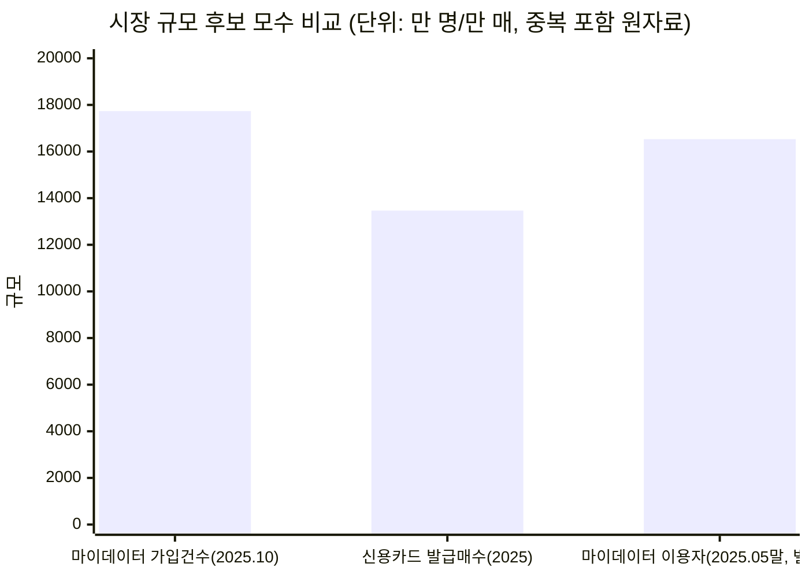

# 04. TAM-SAM-SOM & Market Segment Map — Evidence & Analysis

| 항목 | 내용 |
| --- | --- |
| 분석 대상 | 마이데이터 기반 미래지출 반영 카드조합 재설계 서비스의 시장 규모와 진입 세그먼트 |
| 정본 | `윤정/확정본/04_TAM_SAM_SOM_Segment_Map.md` (원본: `윤정/0819_04_TAM-SAM-SOM 마켓세그먼트.md` — TAM 앵커 확정, "재논의 금지") |
| Deck | p4~5 (`master-deck/p04-05_TAM_SAM_SOM_Segment_Map.md`) |
| 상태 | 🔶 **정의·산식 확정 / SAM·SOM 실수치 🟠 미확보** |

---

## 0. 최종 판단

| 층 | 정의 | 값 | 등급 |
| --- | --- | --- | :---: |
| **TAM** | 마이데이터 서비스를 이용해 본인 지출을 능동적으로 확인하는 사용자 전체 | **누적 가입 건수 1억 7,734만 건**(2025.10, 중복 포함) — **고유 인원은 산출하지 않는다** | 🔵 / 인원 환산 불가 |
| **SAM** | TAM 중 향후 12개월 내 소비구조가 유의미하게 바뀔 것으로 예상되는 사용자 | 혼인 연 약 **48만 명**(24만 건 × 2) 등 대리지표 **합산 예정** | 🔵(대리지표) / 합산 🟠 |
| **SOM** | SAM 중 Beachhead(혼인) 채택자 | 비중·도달률·선택률 **미확정** — 카드고릴라 140만·뱅크샐러드 130만을 **상한 참고치**로 사용 | 🟠 |

**세 가지 판단이 이 방법론의 결론이다.**

1. **TAM 모수로 마이데이터 가입 건수를 쓴다** — 이것만이 "지출을 능동적으로 확인하는 사람"이라는 **서비스 자격 조건과 직접 맞물린다.** 마이데이터를 쓰지 않는 사람은 계산에 필요한 과거 소비 데이터를 애초에 제공할 수 없으므로 자연스럽게 대상에서 제외된다. 신용카드 발급매수는 카드 보유 여부만 나타내고 마이데이터 이용 여부와 무관하다.
2. **사람 수로 환산하지 않는다** — 1억 7,734만 건과 1억 6,531만 명 모두 한국 인구 약 5,170만 명을 크게 초과한다. 서비스별 중복 합산 지표이지 실제 사람 수가 아니므로(⚪), **임의의 환산 배수로 인원을 만들지 않는다.**
3. **Beachhead는 혼인이다** — 혼인이 데이터 신뢰도가 가장 높은 수요 발생 원인이다(Trigger 감지 용이 + 1인당 지출강도 최고 🔵).

> ⚠️ **구조적 한계 1건** — TAM은 **건수**, SAM·SOM은 **인원**이다. `SOM ⊂ SAM ⊂ TAM` 포함관계가 단위 불일치로 성립하지 않는다(`효진/확정본/README.md` 3절 🟠 5번). 이 파일은 각 층의 단위를 **명시적으로 표기**하고 층 간 비율을 계산하지 않는 방식으로 처리한다.

---

## 1. 상세표

### 1-1. 시장 규모 후보 지표와 채택 판정

| 후보 지표 | 값 | 집계 기준 | TAM 채택 | 배제 이유 |
| --- | --- | --- | :---: | --- |
| **마이데이터 가입 건수** | **1억 7,734만 건** (2025.10) 🔵 | 서비스별 가입 누계, **중복 포함** | ✅ **채택** | — |
| 마이데이터 이용자 수(별도 집계) | 1억 6,531만 명 (2025.05말) | 상이한 산정 기준 | ✗ 참고용 | 고유 인원으로 볼 수 없다 — 인구 규모를 크게 초과 |
| 신용카드 발급매수 | 1억 3,466만 매 (2025) 🔵 | **카드 장수**, 1인 다중보유 포함 | ✗ | 사람 수가 아니고, 마이데이터 이용 여부와 무관 |
| 개인카드 국내 이용액 누계 | 약 275.97조원 🔵 | 누계 거래액 | ✗ | 사람 수가 아님 |

**세 수치는 서로 집계 기준이 달라 단순 비교가 위험하다** — 그래서 발급매수는 TAM 후보에서 아예 제외했다.

### 1-2. 수요 발생 원인 — 생애이벤트

| 원인 | Trigger 감지 가능성 | 1인당 지출강도 | 판정 |
| --- | --- | --- | --- |
| **혼인** | **높음** (웨딩업체 신호로 감지 용이) | **최고** — 카드결제 대상 지출 **1,473만~2,203만원** 🔵 | 🥇 **1차 Beachhead** |
| 입주(이사) | 낮음 (부동산 중개 파편화) | 확인 안 됨 — 혼인 지출과 중복이 커 독립 계상 어려움 | 2차 표적 |
| 출산 | 혼인·이사와 강하게 중복 | 🟠 미수집 | 독립 계상 불가 |
| 이직·전직 | — | 🟠 미수집 | 소비변화 유의성이 위 셋보다 약함 |

**자녀 입학·유학·은퇴 등 다른 원인도 같은 수요를 만든다.** 유학·은퇴처럼 **소비가 감소하는 방향**의 이벤트는 별도 설계가 필요하다 → [06](06_Opportunity_Score.md) 후보 F, [07](07_JTBD.md) Job F.

### 1-3. 대리지표와 주의점

| 대리지표 | 값 | 등급 | 출처 | 확인일 | 주의점 |
| --- | --- | :---: | --- | --- | --- |
| 혼인 건수 × 2(양 당사자) | **24만 건 (+8.1%)** → 약 48만 명 | 🔵 | 국가데이터처 | 2026.03.19 / 확인 2026-08-19 | **재혼 포함 여부 명시 필요** |
| 주민등록 전입(이사) 세대 수 | 이동자 **611.8만 명**, 주택사유 **33.7%**(≈206만 명은 ⚪ 환산) | 🔵 | 국가데이터처 (`효진/0819_미확인 항목 검증 결과.md` 경유 — **원본에 발표기관명 미기재 🟠**) | 2026-08-19 | **세대 기준**으로 잡아야 중복 감소. 혼인과 중복분 제외 필요. 주택사유가 전년 대비 **-10.5만 명**으로 가장 큰 감소 — **Q2 시장은 축소 국면** |
| 출생아 수 | 🟠 미수집 | — | — | — | 혼인·이사와 강하게 중복 |
| 이직·전직자 수 | 🟠 미수집 | — | — | — | 소비변화 유의성이 약함 |
| 해외여행 1건당 지출 | 약 102만원 | 🔵 | 업계 자료 | 2026-08 | Q3 세그먼트 판정용 |

**중복 제거 원칙** — 신혼 1쌍은 혼인 + 이사 + (경우에 따라)출산에 모두 잡힐 수 있어 **"세대(가구) 단위" 카운트로 통일**한다.

### 1-4. Market Segment Map — Beachhead 우선순위

**채택 축: Trigger 감지가능성 × 1인당 지출강도.** *"소비변화 예측가능성 × 보유카드 수"* 축도 후보로 검토했으나 **실측 데이터가 없어 채택하지 않았다** — 축 선택 자체가 데이터 유무로 결정됐다는 점이 이 절의 핵심 판단이다.

| 세그먼트 | Trigger 감지가능성 | 1인당 지출강도 | 우선순위 |
| --- | --- | --- | :---: |
| **Q1. 혼인** | 높음 | **최고** (1,473만~2,203만원 🔵) | 🥇 **1차 표적(SOM)** |
| Q2. 입주(이사) | 낮음 | 확인 안 됨 — Q1 지출과 중복 | **대상 아님** — 혼수 항목이 Q1 혼인 지출(혼수 1,445만원 포함)과 정면 중복, 독립 계상 시 **이중 계상** |
| Q3. 해외여행(일반) | 낮음 | 낮음 (1건당 약 102만원) | 대상 아님 (신혼여행은 Q1에 포함) |
| Q4. 카드 갱신 일반군 | **매우 높음** | 낮음 (무차별) | 대상 아님 — **채널 후보로만** 참고 |

**Q1~Q4는 이번 리서치로 데이터를 확보한 사건이며, 자녀 입학·유학·은퇴 등도 같은 수요를 만든다.**

---

## 2. 산식·계산

### 2-1. 산식

```
SAM = [ Σ(연간 소비변화 이벤트 발생 인원) − 중복 ] × 마이데이터 이용률

SOM = SAM × Beachhead 비중 × 초기 채널 도달률 × 조합안 선택률(Payment Plan Selection Rate)
```

### 2-2. 확보된 항목과 빈 항목

| 항목 | 값 | 상태 |
| --- | --- | :---: |
| 혼인 발생 인원 | 48만 명 (24만 건 × 2) | 🔵 확보 |
| 이사 발생 세대 | 이동자 611.8만 명 × 주택사유 33.7% ≈ 206만 명 | 🔵 원자료 / ⚪ 환산 |
| 출산·이직 인원 | — | 🟠 미수집 |
| **중복률** | 시나리오 가정값(2-3절) | 🟡 가정 |
| **마이데이터 이용률** | — | 🟠 **미확보 — TAM이 건수라 이용률을 인원 비율로 환산할 수 없다** |
| Beachhead 비중 | — | 🟠 |
| 초기 채널 도달률 | — | 🟠 (웨딩업체 채널 D6 미확보) |
| 조합안 선택률 | 목표 40% 🟡 / 기준선 🟠 | E2가 유일한 확보 경로 |

**SAM·SOM의 최종 수치를 계산하지 않은 이유** — 곱셈 인자 4개 중 3개가 🟠다. **없는 값을 가정으로 채워 곱하면 결과의 자릿수만 그럴듯해지고 근거는 0이 된다.** 그래서 이 파일은 **산식과 확보된 대리지표까지만** 확정하고 결과값은 비워 둔다.

### 2-3. 3시나리오 민감도

| 시나리오 | 중복률 가정 | 마이데이터 이용률 가정 | 산출 |
| --- | :---: | --- | --- |
| 보수 | 0.8 (중복 많음) | 낮음 | SAM 최소값 |
| 기본 | **0.65** | 중간 | SAM 중심값 |
| 공격 | 0.5 (중복 적음) | 높음 | SAM 최대값 |

### 2-4. 혼인 1인당 지출강도 계산 근거 — 1,473만 ~ 2,203만원

**출처: 듀오 2026 결혼비용 조사.** 총계 5,912만원(주택자금 제외)에서 **카드결제가 확실한 항목만** 골라 합산한 뒤 2인으로 나눴다.

| 항목 | 금액 | 카드결제 확실성 |
| --- | --- | :---: |
| 신혼여행 | 1,030만원 | 확실 |
| 혼수 | 1,445만원 | 확실 |
| 웨딩패키지 | 471만원 | 확실 |
| **소계** | **2,946만원** | → 1인당 **1,473만원** |
| 예식홀 | 1,460만원 | **조건부** |
| **조건부 포함 합계** | 4,406만원 | → 1인당 **2,203만원** |

**하한·상한을 범위로 제시한 이유** — 예식홀 결제 수단이 카드로 확정되지 않아, 포함 여부를 판단으로 정하지 않고 **범위의 양 끝으로 노출**했다.

### 2-5. 규모 후보 비교 (중복 포함 원자료)



---

## 3. 출처·확인일

| # | 사실 | 등급 | 출처 | 확인일 |
| :---: | --- | :---: | --- | --- |
| 1 | 마이데이터 가입 건수 1억 7,734만 건 | 🔵 | 금융위·마이데이터종합포털 계열 (2025.10 기준) | 2026-08-19 |
| 2 | 마이데이터 이용자 수 1억 6,531만 명 (2025.05말, 별도 집계) | 🔵 | 동일 계열, 상이한 산정 기준 | 2026-08-19 |
| 3 | 신용카드 발급매수 1억 3,466만 매 (2025) | 🔵 | 여신금융협회 | 2026-08-15 |
| 4 | 개인카드 국내 이용액 누계 약 275.97조원 | 🔵 | 여신금융협회 월간통계 (2026.06) | 2026-08 |
| 5 | 혼인 24만 건 (+8.1%) | 🔵 | 국가데이터처 | 2026.03.19 |
| 6 | 혼인 1인당 카드결제 대상 지출 1,473만~2,203만원 | 🔵 | 듀오 2026 결혼비용 조사 (2-4절 계산) | 2026-08 |
| 7 | 이동자 611.8만 명 / 주택사유 33.7% / 주택사유 전년 대비 -10.5만 명 | 🔵 | 국가데이터처 (`효진/0819_미확인 항목 검증 결과.md` 경유 — **발표기관명 미기재 🟠**) | 2026-08-19 |
| 8 | 한국 인구 약 5,170만 명 | 🔵 | 주민등록·인구추계 | 2026-08 |
| 9 | 카드고릴라 MAU 140만 / 뱅크샐러드 카드추천 130만 (SOM 상한 참고치) | 🔵 | 이데일리·인사이트코리아 / 기업 발표 | 2026-08-20 |

---

## 4. Fact / Inference / Assumption

### 🔵 Fact

3절 표 참조. 신뢰도 **High**, 단 7번은 원본에 발표기관명이 없어 **Mid**로 강등해 표기한다.

### ⚪ Inference

| 분석 대상 | 관찰·주장 | 근거·추론 과정 | 신뢰도 | 영향 | 검증 계획 |
| --- | --- | --- | :---: | --- | --- |
| TAM 단위 | 마이데이터 가입 1억 7,734만 건은 **고유 인원이 아니다** | 한국 인구 약 5,170만 명을 3배 이상 초과 → 서비스별 중복 합산 지표로 해석 | **High** | TAM을 인원으로 표기하지 않는 결정 자체 | 고유 인원은 **비공개 지표라 산출 불가** — 확인 불가로 확정 |
| 이사 인원 | 주택사유 이동자 ≈ 206만 명 | 611.8만 × 33.7% 환산 — 원자료는 비율까지만 제공 | Mid | SAM 대리지표 후보 | 세대 단위 원자료 확보 |
| Q2 시장 | **이사 세그먼트는 축소 국면**이다 | 주택사유 이동이 전년 대비 -10.5만 명으로 가장 큰 감소(🔵) | Mid | Q2를 2차 표적으로 두되 우선순위를 낮추는 근거 | 다음 연도 통계로 추세 확인 |
| 중복 | 신혼 1쌍이 혼인·이사·출산에 **모두 잡힌다** | 생애이벤트의 시간적 근접성 | Mid | 세대 단위 카운트 원칙의 근거 | 세대 단위 원자료로 실측 |

### 🟡 Assumption

| 가정 | 뒤집히면 | 신뢰도 | 검증 |
| --- | --- | :---: | :---: |
| 중복률 0.5 / 0.65 / 0.8 (3시나리오) | SAM 값의 자릿수가 바뀐다 | Low | 세대 단위 대리지표 합산 |
| 마이데이터 이용률을 SAM 필터로 쓸 수 있다 | **산식 자체가 성립하지 않는다** — TAM이 건수라 인원 비율로 환산할 수 없다 | Low | 고유 인원 지표 확보 여부에 종속 |
| 카드고릴라 140만·뱅크샐러드 130만이 SOM **상한**이다 | SOM 상한선의 근거가 사라진다 | Low | 경쟁사 MAU를 상한으로 쓰는 것이 타당한지 팀 확인 |
| 혼인 세그먼트가 웨딩업체 채널로 도달 가능하다 | SOM 전체 — E2 착수 불가 | Low | **D6**(🟠 미확보) |

### 🟠 미확인

| # | 항목 | 성격 | 처리 |
| :---: | --- | --- | --- |
| 1 | **SAM·SOM 실수치** (대리지표 합산·중복 제거) | 계산 미완 | 추가 검증과제 1순위. 세대 단위·중복 제거 원칙 적용 |
| 2 | 마이데이터 **고유 인원** | **확인 불가** | 비공개 지표 — 사람 수로 환산하지 않는 것으로 대응 |
| 3 | 출생아 수 · 이직·전직자 수 | 미수집 | 혼인·이사와 중복이 커 우선순위 낮음 |
| 4 | 혼인 건수의 **재혼 포함 여부** | 확인 가능 | 국가데이터처 원자료 정의 확인 |
| 5 | 이사 대리지표의 **세대 기준 원자료** | 확인 가능 | 인원 기준으로는 중복 제거가 불가능 |
| 6 | Beachhead 비중 · 초기 채널 도달률 | 실측 필요 | 웨딩업체 채널 확보 후 베타 |
| 7 | 조합안 선택률 기준선 | 실측 필요 | **E2**가 유일한 확보 경로 |

---

## 5. 사례 비교 — 세그먼트 판정의 대조

| 세그먼트 | 왜 이 판정인가 | 대조 대상과의 차이 |
| --- | --- | --- |
| **Q1 혼인 → 채택** | 두 축(Trigger 감지 + 지출강도)에서 **모두 최상위인 유일한 칸** | Q4는 감지가 더 쉽지만 지출강도가 무차별로 낮다 — **감지만 쉬워도 안 된다** |
| Q2 이사 → 제외 | 지출 항목(혼수 1,445만원)이 Q1과 **정면 중복**해 독립 계상 시 이중 계상 | Q1과 별개 세그먼트로 보이지만 실제로는 같은 지출을 두 번 세는 것 |
| Q3 해외여행 → 제외 | 1건당 약 102만원으로 지출강도가 낮고, 신혼여행은 이미 Q1에 포함됨 | 감지도 어렵고 강도도 낮아 **두 축 모두 열세** |
| Q4 카드 갱신 일반군 → 채널로만 | 감지가 **매우 높음**이지만 지출강도가 무차별 | **"크지만 닿아도 의미가 적은 시장"** — [06](06_Opportunity_Score.md)의 "크지만 닿을 수 없는 시장은 관련도가 낮다"와 대칭 사례 |

**TAM 모수 선택도 같은 방식의 비교로 결정됐다** — 세 후보 모수 중 규모가 가장 큰 것(가입 건수)을 고른 게 아니라, **서비스 자격 조건과 직접 연결되는 것**을 골랐다. 발급매수(1억 3,466만 매)가 더 "사람에 가까워" 보이지만 마이데이터 이용 여부와 무관해 배제했다.

---

## 6. 전이 분석

**받아오는 것** — [01](01_Five_Forces.md): 경쟁자 MAU 규모(SOM 상한 참고치)·마이데이터가 상위 사업자 한정 자산이라는 판정 / [02](02_Value_Chain.md): 마케팅 활동의 Beachhead·웨딩업체 채널 / [03](03_KSF.md): KSF 5(Beachhead 도달력).

| 이 파일의 결론 | 흘러가는 곳 | 어떻게 쓰이는가 |
| --- | :---: | --- |
| Beachhead = 혼인(Q1) | [05](05_Persona_Spectrum_Journey.md) Core 페르소나 5명 / [09](09_PRD_Requirement_Trace.md) D6 | **이서연·김도윤·박서준이 이 세그먼트에서 도출됐다** |
| Q2 이사 = 2차 표적 | [05](05_Persona_Spectrum_Journey.md) 한지민·최유리 | SAM Phase 1 계층 |
| 이벤트 비종속 확장 | [05](05_Persona_Spectrum_Journey.md) 정하늘·오세훈·강민재 / [06](06_Opportunity_Score.md) 후보 F | SAM Phase 2 계층 |
| Q4 "대상 아님" 판정 논리 | [06](06_Opportunity_Score.md) Market Relevance 2요인 모델 | **"크지만 닿을 수 없는 시장은 관련도가 낮다"**의 원본 논리 — 신은서·윤태호 MR을 낮게 준 근거 |
| 1인당 지출강도 1,473만~2,203만원 | [05](05_Persona_Spectrum_Journey.md) 이서연 Pain / [09](09_PRD_Requirement_Trace.md) 9-1절 | 페르소나 Pain의 정량 앵커 |
| SOM 산식의 마지막 인자 = 조합안 선택률 | [08](08_Value_Proposition.md) North Star / [09](09_PRD_Requirement_Trace.md) 7-1절 | **시장 규모 산식과 북극성 지표가 같은 수를 공유한다** |

> `가람/0819/DOS Market Relevance 모수 판단.md`가 이 문서를 **"TAM 앵커 확정본, 재논의 금지"**로 인용한다 — [06](06_Opportunity_Score.md)의 계층 매핑(SOM / SAM Phase 1 / SAM Phase 2 / TAM)이 전부 이 파일의 층 구조를 상속한다.

---

## 7. 추가 검증과제

| 순위 | 과제 | 방법 | 무엇이 풀리나 |
| :---: | --- | --- | --- |
| 1 | **SAM·SOM 실수치 합산** | 세대(가구) 단위로 대리지표를 재수집해 중복 제거 후 3시나리오 대입 | 🟠 → 🔵. 시장 규모 주장의 유일한 빈칸 |
| 2 | 마이데이터 이용률 필터 대체 방안 | TAM이 건수인 한 인원 비율 환산이 불가 → **"가입 건수 대비 활성 이용 건수"** 같은 동일 단위 지표 탐색 | 산식 성립 여부 자체 |
| 3 | 이사 대리지표 세대 기준 원자료 | 국가데이터처 원자료 재조회 | 중복 제거 가능성 |
| 4 | 혼인 건수 재혼 포함 여부 | 원자료 정의 확인 | 대리지표 정확성 |
| 5 | 웨딩업체 모집 경로 확보 | 제휴 접촉 | **D6 — E2 착수의 실제 블로커** |
| 6 | 조합안 선택률 기준선 | **E2 Concierge Test** (모집 40 / 유효 30) | SOM 산식 마지막 인자 + 북극성 기준선 동시 확보 |
| — | 마이데이터 고유 인원 | **확인 불가** | 비공개 — 사람 수 환산을 포기하는 것으로 확정 |
