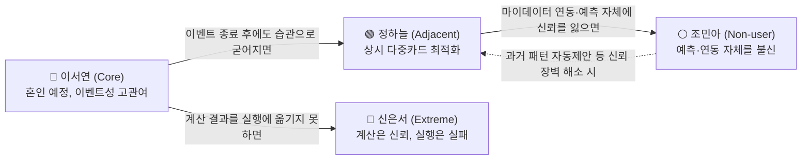

# 05. 페르소나 스펙트럼 · 고객 여정지도 — Evidence & Analysis

| 항목 | 내용 |
| --- | --- |
| 분석 대상 | 12명 페르소나 스펙트럼(Core 5·Adjacent 3·Extreme 2·Non-user 2)과 서비스 고유 7단계 여정 |
| 정본 | `가람/확정본/05_Persona_Spectrum_Journey.md` (3부 구성: 페르소나 대표 4명 통합본 · 스펙트럼 12명 상세 · 고객 여정지도 12명) |
| Deck | p8~10 (`master-deck/p08-11_고객맥락.md`) |
| ⚠️ 전제 | **12명 전원 🟡 가상 인물**이다. 각 인물의 Pain은 팀 근거 문서에서 인용했지만 인물 자체는 실측 표본이 아니다 |

---

## 0. 최종 판단

**세 가지가 이 방법론의 결론이다.**

1. **12명 중 4명이 7단계 여정을 완주하지 못한다** — 배정호(②인지), 조민아(③온보딩), 윤태호(⑤~⑥실행 직전), 신은서(⑥실행). **가장 취약한 전환점은 ③온보딩과 ⑥실행**이다.
2. **③과 ⑥에 대한 대응 방식이 다르다** — ③은 제품이 개입하고(F-11 과거 패턴 기반 초기값 자동 제안), **⑥은 개입하지 않고 측정만 한다**(F-13). 마이데이터 기반 서비스에 해지·전환 실행에 대한 직권·대행 권한이 없기 때문이다(→ [02](02_Value_Chain.md) 5절).
3. **같은 "실행 실패"도 원인이 다르면 해법이 달라야 한다** — 신은서는 **외부 마찰**(상담사 만류), 윤태호는 **내부 과부하**(카드 20장+ 정보량). 우리는 외부 마찰은 측정으로, 내부 과부하는 제시 방식(F-07 Could)으로 나눴다.

**5단계 파이프라인 산출물** — 스펙트럼 도출(12명) → Convergent Filtering(대표 4명) → Contextual Rewriting(F-01~F-06 언어로 재기술) → AI Peer Review(3개 독립 관점 교차검증) → Spectrum Map(관계 구조·전환 시나리오).

---

## 1. 상세표

### 1-1. 12명 스펙트럼 — 유형·Pain·Goal·대체 솔루션

**Core (5명) — 매출·사용 빈도 중심**

| 인물 | 직무 / 나이 / 기술 | Pain | Goal | 대체 솔루션 | 근거 |
| --- | --- | --- | --- | --- | :---: |
| **이서연** | 대기업 마케팅 대리 / 32 / 중급 | 3개월 뒤 결혼, 지출 **1,473~2,203만원**이 몰리는데 전월실적·혜택한도를 스스로 계산 못함 | 결혼 준비 지출을 카드별로 배분해 놓치는 혜택 없이 최대 혜택 | 뱅크샐러드 카드추천(과거 기준) + 카페 후기 | 🔵 지출강도 |
| **김도윤** | 스타트업 PM / 30 / 상 | 결혼 + 신혼집 이사가 겹쳐 두 이벤트를 하나의 카드 전략으로 못 묶음 | 두 이벤트를 하나의 결제 계획으로 통합, 실행 순서까지 | 개인 엑셀 가계부 수기 추적 | 🟡 |
| **박서준** | 중소기업 영업 / 34 / 중 | 실적 구간을 못 채워 혜택 놓침 + 카드사 **단종카드 자동대체** 후 혜택 불일치 경험 | 카드사의 일방적 자동대체에 끌려가지 않고 스스로 검증한 근거로 결정 | 카드사 콜센터(설명이 상충되어 불신) | 🔵 민원 +88.4% |
| **한지민** | 프리랜서 번역가 / 36 / 중 | 전세→자가 입주로 지출이 몰리는데 **소득이 불규칙**해 실적 구간 맞추기가 더 어려움 | 이사 기간 한정으로 조합을 바꾸고 끝나면 되돌리기 | 카드고릴라 스펙 비교 후 감으로 결정 | 🟡 |
| **최유리** | 대기업 회계 과장 / 39 / 상 | 지방 발령으로 갑작스러운 이사 — 가전·인테리어 + 통근 교통비까지 구조 전체 재검토 필요 | 회계 경험을 살려 **스스로 검증할 수 있는** 계산 결과 | 본인 엑셀 시뮬레이션(약 240분, 자주 포기) | ⚪ 240분은 1인 진술 |

**Adjacent (3명) — 유사 니즈·다른 맥락**

| 인물 | 직무 / 나이 / 기술 | Pain | Goal | 대체 솔루션 | 근거 |
| --- | --- | --- | --- | --- | :---: |
| **정하늘** | 신입 회계사 / 27 / 상 | **"PIVOT"**(다중카드 병행 트렌드)처럼 이미 여러 카드를 병행하지만 매달 직접 계산하느라 시간이 많이 듦 | 이미 하는 수작업 최적화를 자동 계산으로 대체 | 카드 커뮤니티 + 개인 스프레드시트 | 🔵 트렌드 키워드 |
| **오세훈** | 이직한 개발자 / 32 / 상 | 이직으로 패턴이 바뀌었지만 특정 "이벤트"로 분류되지 않아 기존 서비스가 반영 못함 | **이벤트명과 무관하게** 입력한 소비 변화만으로 재설계 | 기존 카드 방치, 가끔 지인 추천 | 🟡 |
| **강민재** | 자영업자 / 55 / 중 | 자녀 독립으로 지출이 **줄었는데** 기존 서비스는 증가만 가정 | 지출 감소 방향도 반영해 불필요해진 카드 정리 | 카드사 안내 문자만 보고 개별 판단 | 🟡 |

**Extreme (2명) — 실패·불편 중심**

| 인물 | 직무 / 나이 / 기술 | Pain | Goal | 대체 솔루션 | 근거 |
| --- | --- | --- | --- | --- | :---: |
| **윤태호** | 회사원(관리직) / 44 / 하 | 카드 **20장 이상** 보유 — 조합이 복잡해져 관리를 포기한 상태 | 방치한 카드까지 포함해 전체를 한 번에 정리·재배치 | 안 쓰는 카드는 서랍에 방치, 연회비만 지불 | 🟡 (E-07, 인용 통계 없음) |
| **신은서** | 직장인 / 29 / 중 | 계산상 해지가 유리한데도 상담사 만류·절차 복잡으로 **실제 해지에 3번 실패** | 계산 결과뿐 아니라 **실행(해지)까지 완주** | 해지 시도 후 포기, 자동이체만 방치 | ⚪ (사례는 🔵, 빈도는 추론) |

**Non-user (2명) — 인식·신뢰 결여 중심**

| 인물 | 직무 / 나이 / 기술 | Pain | Goal | 대체 솔루션 | 근거 |
| --- | --- | --- | --- | --- | :---: |
| **배정호** | 자영업자 / 62 / 하 | 체크카드·현금 위주, 스마트폰 앱으로 미래 지출을 입력하는 방식 자체가 낯섦 | 복잡한 조작 없이 지금 방식 그대로 지내기(서비스가 목표가 아님) | 종이 가계부, 은행 창구 상담 | ⚪ (반박2 디지털 비친화) |
| **조민아** | 프리랜서 / 26 / 중 | 몇 달 앞선 미래 소비를 예측해 입력하는 것 자체가 비현실적이라고 생각 | 예측하지 않고 그때그때 대응하는 것으로 충분 | 지인 추천 카드 1장만 계속 사용 | 🟡 **"가장 큰 가정" 붕괴 케이스** |

### 1-2. 서비스 고유 7단계 여정

범용 이커머스 여정 템플릿을 쓰지 않고 **F-01~F-06 기능 흐름에 맞춰 7단계로 재정의**했다.

```
① 트리거 발생 → ② 서비스 인지 → ③ 온보딩·입력(F-01·F-02) → ④ 계산 결과·근거 확인(F-03·F-06)
  → ⑤ 신규카드 포함안 비교(F-04) → ⑥ 실행(F-05) → ⑦ 구매 후(다음 달 실제 혜택 확인)
```

### 1-3. 여정 단절 4명 — 단절 지점·원인·대응

| 인물 | 단절 지점 | 핵심 Pain Point | 대응 | 등급 |
| --- | :---: | --- | --- | :---: |
| **배정호** | ② 서비스 인지 | 입력 항목 많은 화면을 보는 순간 거부감 + 디지털 채널 자체 거부. **조민아보다도 이른 단계에서 이탈** | ❌ **앱 개선으로 전환 불가 — v0.1 제외.** 가족 대리 입력·은행 창구 연계는 별도 검토 | ⚪ |
| **조민아** | ③ 온보딩·입력 | **미래 지출을 예측해 입력하는 것 자체를 신뢰하지 않음.** 온보딩에서 "미래 지출 입력"을 요구받는 순간 이탈 | ✅ **F-11 과거 패턴 기반 초기값 자동 제안**(Must — 기능 추가가 아니라 MVP 성립 조건) | 🟡 |
| **윤태호** | ⑤~⑥ 실행 직전 | 처리할 항목(카드 20장+)이 한 번에 너무 많이 나와 **정보 과부하로 실행을 미룸**. "나중에 시간 날 때 하자"가 반복됨 | 🔶 **F-07 단계적 제시**("이번 주 상위 3개") — **Could**. F-14(대량 처리 최적화)는 Won't v1 | ⚪ |
| **신은서** | ⑥ 실행(해지 시도) | 계산은 믿지만 **상담사 만류·전환유도 화법에 부딪혀 완주 실패**(3회 시도 0회 성공) | 📊 **서비스가 해결할 수 없는 영역** — 직권·대행 권한 없음. F-06 근거 공개를 더 명확히 하는 것 외 별도 기능 없음. **F-13 측정으로만 내부화** | ⚪ |

### 1-4. 완주한 8명의 갈림 — ⑦ 이후 재사용 동기

| 패턴 | 인물 | 관찰 |
| --- | --- | --- |
| **이벤트 종료와 함께 동기가 약해짐** | 이서연 · 김도윤 · 한지민 · 최유리 | *"결혼 이벤트가 끝나면 계속 쓸 이유가 약해짐"* — [06](06_Opportunity_Score.md) 후보 E(지속 사용 동기)의 근거 |
| **습관으로 굳어져 지속** | 정하늘 · 오세훈 | *"이제 스프레드시트 안 만들어도 되겠다"* / *"이벤트가 없어도 또 쓸 수 있겠다"* — SAM Phase 2 확장 채널의 근거 |
| 신뢰 회복형 | 박서준 | *"이제 자동대체 문자가 와도 겁 안 난다"* — 단, 카드사가 또 조건을 바꾸면 반복 비용 발생 |
| 정리 완료형 | 강민재 | 연회비 절감을 체감하고 주변에 권유. 단 해지 자체의 상담사 마찰 리스크는 신은서와 공유 |

### 1-5. Persona Spectrum Map — 관계 구조와 전환 시나리오



**읽는 법** — 실선은 "서비스가 방치했을 때" 자연스럽게 이동하는 방향(Core→Adjacent는 좋은 이동, Core→Extreme·Adjacent→Non-user는 이탈 리스크), 점선은 "서비스가 개입했을 때" 되돌릴 수 있는 방향.

| 출발 | 도착 | 전환 조건 | 관련 기능·근거 |
| --- | --- | --- | --- |
| 이서연 (Core) | 정하늘 (Adjacent) | 혼인 이벤트 성공 경험 후 조합 관리가 습관으로 유지 | SAM Phase 1 → 확장 경로와 일치 |
| 이서연 (Core) | 신은서 (Extreme) | 계산은 받았지만 실행 단계에서 상담사 만류·절차 마찰 | 해지 실행 마찰 🔵 |
| 정하늘 (Adjacent) | 조민아 (Non-user) | 마이데이터 연동 요구·예측 방식에 신뢰를 잃고 이탈 | 마이데이터 연동 필수 결정(2026-08-19 10:42)으로 **이 리스크가 새로 커졌다** |
| 조민아 (Non-user) | 정하늘 (Adjacent) | 온보딩에서 예측 대신 **과거 패턴 기반 초기값 자동 제안** | F-11 (AI Peer Review의 F-01 보강 권고) |

> ⚠️ **신은서 → 이서연 회복 경로는 없다.** 마이데이터 기반 서비스는 해지·전환 실행에 대한 직권·대행 권한이 없어(→ [02](02_Value_Chain.md) 5절) 신은서의 실행 마찰은 서비스가 개입해 해소할 수 있는 영역이 아니다. 이 표는 "서비스가 만들 수 있는" 전환만 다루므로 이 구간을 목록에서 제외했다.

### 1-6. 2축 포지셔닝과 숨은 제3축

| 페르소나 | 신뢰도(미래 예측을 믿는 정도) | 관여도(카드 관리 노력) | 위치 |
| --- | --- | --- | --- |
| 정하늘 (Adjacent) | 높음 | 높음 | 우상단 — 이미 서비스 가치를 스스로 실천 중, 자동화만 얹으면 즉시 전환 |
| 이서연 (Core) | 중간(이벤트로 상승) | 중간(이벤트 기간만 상승) | 중앙 — **Beachhead**. 이벤트 후 습관화 또는 원점 회귀의 갈림길 |
| 신은서 (Extreme) | 높음 | 높음 → **실행 단계에서만 이탈** | 우측이나 **제3축(실행 완료율)에서 낮음** |
| 조민아 (Non-user) | 낮음 | 낮음 | 좌하단 — 진입 장벽이 가장 높음 |

**신은서는 2축 지도에서 정하늘과 유사한 위치에 놓인다** — 갈리는 축은 *"계산 결과를 실행까지 완주하는가"*라는 **제3축**뿐이고, 이 축은 서비스가 통제할 수 없는 영역이다. **이것이 F-13(실행 완주율 계측)이 별도 지표층으로 필요한 이유의 원본 근거**다 → [08](08_Value_Proposition.md) 5-3절 Blind-spot 층.

---

## 2. 산식·계산

정량 산식은 없다. **감정 곡선(1=최저, 5=최고)** 이 정량 대리지표로 쓰였고, 이 값이 [06](06_Opportunity_Score.md)의 Satisfaction 채점에 입력됐다.

| 인물 | ① 트리거 | ② 인지 | ③ 온보딩 | ④ 계산결과 | ⑤ 신규비교 | ⑥ 실행 | ⑦ 이후 |
| --- | :---: | :---: | :---: | :---: | :---: | :---: | :---: |
| 이서연 (Core) | 2 | 3 | 2 | 4 | 3 | 4 | 5 |
| 정하늘 (Adjacent) | 2 | 3 | 2 | 4 | 3 | 5 | 5 |
| 신은서 (Extreme) | — | — | — | 확신 | — | **좌절·무력** | — |
| 조민아 (Non-user) | 2 | 2 | **1 (이탈)** | 도달 못함 | — | — | — |

**공통 패턴 — ③에서 값이 떨어지고 ④에서 회복된다.** ③은 입력 부담(피로감), ④는 근거 확인(안도·신뢰 형성)이다. **F-06(근거 공개)이 ④ 단계 이탈을 막는 핵심 장치**이며, 조민아·배정호를 제외한 10명이 이 단계를 통과해야 다음으로 간다.

> ⚠️ **감정 곡선을 Satisfaction 대리지표로 쓴 것 자체가 한계다** — 가상 인물 기반이라 실측값이 아니다 → [06](06_Opportunity_Score.md) 한계 4번.

---

## 3. 출처·확인일

| 인물·주장 | 등급 | 출처 | 확인일 |
| --- | :---: | --- | --- |
| 이서연 — 혼인 지출 1,473만~2,203만원 | 🔵 | 듀오 2026 결혼비용 조사 (→ [04](04_TAM_SAM_SOM_Segment_Map.md) 2-4절) | 2026-08 |
| 박서준 — 신용카드 민원 2022→2025 **6,720 → 12,661건 (+88.4%)**, 발급매수 증가(+8.5%)의 약 10배 | 🔵 | 금융감독원 발표 2026.06.09 (3개 매체 교차확인) | 2026-08-15 |
| 신은서 — 해지 시 상담사 만류·전환유도 화법 사례 | 🔵 사례 / ⚪ 빈도 | 뉴스토마토 2025.10.13 | 2026-08-18 |
| 정하늘 — 다중카드 병행 트렌드 "PIVOT" / 카드고릴라 MAU 140만 · 뱅크샐러드 130만 | 🔵 | 카드고릴라 2026 트렌드 발표 · `윤정/0815/국내 신용카드 시장 리서치.md` | 2026-08-14 |
| 조민아 — 더쎈카드 2023 출시 → 2026 종료(사유 미공개) | 🔵 사실 / 🟡 인과 | 더쎈카드 2026년 사업보고서 · 클리앙 · THE VC | 2026-08-18 |
| 배정호 — 디지털 비친화 인구의 존재 | ⚪ | `윤정/0818_TAM 정의 재논의 정리.md` 반박2 | 2026-08-18 |
| 최유리 — 엑셀 수기 판단 약 240분("반나절") | ⚪ **1인 진술** | 페르소나 인터뷰 시나리오 | 2026-08-19 |
| 이서연 — 마이데이터 연동 단계 이탈 리스크 | 🟡 | 팀 내부 추론 (`가람/0819/Evidence Log.md` E-01) | 2026-08-19 |
| 윤태호 — 카드 다장 보유자의 실행 포기 | 🟡 | 팀 내부 추론 (E-07) — **근거 문서 어디에도 인용된 통계 없음** | 2026-08-19 |
| 마이데이터 연동 MVP 필수 확정 | 팀 결정 | `decision-log/decision-log.md` 2026-08-19 10:42 | 2026-08-19 |

**출처 유형 필드** — `가람/0819/Evidence Log.md`는 8필드에 **출처 유형**(직접 관찰 / 공식자료 / 약관·도움말 / 사용자 반응 / 내부 추론)을 추가해 관리한다. E-01~E-07의 유형 분포는 공식자료 2건 · 사용자 반응 1건 · 내부 추론 4건이다.

---

## 4. Fact / Inference / Assumption

### 🔵 Fact (2건 — E-02·E-06)

| # | 관찰·주장 | 신뢰도 | 영향 | 검증 계획 |
| :---: | --- | :---: | --- | --- |
| E-02 | 신용카드 민원 2022→2025 +88.4%, 발급매수 증가율(+8.5%)의 약 10배 | **High** | 박서준 Pain의 타당성을 직접 뒷받침 + [06](06_Opportunity_Score.md) 후보 C Importance의 **유일한 공식 통계 근거** | 이미 검증됨 — 민원 유형별 비중(🟠 미공개)만 남음 |
| E-06 | 카드고릴라 MAU 140만 / 뱅크샐러드 카드추천 130만 / 트렌드 "PIVOT" | **High** | Adjacent 세그먼트(정하늘)의 존재를 가장 강하게 뒷받침 — **AI Peer Review 3개 관점 전원이 "높음"으로 판정한 유일한 페르소나** | 이 집단의 서비스 전환 의향만 추가 설문 필요 |

### ⚪ Inference (2건 — E-03·E-04, + 여정 관찰 2건)

| # | 관찰·주장 | 근거·추론 과정 | 신뢰도 | 영향 | 검증 계획 |
| :---: | --- | --- | :---: | --- | --- |
| E-03 | 해지 시 상담사 만류로 실행이 막히는 사례가 존재하며 **일정 빈도로 반복될 것** | 언론 보도 1건은 사실이나 "몇 %인가"는 미확정. AI Peer Review(시장데이터 관점)도 **"민원율 ≠ 해지실패율"** 통계 오용 위험을 지적하며 신뢰도를 "낮음"으로 판정 | Mid | F-05가 실행에 개입하지 않는 근거 + 신은서 대표성의 핵심 근거 | 인터뷰로 해지 시도 후 실패 경험 **빈도** 확인 |
| E-04 | "신용카드 사용자=거의 모든 성인" 정의에는 **디지털 채널을 쓰지 않는 하위 집단이 섞여 든다** | "성인 대부분=카드 사용자"라는 사실에서 디지털 비친화 인구가 통계적으로 존재한다는 논리적 추론 — 공식 통계로 직접 확인한 수치는 아님 | Mid | Non-user(배정호)의 존재를 뒷받침하나 규모·특성은 미확인 | 설문에서 "체크카드·현금 위주 응답자 비율" 확인 |
| I-a | **신은서는 실행 마찰의 대리지표다** | 개별 사례 + E-02 민원 증가 | Mid | F-13의 존재 이유 | **사례 1건**이다. 실제 분포는 E7로만 확인된다 |
| I-b | **윤태호와 신은서의 실행 실패는 원인이 다르다**(내부 과부하 vs 외부 마찰) | CJM 12명 비교에서 단절 지점과 감정 서술이 갈림 | Mid | 해법을 둘로 나눈 근거(F-07 vs F-13) | 가상 인물 기반 — 실제 사용자에서 이 구분이 유지되는지 미검증 |
| I-c | 판단 소요시간 **240분**은 엑셀 수기 대비 기준선이다 | 최유리 "반나절" 진술 | Low | G1(p95 5분) 목표의 기준선 | **1명 진술** — E1에서 분포 수집 필요 |

### 🟡 Assumption (3건 — E-01·E-05·E-07)

| # | 가정 | 뒤집히면 | 신뢰도 | 검증 |
| :---: | --- | --- | :---: | :---: |
| **E-05** | **사용자가 몇 달 앞선 소비 변화를 스스로 입력할 의향·능력이 있다**(가장 큰 가정) — 조민아가 이 가정의 붕괴 케이스 | **MVP 전체(F-01~F-06)가 무의미해진다** — 프로젝트 최대 리스크 | Low (인과 미확정) | **E2 Concierge Test** — 실사용자의 입력 완료율·정확도 실측 |
| E-01 | 마이데이터 연동 동의 요구가 개인정보 망설임으로 **이탈을 유발**한다 | 온보딩 설계 우선순위를 잘못 잡는다 | Low | E2에서 연동 단계 실제 이탈률 측정 |
| E-07 | 카드 보유 수가 많을수록 결과를 받고도 **실행을 포기할 가능성이 높다** | F-07(단계적 제시)의 필요성 근거가 사라진다 | Low | AI Peer Review가 **"상상된 극단"**으로 명시 지적 — 카드 보유 개수별 설문 필요 |
| A-a | 12명 전원이 🟡 **가상 인물**이라는 전제 | 페르소나 기반 판단 전체(→ 06·07·08) | Low | **E1 실제 인터뷰 n=15** |

**분포** — 🔵 Fact 2 · ⚪ Inference 2 · 🟡 Assumption 3. **Assumption 3건 중 E-05(가장 큰 가정)가 프로젝트 전체에서 가장 영향이 크므로 검증 우선순위 1위다.**

### 🟠 미확인

| # | 항목 | 처리 |
| :---: | --- | --- |
| 1 | 실행 완주 실패의 **실제 빈도 분포** | E7a(사유) → E7b(비율, 베타 +21주) |
| 2 | 디지털 비친화 인구의 규모·특성 | 설문 |
| 3 | 카드 다장 보유자의 실행 포기율 | 카드 보유 개수별 설문 |
| 4 | 민원 유형별 건수·비중 | **확인 불가** — 원문 미공개 |
| 5 | 홈택스 연말정산 미리보기의 이용자 수·입력 완료율 | 미확보. 확보되면 "가장 큰 가정"을 🟠 → 🔵로 승격 가능 → [10](10_Evidence_Inference_Assumption.md) U-16 |

---

## 5. 사례 비교

### 5-1. 대체 솔루션 비교 — 12명이 지금 쓰는 것

| 대체 솔루션 | 쓰는 인물 | 왜 불충분한가 |
| --- | --- | --- |
| **뱅크샐러드 카드추천** | 이서연 | 과거 소비 기준이라 곧 몰릴 지출에 안 맞음 |
| **개인 엑셀·스프레드시트** | 김도윤 · 최유리 · 정하늘 | 시간이 많이 들어(최유리 약 240분 ⚪) 자주 포기 |
| **카드고릴라 스펙 비교** | 한지민 | 스펙만 보고 실행은 감으로 결정 |
| **카드사 콜센터** | 박서준 | 설명이 상충되어 **오히려 불신 유발** |
| **카드 커뮤니티·지인 추천** | 정하늘 · 오세훈 · 조민아 | 개인 상황에 맞는 계산이 아님 |
| **방치(아무것도 안 하기)** | 윤태호 · 신은서 · 오세훈 | [01](01_Five_Forces.md)이 지목한 **가장 강력한 대체재** |
| **종이 가계부·창구 상담** | 배정호 | 디지털 채널 자체를 우회 |

**"방치"가 세 명의 대체 솔루션이라는 점이 Five Forces의 대체재 판정을 페르소나 층에서 재확인한다.**

### 5-2. 여정 단절 4명의 대응 방식 비교 — 왜 대응이 다른가

| 인물 | 단절 원인의 위치 | 서비스가 통제 가능한가 | 대응 방식 |
| --- | --- | :---: | --- |
| 조민아 | **제품 안**(온보딩 설계) | ✅ 가능 | **기능으로 대응** — F-11 Must |
| 윤태호 | **제품 안**(결과 제시 방식) | ✅ 가능 | **제시 방식으로 대응** — F-07 Could |
| 신은서 | **제품 밖**(카드사 상담사 화법) | ❌ 불가 | **측정으로만 대응** — F-13 Should |
| 배정호 | **제품 밖**(디지털 채널 거부) | ❌ 불가 | **대상에서 제외** — 오프라인 채널 별도 검토 |

**이 표가 F-13이 "기능 없이 측정만"인 이유를 설명한다** — 통제 가능성이 대응 방식을 정했고, 통제 불가인 두 건 중 하나(신은서)는 기회점수 공동 1위라 무시할 수 없어 **측정이라는 제3의 대응**이 나왔다.

---

## 6. 전이 분석

**받아오는 것** — [04](04_TAM_SAM_SOM_Segment_Map.md): Segment Map Q1~Q4와 SAM Phase 1/2 계층(Core는 Q1·Q2, Adjacent는 Phase 2에서 도출) / [02](02_Value_Chain.md) 5절: 스코프 경계(신은서 대응의 근거) / `윤정/0818_쟁점정리.md`: F-01~F-06·Guardrail.

| 이 파일의 결론 | 흘러가는 곳 | 어떻게 쓰이는가 |
| --- | :---: | --- |
| 12명 × Pain 3개 = 36건 | [06](06_Opportunity_Score.md) 0절 | Core+Adjacent 8명 24건이 **6개 후보(A~F)로 압축**된다 |
| 감정 곡선 | [06](06_Opportunity_Score.md) Satisfaction 채점 | 실측 설문 대신 쓴 대리지표 — **이것이 06의 최대 한계** |
| 페르소나 → 계층 매핑 | [06](06_Opportunity_Score.md) Market Relevance | SOM(이서연·박서준·김도윤) / SAM Phase 1(한지민·최유리) / SAM Phase 2(정하늘·오세훈·강민재) / TAM(신은서·윤태호) / 경계(조민아·배정호) |
| Job 도출 | [07](07_JTBD.md) 0절 | 페르소나 12명이 **Job 6개 + 경계 Job 3개**로 재구성된다 |
| 단절 4명 | [08](08_Value_Proposition.md) 3절 / [09](09_PRD_Requirement_Trace.md) F-11·F-07·F-13 | **"CJM 완주 실패 4명 중 2명이 실행 단계"**가 08의 🔶 판정 3대 근거 중 하나 |
| 제3축(실행 완료율) | [08](08_Value_Proposition.md) 5-3절 Blind-spot 층 | 표준 3층 Metric Tree에 4층을 신설한 원본 근거 |
| 신은서 사례 | [09](09_PRD_Requirement_Trace.md) A6·E7 | "실행 완주율이 낮다"는 ⚪ 추론의 유일한 관측 사례 |

---

## 7. 추가 검증과제

| 순위 | 과제 | 방법 | 무엇이 풀리나 |
| :---: | --- | --- | --- |
| 1 | **가상 인물 12명을 실제 응답으로 교체** | **E1 실제 인터뷰 n=15** (Switch Interview 3그룹) | 05·06·07의 공통 최대 한계. Importance·Satisfaction 🟡 → 🔵 |
| 2 | 가장 큰 가정(E-05) 실증 | **E2 Concierge Test** — 입력 완료율·정확도 | 조민아 유형의 실재 규모. 20% 미달이면 피벗 |
| 3 | 온보딩 이탈률 실측(E-01) | E2 연동 단계 이탈 관측 + **E3** F-11 A/B(n=500) | ③ 단절 대응(F-11)의 효과 |
| 4 | 실행 완주 실패 빈도(E-03·I-a) | **E7a**(사유, 개입 없음) → **E7b**(비율, 베타 +21주) | ⑥ 단절의 실제 분포. E2 선택자 6명 수준으로는 비율 산출 불가 |
| 5 | 카드 다장 보유자 실행 포기율(E-07) | 카드 보유 개수별 설문 | F-07 필요성 — "상상된 극단" 지적 해소 |
| 6 | 판단 소요시간 240분 분포(I-c) | E1에서 수집 | G1 목표(p95 5분)의 기준선 |
| 7 | 디지털 비친화 인구 규모(E-04) | 설문 — 체크카드·현금 위주 응답자 비율 | 배정호 유형 제외 판단의 정당성 |
