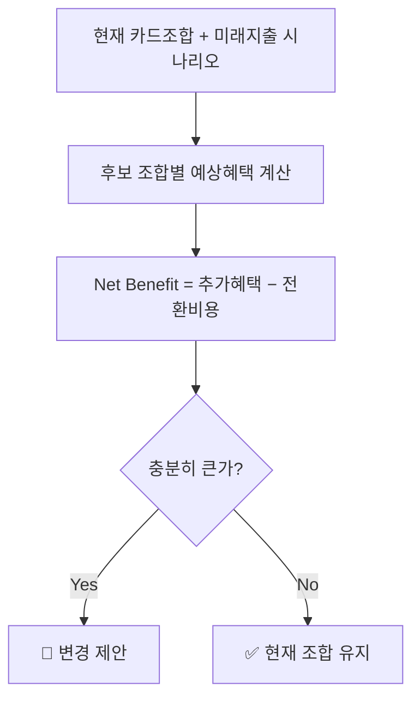
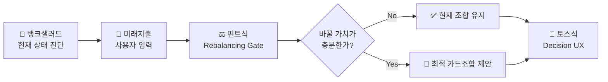
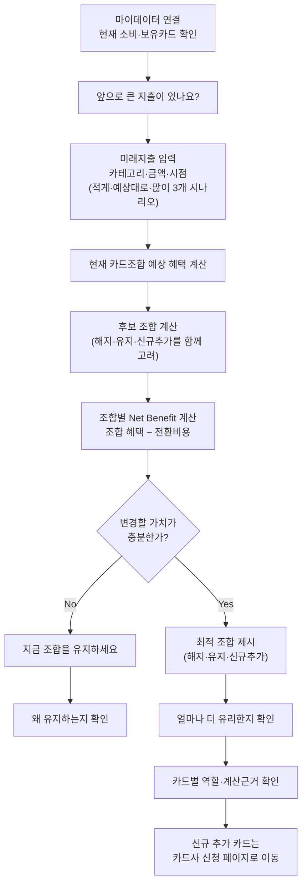

# 11. Benchmark & Mechanism Transfer — Evidence & Analysis

| 항목 | 내용 |
| --- | --- |
| 분석 대상 | 동일·인접·교차 산업 5사례의 메커니즘 전이 판정(유지·변형·제외)과 믹스매치 |
| 정본 | `윤정/확정본/11_Benchmark_Transfer.md` |
| 상세 전이표 | `윤정/0820/동일_인접_교차_산업_메커니즘_전이_분석.md`(**8필드 전이 분석**) · `윤정/0820/메커니즘_벤치마킹_분석_리포트.md` |
| Deck | p15~19 (`master-deck/p15-17_산업사례_메커니즘.md` · `p18-19_전이판단_믹스매치.md`) |
| 확인일 기준 | 별도 표기 없으면 2026-08-20 |

---

## 0. 최종 판단

**3사를 채택하고 2사를 서로 다른 이유로 제외했다.**

| 역할 | 벤치마크 | 가져오는 메커니즘 | 상태 |
| --- | --- | --- | :---: |
| 현재 상태 진단 | 🏦 **뱅크샐러드** | 실제 소비 데이터 기준 혜택·손실 가시화 | ✅ 채택(변형) |
| 미래 상태 전환 판단 | ⚖️ **핀트** | **Net Benefit 게이팅** — 변경 효익 > 변경 비용일 때만 제안 | ✅ 채택(변형) |
| 결과 이해·신뢰 | 💬 **토스** | 결론 우선 · 단계적 근거 공개 | ✅ 채택(변형) |
| — | 📶 통신 요금제 진단(스마트초이스) | 사용 패턴 기반 상품 재매칭 | 🔶 **제외 — 핀트와 메커니즘 중복** |
| — | 🚚 TMAP TMS(배차·경로 최적화) | 다대다 제약 최적화 | 🔶 **제외 — 구조 불일치** |

**세 가지가 이 방법론의 결론이다.**

1. **문제의 본질은 추천 정확도가 아니라 시간축이다** — 개인화 추천이 과거 행동 데이터에 의존하면, **소비구조가 크게 변하기 직전에는 추천에 필요한 데이터가 아직 존재하지 않는다.** 이 추상화가 산업을 넘을 수 있게 한 근거다.
2. **가장 중요한 변형은 "자동 실행"을 뺀 것이다** — 핀트는 판단 후 실제 매매까지 대행하지만, 마이데이터 기반 서비스에는 카드 해지·전환에 대한 직권·대행 권한이 없다. **메커니즘의 앞 절반(판단)만 가져오고 뒤 절반(실행)은 버렸다.** 그 공백을 기능으로 메우지 않고 **측정으로만** 대응한 것이 이 프로젝트의 핵심 스코프 결정이다.
3. **두 제외의 성격이 다르다는 것이 이 분석의 핵심이다** — TMAP TMS는 **첫 기준에서 탈락**했고, 스마트초이스는 **6기준을 다 통과했는데도** 제외했다. 서로 다른 이유로 제외된 두 사례를 지우지 않고 남긴 것 자체가 **교차 산업을 폭넓게 검토했다는 근거**다.

**경쟁 재정의** — *과거 행동을 이용한 사후적 최적화 → 미래 행동을 입력받아 의사결정 전에 수행하는 **선제적** 최적화.* 차별점은 **카드 개수가 아니라 시간축과 의사결정 방식**이다.

---

## 1. 상세표

### 1-1. 기준 서비스 분석 — 뱅크샐러드 As-Is와 이탈 지점 5개

**현재 제공 가치** — 가계부·마이데이터에 축적된 실제 소비를 카드 상품 데이터와 비교해, 다른 카드를 썼다면 받았을 혜택을 시뮬레이션한다. **연회비·전월실적 조건·통합할인한도가 계산에 반영**되고, 예상 연 혜택 금액의 **계산 근거도 확인**할 수 있다 🔵. 여기에 소비 패턴을 분석해 카드 조합을 추천하고 불필요한 연회비를 찾는 "내 카드 사용법" 기능도 있다 🔵.

**As-Is 흐름**

**핵심 이탈 지점 5개**

| 단계 | 사용자 상태 | 이탈 가능 원인 | 등급 |
| --- | --- | --- | :---: |
| 데이터 준비 | 개인화 추천을 기대함 | 등록된 소비 내역이 **1개월 미만**이면 추천 정확도가 낮아짐 | 🔵 |
| 데이터 매칭 | *"내 카드 분석이 왜 안 되지?"* | **카드사 카드명 ≠ 서비스 DB 카드명**이면 혜택 계산 자체가 불가능 | 🔵 |
| 추천 확인 | 추천 금액을 확인함 | 과거 소비는 잘 설명하지만 **곧 발생할 고액지출·생활변화를 반영하지 못함** | ⚪ |
| **변경 판단** | 더 유리한 카드·조합을 확인함 | *"지금 굳이 새 카드를 만들어야 하는가"*, *"연회비·실적관리를 감수할 만큼 차이가 큰가"* | 🟡 |
| **신뢰 판단** | 예상 혜택을 확인함 | **자신의 실제 미래 소비가 아직 없는 상태**에서는 제시된 혜택이 실제로 발생할지 확신하기 어려움 | 🟡 |

> 세 원인은 하나의 구조로 수렴한다 — **개인화 수준이 높아질수록 추천 품질이 사용 가능한 행동 데이터의 품질과 양에 강하게 의존한다.** 그래서 여기서 **실질적인 경쟁자는 다른 카드추천 서비스가 아니라 "그냥 지금 카드를 계속 사용하는 것"**이다.

### 1-2. 문제 구조 추상화 — 왜 산업을 넘을 수 있나

| 수준 | 정의 |
| --- | --- |
| **낮은 수준** | *"뱅크샐러드에는 미래지출을 직접 입력해 카드조합을 계산하는 기능이 부족하다"* — **기능 추가 제안에 머문다** |
| **구조적** | *"개인화 추천이 과거 행동 데이터에 의존할 경우, 소비구조가 크게 변하기 직전에는 추천에 필요한 데이터가 아직 존재하지 않는다. 따라서 사용자는 중요한 결제 의사결정을 내려야 하는 시점에 미래의 자신에게 적합한 결제수단을 판단하기 어렵다"* |

- 현재 시스템이 푸는 질문: *"지금까지 이렇게 소비했다면 어떤 카드 구성이 유리했는가?"*
- 이 서비스가 푸는 질문: *"앞으로 이렇게 소비할 예정이라면 지금 어떤 카드 구성을 준비해야 하는가?"*

**같은 구조를 갖는 문제들**

| 구조 | 유사 문제 |
| --- | --- |
| 현재 상태와 미래 목표 상태의 차이 | **투자 포트폴리오 리밸런싱** |
| 변경의 효익과 변경비용 비교 | 자산배분 · 설비교체 · SaaS 마이그레이션 |
| 여러 제약 안에서 최적 구성 결정 | 포트폴리오 최적화 · 자원배분 |
| 복잡한 계산을 사람이 판단 가능한 형태로 전달 | 금융자문 · 보험설계 · 대출비교 |
| 미래 입력값이 바뀌면 다시 계산 | 시나리오 플래닝 |

**이 지점에서 핀트와 토스를 함께 참고하는 논리가 성립한다.**

### 1-3. 탐색 범위 커버리지 — 5사례

| 탐색 영역 | 사례 | 판정 |
| --- | --- | :---: |
| 동일 금융 도메인 | 🏦 뱅크샐러드 | ✅ 채택(변형) |
| 동일 금융 도메인 (UX) | 💬 토스 | ✅ 채택(변형) |
| 인접 금융 도메인 | ⚖️ 핀트 | ✅ 채택(변형) |
| **교차 산업 — 통신·유틸리티** | 📶 스마트초이스 | 🔶 **제외 (중복)** |
| **교차 산업 — 물류** | 🚚 TMAP TMS | 🔶 **제외 (구조 불일치)** |

**산업이 멀다고 가져오고 가깝다고 버리지 않았다** — **문제 구조가 같은지, 그리고 이미 가진 메커니즘과 겹치지 않는지**로 판정했다.

---

## 2. 전이 분석 — 8필드

`윤정/0820/동일_인접_교차_산업_메커니즘_전이_분석.md` 1절의 8필드(참고 사례와 원래 맥락 / 해결하는 문제 구조 / 핵심 작동 원리 / 효과 근거 / 유지 / 변형 / 제외 / 개선안 반영)를 사례별로 옮긴 것이다.

### 2-1. 🏦 뱅크샐러드 (동일 금융 도메인)

| 필드 | 내용 |
| --- | --- |
| **원래 맥락** | 마이데이터 연동 사용자가 "카드 갈아타기" 화면에서 보유카드 대비 대체카드의 예상 혜택을 비교 (🔵 실사용 캡처 `윤정/0818/경쟁사_유저플로우_뱅크샐러드.pdf`) |
| **문제 구조** | **인식 부재** — 지금 카드가 최선인지 스스로 판단할 근거가 없음(신뢰 부족의 앞 단계) |
| **작동 원리** | 손실 회피 · 기회비용 가시화 · **앵커링**(현재 카드가 기준점) |
| **효과 근거** | 직접 관찰(앱 캡처) 🔵 · 카드추천 이용자 약 130만 명 🔵 |
| **유지** | **손실 프레이밍 구조 자체** — 기준점과 대안의 차액을 금액으로 가시화하는 방식 |
| **변형** | 기준점을 **과거 1년 소비 → 미래 예상 지출**로 교체 |
| **제외** | **단일 카드 1장 비교라는 제약** — 조합 단위로 확장해 제외 |
| **개선안 반영** | 손실 프레이밍 동기부여 라인 · [08](08_Value_Proposition.md) Gain Creator "손실 가시화" |

### 2-2. ⚖️ 핀트 (인접 금융 도메인)

| 필드 | 내용 |
| --- | --- |
| **원래 맥락** | 핀트(Fint) AI 투자자문 — 정기 주기로 포트폴리오를 점검하고 필요 시 리밸런싱을 제안하되, **효익이 거래비용보다 작으면 매매를 미룸** (🔵 공식 서비스 설명) |
| **문제 구조** | 상태 불확실성(언제 개입해야 하는지 모름) + **과도한 개입으로 인한 신뢰 저하** |
| **작동 원리** | **비용-편익 게이팅** — 재구성 효익이 비용을 넘을 때만 개입. **현상유지를 "판단 후 유지"로 재프레이밍** |
| **효과 근거** | 공식 서비스 설명 🔵 |
| **유지** | **Net Benefit ≥ 임계치일 때만 제안**한다는 게이팅 원리 |
| **변형** | ① 거래비용 → **연회비 · 실적 재적립 손실 · 발급 대기 비용 3항목** ② **정기 점검 주기 제거** — Drift가 시장이 아니라 **사용자의 지출 입력**에서 발생하므로 정기 점검할 대상 자체가 없다 |
| **제외** | ① **자동 실행(일임매매)** — 카드에는 직권·대행 권한이 없다 ② **투자성향 진단(공격·중립·보수)** — 사용자 리스크 성향 개념이 없다 |
| **개선안 반영** | Rebalancing Optimization Engine 전체 → [09](09_PRD_Requirement_Trace.md) F-04 · G3 · GR2 |

**카드 문제로 번역**

**해결하는 이탈 지점** — *"새 카드를 만들 만큼 가치가 있는가?"* 추천의 목표를 *"더 좋은 카드 찾기"*에서 **"바꿀 가치가 있는 경우만 알려주기"**로 바꾼다.

### 2-3. 💬 토스 (동일 금융 도메인, UX)

| 필드 | 내용 |
| --- | --- |
| **원래 맥락** | 토스 디자인 시스템(TDS) + UX Writing 가이드 — 해요체·능동형·긍정 표현, `결론 → 핵심변화 → trade-off → 근거 → 상세` 순 정보 계층화 (🔵 공식 가이드) |
| **문제 구조** | 정보 과부하로 인한 **의사결정 지연·이탈** |
| **작동 원리** | 정보 위계화(단계적 공개) + 결과 우선 노출 |
| **효과 근거** | 공식 디자인 가이드 문서 🔵 |
| **유지** | 결론 우선 · 단계적 공개 원칙 |
| **변형** | ① 근거 항목을 **6개 이상 강제** ② **"장점·단점 병렬 제시"를 그대로 가져오지 않았다** — 전환비용을 순혜택 숫자에 종속시켜 **하나의 결론 문장**으로 표기. 이미 게이팅을 통과한 제안에 "단점"이라는 별도 항목을 두면 **재고 명분(이탈 유인)**이 생긴다 |
| **제외** | ① 해요체 **문체 자체의 복제** ② 여러 옵션 나열 비교 — 결론은 항상 하나 |
| **개선안 반영** | [09](09_PRD_Requirement_Trace.md) F-06 · 블루프린트 07 근거 스테이지 |

**카드 문제로 번역** — 첫 결과 화면에는 결론 하나만.

> **"A카드는 유지하고, B카드는 정리하고, C카드를 추가하는 조합이에요 — 지금보다 연 34,000원 더 받을 수 있어요."**

카드별 예상 혜택, 전월실적·할인한도·연회비, 전환비용, 계산 기준일은 **눌러야 펼쳐진다.**

**해결하는 이탈 지점** — *"혜택이 정말 이만큼 나오는가?"* **결론을 단순화하되 근거는 없애지 않는다.**

### 2-4. 📶 스마트초이스 — 통신 요금제 진단 (교차 산업, 제외)

| 필드 | 내용 |
| --- | --- |
| **원래 맥락** | 정부·통신3사 공동운영 요금제 비교 서비스. 실사용 데이터를 요금제 규칙에 대입해 최적 상품을 계산 (🔵 Open API·공동운영 공시) |
| **문제 구조** | **비교 복잡성** — 요금제 구조가 복잡해 스스로 최적안을 계산할 수 없음. **구조가 카드 조합과 동일하다** |
| **작동 원리** | 실사용 데이터를 규칙에 대입 + **공적 신뢰 장치** |
| **효과 근거** | 정부·통신3사 공동운영 · Open API 🔵 / **전환율 지표 🟠 미확보** |
| **유지** | **없음** |
| **변형** | 해당 없음 |
| **제외** | **사례 전체.** 이미 핀트에서 채택한 메커니즘의 **방증(cross-validation)**일 뿐 새 메커니즘을 주지 않는다 |
| **개선안 반영** | 없음 — 제외 사유 자체가 전이 판단의 근거로 남는다 |

### 2-5. 🚚 TMAP TMS (교차 산업, 제외)

| 필드 | 내용 |
| --- | --- |
| **원래 맥락** | 배차·경로 최적화 서비스 — 다수 차량·다수 배송지의 순서와 경로를 자동 계산 (🔵 공식 API 설명) |
| **문제 구조** | **다대다 제약 최적화** — 이동거리·시간창의 **연속 비용**과 **방문 순서(시퀀싱)**가 핵심 |
| **작동 원리** | 인지부하 위임 |
| **효과 근거** | 공식 API 설명 🔵 |
| **유지** | **없음** |
| **변형** | 해당 없음 |
| **제외** | **배차·경로·재배차라는 은유 전체.** 카드 조합은 **실적 구간을 채우는** 문제라 구조가 맞지 않는다 |
| **개선안 반영** | 없음 |

### 2-6. 전이 판단 종합 — 유지 · 변형 · 제외

| 축 | 벤치마크 | 유지할 원리 | 변형한 조건 | 제외한 요소 |
| --- | --- | --- | --- | --- |
| 현재 상태 진단 | 뱅크샐러드 | 실제 소비 데이터로 놓치는 금액을 **손실로 가시화** | 계산 기준을 과거 1년 → **과거 + 미래 입력** | 발급 연계를 종착점으로 삼는 설계 |
| 전환 판단 | 핀트 | **Net Benefit 게이팅** | 거래비용 → **연회비·실적 재적립 손실·발급 대기** 3항목 / 정기 주기 제거 | **자동 실행(일임매매)** · 투자성향 진단 |
| 결과 전달 | 토스 | 결론 우선 · **단계적 근거 공개** | 근거 항목을 **6개 이상 강제** / 장점·단점 병렬 제시 대신 순혜택 종속 | 해요체 문체 자체의 복제 · 여러 옵션 나열 |

---

## 3. 산식·계산 — 믹스매치 6기준 심사

| 기준 | 뱅크샐러드 | 핀트 | 토스 | 스마트초이스 | TMAP TMS |
| --- | :---: | :---: | :---: | :---: | :---: |
| **문제 적합성** | ✅ 손실 인식 부재 | ✅ 개입 시점 불확실 | ✅ 정보 과부하 | ✅ 비교 복잡성 (**구조 동일**) | ❌ 연속비용·시퀀싱 구조 |
| 가치 적합성 | ✅ 전환 동기 | ✅ 불필요 전환 방지 | ✅ 실행률 | ✅ 계산 타당성 근거 | — |
| 맥락 적합성 | ✅ 저빈도·저리스크로 조정 | ✅ 정기 주기 제거 | ✅ 톤 검증 필요로 표기 | ✅ 과거→미래 축 변경 | ❌ 반영해도 구조 불일치 |
| 도메인 적합성 | ✅ 근거 공개로 설명의무 | ✅ 계산·설명 분리 | ✅ 순혜택 종속 표기 | ✅ 공적 신뢰 포지셔닝 제외 | — |
| 운영 가능성 | ✅ 오류 신고만으로 충분 | ✅ 임계치 하드코딩 후 튜닝 | ✅ A/B 검증 가능 | ✅ 규칙 엔진 재사용 | — |
| 검증 가능성 | ✅ 입력 완료율·채택률 | ✅ 트리거 대비 채택률 | ✅ 첫 화면 이탈률 | 🟠 전환율 미확보 | — |
| **판정** | **채택** | **채택** | **채택** | **6/6 통과 후 제외** | **1기준 탈락** |

**두 제외의 성격이 다르다는 것이 이 심사의 결론이다.**

- **TMAP TMS는 첫 기준에서 탈락했다.** 문제 구조가 다르면 뒤의 5개 기준은 애초에 성립하지 않으므로 **적용하지 않았다.** 이동거리·시간창이라는 연속 비용과 방문 순서가 핵심인 구조인데, 카드 조합은 **실적 구간을 채우는** 문제다. 남는 건 *"다대다 최적화를 자동화한다"*는 일반론뿐이고, 이건 TMAP 고유 특징이 아니라 **모든 최적화 엔진의 공통점**이라 **이름과 은유를 가져오면 잘못된 직관을 심는다.**
- **스마트초이스는 6기준을 다 통과했는데도 제외했다.** 사용 패턴을 규칙에 대입해 최적 상품을 계산하는 구조가 카드 조합과 같다 — 그래서 통과한다. 그런데 그 메커니즘은 **이미 핀트에서 채택했다.** **기준 통과와 "기존 채택 사례에 없던 새 메커니즘을 주는가"는 다른 문제**다. 교차 산업이라는 이유만으로 별도 사례로 남기면 `방법론.md` 8장이 경고한 **"이색 사례 수집"**이 된다.

### 3-1. 믹스매치 근거 — 세 메커니즘이 각각 하나의 이탈을 막는다

| 뱅크샐러드 이탈 지점 | 막는 메커니즘 | 대응 기능 |
| --- | --- | :---: |
| **추천 확인** — 곧 발생할 고액지출이 반영되지 않음 ⚪ | 미래지출 입력 | F-01 |
| **변경 판단** — *"굳이 새 카드를 만들 만큼 차이가 큰가"* 🟡 | **핀트식 게이팅** — "바꿀 가치가 있을 때만 알려주기" | F-04 |
| **신뢰 판단** — *"미래 소비가 없는데 이 혜택을 확신할 수 있나"* 🟡 | **토스식 Decision UX + 근거 6항목** | F-06 |

**p15에서 확인한 뱅크샐러드의 세 이탈 원인과 1:1로 대응한다** — 진단은 *"왜 바꿔야 하나"*(동기), 게이팅은 *"굳이 바꿀 만한가"*(변경 판단), Decision UX는 *"이 숫자를 믿어도 되나"*(신뢰 판단).

### 3-2. 믹스매치 종합 흐름

### 3-3. To-Be 핵심 흐름

**두 원칙**

1. 카드 한 장을 고르는 게 아니라 **해지·유지·신규추가를 함께 계산해 하나의 조합으로 압축**한다.
2. **"유지"도 정상적인 추천 결과다** — 무조건 신규카드를 추천하지 않는다.

**흐름은 지출 시나리오(적게·예상대로·많이) 각각에 독립적으로 적용된다.** 화면은 항상 **예상 지출액 기준 결론 하나**로 열리고, 적게·많이는 **탭으로 전환**해 확인한다.

**마지막 단계(M)는 신청서 작성·제출을 대신하지 않는다.** 뱅크샐러드와 동일하게 카드사 공식 신청 페이지로 연결하는 **링크만** 제공하며, **해지는 이 단계 대상이 아니다** — 해지 상담·대행은 서비스 범위 밖이다.

---

## 4. 출처·확인일

| 사례 | 근거 | 등급 | 출처 | 확인일 |
| --- | --- | :---: | --- | --- |
| 뱅크샐러드 | 카드 갈아타기 화면·계산 근거 공개·"내 카드 사용법" | 🔵 직접 관찰 | `윤정/0818/경쟁사_유저플로우_뱅크샐러드.pdf`(앱 실사용 캡처) | 2026-08-18 |
| 뱅크샐러드 | 최근 1년 기준·후보 카드 1장 비교·발급 연계 | 🔵 | 전자신문 2026.05.28 | 2026-08-20 |
| 뱅크샐러드 | 카드추천 이용자 약 130만 | 🔵 | 기업 발표 | 2026-08 |
| 뱅크샐러드 | 소비 내역 1개월 미만 시 정확도 저하 / 카드명 불일치 시 계산 불가 | 🔵 | 공식 도움말 | 2026-08-18 |
| 핀트 | 효익 < 거래비용이면 매매를 미룬다 | 🔵 | 공식 서비스 설명 | 2026-08-19 |
| 토스 | 해요체·능동형·긍정 표현, 결론 우선 정보 계층화 | 🔵 | TDS·UX Writing 공식 가이드 | 2026-08-19 |
| 스마트초이스 | 정부·통신3사 공동운영, Open API | 🔵 | 공시 | 2026-08-20 |
| 스마트초이스 | **전환율 지표** | 🟠 **미확보** | — | — |
| TMAP TMS | 배차·경로 최적화 구조 | 🔵 | 공식 API 설명 | 2026-08-20 |

---

## 5. Fact / Inference / Assumption

### 🔵 Fact

4절 표 참조. **다섯 사례 전부 공식 자료 또는 직접 관찰로 확인**했다 — 이 방법론은 사실 확보율이 높은 편이다. 유일한 🟠는 스마트초이스 전환율이며, 그 사례는 어차피 제외됐다.

### ⚪ Inference

| 분석 대상 | 관찰·주장 | 근거·추론 과정 | 신뢰도 | 영향 | 검증 계획 |
| --- | --- | --- | :---: | --- | --- |
| 문제 구조 | **문제의 본질은 추천 정확도가 아니라 시간축이다** | 뱅크샐러드 이탈 지점 3개가 모두 "데이터 의존" 구조로 수렴하는 관찰 | **High** | **산업을 넘어 사례를 고를 수 있게 한 근거** | 구조 판단이라 실증 대상 아님 |
| 이탈 지점 | 추천 확인 단계에서 **곧 발생할 고액지출이 반영되지 않아** 이탈한다 | 계산 기준이 과거 1년이라는 사실(🔵)에서 유추 | Mid | F-01의 존재 이유 | E5 벤치마크 비교 · E1 인터뷰 |
| 진짜 경쟁자 | **실질적 경쟁자는 다른 추천 서비스가 아니라 "그냥 지금 카드를 계속 쓰는 것"**이다 | 변경 판단·신뢰 판단 두 단계에서 결정을 보류하는 구조 | Mid | [01](01_Five_Forces.md) 대체재 판정과 상호 강화 | E2 조합안 선택률 |
| 토스 변형 | 게이팅 통과 제안에 **"단점" 항목을 두면 재고 명분(이탈 유인)이 생긴다** | 정보 위계 원칙과 게이팅 설계의 상호작용 | Mid | 장점·단점 병렬 제시를 가져오지 않은 근거 | 첫 화면 이탈률 A/B |
| 핀트 변형 | **Drift가 시장이 아니라 사용자 입력에서 발생**하므로 정기 점검 대상이 없다 | 카드 혜택 Rule 변경보다 사용자 지출 계획 변경이 더 빈번하다는 판단 | Mid | **F-10(정기 재진단 알림) Won't 결정의 근거** | Rule 변경 빈도 관측 |

### 🟡 Assumption

| 가정 | 뒤집히면 | 신뢰도 | 검증 |
| --- | --- | :---: | :---: |
| **변경 판단·신뢰 판단 두 단계가 실제 이탈 지점이다** | 세 메커니즘의 채택 근거(3-1절 1:1 대응)가 무효 | Low | **E2** — 근거 열람 전후 신뢰 점수 + 선택률 |
| 핀트식 게이팅이 **카드 도메인에서도 작동**한다 | F-04 전체 | Low | E2 제외군 비율 · GR2 실측 |
| 토스식 정보 위계가 **금융 계산 결과에도 유효**하다 | F-06 노출 설계 | Low | 첫 화면 이탈률 A/B |
| 스마트초이스의 메커니즘이 **핀트와 정말 중복**이다 | 제외 판단 재검토 — 놓친 메커니즘이 있을 수 있다 | Low | 팀 재확인 |

### 🟠 미확인

| # | 항목 | 처리 |
| :---: | --- | --- |
| 1 | 스마트초이스 **전환율 지표** | 미확보 — 제외 사례라 추가 조사하지 않는다 |
| 2 | **전환율·완료율류 벤치마크 수치** | **이 방법론에도, 저장소 어디에도 없다.** 그래서 북극성 목표 40%에 외부 앵커가 없다 → [10](10_Evidence_Inference_Assumption.md) U-02. **없는 근거를 만들어 붙이지 않고 "팀 합의 임계치"로 성격을 표기했다** |
| 3 | 뱅크샐러드가 **조합을 추천하는가** | `윤정/확정본/11` 7절과 01·02의 서술이 충돌한다. **2026.05 출시 보도 원문(*"단 한 장의 추천 카드로 사용했을 때와 비교"*)이 01·02를 지지** → [02](02_Value_Chain.md) 5절 |

---

## 6. 사례 비교 — 채택 3사 vs 제외 2사

| 축 | 채택 3사의 공통점 | 제외 2사의 차이 |
| --- | --- | --- |
| 문제 구조 | 우리 문제의 **다른 국면**(진단·판단·전달)을 각각 담당 | TMAP은 구조 자체가 다름 / 스마트초이스는 **핀트와 같은 국면** |
| 가져온 것 | **메커니즘**(작동 원리) | TMAP은 **은유만** 남고 원리는 일반론 / 스마트초이스는 원리가 이미 있음 |
| 산업 거리 | 동일 2 · 인접 1 | 교차 2 — **거리가 문제가 아니었다** |
| 역할 중복 | **없음** — 3사가 각각 하나의 이탈 지점을 막는다 | 스마트초이스는 **역할 중복** |

**세 메커니즘이 역할을 나눈 것이 믹스매치의 핵심이다** — 같은 국면에 두 사례를 겹쳐 넣으면 설계에 아무것도 더하지 않는다. **"몇 개를 봤는가"가 아니라 "빈 국면을 채웠는가"로 판정했다.**

---

## 7. 전이 분석 — 이 파일이 어디로 흘러가는가

**받아오는 것** — [01](01_Five_Forces.md): 뱅크샐러드 As-Is·경쟁 공백·대체재 판정 / [02](02_Value_Chain.md): 스코프 경계(핀트의 "자동 실행" 제외 근거).

| 이 파일의 결론 | 흘러가는 곳 | 어떻게 쓰이는가 |
| --- | :---: | --- |
| **Net Benefit 게이팅** | [08](08_Value_Proposition.md) Pain Reliever / [09](09_PRD_Requirement_Trace.md) **F-04 · G3 · GR2** | **핵심 기능 1개의 원본 메커니즘** |
| 전환비용 **3항목** | [08](08_Value_Proposition.md) 2-6절 / [09](09_PRD_Requirement_Trace.md) PlanCandidate 엔터티 | 뱅크샐러드 대비 개선폭(1개 → 3개)의 근거 |
| 손실 가시화 | [03](03_KSF.md) KSF③ ①동기 / [08](08_Value_Proposition.md) Gain Creator | **대체재를 이기는 힘** |
| 결론 우선·근거 6항목 | [08](08_Value_Proposition.md) 차별점 ③ / [09](09_PRD_Requirement_Trace.md) **F-06 · G4** | 6항목 미달 시 응답 거부 규칙 |
| "유지도 정답" | [08](08_Value_Proposition.md) Gain Creator / [09](09_PRD_Requirement_Trace.md) **G3 · 북극성 분모 제외** | **북극성 산식 설계를 바꾼 결정** |
| 정기 주기 제거 | [08](08_Value_Proposition.md) 미해결 #4 / [09](09_PRD_Requirement_Trace.md) **F-10 Won't** | Job E 제외 결정과 **일관** |
| To-Be 흐름 + 시나리오 3개 | [09](09_PRD_Requirement_Trace.md) F-03 · 3-1절 / 블루프린트 8스테이지 | 화면 단위 구현 |
| **경쟁 재정의** | [08](08_Value_Proposition.md) 4절 | *"의사결정 전에 미리"*가 선언문의 축 |
| 두 제외의 성격 차이 | master-deck p17·p18~19 | **교차 산업 검토 폭의 증거** |

---

## 8. 추가 검증과제

| 순위 | 과제 | 방법 | 무엇이 풀리나 |
| :---: | --- | --- | --- |
| 1 | **게이팅이 카드 도메인에서 작동하는가** | **E2** — 제외군 비율(유지 결론 비율) + GR2 실측 | 핀트 전이의 유효성. 제외군 30% 초과 시 북극성 산식 재설계 |
| 2 | **근거 공개가 신뢰를 만드는가** | **E2 군 내 전후 비교**(대응표본, n=30에서 d≈0.53 검출) | 토스 전이의 유효성 · 차별점 ③ |
| 3 | **동일 데이터에서 더 정확한 조합을 내는가** | **E5 벤치마크** — 같은 스냅샷 n=20, **비교 단위·근거 항목·전환비용 3축 전부 우위** | 뱅크샐러드 대비 개선폭 실증 |
| 4 | 전환비용 3항목 실측 | E2 | **Net Benefit 임계값(D2)** 산정의 전제 |
| 5 | 첫 화면 이탈률 | A/B | 토스 변형(장점·단점 병렬 제시 제외)의 타당성 |
| 6 | 뱅크샐러드 조합 추천 여부 | 앱 직접 관찰 + 원저자 확인 | 문서 충돌 해소 → 선언문 "조합" 축의 방어력 |
| 7 | 스마트초이스 중복 판단 재확인 | 팀 재확인 | 놓친 메커니즘이 없는지 |
| — | 전환율류 외부 벤치마크 | **부재 확정** | 조사해도 없어 "팀 합의 임계치" 표기로 종결 |
