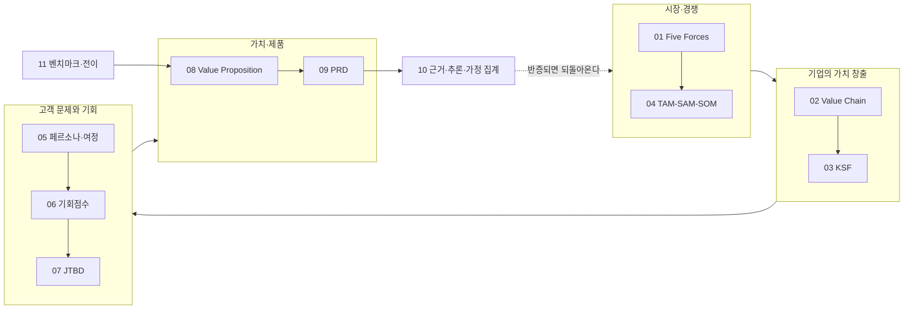

# Evidence & Analysis Workbook — CardFit (공용)

> **제출물 02.** 팀 3인의 확정본(`윤정/확정본`·`가람/확정본`·`효진/확정본`)과 `master-deck/`을 근거로, **11개 방법론이 최종 판단에 실제로 사용한 핵심 근거·계산·가정·결론**을 방법론별 1파일로 분리해 남긴 공용 작업 폴더입니다.
>
> Master Deck(제출물 01)이 **결론**을 담고, 이 Workbook이 **계산과 출처**를 담습니다. 같은 내용을 여러 파일에서 반복하지 않고, 겹치는 지점은 `→ 0N 참조`로 넘깁니다.
>
> 선행본: `효진/0820/final/02_Evidence_Analysis_Workbook.md`(단일 파일 11탭). 이 폴더는 그 산출물을 **방법론 단위 파일로 분리하고 확정본 원문의 상세표·산식을 복원해 확장한** 공용판입니다.

---

## 파일 목록

| 파일 | 방법론 | 정본(근거 원문) | Deck | 상태 |
| --- | --- | --- | :---: | :---: |
| [01_Five_Forces.md](01_Five_Forces.md) | Porter's Five Forces | `윤정/확정본/01` | p3 | ✅ |
| [02_Value_Chain.md](02_Value_Chain.md) | 가치사슬 | `윤정/확정본/02` | p6 | ✅ |
| [03_KSF.md](03_KSF.md) | Top 5 KSF | `윤정/확정본/03` | p7 | ✅ |
| [04_TAM_SAM_SOM_Segment_Map.md](04_TAM_SAM_SOM_Segment_Map.md) | TAM-SAM-SOM & Segment Map | `윤정/확정본/04` | p4~5 | 🔶 SAM·SOM 실수치 미확보 |
| [05_Persona_Spectrum_Journey.md](05_Persona_Spectrum_Journey.md) | 페르소나 스펙트럼·여정지도 | `가람/확정본/05` | p8~10 | ✅ (가상 인물 🟡) |
| [06_Opportunity_Score.md](06_Opportunity_Score.md) | 기회점수 AOS·DOS | `가람/확정본/06` | p12 | 🔶 점수 팀 추정 |
| [07_JTBD.md](07_JTBD.md) | JTBD | `가람/확정본/07` | p11 | 🔶 모의 인터뷰 |
| [08_Value_Proposition.md](08_Value_Proposition.md) | Value Proposition Sheet | `효진/확정본/08` | p20 | ✅ |
| [09_PRD_Requirement_Trace.md](09_PRD_Requirement_Trace.md) | PRD & 요구사항 추적 | `효진/확정본/09` | p26~29 | ✅ / D1~D5 미정 🔴 |
| [10_Evidence_Inference_Assumption.md](10_Evidence_Inference_Assumption.md) | 근거·추론·가정 집계 | 신규 작성(전 파일 집계) | p32 | ✅ |
| [11_Benchmark_Transfer.md](11_Benchmark_Transfer.md) | 벤치마크·메커니즘 전이 | `윤정/확정본/11` + `윤정/0820` | p15~19 | ✅ |

> `윤정/확정본/`의 05~10은 0바이트 빈 파일입니다 — 05·06·07 정본은 `가람/확정본/`, 08·09 정본은 `효진/확정본/`이며, **10은 저장소에 정본이 없어 이 폴더에서 신규 작성**했습니다.

---

## 제출물 02 산출 — `02_Evidence_Analysis_Workbook.xlsx`

루트 `README.md`의 최종 제출 패키지가 제출물 02를 **`.xlsx`**로 지정하고, `효진/0820/final/00_README_제출_점검.md`도 *"02·03을 Sheet 또는 PDF로 변환"*을 남은 과제로 둔다. 그 변환본이 이 폴더의 `02_Evidence_Analysis_Workbook.xlsx`다.

| 항목 | 내용 |
| --- | --- |
| 시트 구성 | **12개** — `00_Index` + 방법론 11개 탭 |
| 생성 방법 | `python3 build_workbook_xlsx.py` (openpyxl) |
| 정본 관계 | **이 폴더의 `*.md` 11개가 정본이고 xlsx는 파생물이다.** md를 고치면 스크립트를 다시 돌려 갱신한다 — xlsx를 직접 편집하면 다음 실행에서 덮어써진다 |
| 다이어그램 | mermaid 블록은 셀로 옮기지 않고 `[다이어그램 — 원문 .md 참조]`로 표시한다 |
| 구글 Sheet | 이 xlsx를 Drive에 올려 "Google 스프레드시트로 열기"를 하면 탭 구조·서식이 그대로 변환된다 |

**시트명 대응** (엑셀 31자 제한으로 일부 축약)

| 파일 | 시트명 |
| --- | --- |
| `04_TAM_SAM_SOM_Segment_Map.md` | `04_TAM_SAM_SOM` |
| `05_Persona_Spectrum_Journey.md` | `05_Persona_Journey` |
| `09_PRD_Requirement_Trace.md` | `09_PRD_Trace` |
| `10_Evidence_Inference_Assumption.md` | `10_Fact_Inference_Assum` |
| 그 외 8개 | 파일명과 동일(확장자 제외) |

> 제출 시에는 이 xlsx를 `팀명_CardFit_역기획프로젝트_Final/02_Evidence_Analysis_Workbook.xlsx`로 복사한다. **`03_Decision_AI_Usage_Log.xlsx`는 아직 만들지 않았다** — 재료는 `decision-log/decision-log.md`와 `ai-usage-log/ai-usage-log.md`다.

---

## 공통 형식 — 방법론.md 8장 Evidence & Analysis Workbook 8필드

모든 파일의 4절(근거·추론·가정)은 아래 8필드를 따릅니다.

`분석 대상 / 구분(Fact·Inference·Assumption) / 관찰·주장 / 출처·확인일 / 근거·추론 과정 / 신뢰도(High·Mid·Low) / 영향 / 검증 계획`

각 파일 구조는 동일합니다.

| 절 | 내용 |
| :---: | --- |
| 0 | **최종 판단** — 이 방법론이 내린 결론과 그 근거 강도 |
| 1 | **상세표** — 확정본 원문의 판정표·근거표 |
| 2 | **산식·계산** — 공식과 실제 대입 과정(해당 방법론만) |
| 3 | **출처·확인일** — 1차 출처와 확인 날짜 |
| 4 | **Fact / Inference / Assumption / 미확인** — 8필드 |
| 5 | **사례 비교** — 경쟁사·벤치마크 대조 |
| 6 | **전이 분석** — 이 결론이 어느 방법론에서 왔고 어디로 흘러가는가(`방법론.md` 5장 연결규칙) |
| 7 | **추가 검증과제** |

## 기호 체계

| 축 | 기호 | 의미 |
| --- | --- | --- |
| 근거 등급 | 🔵 ⚪ 🟡 🟠 | Fact(1차 출처 확인) / Inference(추론) / Assumption(팀 가정) / 미확인 |
| 조건 충족도 | ✔ ◐ ✗ ？ | 충족 / 부분 충족 / 미충족 / 확인 불가 |
| 상태 | ✅ 🔶 ⬜ 🔴 | 확보 / 부분·수정필요 / 미착수 / 블로커 |

⚠️ **두 축을 혼동하지 않습니다** — ◐는 "부분 충족"이고 추론(⚪)이 아닙니다. `◐ 🔵` = 부분 충족이며 그 판정이 사실로 확인됨.

**확인일은 별도 표기가 없으면 2026-08-20입니다.** 이 폴더 작성일은 2026-08-21입니다.

---

## 이 Workbook을 읽는 순서

**10번은 마지막에 읽는 파일이 아니라 전 파일의 등급 판정을 모아 놓은 색인**입니다 — 어떤 주장이 🔵이고 어떤 주장이 🟡인지 한곳에서 확인하려면 10번부터 보십시오.

---

## 최종 판단 한 줄 요약 — 11개 방법론 종합

| # | 결론 | 근거 강도 |
| :---: | --- | :---: |
| 01 | 산업 매력도는 **중간**. 구매자 힘·대체재 위협이 높고 공급자 의존도도 높지만, **3조건 동시 충족 경쟁자가 0곳**이라는 공백이 진입을 정당화한다 | 🔵 |
| 02 | 차별화 구간은 체인의 **중간 두 단계**(제약 최적화·결제수단 배분)다 — 경쟁자 체인에 아예 없다 | 🔵 |
| 03 | KSF 1·2는 Table Stakes이고 **3(손실 가시화 + 근거 투명성)이 유일하게 이길 수 있는 지점**이다 | ⚪ |
| 04 | TAM은 **누적 가입 건수**로만 표기하고 사람 수로 환산하지 않는다. SOM은 혼인 Beachhead | 🔵 / SAM·SOM 값 🟠 |
| 05 | 12명 중 4명이 여정을 완주하지 못하고, **③온보딩과 ⑥실행**이 가장 취약하다 | 🟡 가상 인물 |
| 06 | **A(미래지출 연결)와 C(실행 완주)가 사실상 공동 1위** — 모수를 바꾸면 순위가 뒤바뀔 만큼 붙어 있다 | 🟡 팀 추정 |
| 07 | 가장 큰 가정이 "입력할까"에서 **"혜택 보상이 입력 노동을 정당화하나"**로 좁혀졌다 | 🟡 모의 인터뷰 |
| 08 | Fit 6건 중 ✅3·🔶3. **공동 1위 기회 C에 기능이 없고, 기능이 아니라 측정(F-13)으로 대응**한다 | 🔵 근거 / 🟡 목표 |
| 09 | 핵심 기능은 **F-04(Net Benefit 게이팅 조합 최적화)** 하나. 성공 판정은 조합안 선택률 ≥ 40% 🟡 | 🟠 기준선 전량 미측정 |
| 10 | 🔵 13건 · ⚪ 6건 · 🟡 8건 · 🟠 22건. **E2 Concierge Test 하나가 최대 리스크 4건을 동시에 해소**한다 | — |
| 11 | 뱅크샐러드(진단)·핀트(게이팅)·토스(전달) 3사를 채택하고 2사를 **서로 다른 이유로** 제외했다 | 🔵 |

---

**연결 문서**: `../방법론.md` 5장(연결규칙)·8장(근거 관리 원칙) · `../master-deck/README.md`(32p 페이지별 근거 인덱스) · `../decision-log/decision-log.md` · `../ai-usage-log/`
