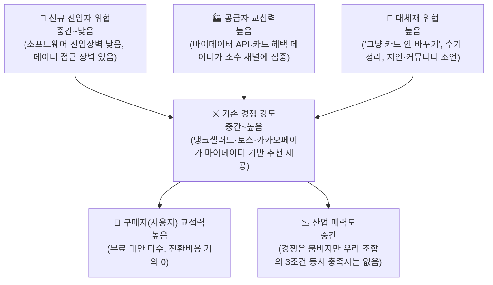

# p3. Porter's Five Forces — 마이데이터 기반 미래지출 반영 카드조합 재설계

> **분석 대상 산업**: 카드 발급업이 아니라, 그 위에서 계산·추천·재배치를 하는 **소프트웨어 레이어**
>
> **서비스 정의**: 마이데이터로 확보한 과거 소비 기록과 사용자가 직접 입력한 미래 소비 변화(혼인·이사 등)를 함께 반영해, 보유·신규카드의 실적 구간·혜택한도·연회비를 계산 근거와 함께 공개하며 실행 가능한 카드 조합 재배치안을 제시하는 서비스
>
> **범례 — 두 축을 구분해 읽습니다**
> · 근거 등급: 🔵 Fact(출처로 재확인 가능) · ⚪ Inference(추론) · 🟡 Assumption(가정) · 🟠 미확인
> · 조건 충족도: ✔ 충족 · ◐ 부분 충족 · ✗ 미충족 · ？ 확인 불가
> · 두 축은 함께 표기합니다 — 예: `◐ 🔵` = 부분 충족이며 그 판정이 사실로 확인됨

---

## 0. 구조 한눈에 보기

| 힘 | 강도 | 판단 근거 |
| --- | --- | --- |
| 공급자 교섭력 | **높음** | 카드 이용내역은 마이데이터 API로만 제공(오픈뱅킹 불가, 🔵 금융위 2024.12.30) — 채널이 사실상 하나뿐 |
| 구매자 교섭력 | **높음** | 카드고릴라·토스·카카오페이 등 무료 대안이 이미 존재, 전환비용 거의 없음 |
| 신규 진입 위협 | **중간~낮음** | 계산 엔진 자체는 소프트웨어라 자본 장벽이 낮지만, 마이데이터 데이터 접근이 실질적 장벽 |
| 대체재 위협 | **높음** | "그냥 기존 카드 유지"가 가장 강력한 대체재 — 심리적 관성이 전환비용을 대체함 |
| 기존 경쟁 강도 | **중간~높음** | 트래픽·회원 기반 경쟁자는 이미 존재하나, 3조건(실행설계·미래소비반영·근거공개) 동시 충족자는 없음 |

---

## 1. 공급자의 힘 — 마이데이터·카드 데이터 채널에 종속 → **높음**

- 카드 이용내역(결제내역)은 마이데이터 API로만 제공되고 오픈뱅킹으로는 제공되지 않음(🔵 금융위원회 보도자료 2024.12.30) — **대체 공급자가 없음**
- 마이데이터 본허가 사업자 수는 **🟠 미확정** — 69개사·그중 7개사 허가 반납(스트레이트뉴스 2025)과 35곳(2024.03 기준, 신용정보업협회) 두 수치가 상충하며 집계 기준이 다를 수 있음. 확정 수치는 신용정보업협회 허가 현황 원자료로 재확인 필요. **다만 어느 쪽이든 "채널이 좁고 API 과금 부담이 실재한다"는 방향성은 유지됨**
- 카드 혜택 Rule(전월실적 구간·통합할인한도·제외 항목)은 카드사별 개별 약관에만 존재하고 공식 통합 API가 없음(🔵) — 공급자가 전업카드사 8개사+겸영은행으로 파편화

**판단**: 공급자 교섭력 **높음**. MVP부터 마이데이터 연동을 전제하기로 확정(decision-log 2026-08-19)했으므로 이 힘은 회피 대상이 아니라 **직접 관리할 리스크**다 — 직접 인가 취득 vs 기존 인가 사업자 제휴 선택이 미해결(쟁점 1).

> ※ 카드 이용내역이 오픈뱅킹으로 제공되지 않는다는 규제 사실은 MVP 설계 방향과 무관하게 유효하다 — 이 때문에 마이데이터 연동이 선택이 아니라 전제가 된다.

## 2. 구매자(사용자)의 힘 — 전환비용 거의 0 → **높음**

- 카드고릴라(15년 누적 방문자 약 8,000만 명, MAU 약 140만), 뱅크샐러드(카드추천 약 130만 명), 토스 카드라운지, 카카오페이가 모두 **무료**로 카드 추천 제공(🔵)
- 가입비·데이터 이전 비용이 없어 전환비용이 사실상 0

**약해지는 조건(우리 방어선)**: 위 경쟁자 중 "미래 소비 변화 반영 + 실행 설계(재배치) + 계산 근거 공개"를 동시에 제공하는 곳은 없음(🔵 4절) — 이 3조건이 실제로 가치가 있다면 전환비용을 대신할 **차별적 가치**가 된다.

**판단**: **높음**. 차별점 A·B·C가 실제로 작동해야만 방어가 성립 — KSF 3(03 문서)로 연결.

## 3. 신규 진입자의 위협 — 소프트웨어 장벽 낮음, 데이터 장벽 있음 → **중간~낮음**

**장벽이 되는 요소**
- 마이데이터 신규 참여 6대 허가요건(자본금 최소 5억원, 물적설비·보안, 사업계획 타당성 등, 🟠 2020~2022 기준 — 최신 개정 확인 필요)
- 카드 혜택 Rule 최신성 유지에 전업카드사 8개사+겸영은행 약관의 지속 추적 필요 — 후발주자도 동일한 **데이터 운영 비용**을 감당해야 함

**장벽이 낮은 요소**
- 계산 엔진(F-01~F-06)은 규칙 기반 소프트웨어로 특허·독점 기술 요건이 없음(⚪)
- 직접 인가 대신 기존 인가 사업자 제휴로 시작 가능 — 초기 자본 장벽을 낮출 수 있음

**판단**: **중간~낮음**. 우리 자신이 이 낮은 장벽으로 진입하는 입장이므로, 후발주자도 같은 경로로 들어올 수 있다는 점을 KSF에서 **데이터 운영 역량**으로 방어해야 함.

## 4. 대체재의 위협 — "아무것도 안 하기"가 가장 강력 → **높음**

**강해지는 조건**
- 카드 조합 변경 자체가 실적 재설계·해지 절차 마찰을 수반 — 계산상 유리해도 실행하지 않는 것이 합리적 선택이 될 수 있음(🔵 카드 해지 절차 마찰 민원)
- 카드사가 이미 "단종카드 자동대체"로 재배치를 대신 수행(🔵) — 사용자가 능동적 재설계 필요를 못 느낄 수 있음
- 수기 가계부·지인 추천·커뮤니티 조언도 무료 대체재

**약해지는 조건 — 동기와 신뢰는 다른 문제다**
- 이 대체재를 실제로 흔드는 것은 **지금 카드를 그대로 쓰면 이번 지출에서 얼마를 놓치는지를 손실로 보여주는 것**이다 — "지금 이 카드로는 혜택 0원, 바꾸면 8,000원 더 받는다"처럼 놓치는 금액을 구체화하는 방식(🔵 메커니즘 전이 분석 1절). 이것이 **동기** 요인이다
- 계산 근거 공개(차별점 C)는 그 격차 숫자를 마케팅 문구가 아니라 진짜 계산으로 **믿게 만드는 신뢰 보강 장치**다. 단종카드 자동대체 이후 "혜택 불일치" 민원이 다수 존재한다는 것(🔵 민원 2022→2025 **+88.4%**)은 근거 없는 자동 재배치에 대한 불신이 이미 시장에 형성돼 있다는 뜻이므로 이 장치가 필요한 이유는 성립한다 — 다만 그 자체가 "유지"를 이기는 동기는 아니다

**판단**: **높음**이나 고정되지 않음 — 상쇄는 **격차를 손실로 보여주기(동기)** 와 **그 숫자를 믿게 만들기(신뢰)** 를 함께 갖출 때만 성립하며, 실제 작동 여부는 검증 가설로 남는다.

## 5. 기존 경쟁자 간의 경쟁 강도 — 붐비지만 우리 조합은 비어 있음 → **중간~높음**

**강해지는 조건**
- 카드고릴라(MAU 140만)·뱅크샐러드(카드추천 130만)·토스(카드라운지 방문자 11배 증가)·카카오페이(AI 마이데이터 분석 추천) 모두 활발히 경쟁(🔵)
- **뱅크샐러드가 카드 영역에 연속 투자 중** — 2026.04 "카드 실적 관리" → 2026.05 "나에게 딱 맞는 카드 찾기"(마이데이터 기반, 발급 연계까지) 🔵 전자신문 2026.05.28. **전월실적 추적은 우리 F-02·F-03과 겹치는 영역이므로 가장 주의할 경쟁 움직임**

**데이터 접근성은 균등하지 않음 (원본 교정)**
- 마이데이터를 실제로 활용하는 곳은 **뱅크샐러드·카카오페이·토스 3곳**이고, **트래픽 1위인 카드고릴라는 비마이데이터 미디어·비교 모델**(카드 스펙·혜택 정보와 고릴라차트 기반, 🔵)
- 즉 **마이데이터 접근은 "격차가 없는 공통 자산"이 아니라 상위 사업자에 한정된 자산**이다 — 이는 3절(데이터 접근이 실질적 장벽)과 정합하며, 우리가 마이데이터 연동을 MVP 전제로 택한 결정을 뒷받침한다.

**약해지는 조건(경쟁 완화)**
- 경쟁 6곳 중 3조건(실행설계·미래소비반영·근거공개)을 동시 충족하는 곳이 없다 🔵 — 가장 앞선 뱅크샐러드도 아래 평가에서 충족하지 못한다
- 유사 기능(미래 소비항목 반영)을 제공했던 더쎈카드는 2023년 출시 후 2026년 서비스 종료(원인 🟠 미확인) — 이 세그먼트에 확신 있는 성공 사례가 아직 없음

### 뱅크샐러드 3조건 상세 평가 — 가장 앞선 경쟁자도 조합을 다루지 않는다

| 조건 | 판정 | 근거 |
| --- | :---: | --- |
| 실행 설계 | **◐ 🔵** | 발급 연계까지 지원하므로 "추천에서 끝"은 아니다. 그러나 실행의 종착점이 **신규 발급**이며 보유카드 재배치·결제수단 배분은 없다 |
| 미래 소비 반영 | **✗ 🔵** | 마이데이터로 연결된 **최근 1년 소비 내역**을 기준으로 계산한다 — 미래 지출을 입력받는 단계가 없다 |
| 근거 공개 | **◐ 🔵** | "얼마를 더 받을 수 있는지 **원 단위까지**" 결과 금액은 공개한다. 그러나 공개되는 것은 **결과**이고, 실적 구간·혜택한도가 어떻게 적용됐는지의 **산출 근거**는 아니다 |

**3조건 동시 충족은 아니다.** 그리고 이 평가에서 나오는 문장은 *"뱅크샐러드는 실행을 안 한다"* 가 아니라 이것이다 — **뱅크샐러드의 실행은 신규 발급에서 끝나고, 계산 기준은 과거 1년이며, 비교 대상은 후보 카드 단 한 장이다.** 우리가 파고드는 지점이 정확히 이 세 곳이다.

**판단**: 트래픽·회원 기반 경쟁은 **중간~높음**이나, 우리가 겨냥한 정확한 문제(미래소비 반영형 조합 재설계)는 경쟁 공백 — "산업 매력도는 중간이나 우리 세그먼트는 상대적으로 매력적".

---

## 6. 종합 판단

다섯 힘을 종합하면, 이 산업은 **구매자 힘과 대체재 위협이 강해 사용자 유입·유지가 쉽지 않고, 공급자(마이데이터·카드데이터) 의존도가 높아 운영 비용·리스크가 있는 산업**이다.

진입을 정당화하는 근거는 두 가지다.

1. **기존 경쟁자 대부분이 우리가 겨냥한 정확한 조합(미래소비반영 + 조합 재설계 + 근거공개)을 다루지 않는다** — 가장 앞서 있는 뱅크샐러드조차 과거 1년 기준·단일 카드 비교·발급 연계에서 멈춘다(🔵)
2. **마이데이터 접근이 공통 자산이 아니라 상위 사업자에 한정된 자산이다** — 트래픽 1위 카드고릴라가 비마이데이터 모델이라는 사실이 이를 보여주며, 동시에 이것이 우리에게는 관리해야 할 공급자 리스크이기도 하다

이 결론은 03(KSF)에서 "무엇에 집중해야 하는가"로 이어진다 — 방어선은 **데이터 운영 역량**과 **조합 배분 계산의 정확성** 두 축이다.

---

## 출처

- 금융위원회 보도자료 2024.12.30 (카드 이용내역은 마이데이터 API로만 제공) — `윤정/국내 신용카드 시장 리서치.md` 5절 경유
- [뱅크샐러드, 소비패턴 분석해 '인생카드' 찾아준다 — 전자신문 2026.05.28](https://www.etnews.com/20260528000057)
- [뱅크샐러드, '나에게 딱 맞는 카드 찾기' 서비스 출시 — 스포츠경향 2026.05.29](https://sports.khan.co.kr/article/202605290434003/)
- [뱅크샐러드, '내 소비 맞춤 카드' 추천…마이데이터로 혜택 극대화 — 문화일보](https://www.munhwa.com/article/11591916)
- [마이데이터 본인신용정보관리업 허가 현황 — 신용정보업협회](https://www.cica.or.kr/14_mydata/mydata_05.jsp)
- 카드고릴라 트래픽·MAU — 이데일리/마켓인 2025.07, `윤정/국내 신용카드 시장 리서치.md` 3절 경유

**다음 페이지로 연결**: 이 결론은 p7(KSF)에서 "무엇에 집중해야 하는가"로 이어진다 — 방어선은 **데이터 운영 역량**과 **조합 배분 계산의 정확성** 두 축이다.
