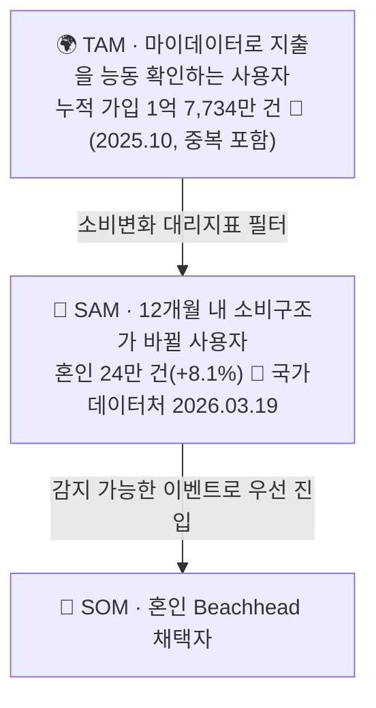

# 원고 · p4~5 시장·경쟁 ②③

> 발표용 원고. **정본은 `효진/0820/final/01_서비스_역기획서.md`**이며 이 파일은 페이지 단위 파생물이다.
> 표기 — 근거: 🔵 확인된 사실 · ⚪ 추론 · 🟡 가정 · 🟠 미확인 / 충족도: ✔ 충족 · ◐ 부분 · ✗ 미충족

| 항목 | 내용 |
| --- | --- |
| 구간 | p4~5 |
| 담당 | 윤정 원본 / 효진 원고 |
| 근거 문서 | `윤정/확정본/04_TAM_SAM_SOM_Segment_Map.md` |

---

# p4 · 시장·경쟁 ② TAM-SAM-SOM



**산식**
```
SAM = [ Σ(연간 소비변화 이벤트 인원) − 중복 ] × 마이데이터 이용률
SOM = SAM × Beachhead 비중 × 초기 채널 도달률 × 조합안 선택률
```

| 결정 | 내용 |
| --- | --- |
| TAM 앵커 = 마이데이터 가입 건수 | 서비스 자격 조건과 그대로 맞물린다 — 마이데이터를 쓰지 않는 사람은 계산에 필요한 과거 소비를 제공할 수 없다 |
| **사람 수로 환산하지 않는다** | 1억 7,734만 건은 서비스별 중복 합산이다. 인구 5,170만 명을 크게 초과하므로 고유 인원이 아니다 ⚪. 임의 배수로 인원을 만들지 않는다 |
| 신용카드 발급매수(1억 3,466만 매, 2025)는 제외 | 카드 장수이지 사람 수가 아니고, 마이데이터 이용 여부와 무관하다. 개인카드 이용액 누계 275.97조원(🔵 여신금융협회 월간통계 2026.06)도 같은 이유로 제외 |
| 중복 제거 원칙 | 신혼 1쌍은 혼인+이사+출산에 모두 잡힌다 → **세대(가구) 단위**로 통일 |

민감도 3시나리오 — 보수(중복률 0.8) · 기본(0.65) · 공격(0.5)

**지출강도 1,473만~2,203만원의 산식** — 듀오 2026 결혼비용 조사 총계 5,912만원(주택자금 제외) 중 **카드결제 확실 항목**(신혼여행 1,030만 + 혼수 1,445만 + 웨딩패키지 471만 = 2,946만 → 1인당 **1,473만**), 예식홀 1,460만 조건부 포함 시 1인당 **2,203만**.

> ⚠️ 이사 대리지표는 **축소 국면**이다 — 2025년 주택사유 이동자가 전년 대비 **-10.5만 명**으로 가장 큰 감소다. Q2를 제외한 판단(다음 페이지)의 보조 근거다.

`근거: 윤정/확정본/04_TAM_SAM_SOM_Segment_Map.md`

---

# p5 · 시장·경쟁 ③ Market Segment Map

**축 선택: Trigger 감지가능성 × 1인당 지출강도** — 실측 데이터가 채워진 축이라서 채택했다. "예측가능성 × 보유카드 수" 축은 실측이 없어 버렸다.

| 세그먼트 | Trigger 감지 | 1인당 지출강도 | 판정 |
| --- | --- | --- | --- |
| **Q1 혼인** | 높음 (웨딩업체 신호) | **최고 — 1,473만~2,203만원** 🔵 | 🥇 **1차 표적(SOM)** |
| Q2 입주(이사) | 낮음 (중개 파편화) | 확인 안 됨 | 대상 아님 — 혼수 항목이 Q1 혼인 지출과 **정면 중복**, 독립 계상 불가 |
| Q3 해외여행(일반) | 낮음 | 낮음 (1건 약 102만원, 등급 미표기 🟠) | 대상 아님 — 신혼여행 1,030만원은 일반 해외여행의 약 10배로 Q1에 포함 |
| Q4 카드 갱신 일반군 | 매우 높음 | 낮음 (무차별) | 대상 아님 — **채널 후보로만** 참고 |

> 자녀 입학·유학·은퇴도 같은 수요를 만든다. 유학·은퇴처럼 **소비가 줄어드는 방향**의 이벤트는 별도 설계가 필요하다 — F-01의 양방향 입력 요건이 여기서 나온다.

`근거: 윤정/확정본/04` 6절, `decision-log` 08.19 19:36 (Q2 재분류)

---
