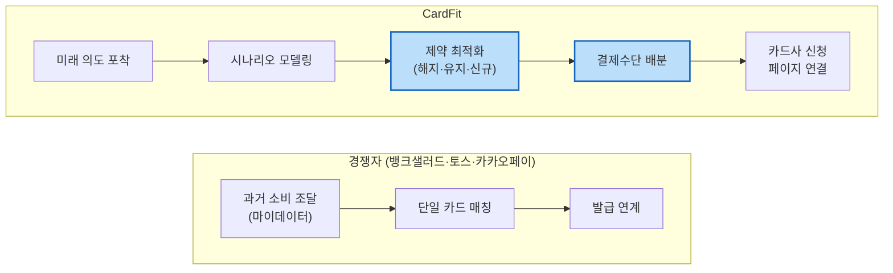
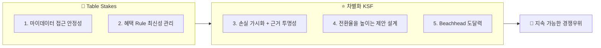

# 원고 · p6~7 기업·성공구조

> 발표용 원고. **정본은 `효진/0820/final/01_서비스_역기획서.md`**이며 이 파일은 페이지 단위 파생물이다.
> 표기 — 근거: 🔵 확인된 사실 · ⚪ 추론 · 🟡 가정 · 🟠 미확인 / 충족도: ✔ 충족 · ◐ 부분 · ✗ 미충족

| 항목 | 내용 |
| --- | --- |
| 구간 | p6~7 |
| 담당 | 윤정 원본 / 효진 원고 |
| 근거 문서 | `윤정/확정본/02_Value_Chain.md · 03_KSF.md` |

---

# p6 · 기업·성공구조 ① 가치사슬

**경쟁자 체인 2단계 vs 우리 체인 5단계**

경쟁자 체인에는 **중간 두 단계(제약 최적화·결제수단 배분)가 아예 없다** 🔵. 마지막 단계(신청 페이지 연결)는 경쟁자도 하는 일이므로 차별점이 아니다 — 차별은 그 단계에 **도달하기 전에** 조합 재배치와 배분을 거치느냐다.

| 활동 | 핵심 결정 |
| --- | --- |
| 투입·조달 | 마이데이터 API(단일 채널, 대체 없음) + 카드 약관 직접 수집. 장애 시 "최근 확인된 데이터 기준" 경고로 완화 |
| 운영·생산 | **혜택 계산은 결정론적 규칙 엔진, AI는 근거 설명만.** 이 경계가 무너지면 "혜택을 보장한다"는 규제 리스크 |
| 산출·물류 | 결론 → 핵심 변화 → Trade-off → 근거 → 상세 Rule 순 계층화. 첫 화면은 순혜택만 |
| 마케팅·영업 | 혼인 Beachhead, 웨딩업체 제휴. Concierge Test로 선택률 실측 |
| 서비스 | **계산 오류 신고·정정이 유일한 사후지원.** 해지 상담·대행은 어떤 형태로도 제공하지 않는다 — 카드사 책임 영역 |

`근거: 윤정/확정본/02_Value_Chain.md`

---

# p7 · 기업·성공구조 ② KSF Top 5

| # | KSF | 구분 | 자원 배분 시사점 |
| :---: | --- | :---: | --- |
| 1 | 마이데이터 접근 안정성 | 🧱 | **인가 vs 제휴를 가장 먼저 확정**해야 나머지가 성립. 기존 사업자는 이미 보유 = 경쟁우위 아님 |
| 2 | 혜택 Rule 최신성 관리 | 🧱 | 초기엔 대표 카드 1~2종으로 범위를 좁혀 관리 부담을 낮춘다 |
| 3 | **손실 가시화 + 근거 투명성** | ⭐ | **핵심 KSF.** ①동기(놓치는 금액을 손실로) + ②신뢰(근거 공개)가 함께여야 "유지하기"라는 대체재를 이긴다 |
| 4 | 전환율을 높이는 제안 설계 | ⭐ | 여러 카드를 한꺼번에 바꾸라 하지 않고, 결론을 하나로 압축 |
| 5 | Beachhead 도달력 | ⭐ | Concierge Test로 도달률·전환율 실측 |

> **①만 있으면** "과장 광고 아니냐"는 의심을 산다. **②만 있으면** 숫자는 투명한데 "그래서 뭐가 달라지나"는 무관심을 부른다. 둘이 같이 있어야 카드를 바꾸는 행동까지 이어진다.

`근거: 윤정/확정본/03_KSF.md`

---
