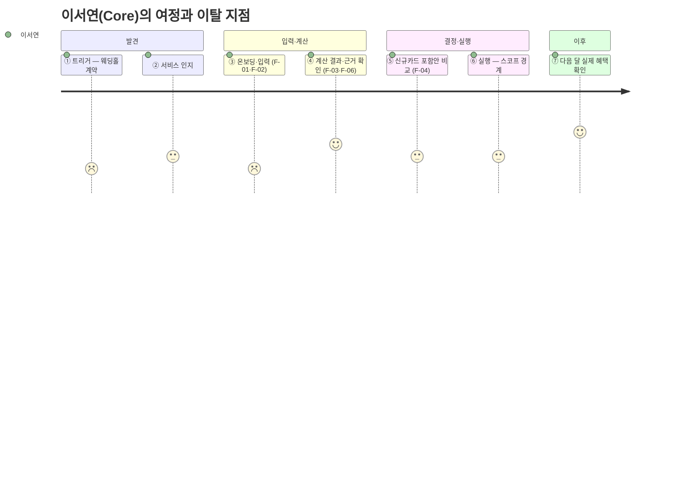

# 원고 · p8~11 고객 맥락

> 발표용 원고. **정본은 `효진/0820/final/01_서비스_역기획서.md`**이며 이 파일은 페이지 단위 파생물이다.
> 표기 — 근거: 🔵 확인된 사실 · ⚪ 추론 · 🟡 가정 · 🟠 미확인 / 충족도: ✔ 충족 · ◐ 부분 · ✗ 미충족

| 항목 | 내용 |
| --- | --- |
| 구간 | p8~11 |
| 담당 | 가람 원본 / 효진 원고 |
| 근거 문서 | `가람/확정본/05_Persona_Spectrum_Journey.md · 07_JTBD.md` |

---

# p8 · 고객 맥락 ① 페르소나 스펙트럼 12명

| 유형 | 인원 | 인물 | 이 층에서 배우는 것 |
| --- | :---: | --- | --- |
| **핵심 Core** | 5 | 이서연(혼인) · 김도윤(결혼+이사) · 박서준(자동대체 불신) · 한지민(프리랜서·이사) · 최유리(발령·회계 전문가) | 기준 수요 — Job A·B가 여기서 나온다 |
| **확장 Adjacent** | 3 | 정하늘(기존 서비스 이용자) · 오세훈(이직) · 강민재(자녀 독립·지출 **감소**) | Job F — 이벤트명에 안 걸리는 수요 |
| **극단 Extreme** | 2 | 윤태호(카드 20장+, 관리 포기) · **신은서(해지 3회 시도·0회 성공 ⚪ 단일 사례)** | 실패의 두 원인 — 내부 과부하 vs 외부 마찰 |
| **비활성 Non-user** | 2 | 배정호(디지털 비친화) · **조민아(예측 자체를 불신)** | 조민아 = **가장 큰 가정의 정면 반대** |

> 대표 4명으로 발표하되 12명 전원을 Workbook 05 탭에 남긴다. **신은서와 조민아가 이 프로젝트의 두 반증 사례**다 — 신은서는 지표 설계를(실행 완주율), 조민아는 온보딩 설계를(F-11 초기값 자동 제안) 바꿨다.

`근거: 가람/확정본/05_Persona_Spectrum_Journey.md`

---

# p9 · 고객 맥락 ② 2축 포지셔닝과 전환 시나리오

**축: 계산 신뢰도 × 관여도**

| 위치 | 인물 | 서비스가 만들 전환 |
| --- | --- | --- |
| 고신뢰·고관여 | 정하늘·최유리 | 이미 대안(엑셀·뱅크샐러드)을 쓴다 → **조합 단위 계산**으로 갈아타게 만든다 |
| 저신뢰·고관여 | 박서준·신은서 | 카드사 설명을 못 믿는다 → **근거 6항목 공개**로 신뢰를 만든다 |
| 고신뢰·저관여 | 이서연·김도윤 | 계산해 줄 사람만 있으면 맡긴다 → **결론 하나로 압축** |
| 저신뢰·저관여 | 조민아·배정호 | 예측·디지털 자체를 거부 → **v0.1 대상 아님**(명시적 제외) |

> 경계 3명(윤태호·조민아·배정호)의 처리를 암묵적 제외로 두지 않고 **PRD에서 명시적으로 선언**했다. VP 시트 미해결 #5의 해소다.

`근거: 가람/확정본/05` 1~3절, `효진/확정본/08` 5절

---

# p10 · 고객 맥락 ③ 고객 여정지도 — 서비스 고유 7단계

**12명 중 4명이 완주에 실패한다.**

| 인물 | 단절 지점 | 원인 | 우리 대응 |
| --- | :---: | --- | --- |
| 배정호 | ② 인지 | 디지털 채널 자체 거부 | ❌ 앱으로 해결 불가 — v0.1 제외 |
| **조민아** | ③ 온보딩 | 미래 예측 입력 자체를 불신 | ✅ **F-11 과거 패턴 기반 초기값 자동 제안** |
| 윤태호 | ⑤~⑥ | 카드 20장+ 정보 과부하 | 🔶 F-07 단계적 제시(Could) |
| **신은서** | ⑥ 실행 | 상담사 만류 (3회 시도 0회 성공 ⚪ 단일 사례) | 📊 **측정만** — 대행 권한 없음 |

> **가장 취약한 전환점은 ③과 ⑥이다. ③은 제품이 개입하고, ⑥은 개입하지 않고 측정만 한다.** 이 한 줄이 스코프 경계 전체를 요약한다.

`근거: 가람/확정본/05` 고객여정지도 13·14절

---

# p11 · 고객 맥락 ④ JTBD — Job 6개

| # | Job — 고객이 이루려는 진전 | 해당 인물 |
| :---: | --- | --- |
| **A** | 소비 구조가 곧 바뀔 때, 미래 지출을 카드 혜택과 미리 연결해 계산받기 | 이서연·김도윤·한지민·최유리·정하늘 |
| **B** | 계산 결과를 신뢰할 수 있는 근거로 직접 검증하기 | 이서연·박서준·최유리·정하늘 |
| **C** | 계산까지 마친 뒤 기존 카드를 실제로 해지·전환해 완주하기 | 이서연·박서준 (극단: 신은서) |
| **D** | 정확한 숫자를 몰라도 부담 없이 유연하게 입력하기 | 김도윤·한지민·정하늘·강민재 |
| **E** | 이벤트가 끝난 뒤에도 계속 쓸 이유를 갖기 | 김도윤·한지민·최유리 |
| **F** | 이벤트명과 무관하게 내 소비 변화를 대상으로 인정받기 | 오세훈·강민재 |

**가장 큰 가정이 두 번 좁아졌다.** 검증할 것은 이제 *"사용자가 미래 지출을 입력할까"*가 아니다 — 홈택스 연말정산 미리보기·은퇴 시뮬레이터·웨딩북 예산관리 등 **타 도메인에서 이미 작동하는 행동**이다(⚪ — 홈택스의 실제 이용자 수·입력 완료율은 🟠 미확보이므로 "대규모"라고 단정하지 않는다). 진짜 질문은 **"카드 혜택 최적화라는 보상이 입력 노동을 정당화할 만큼 큰가"**다.

`근거: 가람/확정본/07_JTBD.md` 0절, Evidence Log E-05`

---
