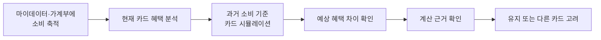
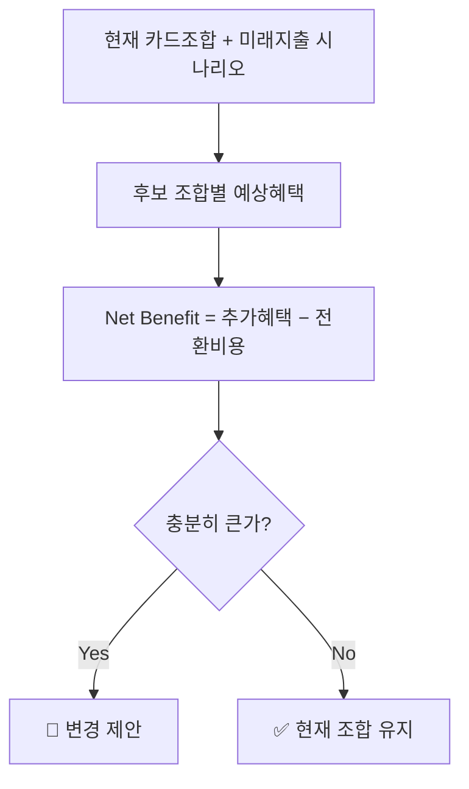

# 원고 · p15~17 사례·메커니즘

> 발표용 원고. **정본은 `효진/0820/final/01_서비스_역기획서.md`**이며 이 파일은 페이지 단위 파생물이다.
> 표기 — 근거: 🔵 확인된 사실 · ⚪ 추론 · 🟡 가정 · 🟠 미확인 / 충족도: ✔ 충족 · ◐ 부분 · ✗ 미충족

| 항목 | 내용 |
| --- | --- |
| 구간 | p15~17 |
| 담당 | 윤정 원본 / 효진 원고 |
| 근거 문서 | `윤정/확정본/11_Benchmark_Transfer.md · 윤정/0820/동일_인접_교차_산업_메커니즘_전이_분석.md` |

---

# p15 · 사례 ① 동일 산업 — 뱅크샐러드 (기준 서비스)

**현재 제공 가치** — 가계부·마이데이터에 축적된 실제 소비를 카드 상품 데이터와 비교해, 다른 카드를 썼다면 받았을 혜택을 시뮬레이션한다. 연회비·전월실적·통합할인한도가 계산에 반영되고, 예상 연 혜택의 계산 근거도 확인할 수 있다 🔵.

**As-Is 흐름**

**핵심 이탈 지점 5개**

| 단계 | 이탈 원인 | 등급 |
| --- | --- | :---: |
| 데이터 준비 | 소비 내역 1개월 미만이면 추천 정확도 저하 | 🔵 |
| 데이터 매칭 | 카드사 카드명 ≠ 서비스 DB 카드명이면 계산 불가 | 🔵 |
| 추천 확인 | 곧 발생할 고액지출·생활변화가 반영되지 않음 | ⚪ |
| **변경 판단** | "지금 굳이 새 카드를 만들 만큼 차이가 큰가" | 🟡 |
| **신뢰 판단** | 미래 소비가 아직 없는 상태에서 제시된 혜택을 확신하기 어려움 | 🟡 |

> 세 원인은 한 구조로 수렴한다 — **개인화 수준이 높아질수록 추천 품질이 행동 데이터의 양·질에 강하게 의존한다.** 그래서 진짜 경쟁자는 다른 추천 서비스가 아니라 **"그냥 지금 카드를 계속 쓰는 것"**이다.

`근거: 윤정/확정본/11` 1절

---

# p16 · 사례 ② 인접 산업 — 핀트 (투자 리밸런싱)

**가져오는 메커니즘** — 핀트는 리밸런싱 효익이 거래비용보다 작으면 매매를 미룬다 🔵. 가져오는 것은 투자상품이나 AI 모델이 아니다.

> **현재 상태와 목표 상태가 다르다고 해서 무조건 변경하지 않는다. 변경으로 얻는 효익이 변경 비용보다 충분히 클 때만 행동을 제안한다.**

**카드 문제로 번역 — Rebalancing Gate**

전환비용 3항목 = **연회비 + 실적 재적립 손실 + 발급 대기 비용**. 절대·상대 기준을 모두 넘는 조합만 제안하고, 못 넘으면 결론은 "유지"다.

**해결하는 이탈 지점** — "새 카드를 만들 만큼 가치가 있나". 추천의 목표를 *"더 좋은 카드 찾기"*에서 **"바꿀 가치가 있는 경우만 알려주기"**로 바꾼다.

`근거: 윤정/확정본/11` 3절

---

# p17 · 사례 ③ 교차 산업 — 토스 UX Writing, 그리고 검토 후 버린 둘

**토스에서 가져오는 것** — 해요체·능동형 표현이라는 UI 외형이 아니라 **정보 위계**다 🔵.

> 복잡한 계산을 사용자가 다시 해석하게 하지 않고, 지금 알아야 할 결과와 다음 행동을 먼저 이해시킨다.

첫 화면은 결론 하나. **"A카드는 유지하고, B카드는 정리하고, C카드를 추가하는 조합이에요 — 지금보다 연 34,000원 더 받을 수 있어요."** 카드별 혜택·실적·한도·전환비용·기준일은 눌러야 펼쳐진다.

**검토했지만 가져오지 않은 두 사례** — 버린 이유가 전이 판단의 근거다.

| 사례 | 구조 유사성 | 버린 이유 |
| --- | --- | --- |
| 통신 요금제 진단 (스마트초이스) | **높음** — 사용 패턴 기반 상품 재매칭은 카드 조합과 같은 구조 | 핀트에서 이미 채택한 메커니즘과 **겹친다.** 중복 반영은 설계에 아무것도 더하지 않는다 |
| TMAP TMS (배차·경로 최적화) | 낮음 | 이동거리·순서가 핵심인 구조다. **실적 구간을 채우는** 카드 조합 문제와 맞지 않아 배차·경로라는 은유를 가져오지 않았다 |

### 탐색 범위 커버리지 — 동일·인접·교차를 모두 봤다

| 탐색 영역 | 사례 | 판정 |
| --- | --- | :---: |
| 동일 금융 도메인 | 🏦 뱅크샐러드 | ✅ 채택 |
| 동일 금융 도메인 (UX) | 💬 토스 | ✅ 채택 |
| 인접 금융 도메인 | ⚖️ 핀트 | ✅ 채택 |
| **교차 산업 — 통신·유틸리티** | 📶 스마트초이스 (통신 요금제 진단) | 🔶 **제외 (중복)** |
| **교차 산업 — 물류** | 🚚 TMAP TMS (배차·경로 최적화) | 🔶 **제외 (구조 불일치)** |

### 믹스매치 6기준 점검 — 제외 사유가 서로 다르다

| 기준 | 뱅크샐러드 | 핀트 | 토스 | 스마트초이스 | TMAP TMS |
| --- | :---: | :---: | :---: | :---: | :---: |
| 문제 적합성 | ✅ 손실 인식 부재 | ✅ 개입 시점 불확실 | ✅ 정보 과부하 | ✅ 비교 복잡성 (구조 동일) | ❌ 연속비용·시퀀싱 구조 |
| 가치 적합성 | ✅ 전환 동기 | ✅ 불필요 전환 방지 | ✅ 실행률 | ✅ 계산 타당성 근거 | — |
| 맥락 적합성 | ✅ 저빈도·저리스크로 조정 | ✅ 정기 주기 제거 | ✅ 톤 검증 필요로 표기 | ✅ 과거→미래 축 변경 | ❌ 반영해도 구조 불일치 |
| 도메인 적합성 | ✅ 근거 공개로 설명의무 | ✅ 계산·설명 분리 | ✅ 순혜택 종속 표기 | ✅ 공적 신뢰 포지셔닝 제외 | — |
| 운영 가능성 | ✅ 오류 신고만으로 충분 | ✅ 임계치 하드코딩 후 튜닝 | ✅ A/B 검증 가능 | ✅ 규칙 엔진 재사용 | — |
| 검증 가능성 | ✅ 입력 완료율·채택률 | ✅ 트리거 대비 채택률 | ✅ 첫 화면 이탈률 | 🟠 전환율 미확보 | — |

**두 제외의 성격이 다르다는 것이 이 분석의 핵심이다.**

- **TMAP TMS는 첫 기준에서 탈락했다.** 문제 구조가 다르면 뒤의 5개 기준은 애초에 성립하지 않으므로 적용하지 않았다. 이동거리·시간창이라는 연속 비용과 방문 순서가 핵심인 구조인데, 카드 조합은 **실적 구간을 채우는** 문제다. 남는 건 "다대다 최적화를 자동화한다"는 일반론뿐이고, 이건 TMAP 고유 특징이 아니라 모든 최적화 엔진의 공통점이라 **이름과 은유를 가져오면 잘못된 직관을 심는다.**
- **스마트초이스는 6기준을 다 통과했는데도 제외했다.** 사용 패턴을 규칙에 대입해 최적 상품을 계산하는 구조가 카드 조합과 같다 — 그래서 통과한다. 그런데 그 메커니즘은 **이미 핀트에서 채택했다.** 기준 통과와 "기존 채택 사례에 없던 새 메커니즘을 주는가"는 다른 문제다. 교차 산업이라는 이유만으로 별도 사례로 남기면 **"이색 사례 수집"**이 된다.

> 서로 다른 이유로 제외된 두 사례를 지우지 않고 남긴 것 자체가, 교차 산업을 폭넓게 검토했다는 근거다.

> 산업이 멀다고 가져오고 가깝다고 버리지 않았다 — **문제 구조가 같은지, 그리고 이미 가진 메커니즘과 겹치지 않는지**로 판정했다.

`근거: 윤정/확정본/11` 4·5절, `윤정/0820/동일_인접_교차_산업_메커니즘_전이_분석.md` 0·2·3절

---
