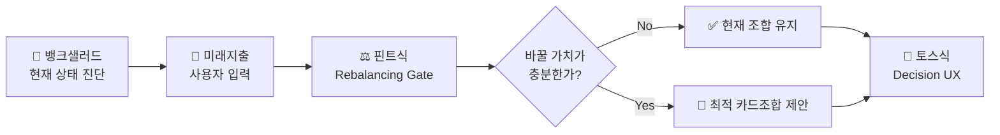

# 원고 · p18~19 전이 가능성

> 발표용 원고. **정본은 `효진/0820/final/01_서비스_역기획서.md`**이며 이 파일은 페이지 단위 파생물이다.
> 표기 — 근거: 🔵 확인된 사실 · ⚪ 추론 · 🟡 가정 · 🟠 미확인 / 충족도: ✔ 충족 · ◐ 부분 · ✗ 미충족

| 항목 | 내용 |
| --- | --- |
| 구간 | p18~19 |
| 담당 | 윤정 원본 / 효진 원고 |
| 근거 문서 | `윤정/0820/동일_인접_교차_산업_메커니즘_전이_분석.md 1·2·3절` |

---

# p18 · 전이 판단 — 유지 · 변형 · 제외

| 축 | 벤치마크 | 유지할 원리 | 변형한 조건 | 제외한 요소 |
| --- | --- | --- | --- | --- |
| 현재 상태 진단 | 뱅크샐러드 | 실제 소비 데이터로 놓치는 금액을 **손실로 가시화** | 계산 기준을 과거 1년 → **과거 + 미래 입력** | 발급 연계를 종착점으로 삼는 설계 |
| 전환 판단 | 핀트 | **Net Benefit 게이팅** — 바꿀 가치가 있을 때만 제안 | 거래비용 → **연회비·실적 재적립 손실·발급 대기** 3항목 | 자동 실행(일임매매) — 카드에는 직권·대행 권한이 없다 |
| 결과 전달 | 토스 | 결론 우선 · **단계적 근거 공개** | 근거 항목을 **6개 이상 강제** | 해요체 문체 자체의 복제 |

**가장 중요한 변형은 "자동 실행"을 뺀 것이다.** 핀트는 판단 후 실제 매매까지 대행하지만, 마이데이터 기반 서비스에는 카드 해지·전환에 대한 직권·대행 권한이 없다. **메커니즘의 앞 절반(판단)만 가져오고 뒤 절반(실행)은 버렸다.** 그 공백을 기능으로 메우지 않고 **측정으로만** 대응한 것이 이 프로젝트의 핵심 스코프 결정이다.

`근거: 윤정/확정본/11` 5절, `윤정/확정본/02` 5절, `윤정/0820/동일_인접_교차_산업_메커니즘_전이_분석.md` 1절

---

# p19 · 믹스매치 종합 — 세 메커니즘의 결합

| 역할 | 벤치마크 | 전이 원리 | 상태 |
| --- | --- | --- | :---: |
| 현재 상태 진단 | 뱅크샐러드 | 소비 데이터 기준 혜택·손실 가시화 | ✅ 채택 |
| 전환 판단 + 배분 최적화 | 핀트 | Net Benefit 게이팅 | ✅ 채택 |
| 결과 전달 | 토스 | 결론 우선·단계적 근거 공개 | ✅ 채택 |
| — | 통신 요금제 진단 | 핀트와 메커니즘 중복 | 🔶 제외 |
| — | TMAP TMS | 구조 불일치 | 🔶 제외 |

**세 메커니즘이 각각 하나의 이탈 지점을 막는다** — 진단은 "왜 바꿔야 하나"(동기), 게이팅은 "굳이 바꿀 만한가"(변경 판단), Decision UX는 "이 숫자를 믿어도 되나"(신뢰 판단). p15에서 확인한 뱅크샐러드의 세 이탈 원인과 1:1로 대응한다.

`근거: 윤정/확정본/11` 5절

---
