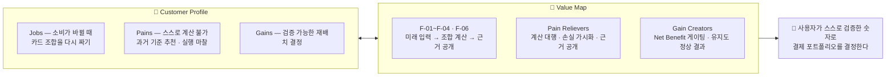

# 원고 · p20 Value Proposition

> 발표용 원고. **정본은 `효진/0820/final/01_서비스_역기획서.md`**이며 이 파일은 페이지 단위 파생물이다.
> 표기 — 근거: 🔵 확인된 사실 · ⚪ 추론 · 🟡 가정 · 🟠 미확인 / 충족도: ✔ 충족 · ◐ 부분 · ✗ 미충족

| 항목 | 내용 |
| --- | --- |
| 구간 | p20 |
| 담당 | 효진 |
| 근거 문서 | `효진/확정본/08_Value_Proposition.md` |

---

# p20 · Value Proposition Sheet

**Fit 검사 — 6개 중 3 ✅ / 2 🔶 / 1 🔴**

| 순위 | Outcome | 대응 기능 | Fit |
| :---: | --- | --- | :---: |
| 1 | A 미래지출 자동 연결 | F-01 · F-02 · F-03 | ✅ |
| 1 | **C 실행 완주** | **기능 없음 — 측정(F-13)으로만 대응** | 🔴 |
| 3 | F 이벤트 비종속 | F-01 (이벤트 선택 단계 자체 없음) | ✅ |
| 4 | B 검증 가능한 근거 | F-06 | ✅ |
| 5 | E 지속 사용 동기 | 없음 (Won't v1) | 🔶 |
| 5 | D 입력 부담·유연성 | F-02·F-11 부분 해소 | 🔶 |

> 🔴 **공동 1위 기회에 대응 기능이 없다는 것을 숨기지 않는다.** 근거가 세 방향에서 일치하는데(DOS 1위 · 유일한 🔵 Importance · CJM 실행 단계 2명 단절) 기능은 비어 있다. F-05를 좁힌 판단 자체는 합리적이다 — 상담사 화법은 통제할 수 없고 대행은 규제 리스크가 크다. **문제는 좁히면서 대안 설계를 안 하는 것이었고, 그래서 측정(F-13)을 신설했다.**

## 고객 가치 선언문

> **소비가 곧 바뀔 사람에게, CardFit은 과거 결제내역이 아니라 앞으로의 지출 계획을 기준으로 카드 조합을 다시 계산해, 지금 조합을 유지할 때와 바꿀 때의 차액을 계산 근거와 함께 보여준다. 그래서 사용자는 카드사의 권유나 감이 아니라, 자기가 검증한 숫자로 결제 포트폴리오를 결정한다.**

`근거: 효진/확정본/08_Value_Proposition.md`

---
