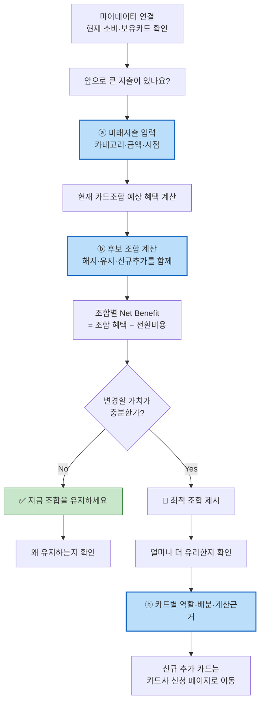

# 원고 · p21~23 To-Be·화면

> 발표용 원고. **정본은 `효진/0820/final/01_서비스_역기획서.md`**이며 이 파일은 페이지 단위 파생물이다.
> 표기 — 근거: 🔵 확인된 사실 · ⚪ 추론 · 🟡 가정 · 🟠 미확인 / 충족도: ✔ 충족 · ◐ 부분 · ✗ 미충족

| 항목 | 내용 |
| --- | --- |
| 구간 | p21~23 |
| 담당 | 윤정 원본 / 효진 원고 |
| 근거 문서 | `윤정/blueprint/blueprint_v0.2.html · master-deck/README 0-1절` |

---

# p21 · To-Be Concept — 개선축은 2개다

**08.19 팀 결정: 개선축을 2개로 분리했다.** 브리프 차별점은 시간축만 서술하고 조합 단위 차이는 "실행 설계자"에 섞여 있었는데, PDF 실측으로 As-Is가 **"후보 카드 한 장에 재적용"**임이 확인되어 조합축을 독립 축으로 분리했다 — 섞어 두면 방어력이 약해진다.

## 기준 서비스 ↔ 개선 기능 대비 (4항목 실측 대비)

| 항목 | 기준 서비스 (As-Is) | CardFit (To-Be) | 어느 축 |
| --- | --- | --- | :---: |
| 진입 경로 | `카드 갈아타기 > 카드 탐색 > 내 카드보다 더 좋은 카드 보기` 🔵 | **동일 지점** — 이 플로우 위에 얹는다 | — |
| **계산 입력** | **최근 1년 소비**를 후보 카드에 재적용 🔵 | **사용자가 입력한 미래 지출** + 마이데이터 과거 소비 | **ⓐ 시간축** |
| **계산 단위** | 후보 카드 **한 장**에 재적용 🔵 | **카드 조합 배분** (F-05 결제수단 배분 설계) | **ⓑ 조합축** |
| 산출물 | *"대신 쓸 때 혜택 많이 받는 카드 **순위**"* 🔵 | 실행 가능한 **조합안 + 계산 근거 공개** (F-06) | ⓐ+ⓑ |

> **4항목 전부 PDF 실측 근거(🔵)다** — `윤정/0818/경쟁사_유저플로우_뱅크샐러드.pdf` 1p "핵심 구조". 진입 경로는 **일부러 같게** 뒀다. 새 진입점을 만드는 게 아니라 **기존 플로우 위에 두 단계를 얹는 설계**다.

## 두 축이 각각 무엇에 걸리나

| | **ⓐ 시간축** | **ⓑ 조합축** |
| --- | --- | --- |
| 바뀌는 것 | 계산 기준 시점: 과거 1년 → **과거 + 미래 입력** | 계산 단위: 카드 1장 → **해지·유지·신규 조합** |
| 담당 기능 | **F-01** 미래지출 입력 · F-03 시나리오 계산 | **F-04** 조합 최적화 · **F-05** 결제수단 배분 |
| 경쟁 공백 근거 | 경쟁 **6곳 중 이 단계를 가진 곳 0곳** 🔵 | 경쟁자 체인에 **제약 최적화·결제수단 배분 두 단계가 없다** 🔵 |
| 지지하는 차별점 | ② 과거가 못 보는 소비 | ① 실행 설계자 |
| 대응 Job | A (AOS 4.0) | A · C |
| 무너지면 | **서비스 전체가 무너진다** — 진입점 자체가 사라진다 | 뱅크샐러드와 같은 서비스가 된다 |
| 검증 | **E2** — A1 전제 | **E5** — 동일 스냅샷 n=20 비교 |

**ⓐ가 진입점이고 ⓑ가 방어선이다.** ⓐ 없이는 시작할 수 없고, ⓑ 없이는 복제를 막을 수 없다. 뱅크샐러드에 남은 격차 두 가지(미래입력 UI·재배치 로직)가 정확히 이 두 축이다.

## As-Is 흐름 (확정본 6단계 원문)

## To-Be 흐름

파란 칸이 As-Is에 **없는** 단계다 — ⓐ 1개, ⓑ 2개.

## 두 원칙

1. 카드 한 장을 고르는 게 아니라 **해지·유지·신규추가를 함께 계산해 하나의 조합으로 압축**한다. (ⓑ)
2. **"유지"도 정상적인 추천 결과다.** 무조건 신규카드를 끼워 넣지 않는다. (Net Benefit 게이팅)

마지막 단계(M)는 신청서 작성·제출을 대신하지 않는다. 뱅크샐러드와 동일하게 카드사 공식 신청 페이지로 **이동 링크만** 제공하며, **해지는 이 단계 대상이 아니다.**

`근거: master-deck/README.md` 0-1절(4항목 실측 대비, 08.19 확정) · `decision-log` 08.19 15:44(개선축 2개 결정) · `윤정/확정본/11` 1·6절 · `윤정/0818/경쟁사_유저플로우_뱅크샐러드.pdf` 1p

---

# p22 · 사용자 흐름 — UX 블루프린트 8단계

프로토타입 실물이 있다(`윤정/blueprint/blueprint_v0.2.html`, iPhone 17 논리화면 402×874px). 확정본 CJM 7단계를 **화면 단위 8스테이지**로 분해했다.

| 스테이지 | 화면 | 기능 | 사용자 생각 · 제품 판단 |
| :---: | --- | :---: | --- |
| **01** | 현재 카드 진단 — "나의 카드 찾기" | 진입 | *"돈 나갈 데가 한꺼번에 몰리는데 어떻게 대비하지?"* → 마이데이터 기반 **현재 상태 진단을 진입점**으로 (뱅크샐러드 IA 참고) |
| **02** | "앞으로 쓸 돈을 알려주세요" | **F-01** | **이벤트 이름을 묻지 않는다** — 카테고리·금액·시점만. *"이걸 다 입력해야 하나"* → **여기가 이탈 지점**(입력 노동 > 혜택 가치로 보이면 이탈) |
| **03** | "어느 정도까지 바꿔도 괜찮나요?" | **F-02** | 최대 보유 카드 수·신규카드 포함 여부를 **제약조건으로** 받는다. *"신규카드까지 만들 필요는 있나?"* → **'더 좋은 카드 찾기'가 아니라 '바꿀 가치가 있는가'를 먼저 판단** |
| **04** | 시나리오 계산 중 | **F-03** | 화면에 **"금액 산출은 규칙 엔진, AI는 근거 설명에 한정"**을 명시 → 혜택 보장 오해 방지. 필수 데이터 누락·Rule 노후 시 **추천 중단 또는 경고** |
| **A** | **"지금은 바꾸지 않아도 돼요"** | 게이팅 NO | 추가혜택 +₩31,000 / 추가 연회비 −₩38,000 / **Net Benefit −₩7,000** → **"유지"도 정상 결과**로 제시 |
| **B** | **"이 조합이면 ₩186,000 더 유리해요"** | **F-04** | 추가혜택 +₩224,000 − 연회비 ₩38,000. **A 유지 / B 정리 / C 신규**를 현재 유지안과 나란히 비교. 여러 안을 늘어놓지 않고 **최종 1안** |
| **06** | "이번 지출은 이렇게 나눠 결제하세요" | **F-05** | 가전·가구 8.4M(C 6.0M + A 2.4M) · 여행 3.2M(C) · 예식 4.8M(A). *"어떤 카드가 좋은가"에서 끝나지 않고 **"어디에 얼마를 쓸지"**까지* |
| **07** | "혜택이 왜 이렇게 계산됐는지" | **F-06** | 전월실적·혜택한도·연회비·**적용 기준일(2026.08.20)**을 카드별로 접었다 펼친다. **"계산에 포함되지 않은 항목"**(포인트 소멸·자동납부 승계)을 별도 블록으로 고지 |
| **08** | "이 조합을 적용하려면" | **스코프 경계** | ① C카드 신규 신청 → **카드사 공식 페이지로 이동** ② A카드 유지 ③ B카드 정리 → **"해지·전환은 카드사에서 직접 진행"**. 화면에 *"해지 상담·신청 대행은 제공하지 않습니다"*를 명시 |

> ⚠️ **UI 금액은 전부 프로토타입 예시값(demo data)이며 실제 혜택을 의미하지 않는다.**

`근거: 윤정/blueprint/blueprint_v0.2.html`

---

# p23 · 핵심 화면 — 정보 위계와 신뢰 장치

| 계층 | 화면에 보이는 것 | 근거 |
| :---: | --- | --- |
| **1. 결론** | "A 유지 · B 정리 · C 추가 — 지금보다 ₩186,000 더 유리해요" (또는 "지금은 바꾸지 않아도 돼요") — **금액은 예시값** | 토스식 결론 우선 |
| 2. 핵심 변화 | 카드별 역할과 배분 금액 | F-05 |
| 3. Trade-off | 순혜택 = 추가혜택 − 연회비·전환비용 | 핀트식 게이팅 |
| 4. 근거 | 실적구간·혜택한도·연회비·**제외 조건**·계산 기준일 (**≥ 6항목**) | F-06 |
| 5. 상세 Rule | 카드별 실적 충돌·한도 초과 구간 | F-06 |
| **경계 고지** | "해지 상담·신청 대행은 제공하지 않습니다" | **F-12** |

**블루프린트가 화면에 박아 넣은 신뢰 장치 3개**

| 장치 | 어느 화면 | 무엇을 막나 |
| --- | :---: | --- |
| **"금액 산출은 규칙 엔진, AI는 설명"** 명시 | 04 계산 | "AI가 혜택을 보장한다"는 오해 → 규제 리스크 |
| **"계산에 포함되지 않은 항목"** 별도 블록 | 07 근거 | 계산 정확성의 한계를 숨기는 것 → 차별점 ③ 붕괴 |
| **"CardFit의 실행 경계"** 별도 블록 | 08 적용 | 실행 대행 오인 → GR4 위반 |

> **첫 화면에 전환비용을 이미 뺀 숫자만 올린다.** 총혜택을 크게 보여주고 비용을 아래에 숨기는 방식은 차별점 ③을 스스로 무너뜨린다.

**블루프린트가 남긴 미해결 3건 (임의로 구현하지 않았다)**

| 성격 | 항목 | 상태 |
| --- | --- | --- |
| SCOPE BOUNDARY | 해지·전환 실행 대행 — 실제 핵심 Pain이지만 제공하지 않는다. **사용자 여정의 가장 큰 단절 위험으로 남는다** | 확정 제외 |
| **DECIDED (08.20)** | 실행 완주율 — **측정만 채택(F-13)**. VP가 남긴 4개 후보 중 나머지 3개(만류 대응 안내·실행 체크리스트·상태 추적)는 **채택하지 않는다** | ✅ 블루프린트·PRD 정본 **일치** |
| POST-MVP | 구매 후 혜택 확인·리텐션 (Job E) | 대응 기능 0 |

`근거: 윤정/blueprint/blueprint_v0.2.html`, `윤정/확정본/02` 3절

---
