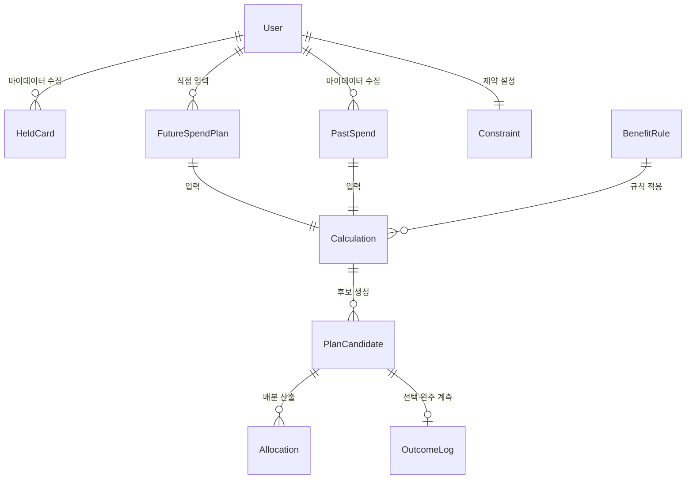
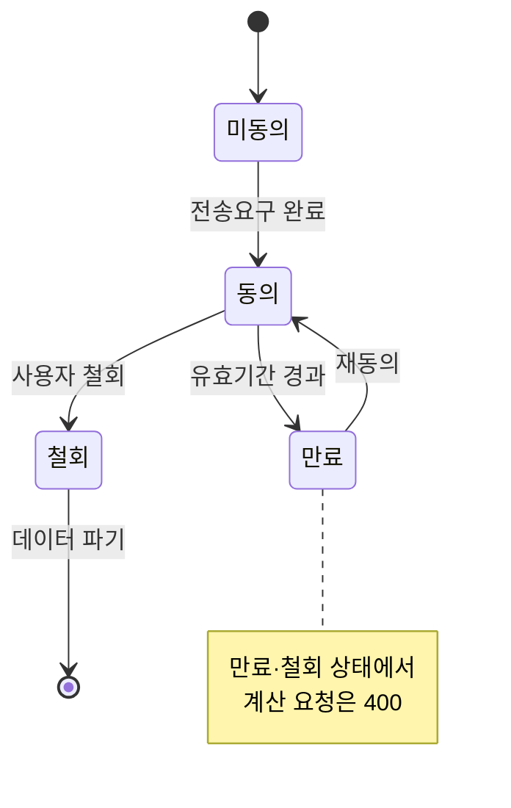

# 원고 · p24~25 실행 조건

> 발표용 원고. **정본은 `효진/0820/final/01_서비스_역기획서.md`**이며 이 파일은 페이지 단위 파생물이다.
> 표기 — 근거: 🔵 확인된 사실 · ⚪ 추론 · 🟡 가정 · 🟠 미확인 / 충족도: ✔ 충족 · ◐ 부분 · ✗ 미충족

| 항목 | 내용 |
| --- | --- |
| 구간 | p24~25 |
| 담당 | 윤정·효진 |
| 근거 문서 | `효진/0820/09_PRD_Requirement_Trace_v0.1.md §5·§6 · 윤정/확정본/02` |

---

# p24 · 필요 데이터 — 핵심 엔터티

| 엔터티 | 주요 필드 | 출처 |
| --- | --- | --- |
| User | user_id, 마이데이터 동의 상태·범위·일시 | 자체 |
| HeldCard | 카드사, 카드명, 연회비, 발급일, 실적 기준월 | 마이데이터 API |
| PastSpend | 가맹점, 업종코드, 금액, 결제일 | 마이데이터 API |
| FutureSpendPlan | 카테고리(자유 입력 허용), 금액(단일 또는 범위), 시점, 확실도 | 사용자 (F-01) |
| Constraint | 최대 카드 수, 연회비 상한, 신규 발급 허용 여부 | 사용자 (F-02) |
| **BenefitRule** | 전월실적 구간, 통합할인한도, **제외 항목**, 적용 시작·종료일, **rule_version** | 카드사 약관 **수집·버전관리** |
| Calculation | 입력 스냅샷, 적용 rule_version 목록, 기준일, **미반영 항목** | 규칙 엔진 |
| PlanCandidate | 조합 구성, Gross Benefit, 전환비용 3항목, **Net Benefit**, 임계 통과 여부 | 규칙 엔진 |
| Allocation | 배정 카테고리, 배분 금액 | 규칙 엔진 |
| OutcomeLog | 선택 여부·일시, **30일 후 완주 응답** | 자체 (F-13) |

`근거: 효진/0820/09_PRD…v0.1` §6.1

---

# p25 · 시스템 기능 · 정책 · 상태 · 외부 연동 · 예외 · 운영 역할

**API·외부 연동**

| 인터페이스 | 제약 |
| --- | --- |
| 마이데이터 카드 업권 API | **단일 채널 — 대체 공급자 없음** 🔵. 장애 시 우회 경로 없음. **호출당 과금** 🔵 |
| 카드 혜택 Rule 데이터 | **공식 통합 API 없음** 🔵 — 8개 카드사·겸영은행 파편화. 수집·버전관리 필수 |
| `POST /calculate` | p95 ≤ 5s. **미래 입력 0건이면 400 반환** |
| `GET /calculations/{id}/evidence` | 근거 6항목 미달 시 **응답 거부** |
| `POST /outcomes/{id}/completion` | **측정 전용 — 실행 개입 엔드포인트 없음** |

## 상태 전이 — 4개 객체

| 객체 | 상태값 | 전이 규칙 |
| --- | --- | --- |
| **마이데이터 동의** | 미동의 → 동의 → (만료 / 철회) | 만료·철회 시 **계산 요청 400**. 철회 시 수집 데이터 파기 |
| **계산(Calculation)** | 요청 → (성공 / 실패 / **부분**) | **부분 = 필수 데이터 누락** → 결과로 취급하지 않고 추천 중단. 성공 건만 `result_viewed` 대상 |
| **조합안(PlanCandidate)** | 제시 → (선택 / 미선택) → 만료 | **`rule_version` 변경 또는 기준일 +30일 경과 시 만료** — 만료된 조합안은 재계산 없이 실행 대상이 되지 않는다 |
| **완주 응답(OutcomeLog)** | 미발송 → 발송 → (응답 / **무응답**) | 발송은 선택 +30일 **1회만**. **무응답은 미완주로 집계**. 재발송·독려 없음(GR4 위반) |

> ⚠️ **조합안 만료가 실무상 중요하다.** 사용자가 3주 전 결과를 들고 실행하려는 사이 약관이 갱신되면 **계산 근거가 이미 틀린 것**이다. `rule_version` 변경을 만료 트리거로 두는 것이 차별점 ③(검증 가능한 계산)의 최소 조건이다.

## 정책 · 예외

| 상황 | 처리 |
| --- | --- |
| 마이데이터 응답 지연·장애 | "최근 확인된 데이터 기준" 경고와 함께 계산, 기준일 노출 |
| 약관 데이터가 오래됨 | 최신성 경고 표시 (갱신 지연 7일 초과 시 일간 알림) |
| 필수 데이터 누락 | **추천 중단** — 부분 데이터로 계산하지 않는다 |
| Net Benefit 임계 미달 | **"현재 조합 유지"를 결론으로 반환** (GR2 = 0%) |
| 계산에 못 넣은 비용 (포인트 소멸·자동납부 승계) | **"이 계산에는 포함되지 않았습니다"로 명시** |
| 경계값 (실적 1원 부족·한도 초과·실적 충돌·정책혜택 중복) | 회귀 테스트 케이스 ≥ 200건으로 상시 검증 |
| **동의 만료 후 계산 요청** | 400 반환 + 재동의 유도. **만료 데이터로 계산하지 않는다** |
| **조합안 만료 후 실행 시도** | 재계산 안내. 만료 근거를 노출하지 않는다 |

## 운영 역할 — 누가 무엇을 하나

**즉시 중단 조건을 만들어놓고 중단 결정자를 정하지 않으면 그 조건은 작동하지 않는다.** 역할 4개로 나눈다.

| 역할 | 담당 활동 | 주기 | 실패 시 |
| --- | --- | :---: | --- |
| **데이터 운영** | 카드사 8곳 약관 수집·`rule_version` 관리·최신성 경고 해제 | 주간 + 약관 변경 감지 시 | 갱신 지연 7일 초과 → GR5 알림. 30일 초과 → **해당 카드 계산 대상 제외** |
| **계산 품질** | 경계값 회귀 테스트 실행·결정론성 검증·계산 오류 신고 정정 | `rule_version` 변경 시마다 | GR1 초과 → **즉시 롤아웃 중단 발의** |
| **제품(PM)** | 지표 집계·보고, 금지어 스캐너 예외 승인, **중단 최종 결정** | 주간(북극성·Input) / 월간(완주율) | — |
| **컴플라이언스·보안** | 마이데이터 동의 범위 점검, 오조회 감시, 문구 규제 검토 | 월간 + 사고 시 즉시 | 오조회 1건 → **서비스 중단 + 신고** |

**Guardrail별 대응 경로**

| 지표 | 발의 | 결정 | 조치 |
| :---: | :---: | :---: | --- |
| GR1 계산 오류율 | 계산 품질 | **PM** | 즉시 롤아웃 중단 |
| GR2 불필요 추천 | 계산 품질 | **PM** | 즉시 중단 + 임계값 재검토 |
| GR3 근거 미공개 | 계산 품질 | **PM** | 즉시 중단 |
| GR4 오인 문구 | 제품 | **PM** | 문구 회수 + 스캐너 패턴 추가 |
| GR5 최신성 경고 | 데이터 운영 | 데이터 운영 | 경고 표시 복구 |
| **오조회** | 컴플라이언스 | **컴플라이언스 (PM 우회)** | **서비스 중단 + 감독당국 신고** |

> **오조회만 PM을 우회한다.** 타인 데이터 노출은 사업 판단의 대상이 아니라 즉시 신고 의무 사항이다. 다른 Guardrail은 PM이 최종 결정하되, 이것만 컴플라이언스가 단독으로 중단할 수 있게 설계했다.

`근거: 윤정/확정본/02`(활동·병목), `효진/0820/09_PRD…v0.1` §5·§6, `방법론.md` 3장(사용자 행동 → 시스템 기능 → 데이터 → 판단 → **결과·상태** → 예외)

---
