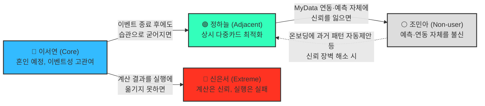

# 페르소나 스펙트럼 맵 (Persona Spectrum Map) — 미래지출 결제설계 서비스

> **이전 버전 안내**: 이 문서는 4단계(AI Peer Review) 산출물이었던 "페르소나 검증 리포트 — 미래지출 결제설계 서비스"를 완전히 대체합니다. 검증 리포트 전문은 커밋 `2a76772`에서 확인 가능합니다.
>
> 5단계(통합, Spectrum Map)에서는 4명(이서연·정하늘·신은서·조민아)의 관계를 구조화하고 시각화해 **Persona Spectrum Map**을 완성합니다. 1~4단계(스펙트럼 도출 → Convergent Filtering → Contextual Rewriting → AI Peer Review) 전체 이력은 decision-log 2026-08-19 표에서 추적 가능합니다.

---

## 1. 관계 구조 (Mermaid)

**읽는 법**: 실선은 "서비스가 방치했을 때" 자연스럽게 이동하는 방향(Core→Adjacent는 좋은 이동, Core→Extreme·Adjacent→Non-user는 이탈 리스크), 점선은 "서비스가 개입했을 때" 되돌릴 수 있는 방향입니다.

---

## 2. 2축 포지셔닝 맵 — 신뢰도 × 관여도

| 페르소나 | 신뢰도 (미래 예측·계획을 믿는 정도) | 관여도 (카드 관리에 들이는 노력) | 위치 요약 |
| --- | --- | --- | --- |
| **정하늘** (Adjacent) | 높음 | 높음 | 우상단 — 이미 서비스가 주려는 가치를 스스로 실천 중, 자동화만 얹으면 즉시 전환 |
| **이서연** (Core) | 중간(이벤트 계기로 상승) | 중간(이벤트 기간만 일시적으로 상승) | 중앙 — Beachhead. 이벤트가 끝나면 정하늘 쪽(습관화) 또는 원점 회귀 갈림길 |
| **신은서** (Extreme) | 높음(계산은 신뢰) | 높음(계산까지는 함) → **실행 단계에서만 이탈** | 우측이나, 별도 축(실행 완료율)에서 낮음 — 3차원으로 봐야 정확 |
| **조민아** (Non-user) | 낮음 | 낮음 | 좌하단 — 신뢰·관여 모두 낮아 서비스 진입 장벽이 가장 높음 |

> 신은서는 신뢰도·관여도만으로는 정하늘과 유사한 위치에 놓이지만, **"계산 결과를 실행까지 완주하는가"**라는 제3의 축에서만 갈립니다. 2축 지도로는 표현되지 않는 이 축은 서비스가 통제할 수 없는 영역입니다 — 마이데이터 기반 서비스는 해지·전환 실행에 대한 직권·대행 권한이 없어(`윤정/확정본/02_Value_Chain.md` 5절), F-05(결제수단 배분 설계)가 이 실행 마찰에 어떤 형태로도 개입하지 않는 실제 근거입니다.

---

## 3. 서비스가 만들 수 있는 전환 시나리오

| 출발 | 도착 | 전환 조건 | 관련 기능/근거 |
| --- | --- | --- | --- |
| 이서연 (Core) | 정하늘 (Adjacent) | 혼인 이벤트에서 성공 경험 후, 카드 조합 관리를 습관으로 유지 | SAM Phase 1(Beachhead) → SAM 확장 경로와 일치 |
| 이서연 (Core) | 신은서 (Extreme) | 계산까지는 받았지만 실행(해지 등) 단계에서 상담사 만류·절차 마찰에 부딪힘 | 문제③ 해지 실행 마찰 🔵 |
| 정하늘 (Adjacent) | 조민아 (Non-user) | MyData 연동 요구·예측 방식에 대한 신뢰를 잃고 이탈 | 최근 결정(마이데이터 연동 필수, 2026-08-19 10:42) — 이 리스크가 새로 커짐 |
| 조민아 (Non-user) | 정하늘 (Adjacent)로 유입 | 온보딩에서 예측 대신 "과거 패턴 기반 초기값 자동 제안" 같은 완화장치 제공 | 4단계 검증 리포트의 F-01 보강 권고 |

> ⚠️ **신은서 → 이서연 회복 경로 없음**: 마이데이터 기반 서비스는 해지·전환 실행에 대한 직권·대행 권한이 없어(`윤정/확정본/02_Value_Chain.md` 5절 — 해지 상담·신청 대행 등 실행 지원은 어떤 형태로도 제공하지 않음), 신은서의 실행 마찰은 서비스가 개입해 해소할 수 있는 영역이 아닙니다. 이 표는 "서비스가 만들 수 있는" 전환만 다루므로 이 구간은 목록에서 제외합니다.

---

## 4. Persona Spectrum Map 요약 — 05(페르소나) 5단계 파이프라인 완료

| 단계 | 산출물 | 커밋 |
| --- | --- | --- |
| 1. 스펙트럼 도출 | 핵심 5·확장 3·극단 2·비활성 2, 총 12명 | `a81d481` |
| 2. Convergent Filtering | 유형별 대표 1명씩 4명 선별 | `b3cdc7d` |
| 3. Contextual Rewriting | 서비스 언어(F-01~F-06)로 재기술한 4종 카드 | `3d8870d` |
| 4. AI Peer Review | 3개 독립 관점 교차검증, 실존 확률 판정 | `2a76772` |
| 5. Spectrum Map (본 문서) | 4명의 관계 구조화 + 전환 시나리오 | (본 커밋) |

이 파이프라인 산출물은 06(OS)·07(JTBD) 작업의 입력으로 이어집니다.

---

**연결 문서**: `윤정/0818_쟁점정리.md`(Segment Map) · `decision-log/decision-log.md` 2026-08-19 표(마이데이터 연동 확정 10:42) · `방법론.md` 5장·7장
