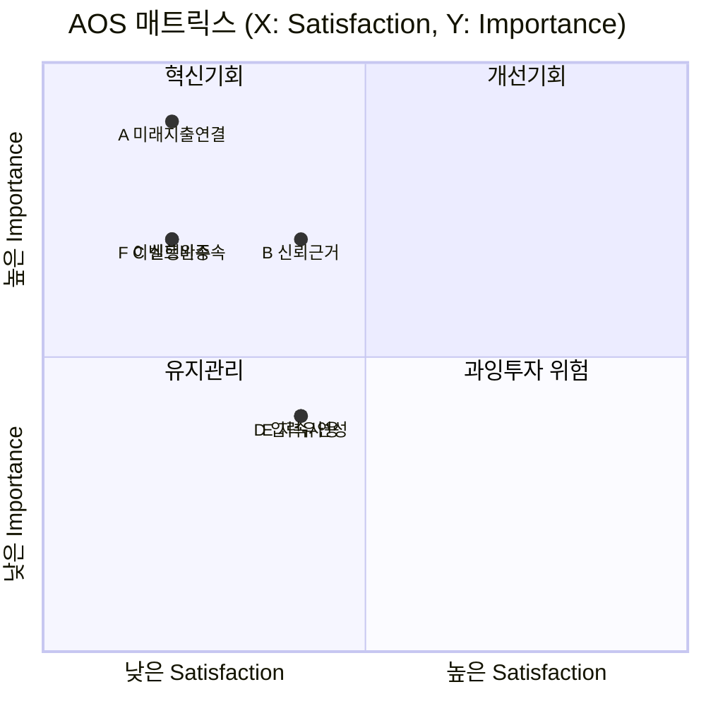

# AOS 분석 결과 — 미래지출 결제설계 서비스

> `가람/0819_시장기회 분석 방법론(AOS).md`의 절차를 실제로 실행한 결과입니다. 입력은 `가람/0819_Pain Point-Goal 매트릭스.md`의 Core+Adjacent 8명(이서연·김도윤·박서준·한지민·최유리·정하늘·오세훈·강민재) × Pain Point 3개 = 24건입니다.
>
> **공식**: `AOS = Importance × (1 − Satisfaction/5)` · **사분면 기준점**: Importance·Satisfaction 각각 **중앙값(median)** 사용(요청 반영)

---

## 0. 후보 확정 (1단계 — 후보 리스트업)

24건의 Pain Point를 같은 Job(진짜 겪는 문제)끼리 묶어 **6개 후보**로 압축했습니다(방법론.md 06 산출물 기준 5~10개 범위 충족).

| # | 후보(통합 Job) | 병합한 출처 Pain Point |
| --- | --- | --- |
| A | 미래/변화하는 지출 상황(이벤트든 아니든)을 카드 혜택과 연결해 자동으로 계산받고 싶다 | 이서연①, 김도윤①, 한지민①, 최유리①, 정하늘① |
| B | 계산 결과를 신뢰할 수 있는 근거로 검증하고 싶다 | 이서연②, 박서준②, 최유리②, 정하늘③ |
| C | 계산 결과를 실제 실행(해지·전환)까지 완주하고 싶다 | 이서연③, 박서준①, 박서준③ |
| D | 입력 부담을 낮추고 유연하게 입력하고 싶다 | 김도윤②, 한지민②, 정하늘②, 강민재② |
| E | 이벤트가 끝나거나 상황이 바뀐 뒤에도 지속적으로 쓸 이유를 갖고 싶다 | 김도윤③, 한지민③, 최유리③ |
| F | 특정 이벤트가 아니어도, 지출 증가든 감소든 내 상황이 서비스 대상으로 인정받고 싶다 | 오세훈①②③, 강민재①③ |

---

## 1. Importance Table (① → ②단계)

| # | 후보 | Importance (1~5) | 근거 |
| --- | --- | --- | --- |
| A | 미래 지출-카드 혜택 자동 연결 | **5** | Core+Adjacent 8명 중 5명이 겪는 가장 반복적인 Pain — 서비스의 핵심 존재 이유(F-01~F-03) |
| B | 신뢰 가능한 계산 근거 | **4** | 4명이 겪음. 금전이 걸린 결정이라 신뢰 없이는 실행 자체가 불가능(F-06 직결) |
| C | 실행(해지·전환) 완주 | **4** | 문제③ 🔵(금감원 민원 88.4%↑)로 뒷받침되는 실제 사업 리스크 |
| D | 입력 부담·유연성 | **3** | 4명이 겪지만, 핵심 가치가 아니라 마찰(Friction) 성격 |
| E | 지속 사용 동기 | **3** | 3명(주로 Core)이 겪는 리텐션 이슈 — 단기 매출보다 장기 지표 |
| F | 이벤트 비종속·양방향 지원 | **4** | SAM Phase 2 확장 전략과 직결, Adjacent 전원(오세훈·강민재)이 겪음 |

---

## 2. Satisfaction Table (③단계 — 현재 대안의 충족 수준)

| # | 후보 | 현재 대안 | Satisfaction (1~5) | 근거 |
| --- | --- | --- | --- | --- |
| A | 미래 지출-카드 혜택 자동 연결 | 뱅크샐러드·카드고릴라(과거 소비 기준), 엑셀, 지인 추천 | **1** | 경쟁사 6곳 중 미래소비반영 조건 충족 0곳(0818 브리프 2절) |
| B | 신뢰 가능한 계산 근거 | 뱅크샐러드(근거공개 ◐), 카드사 콜센터 설명 | **2** | 부분 공개 수준, 카드사 설명은 오히려 불신 유발(박서준 사례) |
| C | 실행(해지·전환) 완주 | 카드사 콜센터 직접 해지 | **1** | 상담사 만류·전환유도가 실행을 적극적으로 막음(문제③) |
| D | 입력 부담·유연성 | 엑셀 수기 관리, 스펙 비교 후 감으로 결정 | **2** | 수작업 자체가 부담의 원인이라 만족도 낮음 |
| E | 지속 사용 동기 | 특별한 대안 없음(이벤트 종료 후 방치) | **2** | 리텐션을 위한 대안 자체가 시장에 없음 |
| F | 이벤트 비종속·양방향 지원 | 없음(경쟁사 전원 이벤트 특정/증가 방향 가정) | **1** | 교차도메인 2×2 매트릭스에서 "미래입력+최적화" 칸이 전 산업에서 빈칸(효진 리서치) |

---

## 3. AOS Table (④단계)

`AOS = Importance × (1 − Satisfaction/5)`

| # | 후보 | Importance | Satisfaction | 1−Sat/5 | **AOS** | 순위 |
| --- | --- | --- | --- | --- | --- | --- |
| A | 미래 지출-카드 혜택 자동 연결 | 5 | 1 | 0.8 | **4.0** | 1 |
| C | 실행(해지·전환) 완주 | 4 | 1 | 0.8 | **3.2** | 2 (공동) |
| F | 이벤트 비종속·양방향 지원 | 4 | 1 | 0.8 | **3.2** | 2 (공동) |
| B | 신뢰 가능한 계산 근거 | 4 | 2 | 0.6 | **2.4** | 4 |
| D | 입력 부담·유연성 | 3 | 2 | 0.6 | **1.8** | 5 (공동) |
| E | 지속 사용 동기 | 3 | 2 | 0.6 | **1.8** | 5 (공동) |

---

## 4. Matrix 배치 (⑤단계 — 중앙값 기준 사분면)

**중앙값 계산**: Importance {5,4,4,3,3,4} → 정렬 3,3,4,4,4,5 → **median = 4.0** / Satisfaction {1,2,1,2,2,1} → 정렬 1,1,1,2,2,2 → **median = 1.5**

| # | 후보 | Importance | Satisfaction | 판정(중앙값 대비) | 사분면 |
| --- | --- | --- | --- | --- | --- |
| A | 미래 지출-카드 혜택 자동 연결 | 5 (≥4) | 1 (<1.5) | High Imp · Low Sat | **Q1 혁신기회** |
| C | 실행 완주 | 4 (≥4) | 1 (<1.5) | High Imp · Low Sat | **Q1 혁신기회** |
| F | 이벤트 비종속·양방향 지원 | 4 (≥4) | 1 (<1.5) | High Imp · Low Sat | **Q1 혁신기회** |
| B | 신뢰 가능한 계산 근거 | 4 (≥4) | 2 (≥1.5) | High Imp · High Sat | **Q2 개선기회** |
| D | 입력 부담·유연성 | 3 (<4) | 2 (≥1.5) | Low Imp · High Sat | **Q4 과잉투자 위험** |
| E | 지속 사용 동기 | 3 (<4) | 2 (≥1.5) | Low Imp · High Sat | **Q4 과잉투자 위험** |

> 위 Mermaid `quadrantChart`가 GitHub에서 렌더링되지 않을 경우를 대비해, 3·4절의 표가 동일한 정보를 담은 신뢰 가능한 대체 형태입니다.

---

## 5. 결론 — 우선순위 (AOS 내림차순)

1. **A. 미래 지출-카드 혜택 자동 연결** (AOS 4.0, Q1) — MVP 핵심 기능(F-01~F-03)의 존재 근거. **JTBD 인터뷰 1순위 대상**
2. **C. 실행 완주** (AOS 3.2, Q1) — F-05 스코프 확장 여부를 결정할 핵심 기회. 신은서 유형이 이 후보의 실사용자 대리 지표
3. **F. 이벤트 비종속·양방향 지원** (AOS 3.2, Q1) — SAM Phase 2 확장 전략의 시장기회 근거. 오세훈·강민재가 대리 지표
4. **B. 신뢰 가능한 계산 근거** (AOS 2.4, Q2) — 이미 F-06으로 대응 중, 지속 개선 영역
5. **D. 입력 부담·유연성 / E. 지속 사용 동기** (AOS 1.8, Q4) — 지금 단계에서는 우선순위 낮음, 자원 배분 재검토 대상

⚠️ **한계**: Importance·Satisfaction 점수는 실측 설문이 아니라 Evidence Log(E-01~E-07)와 CJM 감정 곡선을 근거로 한 팀 추정(🟡)입니다. B·C·F가 정확히 동점(AOS 3.2, Importance 4 공동)이라는 점, 표본이 6개뿐이라 중앙값이 불안정하다는 점도 07 JTBD 인터뷰로 검증이 필요합니다.

---

**연결 문서**: `가람/0819_시장기회 분석 방법론(AOS).md` · `가람/0819_Pain Point-Goal 매트릭스.md` · `가람/0819_Evidence Log.md` · `가람/0819_고객 여정지도.md` · `가람/0819_JTBD 분석 방법론.md`
