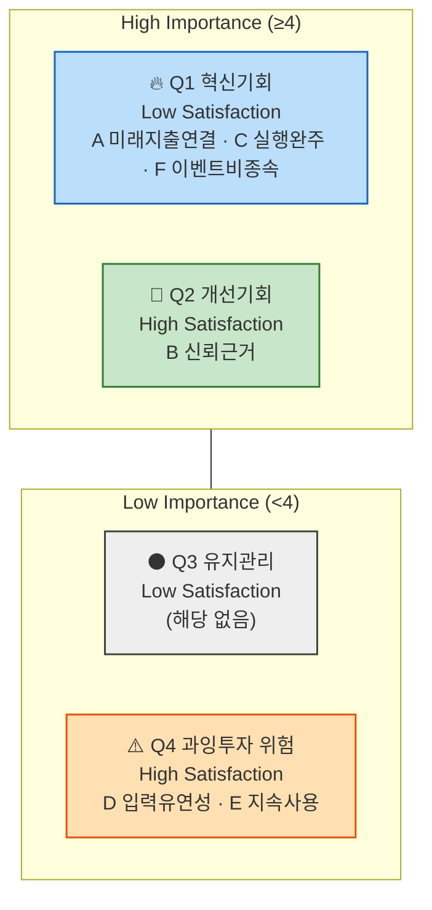

# AOS 분석 결과 — 미래지출 결제설계 서비스

> `가람/0819_시장기회 분석 방법론(AOS).md`의 절차를 실제로 실행한 결과입니다. 원래 별도 문서였던 Pain Point–Goal 매트릭스(입력 자료)를 실제 작업 순서대로 이 문서 맨 앞에 통합했습니다 — **0. Pain Point–Goal 매트릭스(입력) → 1. 후보 확정 → 2. Importance → 3. Satisfaction → 4. AOS 계산 → 5. Matrix 배치 → 6. 결론** 순서로 읽으면 됩니다.
>
> **공식**: `AOS = Importance × (1 − Satisfaction/5)` · **사분면 기준점**: Importance·Satisfaction 각각 **중앙값(median)** 사용(요청 반영)

---

## 0. Pain Point–Goal 매트릭스 (입력 자료)

`가람/0819_고객 여정지도.md` 1~14절 각 인물의 CJM 표에서 "없음"을 제외하고 뽑은 12명 대표 Pain Point(각 3개씩)에, **페르소나 전체 Goal** 열과 **Pain Point별 개별 Goal 추론**을 더한 자료입니다. 각 Pain Point 뒤의 "→ *Goal:*"은 그 Pain을 해소했을 때 충족되는 개별 목표를 추론한 것입니다. 1절부터는 이 중 **Core+Adjacent 8명**(24건)만 1차 채점 대상으로 씁니다.

### Core

| 인물 | 페르소나 Goal | Pain Point 1 | Pain Point 2 | Pain Point 3 |
| --- | --- | --- | --- | --- |
| 이서연 | 결혼 준비 지출을 카드별로 배분해 놓치는 혜택 없이 최대 혜택을 받는 것 | 다가올 지출 규모를 카드 혜택과 연결해 계산할 방법이 없음 → *Goal: 미래 지출을 카드 혜택과 미리 연결해 계산받고 싶다* | 기존 카드추천 앱은 전부 과거 소비 기준이라 신뢰가 안 감 → *Goal: 과거가 아니라 미래 기준으로 계산해주는 서비스를 신뢰하고 싶다* | 해지 단계에서 상담사 만류를 만나면 실행이 막힘 → *Goal: 계산 결과를 실제 해지·전환까지 안전하게 완수하고 싶다* |
| 김도윤 | 결혼+이사 지출을 하나의 결제 계획으로 통합해 실행 순서까지 정하는 것 | 두 이벤트 지출이 동시에 몰릴 때 통합해서 볼 방법이 없음 → *Goal: 여러 이벤트 지출을 하나의 화면에서 한 번에 파악하고 싶다* | 두 이벤트 지출을 따로 입력해야 해서 "통합"이 입력자 몫으로 남음 → *Goal: 입력 부담 없이 서비스가 자동으로 통합해주길 원한다* | 두 이벤트가 끝나면 핵심 가치를 다시 쓸 계기가 줄어듦 → *Goal: 이벤트가 끝난 뒤에도 계속 쓸 이유를 갖고 싶다* |
| 박서준 | 카드사의 일방적 자동대체에 끌려가지 않고 스스로 검증한 근거로 카드를 정하는 것 | 자동대체 전에 미리 확인할 방법이 없음 → *Goal: 카드사 결정 이전에 스스로 먼저 확인하고 대응하고 싶다* | 카드사 설명과 실제 혜택이 달라 혼란 → *Goal: 신뢰할 수 있는 근거로 검증하고 싶다* | 콜센터를 다시 거쳐야 해서 불편 반복 위험 → *Goal: 반복되는 확인 절차 없이 한 번에 안심하고 싶다* |
| 한지민 | 이사 기간 한정 지출에 맞춰 카드 조합을 임시로 바꿨다가 끝나면 원래대로 되돌리는 것 | 소득 불규칙으로 실적구간 예측 불가 → *Goal: 불확실한 소득 상황에서도 안전한 카드 전략을 세우고 싶다* | 단일 숫자 입력 강요 시 이탈 위험 → *Goal: 상황에 맞는 유연한(범위) 입력 방식을 원한다* | 조합을 되돌리는 과정의 번거로움 → *Goal: 이사 기간이 끝나면 힘들이지 않고 원상복구하고 싶다* |
| 최유리 | 회계 업무 경험을 살려 스스로 검증할 수 있는 계산 결과를 받는 것 | 발령처럼 갑작스러운 이벤트는 준비 시간이 짧음 → *Goal: 짧은 시간 안에 빠르게 대응 방안을 받고 싶다* | 근거 부실하면 신뢰를 잃고 엑셀로 회귀 → *Goal: 스스로 검증 가능한 투명한 계산 근거를 원한다* | 다음 변화에도 빠르게 대응해줄지 확신 없음 → *Goal: 반복적으로 발생하는 변화에도 지속적으로 신뢰하고 쓰고 싶다* |

### Adjacent

| 인물 | 페르소나 Goal | Pain Point 1 | Pain Point 2 | Pain Point 3 |
| --- | --- | --- | --- | --- |
| 정하늘 | 이미 하고 있는 수작업 최적화를 자동 계산으로 대체해 시간을 아끼는 것 | 수작업을 대체할 도구가 없음 → *Goal: 이미 하는 최적화를 자동화해 시간을 아끼고 싶다* | 카드 개수가 많을수록 입력 부담 커짐 → *Goal: 카드 수가 많아도 효율적으로 관리하고 싶다* | 자동 갱신이 정책변경을 못 따라가면 신뢰 붕괴 → *Goal: 최신 정책을 항상 반영한 결과를 신뢰하고 싶다* |
| 오세훈 | 혼인·이사 같은 정해진 이벤트가 아니어도, 스스로 입력한 소비 변화만으로 카드 조합을 재설계받는 것 | 이벤트명이 없어 이해받을지 확신 없음 → *Goal: 특정 이벤트가 아니어도 내 상황이 인정받길 원한다* | 마케팅이 혼인·이사 위주라 대상이 아닌 것처럼 보임 → *Goal: 나 같은 케이스도 서비스 대상임을 확인받고 싶다* | 이벤트 선택 강요 시 이탈 → *Goal: 이벤트 없이도 자유롭게 소비 변화를 입력하고 싶다* |
| 강민재 | 지출이 줄어드는 방향의 변화도 반영해 불필요해진 카드를 정리하고 싶은 것 | 지출 감소 케이스는 기존 서비스가 안 맞음 → *Goal: 지출이 줄어드는 상황도 지원받고 싶다* | 신규 앱 학습 의지 낮음 → *Goal: 배우는 노력 없이 바로 이해되는 서비스를 원한다* | 지출 증가만 입력 가능하면 이탈 → *Goal: 지출 감소도 정상적으로 입력하고 정리 제안을 받고 싶다* |

### Extreme (대조군 — 1차 채점 대상 아님)

| 인물 | 페르소나 Goal | Pain Point 1 | Pain Point 2 | Pain Point 3 |
| --- | --- | --- | --- | --- |
| 신은서 | 계산 결과뿐 아니라 실행(해지) 자체를 끝까지 완수하는 것 | 변경 시점을 스스로 알아채기 어려움 → *Goal: 카드 조건 변화를 미리 알림받고 싶다* | 계산은 되지만 실행에서 상담사 만류에 부딪힘 → *Goal: 실행 과정에서 예상되는 장애물에 미리 대비하고 싶다* | 실행의 사회적 마찰까지는 해결 못 함 → *Goal: 계산뿐 아니라 실행까지 끝까지 완주하고 싶다* |
| 윤태호 | 손대지 않고 방치한 카드들까지 포함해 전체를 한 번에 정리·재배치하는 것 | 카드 수가 너무 많아 손대기 부담 → *Goal: 방대한 카드도 부담 없이 한 번에 정리하고 싶다* | 결과를 받고도 실행 못 넘어감(정보 과부하) → *Goal: 실행 가능한 단위로 나눠서 받고 싶다* | 정리 양을 쪼개주지 않으면 계속 이탈 → *Goal: 단계적으로 조금씩 처리해 부담을 줄이고 싶다* |

### Non-user (대조군 — 1차 채점 대상 아님)

| 인물 | 페르소나 Goal | Pain Point 1 | Pain Point 2 | Pain Point 3 |
| --- | --- | --- | --- | --- |
| 조민아 | 미래를 예측하기보다 그때그때 상황에 맞게 대응하는 것으로 충분하다고 느낌 | 미래 지출 예측 전제에 공감 못함 → *Goal: 예측 없이도 그때그때 대응으로 충분하다고 느끼고 싶다* | 온보딩에서 미래 지출 입력 요구 시 이탈 → *Goal: 입력 부담 없이 서비스를 체험하고 싶다* | 예측에 대한 근본적 불신 해소 안 됨 → *Goal: 신뢰할 근거 없이도 안심하고 쓰고 싶다(모순적 니즈)* |
| 배정호 | 복잡한 앱 조작 없이 지금 쓰는 방식 그대로 큰 불편 없이 지내는 것 | 카드 최적화 문제 자체를 못 느낌 → *Goal: 지금 방식(현금·체크카드)을 그대로 유지하고 싶다* | 입력 항목 많은 화면에 거부감 → *Goal: 복잡한 절차 없이 결과만 받고 싶다* | 디지털 채널 자체 거부 → *Goal: 앱을 배우지 않고도 도움을 받고 싶다* |

**Pain Point–Goal 해설**: Core·Adjacent 8명의 Goal은 대부분 **"특정 상황에 맞춰 계산을 자동화하고, 그 결과를 신뢰할 수 있는 근거로 검증하고 싶다"**는 두 축(자동화·신뢰검증)으로 수렴합니다. Extreme 2명(신은서·윤태호)의 Goal은 "실행 완주"에 있지만 원인이 다릅니다(외부 마찰 vs 내부 과부하). Non-user 2명(조민아·배정호)의 Goal은 서비스가 제공하려는 가치와 정면으로 배치되어, Pain Point를 해소해 전환시키는 대상이 아니라 **"서비스가 도달할 수 없는 경계"를 표시하는 참고 자료**로 다룹니다 — 그래서 1절부터는 Extreme·Non-user를 채점 대상에서 제외합니다.

---

## 1. 후보 확정 (AOS 방법론 1단계 — 후보 리스트업)

Core+Adjacent 8명 × Pain Point 3개 = 24건을 같은 Job(진짜 겪는 문제)끼리 묶어 **6개 후보**로 압축했습니다(방법론.md 06 산출물 기준 5~10개 범위 충족).

| # | 후보(통합 Job) | 병합한 출처 Pain Point |
| --- | --- | --- |
| A | 미래/변화하는 지출 상황(이벤트든 아니든)을 카드 혜택과 연결해 자동으로 계산받고 싶다 | 이서연①, 김도윤①, 한지민①, 최유리①, 정하늘① |
| B | 계산 결과를 신뢰할 수 있는 근거로 검증하고 싶다 | 이서연②, 박서준②, 최유리②, 정하늘③ |
| C | 계산 결과를 실제 실행(해지·전환)까지 완주하고 싶다 | 이서연③, 박서준①, 박서준③ |
| D | 입력 부담을 낮추고 유연하게 입력하고 싶다 | 김도윤②, 한지민②, 정하늘②, 강민재② |
| E | 이벤트가 끝나거나 상황이 바뀐 뒤에도 지속적으로 쓸 이유를 갖고 싶다 | 김도윤③, 한지민③, 최유리③ |
| F | 특정 이벤트가 아니어도, 지출 증가든 감소든 내 상황이 서비스 대상으로 인정받고 싶다 | 오세훈①②③, 강민재①③ |

---

## 2. Importance Table (AOS 방법론 2단계)

| # | 후보 | Importance (1~5) | 근거 |
| --- | --- | --- | --- |
| A | 미래 지출-카드 혜택 자동 연결 | **5** | Core+Adjacent 8명 중 5명이 겪는 가장 반복적인 Pain — 서비스의 핵심 존재 이유(F-01~F-03) |
| B | 신뢰 가능한 계산 근거 | **4** | 4명이 겪음. 금전이 걸린 결정이라 신뢰 없이는 실행 자체가 불가능(F-06 직결) |
| C | 실행(해지·전환) 완주 | **4** | 문제③ 🔵(금감원 민원 88.4%↑)로 뒷받침되는 실제 사업 리스크 |
| D | 입력 부담·유연성 | **3** | 4명이 겪지만, 핵심 가치가 아니라 마찰(Friction) 성격 |
| E | 지속 사용 동기 | **3** | 3명(주로 Core)이 겪는 리텐션 이슈 — 단기 매출보다 장기 지표 |
| F | 이벤트 비종속·양방향 지원 | **4** | SAM Phase 2 확장 전략과 직결, Adjacent 전원(오세훈·강민재)이 겪음 |

---

## 3. Satisfaction Table (AOS 방법론 3단계 — 현재 대안의 충족 수준)

| # | 후보 | 현재 대안 | Satisfaction (1~5) | 근거 |
| --- | --- | --- | --- | --- |
| A | 미래 지출-카드 혜택 자동 연결 | 뱅크샐러드·카드고릴라(과거 소비 기준), 엑셀, 지인 추천 | **1** | 경쟁사 6곳 중 미래소비반영 조건 충족 0곳(0818 브리프 2절) |
| B | 신뢰 가능한 계산 근거 | 뱅크샐러드(근거공개 ◐), 카드사 콜센터 설명 | **2** | 부분 공개 수준, 카드사 설명은 오히려 불신 유발(박서준 사례) |
| C | 실행(해지·전환) 완주 | 카드사 콜센터 직접 해지 | **1** | 상담사 만류·전환유도가 실행을 적극적으로 막음(문제③) |
| D | 입력 부담·유연성 | 엑셀 수기 관리, 스펙 비교 후 감으로 결정 | **2** | 수작업 자체가 부담의 원인이라 만족도 낮음 |
| E | 지속 사용 동기 | 특별한 대안 없음(이벤트 종료 후 방치) | **2** | 리텐션을 위한 대안 자체가 시장에 없음 |
| F | 이벤트 비종속·양방향 지원 | 없음(경쟁사 전원 이벤트 특정/증가 방향 가정) | **1** | 교차도메인 2×2 매트릭스에서 "미래입력+최적화" 칸이 전 산업에서 빈칸(효진 리서치) |

---

## 4. AOS Table (AOS 방법론 4단계)

`AOS = Importance × (1 − Satisfaction/5)`

| # | 후보 | Importance | Satisfaction | 1−Sat/5 | **AOS** | 순위 |
| --- | --- | --- | --- | --- | --- | --- |
| A | 미래 지출-카드 혜택 자동 연결 | 5 | 1 | 0.8 | **4.0** | 1 |
| C | 실행(해지·전환) 완주 | 4 | 1 | 0.8 | **3.2** | 2 (공동) |
| F | 이벤트 비종속·양방향 지원 | 4 | 1 | 0.8 | **3.2** | 2 (공동) |
| B | 신뢰 가능한 계산 근거 | 4 | 2 | 0.6 | **2.4** | 4 |
| D | 입력 부담·유연성 | 3 | 2 | 0.6 | **1.8** | 5 (공동) |
| E | 지속 사용 동기 | 3 | 2 | 0.6 | **1.8** | 5 (공동) |

---

## 5. Matrix 배치 (AOS 방법론 5단계 — 중앙값 기준 사분면)

**중앙값 계산**: Importance {5,4,4,3,3,4} → 정렬 3,3,4,4,4,5 → **median = 4.0** / Satisfaction {1,2,1,2,2,1} → 정렬 1,1,1,2,2,2 → **median = 1.5**

| # | 후보 | Importance | Satisfaction | 판정(중앙값 대비) | 사분면 |
| --- | --- | --- | --- | --- | --- |
| A | 미래 지출-카드 혜택 자동 연결 | 5 (≥4) | 1 (<1.5) | High Imp · Low Sat | **Q1 혁신기회** |
| C | 실행 완주 | 4 (≥4) | 1 (<1.5) | High Imp · Low Sat | **Q1 혁신기회** |
| F | 이벤트 비종속·양방향 지원 | 4 (≥4) | 1 (<1.5) | High Imp · Low Sat | **Q1 혁신기회** |
| B | 신뢰 가능한 계산 근거 | 4 (≥4) | 2 (≥1.5) | High Imp · High Sat | **Q2 개선기회** |
| D | 입력 부담·유연성 | 3 (<4) | 2 (≥1.5) | Low Imp · High Sat | **Q4 과잉투자 위험** |
| E | 지속 사용 동기 | 3 (<4) | 2 (≥1.5) | Low Imp · High Sat | **Q4 과잉투자 위험** |

> `quadrantChart` 문법이 GitHub에서 렌더링되지 않아, 이미 검증된 `flowchart` 서브그래프 방식(`가람/0819_시장기회 분석 방법론(AOS).md` 1절과 동일 스타일)으로 교체했습니다. 4·5절의 표가 동일한 정보를 담은 대체 형태이기도 합니다.

---

## 6. 결론 — 우선순위 (AOS 내림차순)

1. **A. 미래 지출-카드 혜택 자동 연결** (AOS 4.0, Q1) — MVP 핵심 기능(F-01~F-03)의 존재 근거. **JTBD 인터뷰 1순위 대상**
2. **C. 실행 완주** (AOS 3.2, Q1) — F-05 스코프 확장 여부를 결정할 핵심 기회. 신은서 유형이 이 후보의 실사용자 대리 지표
3. **F. 이벤트 비종속·양방향 지원** (AOS 3.2, Q1) — SAM Phase 2 확장 전략의 시장기회 근거. 오세훈·강민재가 대리 지표
4. **B. 신뢰 가능한 계산 근거** (AOS 2.4, Q2) — 이미 F-06으로 대응 중, 지속 개선 영역
5. **D. 입력 부담·유연성 / E. 지속 사용 동기** (AOS 1.8, Q4) — 지금 단계에서는 우선순위 낮음, 자원 배분 재검토 대상

⚠️ **한계**: Importance·Satisfaction 점수는 실측 설문이 아니라 Evidence Log(E-01~E-07)와 CJM 감정 곡선을 근거로 한 팀 추정(🟡)입니다. B·C·F가 정확히 동점(AOS 3.2, Importance 4 공동)이라는 점, 표본이 6개뿐이라 중앙값이 불안정하다는 점도 07 JTBD 인터뷰로 검증이 필요합니다.

---

**연결 문서**: `가람/0819_시장기회 분석 방법론(AOS).md` · `가람/0819_Evidence Log.md` · `가람/0819_고객 여정지도.md` · `가람/0819_JTBD 분석 방법론.md` · `가람/0819_DOS 분석 방법론.md` · `가람/0819_페르소나 스펙트럼 분석 보고서.md`(페르소나 Goal 원본)
