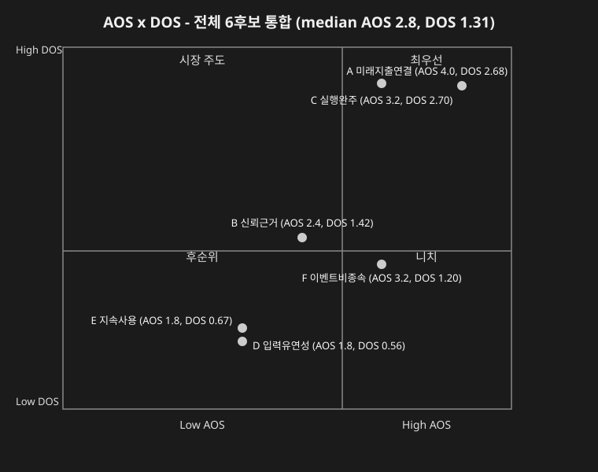
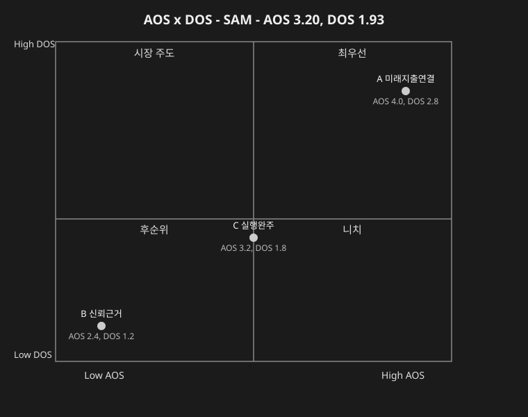

# AOS–DOS 혼합 매트릭스 — 미래지출 결제설계 서비스

> `가람/0819_AOS 분석 결과.md`의 AOS 점수(X축)와 `가람/0819_DOS 분석 결과.md`의 DOS 점수(Y축)를 후보 단위로 대조한 혼합 매트릭스입니다. **0절이 6개 후보(A~F) 전체를 다루는 정식 범위**이고, 1절(이서연 SOM/SAM 버전)은 DOS가 이서연 1인으로 채점되던 시점의 **참고 사례**입니다 — 전체 결론은 0절을 기준으로 삼습니다.
>
> 사분면 경계선은 6개 후보 AOS·DOS 값의 **중앙값**을 기준으로 그었습니다.

---

## 0. 전체 범위 — 6후보 통합 매트릭스

### 원본 점수

| 후보 | Pain/Goal | AOS | DOS(전체 범위) |
| --- | --- | --- | --- |
| A | 미래지출-카드혜택 자동 연결 | 4.0 | 2.68 |
| C | 실행(해지·전환) 완주 | 3.2 | 2.70 |
| F | 이벤트 비종속·양방향 지원 | 3.2 | 1.20 |
| B | 신뢰 가능한 계산 근거 | 2.4 | 1.42 |
| D | 입력 부담·유연성 | 1.8 | 0.56 |
| E | 지속 사용 동기 | 1.8 | 0.67 |

**중앙값 계산**: AOS {4.0, 3.2, 3.2, 2.4, 1.8, 1.8} → 정렬 1.8,1.8,2.4,3.2,3.2,4.0 → **median = 2.8** / DOS {2.68, 2.70, 1.20, 1.42, 0.56, 0.67} → 정렬 0.56,0.67,1.20,1.42,2.68,2.70 → **median = 1.31**

### 혼합 매트릭스 (median AOS 2.8, DOS 1.31)

> 인라인 `<svg>`는 GitHub 마크다운 렌더러가 보안상 제거하므로, `가람/assets/aos-dos-full.svg` 파일로 저장해 이미지(``)로 불러옵니다.

| 후보 | AOS | DOS | 판정(중앙값 대비) | 사분면 |
| --- | --- | --- | --- | --- |
| A | 4.0 (≥2.8) | 2.68 (≥1.31) | High AOS · High DOS | **최우선** |
| C | 3.2 (≥2.8) | 2.70 (≥1.31) | High AOS · High DOS | **최우선** |
| B | 2.4 (<2.8) | 1.42 (≥1.31) | Low AOS · High DOS | **시장주도** |
| F | 3.2 (≥2.8) | 1.20 (<1.31) | High AOS · Low DOS | **니치** |
| E | 1.8 (<2.8) | 0.67 (<1.31) | Low AOS · Low DOS | **후순위** |
| D | 1.8 (<2.8) | 0.56 (<1.31) | Low AOS · Low DOS | **후순위** |

### 해석

- **A(미래지출-카드혜택 자동 연결)·C(실행 완주)**: 둘 다 **최우선**(우상단) — AOS·DOS 중앙값을 모두 넘습니다. `가람/0819_DOS 분석 결과.md` 0절의 핵심 발견(C≈A 사실상 공동 1위)이 매트릭스로도 그대로 재확인됩니다.
- **B(신뢰 가능한 계산 근거)**: AOS는 중앙값 아래지만 DOS는 중앙값 위인 **시장주도** 칸으로 이동 — 개별 고객 임팩트(AOS)보다 시장 가중(Market Relevance)이 상대적으로 크게 반영된 항목입니다. F-06으로 이미 대응 중인 영역이라는 점과 일관됩니다.
- **F(이벤트 비종속·양방향 지원)**: AOS 단독으로는 A·C와 동급(Q1 혁신기회)이었지만, DOS 매트릭스에서는 **니치**(우하단)로 이동 — 고객 임팩트는 크지만 SAM Phase 2 특유의 낮은 도달가능성 때문에 시장 가중 후에는 후순위로 밀립니다. `가람/0819_JTBD 분석 방법론.md` 1-2-1절의 F 우선순위 조정 필요성을 시각적으로도 뒷받침합니다.
- **D(입력 부담·유연성)·E(지속 사용 동기)**: 둘 다 **후순위**(좌하단) — AOS·DOS 어느 축으로 봐도 우선순위가 낮습니다.

---

## 1. 참고 — 이서연 1인 검증 사례 (DOS 1인 고정 시점의 매트릭스)

> 아래는 DOS 방법론이 이서연 1명으로 고정돼 있던 시점의 산출물입니다. 0절(6후보 전체)이 정식 결론이며, 아래는 "한 사람 안에서 SAM 모수 대 SOM 모수를 바꾸면 매트릭스가 어떻게 달라지는가"를 보여주는 참고 자료로만 남깁니다. 이서연 개인의 Pain 3건만 AOS 후보 A·B·C에 대응합니다.

### 원본 점수

| 후보 | Pain | AOS | DOS(SOM 버전) | DOS(SAM 버전) |
| --- | --- | --- | --- | --- |
| A | 미래지출-카드혜택 자동 연결 | 4.0 | 4.0 | 2.8 |
| C | 실행(해지·전환) 완주 | 3.2 | 2.7 | 1.8 |
| B | 신뢰 가능한 계산 근거 | 2.4 | 1.8 | 1.2 |

### 혼합 매트릭스 — SOM 버전 (평균 AOS 3.20, DOS 2.83)

### 혼합 매트릭스 — SAM 버전 (평균 AOS 3.20, DOS 1.93)

### 해석 (1인 사례 내부 비교)

- **A**: SOM·SAM 두 버전 모두 최우선(우상단) — 모수 선택과 무관한 가장 견고한 1순위였습니다.
- **C**: AOS가 두 버전의 AOS 평균과 정확히 같아 경계선에 걸치고, DOS는 두 버전 모두 평균보다 낮아 니치(우하단)로 분류됐습니다. 0절(전체 범위)에서는 C가 DOS 1위로 올라서므로, 이 차이는 "표본이 이서연 1인뿐이었다"는 한계 때문이었음을 보여줍니다.
- **B**: 두 버전 모두 후순위(좌하단)였습니다.
- 점이 3개뿐이라 평균 자체가 표본에 크게 좌우된다는 한계가 있었고, 이는 0절에서 6후보 전체로 확장하며 해소됐습니다.

---

**연결 문서**: `가람/0819_AOS 분석 결과.md` · `가람/0819_DOS 분석 결과.md` · `가람/0819_DOS Market Relevance 모수 판단.md` · `가람/0819_JTBD 분석 방법론.md`(1-2-1절)
