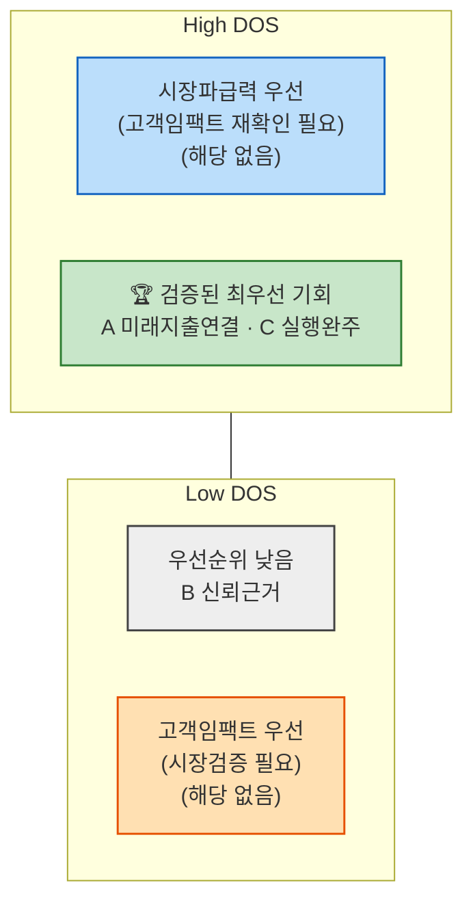
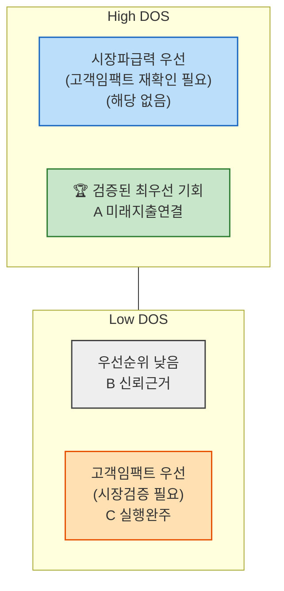

# AOS–DOS 혼합 매트릭스 — 미래지출 결제설계 서비스

> `가람/0819_AOS 분석 결과.md`의 AOS 점수(X축)와 `가람/0819_DOS 분석 결과.md`의 DOS 점수(Y축)를 같은 항목끼리 대조한 혼합 매트릭스입니다. 두 분석 모두 점수가 존재하는 항목은 이서연의 Pain 3건(=AOS 후보 A·B·C)뿐이라, 이 3건만 배치했습니다. D·E·F는 DOS를 아직 채점하지 않아 이 매트릭스에는 없습니다(`가람/0819_DOS 분석 방법론.md` 다음 액션 참고).

---

## 원본 점수

| 후보 | Pain | AOS | DOS(SOM 버전) | DOS(SAM 버전) |
| --- | --- | --- | --- | --- |
| A | 미래지출-카드혜택 자동 연결 | 4.0 | 4.0 | 2.8 |
| C | 실행(해지·전환) 완주 | 3.2 | 2.7 | 1.8 |
| B | 신뢰 가능한 계산 근거 | 2.4 | 1.8 | 1.2 |

> 차트 좌표는 이론상 최댓값(AOS 최댓값=Importance≤5, DOS 최댓값=(Imp−Sat)×MR≤4×1.0=4)으로 나눠 0~1로 정규화했습니다: AOS_정규화 = AOS/5, DOS_정규화 = DOS/4.

---

## 혼합 매트릭스 — SOM 버전 (Mermaid)

*(왼쪽=낮은 AOS, 오른쪽=높은 AOS / 위=높은 DOS, 아래=낮은 DOS)*

## 혼합 매트릭스 — SAM 버전 (Mermaid)

*(왼쪽=낮은 AOS, 오른쪽=높은 AOS / 위=높은 DOS, 아래=낮은 DOS)*

> `quadrantChart` 문법이 GitHub에서 렌더링되지 않아, 이미 검증된 `flowchart` 서브그래프 방식(`가람/0819_시장기회 분석 방법론(AOS).md` 1절과 동일 스타일)으로 교체했습니다. 위 "원본 점수" 표가 동일 정보를 담은 대체 형태이기도 합니다. 배치 기준은 AOS·DOS 정규화 값 각각 **0.5 초과 여부**입니다.

---

## 해석

- **A(미래지출-카드혜택 자동 연결)**: SOM·SAM 두 버전 모두 우상단(**검증된 최우선 기회**)에 위치 — 고객 임팩트(AOS)와 시장 파급력(DOS)이 동시에 가장 큰, 가장 신뢰할 수 있는 1순위 기회입니다.
- **C(실행 완주)**: **SOM 버전에서는 A와 함께 우상단**(DOS 0.68>0.5)에 있지만, **SAM 버전에서는 우하단("고객임팩트 우선, 시장검증 필요")으로 이동**합니다(DOS 0.45<0.5로 하락). AOS(고객 임팩트)는 그대로 높은데, 시장 모수를 SAM으로 넓히면 도달가능성 할인 때문에 DOS만 기준선 아래로 떨어지는 것 — Market Relevance 모수 선택이 실제 우선순위 판정에 영향을 주는 구체적 사례입니다.
- **B(신뢰 가능한 계산 근거)**: 두 버전 모두 좌하단(**우선순위 낮음**)입니다. AOS·DOS 둘 다 기준선 근처거나 아래라 상대적 매력도가 가장 낮습니다.
- **공통 결론**: A는 모수 선택과 무관하게 항상 1위이므로 방법론에 덜 민감한 견고한 결론입니다. 반대로 C는 **모수를 SOM으로 좁혀서 볼 때만 A와 동급 우선순위**로 나오므로, C의 우선순위는 "지금 당장 혼인 Beachhead에 집중한다"는 전제에 의존적이라는 점을 팀 논의에서 밝혀야 합니다.

---

**연결 문서**: `가람/0819_AOS 분석 결과.md` · `가람/0819_DOS 분석 결과.md` · `가람/0819_DOS Market Relevance 모수 판단.md`
