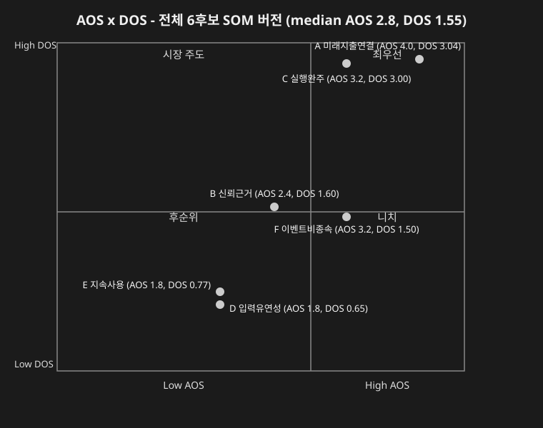
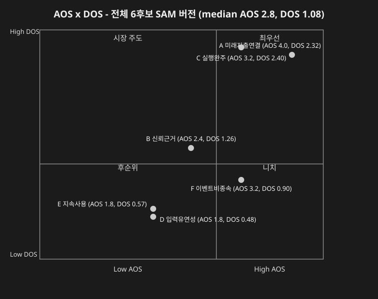

# DOS 분석 결과 — 미래지출 결제설계 서비스

> `가람/0819_DOS 분석 방법론.md`(정정판)의 Output Format대로 채점한 결과입니다. **8명·6개 후보(A~F) 전체**를 대상으로, Market Relevance 모수를 `가람/0819_DOS Market Relevance 모수 판단.md`가 페르소나별로 준 권장 범위의 **상단값(SOM 버전)**과 **하단값(SAM 버전)** 두 가지로 각각 적용해 산출했습니다.
>
> **공식**: `DOS = (Importance − Satisfaction) × Market Relevance`

---

## 0. 전체 범위 — 8명·6후보 통합 DOS 순위표 (SOM/SAM 버전)

Importance·Satisfaction은 `가람/0819_AOS 분석 결과.md` 2·3절 값을 그대로 가져왔습니다. 후보 하나에 여러 페르소나가 걸쳐 있으면(예: 후보 A = 이서연+김도윤+한지민+최유리+정하늘) 각 페르소나의 값을 평균해 그 후보의 Market Relevance로 삼았습니다.

### SOM 버전 (페르소나별 권장 범위의 상단값 — 현재 채택 중인 좁은 시장에서의 도달가능성을 낙관적으로 가정)

| 페르소나 | Market Rel(SOM) |
| --- | --- |
| 이서연·박서준 | 1.0 |
| 김도윤 | 0.9 |
| 한지민·최유리 | 0.7 |
| 정하늘·오세훈·강민재 | 0.5 |

| Pain/Goal(후보) | 기여 페르소나 | Imp | Sat | Market Rel | DOS | Insight |
| --- | --- | --- | --- | --- | --- | --- |
| A. 미래지출-카드혜택 자동 연결 | 이서연·김도윤·한지민·최유리·정하늘 | 5 | 1 | **0.76** | **3.04** | 8명 중 5명이 겪는 가장 넓은 문제 — SOM 낙관 가정에서는 전체 6후보 중 1위 |
| C. 실행(해지·전환) 완주 | 이서연·박서준 | 4 | 1 | **1.00** | **3.00** | 기여자 전원이 SOM 상단값(1.0)이라 MR이 최고치 — A와 근소한 차이로 2위 |
| B. 신뢰 가능한 계산 근거 | 이서연·박서준·최유리·정하늘 | 4 | 2 | **0.80** | **1.60** | 3위, F보다 근소하게 앞섬 |
| F. 이벤트 비종속·양방향 지원 | 오세훈·강민재 | 4 | 1 | **0.50** | **1.50** | AOS에서는 A·C와 동급(혁신기회)이었지만 SOM 버전에서도 4위로 밀림 |
| E. 지속 사용 동기 | 김도윤·한지민·최유리 | 3 | 2 | **0.77** | **0.77** | 5위 |
| D. 입력 부담·유연성 | 김도윤·한지민·정하늘·강민재 | 3 | 2 | **0.65** | **0.65** | 6위(최하위) |

**SOM 버전 순위**: A(3.04) > C(3.00) > B(1.60) > F(1.50) > E(0.77) > D(0.65)

### 혼합 매트릭스 (SOM 버전, median AOS 2.8·DOS 1.55)

---

### SAM 버전 (페르소나별 권장 범위의 하단값 — Phase 1로 확장했을 때의 보수적 도달가능성)

| 페르소나 | Market Rel(SAM) |
| --- | --- |
| 이서연·박서준 | 0.8 |
| 김도윤 | 0.7 |
| 한지민·최유리 | 0.5 |
| 정하늘 | 0.4 |
| 오세훈·강민재 | 0.3 |

| Pain/Goal(후보) | 기여 페르소나 | Imp | Sat | Market Rel | DOS | Insight |
| --- | --- | --- | --- | --- | --- | --- |
| C. 실행(해지·전환) 완주 | 이서연·박서준 | 4 | 1 | **0.80** | **2.40** | 기여자 전원이 SOM 계열(0.8)이라 MR 손실이 가장 적어 — SAM 버전에서는 **A를 제치고 1위** |
| A. 미래지출-카드혜택 자동 연결 | 이서연·김도윤·한지민·최유리·정하늘 | 5 | 1 | **0.58** | **2.32** | 기여자가 SAM Phase2까지 걸쳐 있어 하단값 평균이 C보다 낮음 — 2위로 밀림 |
| B. 신뢰 가능한 계산 근거 | 이서연·박서준·최유리·정하늘 | 4 | 2 | **0.63** | **1.26** | 3위 |
| F. 이벤트 비종속·양방향 지원 | 오세훈·강민재 | 4 | 1 | **0.30** | **0.90** | SAM 하단값(0.3)이 가장 낮은 계층이라 SOM 버전보다 순위 격차가 더 벌어짐 — 4위 |
| E. 지속 사용 동기 | 김도윤·한지민·최유리 | 3 | 2 | **0.57** | **0.57** | 5위 |
| D. 입력 부담·유연성 | 김도윤·한지민·정하늘·강민재 | 3 | 2 | **0.48** | **0.48** | 6위(최하위) |

**SAM 버전 순위**: C(2.40) > A(2.32) > B(1.26) > F(0.90) > E(0.57) > D(0.48)

### 혼합 매트릭스 (SAM 버전, median AOS 2.8·DOS 1.08)

---

## 핵심 발견

- **A와 C의 순위가 모수 선택에 따라 뒤바뀝니다** — SOM 버전(낙관적 도달가능성)에서는 A(3.04)가 근소하게 1위지만, SAM 버전(보수적 도달가능성)에서는 C(2.40)가 A(2.32)를 근소하게 앞섭니다. 두 값이 항상 근접해 있다는 것 자체가 "A와 C는 사실상 공동 1위"라는 결론을 어떤 모수를 쓰든 지지합니다.
- **F는 두 버전 모두에서 4위**입니다 — AOS 단독으로는 A·C와 동급(혁신기회 Q1)이었지만, SOM/SAM 어느 시나리오로 Market Relevance를 매겨도 시장 가중 후에는 순위가 크게 밀립니다. **`가람/0819_JTBD 분석 방법론.md` 1-2-1절의 3순위(F)를 이 결과로 보아 낮춰야 할지는 팀 논의가 필요합니다.**
- **B는 두 버전 모두에서 3위**, **D·E는 두 버전 모두에서 5·6위**로 순위 자체는 모수 선택과 무관하게 안정적입니다 — 순위가 흔들리는 지점은 A·C뿐입니다.

---

**연결 문서**: `가람/0819_DOS 분석 방법론.md` · `가람/0819_DOS Market Relevance 모수 판단.md` · `가람/0819_AOS 분석 결과.md`(2·3절 Importance·Satisfaction 원본) · `가람/0819_AOS-DOS 혼합 매트릭스.md`
