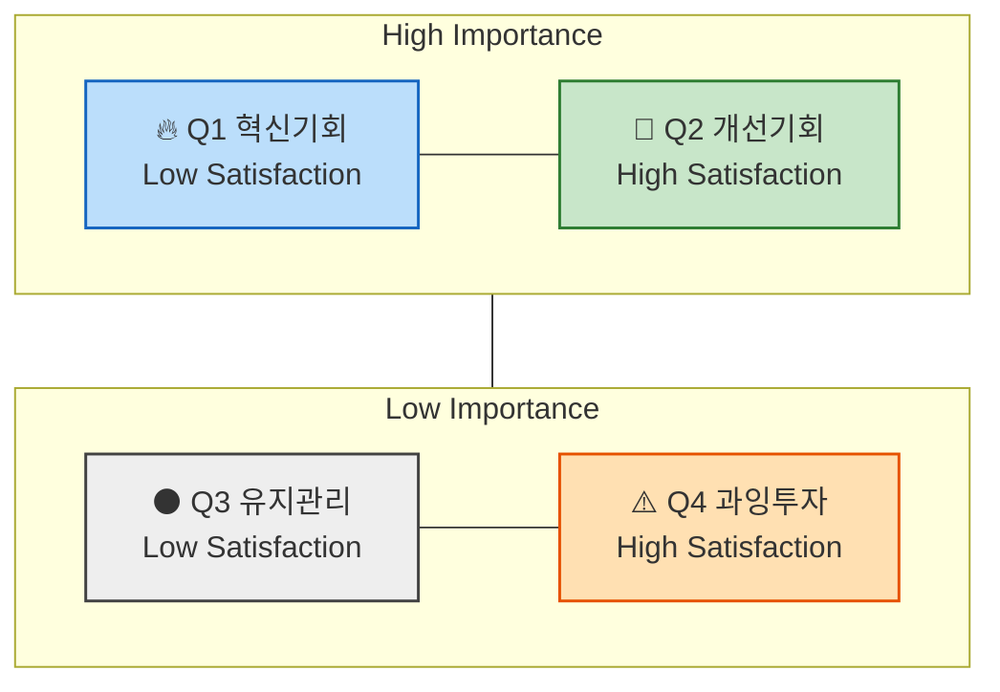

# 시장기회 분석 방법론 (AOS) — 미래지출 결제설계 서비스

> `방법론.md` 06(기회점수 OS 기반 시장기회 분석) 산출물(요구 5~10개 중요도·만족도·OS와 우선순위)을 만들기 위한 절차서입니다. `가람/0819_페르소나 스펙트럼 분석 보고서.md`·`가람/0819_페르소나.md`·`가람/0819_고객 여정지도.md`(특히 14절)를 입력 재료로 삼습니다.
>
> ⚠️ 아래 1·2절은 제공된 원문을 그대로 옮겼고, 3절(5단계 워크플로우)은 원문에 세부 내용이 없어 ODI(Outcome-Driven Innovation) 표준 Opportunity Score 절차를 우리 서비스 맥락으로 재구성했습니다 — 실제 세부 문구가 따로 있다면 교체하겠습니다.

---

## 1. AOS(Adjusted Opportunity Score)의 정의

**공식**: `AOS = 중요도(Importance) + max(중요도 − 충족도(Satisfaction), 0)`

중요도가 높은데 충족도가 낮을수록 점수가 커지는 구조입니다. "Adjusted"는 이 프로젝트 특성(가상 페르소나 기반, 실측 데이터 부족)에 맞춘 가중치 보정을 3절 4단계에서 반영한다는 의미로 씁니다.

### 📈 AOS 시각화 구조

- **사분면 형태로 시각화**: X축 = Satisfaction(충족도), Y축 = Importance(중요도)

### 사분면 해석 방법

| 사분면 | 조건 | 의미 | 전략 행동 |
| --- | --- | --- | --- |
| Q1 | High AOS | 혁신기회(High Importance + Low Satisfaction) | JTBD 인터뷰 대상, MVP 실험 우선 |
| Q2 | 중간 AOS | 개선기회 | 지속적 개선 필요 |
| Q3 | Low AOS | 유지/보완 | UX·마케팅 최적화 중심 |
| Q4 | 0 근처 | 과잉투자 위험 | 자원 분배 재검토 |

> **사분면 기준점(threshold)은 아직 미확정**입니다. 참고 자료(팀 Notion 링크)에 접근할 수 없어 이 문서에서는 방식만 제안합니다 — 3절 4단계에서 "척도 중앙값" 또는 "5점 척도 기준 3점"을 임시 기준점으로 쓰고, 실측 데이터가 쌓이면 재조정합니다.

---

## 2. 평가 대상 정의 — 무엇을(재료로) 점수화하는가

- **`우리가 설계한 솔루션`**에 대한 **페르소나 스펙트럼과 고객 여정 지도**에 대하여
- **`기존 솔루션 생태계`** 하에서 **고객이 겪고 있는 Pain/Job 상황**을 평가합니다.

| 분석 단계 | 평가 단위 = `고객 타겟` | 평가 대상 = `Pain 정의 내용` | 이 프로젝트에서의 실제 소스 |
| --- | --- | --- | --- |
| 페르소나 단계 | 각 페르소나의 주요 Pain·Goal | "이 사람에게 가장 중요한 고통은 무엇인가?" | `가람/0819_페르소나 스펙트럼 분석 보고서.md` 12명의 Pain(문제)·Goal(목표) 필드 |
| 고객 여정 지도 | 여정 단계별 Pain Point / 개선기회 | "고객 여정 중 어디서 좌절이 가장 큰가?" | `가람/0819_고객 여정지도.md` 각 단계 Pain Point, 특히 14절(단절 4명) |
| ~~JTBD 인터뷰 사전 단계~~ | ~~Job Statement 단위~~ | ~~"이 고객이 진보를 이루기 위해 수행하는 일(Job)은 무엇인가?"~~ | 07 JTBD 인터뷰가 아직 실행 전(`가람/0819_JTBD 분석 방법론.md`만 세팅됨)이라 이 행은 지금은 사용 불가 — 인터뷰 완료 후 이 문서에 갱신 |

### ✅ 앞선 분석 결과 중 무엇을 사용하는가 — 이 프로젝트의 답변

**Q1. 페르소나가 도출되기 전, "문제정의"·"Segment" 단계의 Pain List를 사용하면 어떻게 될까?**

사용하지 않습니다. 문제정의·Segment 단계의 Pain List는 아직 구체적 인물에 뿌리내리지 않은 추상적 문제 목록이라, 중요도·충족도를 매기는 평가자마다 서로 다른 가상의 고객을 상상하며 답하게 되어 점수 신뢰도가 떨어집니다. `방법론.md` 5장 연결규칙(`Journey·JTBD → OS`: "우선순위에 올린 기회가 실제 고객 상황과 중요한 미충족 결과에 기반하는가")도 페르소나·여정 이후 데이터를 전제합니다.

**Q2. 페르소나 스펙트럼 4가지 중 어떤 페르소나가 가진 Pain List를 사용해야 할까?**

**Core(핵심)와 Adjacent(확장) Pain List를 1차 점수화 대상으로 채택**합니다. AOS는 "주력 세그먼트가 겪는 미충족 니즈의 우선순위"를 가리기 위한 도구인데, Extreme·Non-user는 대표성이 낮거나(가설적 극단 사례, `가람/0819_Evidence Log.md` E-07 참고) 서비스 채택 자체를 거부하는 집단이라 이들의 만족도를 높이는 투자가 사업적 우선순위가 되기 어렵습니다. 단, **Extreme의 Pain Point는 Q4(과잉투자 위험) 판단 시 대조군으로만 참고**합니다 — 예를 들어 신은서(해지 실행 마찰)의 Pain이 이미 F-05 스코프 결정에 반영돼 있다면, 그 이상의 추가 투자는 과잉일 수 있다는 판단 근거로 씁니다.

> *분석 & 기획 단계에서는 최대한 많은 "유효한" 문제들에 시장기회 점수를 매겨서 내림차순으로 정렬해 봅니다.*

---

## 3. AOS 산출 5단계 워크플로우 (Step-by-Step)

| 단계 | 내용 | 이 프로젝트에서의 적용 |
| --- | --- | --- |
| 1. 후보 리스트업 | 점수화할 Pain/Job 후보를 모은다 | 2절에서 정한 소스(Core+Adjacent 9명의 Pain·Goal, 고객여정지도 Pain Point)에서 중복 제거해 후보 목록 작성 — 목표 5~10개(`방법론.md` 06 산출물 기준) |
| 2. 중요도(Importance) 평가 | 각 후보가 고객에게 얼마나 중요한지 평가 | 1~5점 척도. 실측 설문이 없으므로 잠정적으로 Evidence Log의 신뢰도(High/Mid/Low)와 CJM 감정 곡선(최저점)을 대리 지표로 사용하고, 🟡 표기 유지 |
| 3. 충족도(Satisfaction) 평가 | 기존 대안이 이 Pain을 얼마나 잘 해결해주는지 평가 | 뱅크샐러드·카드고릴라·엑셀 가계부·지인 추천 등 기존 대안(`0819_JTBD 분석 방법론.md` 3-1절 대안 목록과 동일 소스)이 각 Pain을 얼마나 해소하는지 1~5점 척도 |
| 4. AOS 계산 | `중요도 + max(중요도−충족도, 0)` 적용 | 계산 후 사분면 배치. 기준점(threshold)은 임시로 척도 중앙값(3점) 사용, 실측 데이터 확보 시 재조정(1절 참고) |
| 5. 우선순위 정렬 | 내림차순 정렬, Q1부터 검토 | 결과를 `방법론.md` 06 산출물 형식(요구 5~10개 × 중요도·만족도·OS·우선순위)으로 정리, `decision-log/decision-log.md`에 기록 |

---

## 4. 다음 액션

- [ ] Core+Adjacent 9명(이서연·김도윤·박서준·한지민·최유리·정하늘·오세훈·강민재)의 Pain·Goal에서 중복 제거해 5~10개 후보 확정
- [ ] 각 후보의 중요도·충족도를 팀 추정(🟡)으로 1차 채점 — 실측 설문·인터뷰(07 JTBD)로 추후 검증
- [ ] AOS 계산 및 사분면 배치, Q1(혁신기회) 우선순위 확인
- [ ] 결과를 `decision-log/decision-log.md`에 기록하고 `master-deck/README.md` p12(OS) 상태 갱신

---

**연결 문서**: `가람/0819_페르소나 스펙트럼 분석 보고서.md` · `가람/0819_페르소나.md` · `가람/0819_고객 여정지도.md`(14절) · `가람/0819_Evidence Log.md` · `가람/0819_JTBD 분석 방법론.md` · `방법론.md` 06·5장(연결 규칙)
