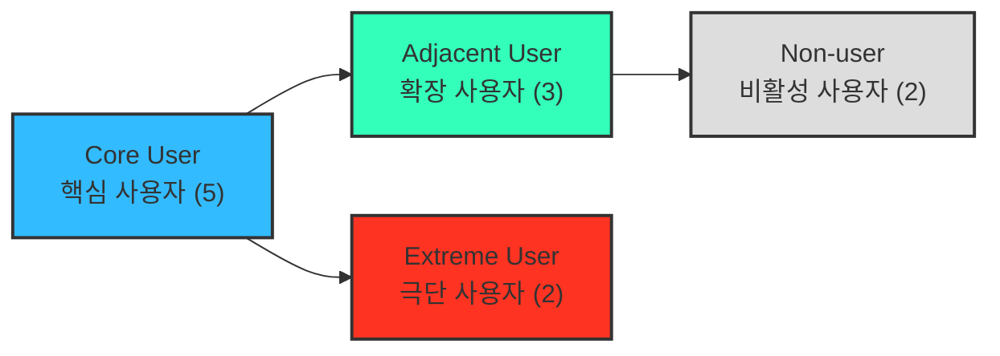

# 페르소나 스펙트럼 (Persona Spectrum) — 미래지출 결제설계 서비스

> **이전 버전 안내**: 이 문서는 2026-08-19 1차본 "페르소나 (방법론 05) — 미래지출 결제설계 서비스"(Q1~Q4 세그먼트 기반 페르소나 A/B/C)를 페르소나 스펙트럼 방법론으로 완전히 대체합니다. 핵심(Core) 유형에 기존 Q1(혼인)·Q2(이사) 세그먼트 근거를 흡수했고, 확장(Adjacent) 유형에 SAM Phase 2(이벤트 비종속)와 기존 경쟁 서비스 이용자를 배치했습니다.
>
> 다중 페르소나 생성 및 평가 워크플로우 **1단계(스펙트럼 도출)** 산출물입니다. 핵심 5명 · 확장 3명 · 극단 2명 · 비활성 2명, 총 12명을 팀이 이미 확보한 근거(`윤정/0818_쟁점정리.md`, `효진/TAM-SAM-SOM 정의 작업안.md`, `윤정/0818_1페이지 브리프.md`)에 기반해 생성했습니다.
>
> 표기: 🔵 Fact(근거 있음) · ⚪ Inference(추정) · 🟡 Assumption(가정, 검증 필요) — `방법론.md` 8장 기준. 아래 12명은 전부 🟡 가상 인물이며, 이름은 예시일 뿐 실존 인물이 아닙니다.

---

## 1. 핵심 사용자 (Core) — 5명

> 생성 포인트: 매출/사용 빈도 중심. Segment Map Q1(혼인)·Q2(이사) — 1~3개월 내 고액 지출이 예정되어 카드 조합 재설계 니즈가 가장 강하고 즉각적인 집단.

| 이름 | 직무 | 문제 | 목표 | 감정 | 대체 솔루션 |
| --- | --- | --- | --- | --- | --- |
| 이서연 (32) | 대기업 마케팅팀 대리 | 3개월 뒤 결혼식, 신혼여행·혼수 지출이 몰리는데 어떤 카드를 얼마나 써야 혜택이 최대인지 계산이 안 됨 | 결혼 준비 기간 지출을 카드별로 배분해 혜택을 놓치지 않고 다 받는 것 | 조급함, 정보 과부하로 인한 피로감 | 뱅크샐러드 카드추천(과거 소비 기준이라 안 맞음) + 네이버 카페 후기 취합 |
| 김도윤 (30) | 스타트업 PM | 결혼과 신혼집 이사가 겹쳐 혼수·이사비용이 동시에 몰림, 두 이벤트를 한 카드 전략으로 못 묶음 | 결혼+이사 지출을 하나의 결제 계획으로 통합해 실행 순서까지 정하는 것 | 압박감, "따로 계산하기 귀찮다"는 회피감 | 엑셀 개인 가계부에 카드별 실적을 수기로 추적 |
| 박서준 (34) | 중소기업 영업직 | 혼수 목돈 지출 시점에 전월실적 구간을 못 채워 놓치는 혜택이 생김(자동대체 후 혜택 불일치 경험) | 카드사의 일방적 자동대체에 끌려가지 않고 스스로 검증한 근거로 카드를 정하는 것 | 억울함(이미 자동대체로 혜택 손해 경험), 불신 | 카드사 콜센터 상담(설명이 상충되어 신뢰 안 감) |
| 한지민 (36) | 프리랜서 번역가 | 전세에서 자가로 입주하며 가전·인테리어 지출이 몰리는데, 소득이 일정하지 않아 카드 실적 구간 맞추기가 더 어려움 | 이사 기간 한정 지출에 맞춰 카드 조합을 임시로 바꿨다가 끝나면 원래대로 되돌리는 것 | 불안(프리랜서라 소득 변동 큼), 계획에 대한 통제 욕구 | 카드고릴라에서 카드 스펙만 비교, 실행은 감으로 결정 |
| 최유리 (39) | 대기업 회계팀 과장 | 지방 발령으로 갑작스러운 이사, 가전·인테리어 지출과 함께 통근 교통비 패턴도 바뀌어 카드 혜택 구조 전체 재검토 필요 | 회계 업무 경험을 살려 스스로 근거를 검증할 수 있는 계산 결과를 받는 것 | 시간 압박(발령 통보 후 이사까지 촉박), 분석적 성향의 답답함 | 본인 엑셀 시뮬레이션(시간이 오래 걸려 자주 포기) |

---

## 2. 확장 사용자 (Adjacent) — 3명

> 생성 포인트: 유사 니즈를 가졌지만 맥락이 다른 인접 시장군. 이미 유사 서비스를 쓰고 있거나(체리피커), 특정 생애 이벤트 없이(SAM Phase 2) 소비 변화를 겪는 사람들.

| 이름 | 직무 | 문제 | 목표 | 감정 | 대체 솔루션 |
| --- | --- | --- | --- | --- | --- |
| 정하늘 (27) | 신입 회계사 | 카드 혜택 최적화가 취미일 정도로 관심 많지만("PIVOT" 트렌드처럼 카드를 여러 장 병행 사용), 매달 실적·한도를 직접 계산하느라 시간이 많이 듦 | 이미 하고 있는 수작업 최적화를 자동 계산으로 대체해 시간을 아끼는 것 | 뿌듯함(잘하고 있다는 자부심)과 동시에 매달 반복되는 번거로움 | 카드 혜택 커뮤니티(카드고릴라 카페)에서 정보 취합 + 개인 스프레드시트 |
| 오세훈 (32) | 이직한 개발자 | 이직으로 소득 구간과 출퇴근·식비 패턴이 바뀌었지만, 특정 "이벤트"로 분류되지 않아 카드 추천 서비스들이 이런 변화를 반영 못 함 | 혼인·이사 같은 정해진 이벤트가 아니어도, 스스로 입력한 소비 변화만으로 카드 조합을 재설계받는 것 | 소외감("내 상황은 카테고리에 없다"), 답답함 | 기존 카드를 바꾸지 않고 방치, 가끔 지인에게 카드 추천 요청 |
| 강민재 (55) | 자영업자 | 자녀 독립 이후 생활비 지출이 줄었는데, 기존 서비스는 지출이 "늘어나는" 상황만 가정해 본인 케이스(지출 감소)에는 안 맞음 | 지출이 줄어드는 방향의 변화도 반영해 불필요해진 카드를 정리하고 싶은 것 | 허탈함(맞는 서비스가 없다는 느낌), 정리에 대한 막연함 | 특별한 도구 없이 카드사 안내 문자만 보고 개별 판단 |

---

## 3. 극단 사용자 (Extreme) — 2명

> 생성 포인트: 실패·불편·대안 사용 중심. "가장 자주 실패를 경험하는 사용자는 누구인가"에 대한 답.

| 이름 | 직무 | 문제 | 목표 | 감정 | 대체 솔루션 |
| --- | --- | --- | --- | --- | --- |
| 윤태호 (44) | 회사원(관리직) | 카드 20장 이상을 보유한 헤비유저 — 조합이 너무 복잡해져 스스로 관리하길 포기한 상태, 어떤 계산 도구도 이 정도 규모는 감당 못할 거라 생각 | 손대지 않고 방치한 카드들까지 포함해 전체를 한 번에 정리·재배치하는 것 | 무력감("이미 늦었다"), 관리 자체에 대한 회피 | 안 쓰는 카드는 그냥 서랍에 방치, 연회비만 내고 있는 카드가 다수 |
| 신은서 (29) | 직장인 | 계산상 해지가 유리하다는 결과를 받아도, 상담사 만류·해지 절차 복잡함 때문에 실제 해지에 3번 실패함(🔵 문제③ 해지 실행 마찰과 동일 패턴) | 계산 결과뿐 아니라 실행(해지) 자체를 끝까지 완수하는 것 | 좌절감, "노력해도 안 바뀐다"는 무력감 | 해지 시도 후 포기하고 자동이체만 걸어둔 채 방치 |

---

## 4. 비활성 사용자 (Non-user) — 2명

> 생성 포인트: 인식·가치·신뢰 결여 중심. "이 서비스를 사용할 수 없는 사람은 누구인가"에 대한 답.

| 이름 | 직무 | 문제 | 목표 | 감정 | 대체 솔루션 |
| --- | --- | --- | --- | --- | --- |
| 배정호 (62) | 자영업자 | 신용카드보다 체크카드·현금 위주로 쓰고, 스마트폰 앱으로 미래 지출을 입력하는 방식 자체가 익숙하지 않음(🔵 반박2 — 디지털 비친화 인구) | 복잡한 앱 조작 없이 지금 쓰는 방식 그대로 큰 불편 없이 지내는 것(서비스 자체가 목표가 아님) | 무관심, 새로운 앱 학습에 대한 거부감 | 종이 가계부, 은행 창구 방문 상담 |
| 조민아 (26) | 프리랜서 | 몇 달 앞선 미래 소비를 예측해서 입력하는 것 자체가 비현실적이라고 생각(🟡 "가장 큰 가정" 붕괴 케이스 — 더쎈카드 종료 리스크와 동일 우려) | 미래를 예측하기보다 그때그때 상황에 맞게 대응하는 것으로 충분하다고 느낌 | 회의감("어차피 예측대로 안 될 것"), 서비스에 대한 불신 | 지인이 추천한 카드 1장만 계속 사용, 별도 최적화 안 함 |

---

## 5. 스펙트럼 유형별 요약

| 구분 | 설명 | 목적 | 이번 문서에서의 근거 |
| --- | --- | --- | --- |
| 핵심(Core) | 이상적인 주요 고객군 | 주력 타깃 설정 | Segment Map Q1(혼인)·Q2(이사) — Trigger 감지가능성·지출강도 근거 🔵 |
| 확장(Adjacent) | 유사 문제를 가진 인접 시장군 | 확장 기회 탐색 | SAM Phase 2(이벤트 비종속) + 기존 카드 최적화 체리피커 ⚪ |
| 극단(Extreme) | 제약·극단적 상황을 가진 사용자 | 제품 개선 및 포용적 설계 | 문제③ 해지 실행 마찰 🔵, 카드 과다보유로 인한 관리 포기 ⚪ |
| 비활성(Non-user) | 아직 사용하지 않거나 회피하는 집단 | 시장 진입 장벽·거부 요인 파악 | 반박2 디지털 비친화 인구 ⚪, "가장 큰 가정" 붕괴 리스크(더쎈카드 종료) 🟡 |

> 다음 단계(2단계 이후)에서는 이 12명 중 우선순위가 높은 유형을 골라 정성 시나리오(JTBD 인터뷰 형태)로 심화하거나, 05(Journey)·06(OS)·07(JTBD) 작업과 대조해 실제 세그먼트 데이터와의 정합성을 검증할 예정입니다.

---

**연결 문서**: `윤정/0818_쟁점정리.md`(쟁점 3, Segment Map) · `효진/TAM-SAM-SOM 정의 작업안.md` · `윤정/0818_1페이지 브리프.md`(문제③ 해지 실행 마찰, 가장 큰 가정) · `방법론.md` 5장(연결 규칙)·8장(Fact/Inference/Assumption 표기)
