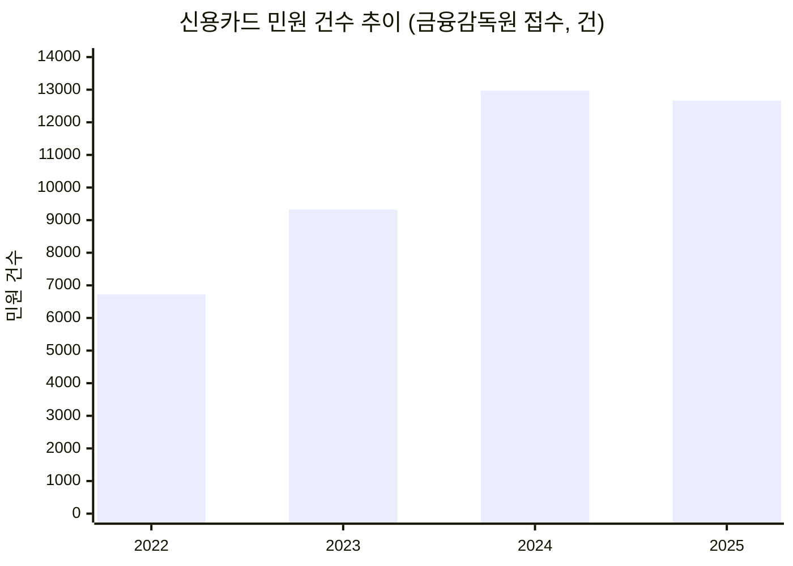

# 국내 신용카드 시장 리서치

**작성 기준일: 2026-08-15** — 2025~2026년 자료만 사용했고, 이미 개정·단종·폐지된 옛 정보는 제외했습니다. 확인하지 못한 항목은 추측하지 않고 "확인 안 됨"으로 표시했습니다.

> 목적: "미래지출 결제설계 서비스" 기획에 들어가기 전, 국내 신용카드 시장·혜택구조·규제·데이터 접근성을 먼저 파악하기 위한 배경 리서치입니다. `방법론.md`의 Fact/Inference 구분을 적용해 🔵 Fact(출처로 재확인 가능) / 🟠 확인 안 됨(추가 검증 필요)으로 표기합니다.

---

## 목차

1. [카드사 및 시장 구조](#1-카드사-및-시장-구조)
2. [카드 혜택 구조 메커니즘](#2-카드-혜택-구조-메커니즘)
3. [카드 추천·비교 서비스 현황](#3-카드-추천비교-서비스-현황)
4. [규제 환경 (여신전문금융업법)](#4-규제-환경-여신전문금융업법)
5. [마이데이터 연계 현황](#5-마이데이터-연계-현황)
6. [개인정보보호 규제 (참고)](#6-개인정보보호-규제-참고)
7. [조사 방법 및 한계](#7-조사-방법-및-한계)
8. [INSIGHT — 이 프로젝트에 대한 시사점](#8-insight--이-프로젝트에-대한-시사점)

---

## SUMMARY

- 국내 카드시장은 **전업 8개사 + 겸영은행**으로 나뉘고, 2026년 2분기 카드 승인실적은 336.9조원(전년동기 +7.6%) — 신한카드 1위지만 삼성카드와의 격차가 4천억원까지 좁혀진 초접전 상태(2026년 1분기 기준)
- **신용카드 누적 발급매수는 2022년 1억 2,417만 매 → 2025년 1억 3,466만 매(+8.5%)**로 완만히 증가한 반면, 같은 기간 금감원 접수 민원은 6,720건 → 12,661건(+88.4%)으로 10배 이상 빠르게 급증 — 주 원인은 해외결제 분쟁·리볼빙·연회비 환급 오해·단종카드 대체발급 4가지 (유형별 정확한 비중 통계는 🟠 확인 안 됨)
- **"단종카드 자동대체 후 혜택 불일치" 민원과 "카드 해지 절차 마찰" 민원은 우리 서비스와 직접 관련** — 카드사가 이미 하고 있는 "자동 재배치"에 대한 불만이 존재하고(F-03의 차별점 근거), 반대로 F-05가 제안하는 "해지"가 실제로는 실행 마찰이 크다는 것도 확인됨 (1-4-1 참고)
- 2026년 업계 키워드는 **"PIVOT"**(PLCC·준프리미엄·글로벌프리미엄·선택형·트래블카드) — 혜택은 캐시백형·즉시할인 중심으로 이동 중이고, "여러 카드 실적을 합산 인정"하는 상품은 사실상 없음
- **카드 이용내역 데이터는 오픈뱅킹이 아니라 마이데이터 API로만 제공**됨. ⚠️ **[08.19 무효]** 이 문서 작성 당시(08.15)에는 이 사실이 "MVP는 마이데이터 연동 없이 사용자 직접 입력"이라는 판단과 일치한다고 봤으나, 08.19 팀이 쟁점 1을 "MVP부터 마이데이터 연동 포함"으로 재정정하면서 그 판단 자체가 폐기됨 — 오픈뱅킹 불가라는 **규제 사실관계만 유효**하고, 그로부터 내린 "그래서 직접입력으로 우회"라는 결론은 더 이상 유효하지 않음(`0818_쟁점정리.md` 쟁점 1 참고)
- 뱅크샐러드가 2026.05에 마이데이터 기반 카드 추천+발급 연계 서비스를 새로 출시해, 기존 경쟁사 비교표(피치덱)의 "실행설계 ✗" 항목이 최신 상태인지 재검증이 필요함
- 마이데이터 이용자 수 등 일부 수치는 출처마다 집계 기준이 달라(🟠 표시) 팀이 최신 원자료로 다시 확인해야 함 — 자세한 내용은 [SUMMARY 근거]와 [INSIGHT](#8-insight--이-프로젝트에-대한-시사점) 참고

---

## 1. 카드사 및 시장 구조

### 1-1. 카드사 분류

| 구분 | 카드사 | 비고 |
| --- | --- | --- |
| 전업카드사 (8개사) | 신한카드 | 개인신판 시장 압도적 1위, 회원수 1,455만 명(2026.06) |
| | 삼성카드 | PLCC(제휴 전용카드) 확대로 순이익 1위·최고 성장률 |
| | 현대카드 | 프리미엄·애플페이 연계, 순이익 유일 성장세 |
| | KB국민카드 | 은행계열 대형사, 회원수 1,299만 명(2026.06) |
| | 롯데카드 | MBK파트너스 대주주 — 매각 진행 중 (1-5 참고) |
| | 우리카드 | 우리금융지주 계열 |
| | 하나카드 | 법인카드 시장 4위→2위로 순위 상승(2026.03) |
| | BC카드 | 자체 발급(BC바로카드) 외 회원은행(씨티·기업은행 등)에 매입망 제공하는 VAN형 구조 |
| 겸영은행 (은행 직접 발급) | NH농협은행·IBK기업은행·한국씨티은행·SC제일은행·부산·경남·광주·전북·제주은행 등 | 별도 법인 없이 은행 내 카드사업부에서 발급 |

🔵 출처: 여신금융협회 회원사 공시(crefia.or.kr), 2026.06 갱신분

### 1-2. 시장 규모

| 지표 | 수치 | 출처 |
| --- | --- | --- |
| 2026년 2분기 카드 승인실적 | 승인금액 336.9조원(전년동기 +7.6%), 승인건수 79.6억 건(+6.0%) — 개인카드 273.7조원(+7.4%), 법인카드 63.4조원(+8.7%) | 🔵 여신금융협회, 뉴스핌 2026.07.30 |
| 신용카드 vs 체크카드 비중 | 신용카드 262.2조원(+6.3%) : 체크카드 68.8조원(+8.3%) ≈ 79 : 21 | 🔵 여신금융협회, 2026.07.30 |
| 2025년 상반기 지급카드 이용규모 | 일평균 3.5조원(+3.7%) — 신용카드 +4.1%, 체크카드 +2.0%, 모바일결제 +6.3%, 실물카드 −0.8% | 🔵 한국은행, KDI 게재 2025 하반기 |
| 전업 8개사 개인 신용카드 국내 이용액 누계 | 약 275.97조원 | 🔵 여신금융협회 월간 통계, 2026.06 |

🟠 확인 안 됨: 신용·체크카드 발급매수 비율의 최신 공식 수치 (발급매수 총량은 1-3 참고)

> ⚠️ 유의: 위 수치들은 "승인실적"·"이용규모"·"이용액" 등 서로 다른 집계 기준을 쓰고 있어 단순 비교·합산하면 안 됩니다. 시장분석에 쓸 때는 출처별 정의를 다시 확인하세요.

### 1-3. 신용카드 발급매수 추이

| 기준연도 | 누적 발급매수 | 비고 |
| --- | --- | --- |
| 2022년 | 1억 2,417만 매 | — |
| 2025년 | 1억 3,466만 매 | 3년간 +1,049만 매(+8.5%) |

🔵 출처: 여신금융협회 공시 자료 인용, 뉴스투데이(news2day.co.kr) "신용카드 민원 3년간 2배 급증…카드사별 양극화", 2026.06.09

🟠 확인 안 됨: 2023·2024년 개별 연도 수치, 2025년 수치의 정확한 기준월(연말 기준으로 추정), 신용카드만인지 체크카드 포함 총 결제카드 수치인지의 명확한 구분(기사 맥락상 신용카드 기준으로 판단)

> 참고: 카드 수는 3년간 8.5% 늘었지만, 같은 기간 카드 관련 민원 건수는 그보다 훨씬 빠르게(2배) 늘어난 것으로 보도됨 — 카드 보급 확대 대비 소비자 불만 증가 속도가 더 가파른 추세. 구체적인 민원 이유는 1-4 참고.

### 1-4. 소비자 민원 급증 현황

| 연도 | 금감원 접수 민원 건수 | 비고 |
| --- | --- | --- |
| 2022년 | 6,720건 | — |
| 2023년 | 9,323건 | 전년 대비 +38.7% |
| 2024년 | 12,968건 | 전년 대비 +39.1%(4년간 최고치) |
| 2025년 | 12,661건 | 전년 대비 −2.4%(소폭 감소 전환), 2022년 대비 **+88.4%** |

🔵 출처(3개 매체 교차확인, 모두 2026.06.09 발행, 금융감독원 발표 인용): [이투데이](https://www.etoday.co.kr/news/view/2591800) · [머니투데이](https://www.mt.co.kr/finance/2026/06/09/2026060911102978831) · [뉴스투데이](https://www.news2day.co.kr/article/20260609500145)

**민원 건수 추이 (2022 → 2025)**

**주요 민원 유형 4가지:**

| 유형 | 내용 | 세부사항 |
| --- | --- | --- |
| ① 해외결제 분쟁 | 해외 쇼핑몰 미배송, 카드 도용, 이중결제 등 | 처리기간 3~5개월(현지 가맹점 조사·국제 브랜드사 심사 필요, 국내보다 까다로움). 이의제기 신청 기한은 거래일/전표접수일 기준 90~120일 이내 — 기한 놓치면 구제 어려움 |
| ② 단종 카드 대체발급 | 카드 단종 시 자동 발급된 대체카드의 **혜택이 소비패턴과 맞지 않는다**는 불만 | 유효기간 도래 1개월 전 사전안내 후 대체발급. 사용이력 없는 카드는 서면/전화 동의 필요, 소비자는 20일 이내 거부 의사표시 가능. 기존 자동납부가 승계 안 될 수 있어 별도 확인 필요 |
| ③ 리볼빙 서비스 | 결제대금 일부만 내고 나머지를 이월하는 고금리 대출성 계약 | 카드사별 평균 수수료율 15.1~18.3%(2026.05말 기준). 장기 이용 시 원금·수수료 부담 증가 + 신용평가에 부정적 영향 |
| ④ 연회비 환급 | 카드 해지 시 연회비 환급 범위에 대한 오해 | 기본연회비+제휴연회비 구성. 원칙적으로 잔여기간 일할계산 환급되나, **발급 첫해는 제조·배송 비용 때문에 기본연회비가 대부분 환급 안 됨** |

🔵 출처: 상동(이투데이·머니투데이·파이낸셜포스트, 2026.06.09, 금융감독원 발표 인용)

🟠 확인 안 됨: 4가지 유형별 정확한 민원 건수·비중(%) — 금감원 발표는 유형별 사례 설명 위주이고, 유형별 통계 공개 자료는 검색으로 확인 못함. 여신금융협회 소비자공시(gongsi.crefia.or.kr) 또는 금감원 "금융소비자의 소리"에 직접 문의 필요

- **카드사별 온도차**: 2026년 1분기 기준 신한·현대·KB국민카드는 민원이 두 자릿수(%) 증가한 반면, 삼성·하나·롯데카드는 큰 폭으로 감소 — 카드사 간 민원 관리 역량 차이가 뚜렷해지는 추세. 🔵 뉴스투데이, 2026.06.09

### 1-4-1. 우리 서비스와 직접 관련된 민원 사례

카드 리밸런싱(F-03·F-05)은 위 ②~④와 구조적으로 맞닿아 있습니다. 실제로 "카드 조합을 바꾸는" 상황 자체에서 이미 아래 두 가지 소비자 불만이 확인됩니다.

| 사례 | 우리 서비스와의 연관성 | 출처 |
| --- | --- | --- |
| **단종·대체카드가 소비패턴과 안 맞는 문제** — 카드사가 단종된 카드를 자동으로 다른 카드로 바꿔주는데, "혜택이 실제 소비패턴과 맞지 않는다"는 민원 다수 | 우리 서비스가 F-03에서 하려는 일(소비 변화에 맞는 카드 재배치)을 카드사가 이미 일방적으로 하고 있고, 그 결과에 대한 불만이 실제로 존재함 — **"자동 대체"가 아니라 "근거를 보여주는 재배치"라는 차별점(C)이 이 민원을 직접 겨냥함** | 🔵 파이낸셜포스트, 2026.06.09 (금감원 발표 인용) |
| **카드 해지 절차 마찰** — 발급은 쉽고 해지는 어려움. 해지 버튼을 찾기 힘들고, 신청 후 "상담사 전화 예정" 안내만 오고, 상담사가 포인트 소멸을 이유로 해지를 만류하는 등 실행 단계 마찰 다수. 롯데카드 해킹 사태(2025) 이후 해지 수요가 늘며 이 불만이 급증 | F-05("A카드 해지 제안")가 계산상으로는 맞아도, **실제 해지 실행 단계에서 사용자가 좌절할 수 있음** — PRD에 "해지 자체를 대행하지 않고, 해지 시 유의사항(포인트 소멸, 자동납부 승계 여부)을 안내"하는 정도로 스코프를 명확히 한정할 필요 | 🔵 뉴스토마토, 2025.10.13 |

> ⚠️ 이 두 사례는 "카드추천 서비스"에 대한 민원이 아니라 "카드사의 자동 대체·해지 프로세스"에 대한 민원입니다. 카드고릴라·뱅크샐러드 등 카드추천/비교 서비스 자체에 대한 소비자 불만 사례는 검색으로 확인되지 않았습니다(🟠) — 아직 이 시장에 정면으로 겨냥한 소비자 불만은 형성되지 않은 것으로 보이며, 이는 오히려 "선점 기회"로 해석할 수도 있습니다.

### 1-5. 점유율·재편 동향 (2025~2026)

- **2026년 상반기 개인신판 시장점유율**: 신한카드 1위(18.48%). 신한-삼성 이용액 격차가 2024년 1분기 3.9조원 → 2025년 1분기 1조원 → 2026년 1분기 4천억원으로 급격히 축소되며 초접전 구도. 🔵 한국금융신문 2026.01.30, 파이낸셜뉴스 2026.04.20
- **순이익 기준(2025년 상반기)**: 삼성카드 1위(격차 확대), 현대카드가 KB국민카드를 추격. 🔵 한국금융신문 2025.08.25
- **롯데카드 매각**: MBK파트너스(2019년 인수, 지분 59.83%)+우리은행 지분 등 총 80% 매각 재추진. 2024년 개인정보 유출 관련 금융위 제재(신규회원 업무정지 1개월 15일, 과징금 50억원) 확정 후 2026.08 초 투자안내서(IM) 배포, 예상가 약 2조원, 인수후보로 KB·하나·우리금융 거론. 🔵 이코노미뉴스 2026.08.05, 브릿지경제 2026.08.07
- 업계 전망: 여전업권 수익성·건전성 이중고 지속, 업황 개선은 2026년 하반기 이후 예상. 🔵 아시아타임 2025.12.29

🟠 확인 안 됨: 신한·삼성 외 나머지 6개사의 2026년 개별 점유율

---

## 2. 카드 혜택 구조 메커니즘

| 항목 | 내용 | 출처 |
| --- | --- | --- |
| 전월실적 | 통상 30만원 구간이 대표적 기준. 카카오페이·네이버페이 등 간편결제 충전·결제분도 실적 인정 범위가 넓어지는 추세 | 🔵 카드고릴라, 2026.01 |
| 통합할인한도 | "한 카드에서 한 달간 받을 수 있는 할인·캐시백·적립의 합산 상한". 카드사별로 "월 최대 할인", "통합 혜택 한도" 등 용어가 다름 | 🔵 카드모아·뱅크샐러드 콘텐츠, 2026 |
| 여러 카드 실적 통합 여부 | 원칙적으로 카드사·카드별 개별 산정. 여러 카드 실적을 합산 인정하는 상품은 현재 거의 없음 | 🔵 아하(a-ha.io) Q&A 취합, 2025~2026 |
| 혜택 지급 방식 | 캐시백형(결제 즉시 할인)이 2026년 대세로 이동 중. 포인트형은 카드사별 현금화 가능 여부·최소 전환단위가 상이. 마일리지형은 항공사 제휴 포인트 성격이라 현금화 불가 | 🔵 카드고릴라, 2026 |
| 국내전용 vs 해외겸용 연회비 | 카드사·브랜드별 차이 존재 (예: 삼성 iD GLOBAL은 국내전용·해외겸용 모두 2만원 동일, 신한 글로버스는 2.2만원 vs 2.5만원). 해외겸용은 결제 시 브랜드 수수료(비자/마스터 약 1~1.25%)가 별도 부과 | 🔵 나무위키·뱅크샐러드 취합, 2026 |

### PLCC(상업자표시신용카드) 현황

- 전략이 "발급량 확대" 중심에서 "수익성·충성고객" 중심으로 전환 중. 시장 포화로 신규 대형 파트너 확보가 어려워지고, 독점 제휴 종료·복수 카드사 제휴 확산 사례 발생(대한항공-현대카드 계약 만료 임박 등). 🔵 뉴스웨이·인사이트코리아 2026.08
- 대표 성공 사례: KB국민카드 × 쿠팡 "쿠팡 와우카드"(2023.10 출시 → 2025.09 발급 200만 장 돌파). 🔵 아시아투데이·인사이트코리아, 2026
- 포르쉐·벤츠 등 프리미엄 브랜드로 PLCC 영역 확장 중(삼성·신한카드 주도). 🔵 인사이트코리아, 2026

### 2025~2026 트렌드 키워드

카드고릴라 2026 키워드 **"PIVOT"** — PLCC(Partner) · 준프리미엄(Intermediate) · 글로벌 프리미엄(VIP) · 선택형 카드(Option) · 트래블카드(Travel). 🔵 카드고릴라, 2026.01

| 트렌드 | 사례 | 출처 |
| --- | --- | --- |
| 준프리미엄 카드 확산 (연회비 5만~8만원대) | 현대카드 부티크 3종/서밋 CE(8만원), KB국민 위시 올플러스·마이위시플러스(5.5만원), 신한 디스카운트 플랜플러스(5만원) | 🔵 헤럴드경제·카드고릴라, 2026 |
| 무실적 카드 | 로카 라이킷 1.2(무실적 전 가맹점 1.2%, 온라인 1.5%), BC 고트(무실적 해외 3% 무제한 적립) | 🔵 카드고릴라, 2026.01 |
| 구독·고정비 특화 카드 | 신한카드 "처음"(OTT 15%·멤버십 20% 적립), 신한 미스터라이프(전기·가스·통신 10% 할인) | 🔵 각사 콘텐츠 취합, 2025~2026 |
| 트래블카드 경쟁 | 신한 SOL트래블·토스뱅크 외화카드(재환전수수료 무료), 네이버페이머니카드(해외결제 2% 적립) | 🔵 종합 취합, 2026 |

---

## 3. 카드 추천·비교 서비스 현황

| 서비스 | 최신 동향 | 출처 |
| --- | --- | --- |
| 카드고릴라 | 15년 누적 방문자 약 8,000만 명, 누적 페이지뷰 8억 회, 2025.01 MAU 약 140만 명(역대 최다). "고릴라차트" 34종 운영 | 🔵 이데일리/마켓인, 2025.07 |
| 뱅크샐러드 | 마이데이터 기반 "나에게 딱 맞는 카드 찾기" 서비스 출시(2026.05), 발급 연계까지 지원 | 🔵 2026.05 |
| 토스 | PC 기반 "카드라운지" 서비스 방문자 수가 초기 대비 11배 증가(2026.07), 신용카드 발급 채널로 이용자 급증 | 🔵 2026.07 |
| 카카오페이 | AI가 결제내역·마이데이터 카드이용내역을 분석해 개인 맞춤 카드 추천 제공 | 🔵 카카오 공식, 2025~2026 |

🟠 확인 안 됨: 카카오페이 카드추천 기능의 정량적 이용자 규모(MAU 등)

---

## 4. 규제 환경 (여신전문금융업법)

| 항목 | 내용 | 출처 |
| --- | --- | --- |
| 가맹점수수료율 재산정 | 2012년부터 3년 주기 적격비용 재산정. 2025.02.13 발표: 영세·중소가맹점 우대수수료율 인하(신용카드 3억원 이하 0.50%→0.40%, 체크카드 0.25%→0.15%), 연매출 1,000억원 이하 일반가맹점 11.6만개는 3년간 동결 | 🔵 금융위원회 보도자료, 2025.02 |
| 겸영업무 확대 | 2024.12.03 국무회의 의결 시행령 개정으로 카드사의 기업정보조회업 겸영 허용(기존 마이데이터·개인사업자신용평가업에 추가) | 🔵 일간NTN, 2024.12 (정확한 시행일은 🟠 확인 안 됨) |
| 인가/등록 자본금 요건 | 신용카드업 단독 200억원 / 할부금융 등 2개 이상 겸업 시 400억원, 겸영여신업자 등록 20억원, 신용카드등부가통신업 등록 20억원(소규모 가맹점 특화 10억원) | 🔵 국가법령정보센터, 여신전문금융업법 (2025.10.01 시행본) |

🟠 확인 안 됨: 다음 적격비용 재산정 확정 시기(3년 주기 기준 2028년경 추정)

---

## 5. 마이데이터 연계 현황

| 항목 | 내용 | 출처 |
| --- | --- | --- |
| 마이데이터 2.0 시행 | 2025.06.19 정식 개시, 27개사 우선 참여(삼성카드·신한카드 포함, 하반기 순차 추가). 주요 변경 — 대면영업 허용, 법정대리인 동의 연령 19→14세, 결제내역 판매자 상호 등 정보 정확성 제고, 동의절차 2단계→1단계 간소화, "안심 제공 시스템" 의무화 | 🔵 금융위원회 보도자료, 2024.09 예고 / 2025.06 시행 |
| 누적 허가 사업자 | 본허가 69개사 — 이 중 LG유플러스·에프앤가이드·NHN페이코·KB핀테크 등 7개사는 API 과금 부담 등으로 허가 반납 | 🔵 스트레이트뉴스, 2025 |
| 카드사 참여 | 신한카드·KB국민카드·현대카드·삼성카드·롯데카드·우리카드·BC카드 등 전업카드사 대부분이 마이데이터 라이선스 보유 | 🔵 취합, 2025~2026 (하나카드 참여 여부는 🟠 확인 안 됨) |
| 카드 이용내역 데이터 제공 방식 | 마이데이터 표준API 중 "카드 업권 정보제공 API 규격"을 통해 결제내역·가맹점명 등을 제공. 2025.09.30자 개정판 발표 | 🔵 마이데이터 종합포털(developers.mydatakorea.org), 2025.09 |
| 오픈뱅킹과의 관계 | 오픈뱅킹은 은행·제2금융권 **계좌**의 조회·이체에 한정(2025년부터 법인까지 이용범위 확대). **카드 이용내역·결제내역은 오픈뱅킹이 아닌 마이데이터 API 체계를 통해서만 제공됨** | 🔵 금융위원회 보도자료, 2024.12.30 |
| 신규 핀테크의 마이데이터 참여 요건 | 6대 허가요건(①자본금 최소 5억원 ②물적설비/보안 ③사업계획 타당성 ④대주주 적격성 ⑤임원자격 ⑥전문성). 금융회사 50% 이상 출자요건 미적용, 클라우드 전산설비 이용 허용 | 🟠 2020~2022년 도입 요건 기준 — 2025~2026년 개정 여부 확인 안 됨, 팀 검증 필요 |

🟠 확인 안 됨: 2026.08 현재 정확한 마이데이터 본허가 사업자 수, 마이데이터 이용자 수 집계 기준(실인원 vs 서비스별 가입 누계 — 2025.10 기준 "1억 7,734만 건" 수치와 2025.05말 기준 "약 1억 6,531만 명" 수치가 검색되었으나 집계 방식이 다를 수 있어 그대로 합산·비교하지 말 것)

---

## 6. 개인정보보호 규제 (참고)

- 개인정보보호법상 전송요구권을 금융 분야에서 보건의료·통신·유통 분야로 확대하는 개정 진행 중. 🔵 datalaw.kr, 2026
- 2026.09.11 시행 예정 개정: 개인정보 유출·과징금·개인정보보호책임자 규정 변경. 🔵 datalaw.kr, 2026
- 금융권 망분리 규제 단계적 완화(1단계 생성형AI·클라우드SaaS 확대, 2단계 개인신용정보 처리 특례 확대 예정). 🔵 KPMG, 2025.05

---

## 7. 조사 방법 및 한계

WebSearch 기반으로 시장구조·혜택구조/트렌드·규제/마이데이터 3개 축을 나눠 총 40여 회 교차 검색했습니다. 여신금융협회, 한국은행, 금융위원회, 마이데이터 종합포털 등 공신력 있는 출처와 언론사(뉴스핌·한국금융신문·헤럴드경제·인사이트코리아 등) 보도를 상호 대조했습니다. 🟠로 표시한 항목은 최신 원자료로 팀이 직접 재확인해 주세요.

---

## 8. INSIGHT — 이 프로젝트에 대한 시사점

- **TAM 재확인 필요**: `쟁점정리.md`에서 쓴 마이데이터 가입 건수(1.77억 건, 2025.10)와 이번에 확인한 마이데이터 2.0 관련 수치(2025.05말 약 1.65억 명)가 다른 집계일 수 있음 — Master Deck에 넣기 전 최신 여신금융협회/마이데이터 종합포털 원자료로 재확인 권장
- **카드 데이터 접근은 마이데이터 API로만 가능** — 오픈뱅킹으로는 안 됨이 명확해짐. ⚠️ **[08.19 무효]** 당시엔 이게 "MVP는 마이데이터 연동 없이 사용자 직접 입력" 판단과 일치한다고 봤으나, 08.19 쟁점 1 재정정(MVP부터 마이데이터 연동 포함)으로 그 판단은 폐기됨 — 규제 사실관계(오픈뱅킹 불가)만 유효
- **F-04(카드 수 제약 안에서 해지·유지·신규추가 비교, 08.19 갱신)와 직결**: PLCC·준프리미엄·무실적카드·구독특화카드 등 2026년 트렌드가 다양해서, "신규카드 후보군"을 무한정 넓히면 스코프가 커짐 — MVP에서는 트렌드 키워드별 대표 카드 1~2종으로 제한하는 것을 추천
- **경쟁 서비스 업데이트 확인 — [08.19 재검증 완료]**: 뱅크샐러드가 2026.05에 "카드 갈아타기" 플로우 안에 마이데이터 기반 카드 추천+발급 연계를 새로 얹었음. 재검증 결과 실행설계는 ✗가 아니라 ◐로 재판정(발급 연계는 하지만 조합 재배치·근거 있는 산출 과정 공개는 없음) — `윤정/0819_01_Porters Five Forces 분석.md` §5, `0818_쟁점정리.md`·`0818_1페이지 브리프.md` 비교표에 반영 완료
- **가맹점수수료 규제는 카드사 수익구조에 영향** — 우리 서비스가 직접 규제 대상은 아니지만, 카드사가 혜택을 축소하는 배경(원가 압박)으로 참고할 것
- **소비자 민원 급증(1-4)은 차별점 C(검증 가능한 계산)의 근거를 강화함** — 민원 상위권인 "연회비 환급 오해"·"리볼빙 고금리 인지 부족"은 F-06(계산 근거 공개)이 정확히 겨냥하는 문제. 특히 리볼빙(15.1~18.3%)이 결제방식 선택에 영향을 주는 만큼, F-03 계산 로직에 "리볼빙 미적용을 전제로 계산했다"는 점을 명시하는 Guardrail을 추가하는 것을 검토할 것
- **"단종카드 자동대체 불만"은 우리 서비스 존재 근거를 뒷받침하는 실제 증거**(1-4-1) — 카드사가 이미 일방적으로 하고 있는 재배치에 대한 불만이 실재하므로, Master Deck Problem 슬라이드에 "카드사 자동대체 vs 우리 서비스의 근거 기반 재배치" 비교를 추가하면 설득력이 커짐
- **"카드 해지 실행 마찰"은 F-05 스코프를 제한하는 신호**(1-4-1) — 계산은 맞아도 실제 해지가 어렵다는 게 확인된 이상, PRD에서 F-05를 "해지 대행"이 아니라 "해지 판단 근거 + 유의사항 안내"로 스코프를 좁혀야 사용자 기대와 실제 서비스 능력 사이의 괴리를 방지할 수 있음
- **카드추천 서비스 자체에 대한 소비자 불만은 아직 형성되지 않은 것으로 보임**(1-4-1, 🟠) — 경쟁 압박이 아직 약한 시기이므로, 초기 진입이 유리할 수 있다는 신호로 참고할 것(다만 검색 한계일 수 있어 과신 금지)
