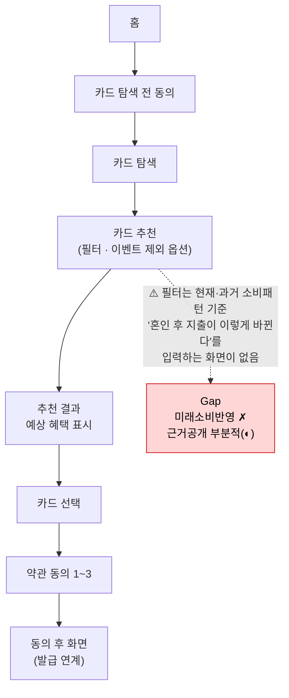
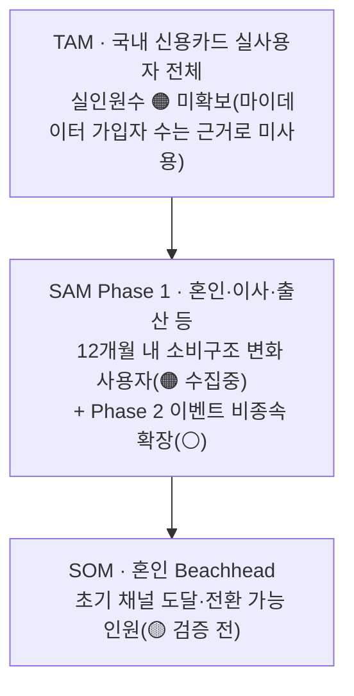
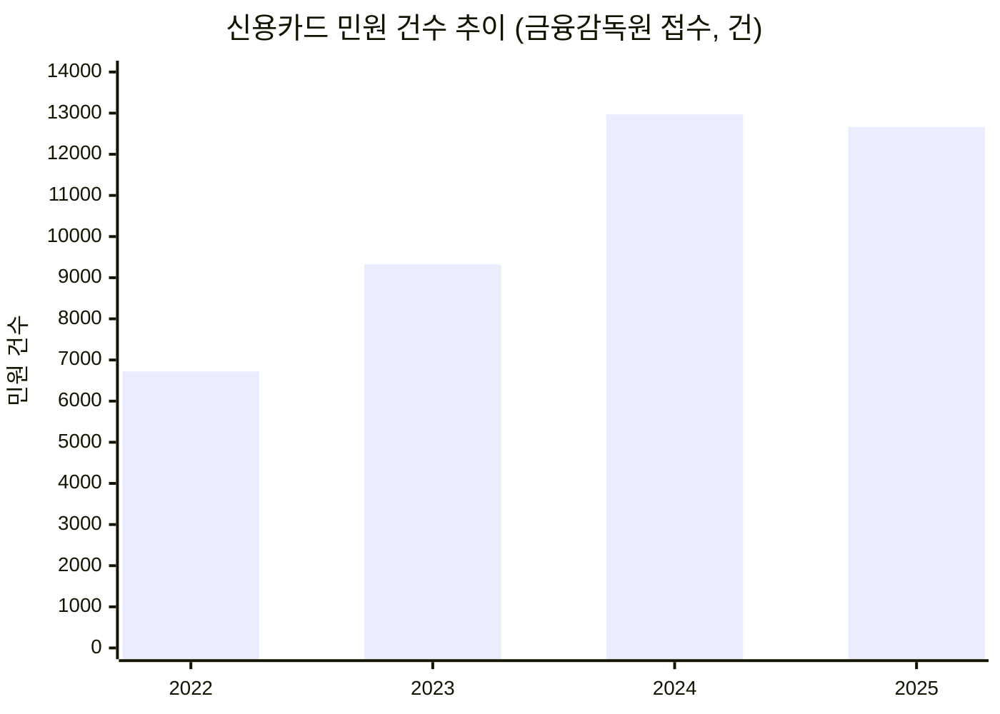

# 컨설팅 전 1페이지 브리프 — 미래지출 결제설계 서비스

> 작성일 2026-08-18 · 작성자 윤정(기준서비스분석·서비스/시스템설계) · 근거: `0818_쟁점정리.md` · `0814_미래지출 결제설계 서비스 피치덱.md` · `국내 신용카드 시장 리서치.md` · `0818_서비스 기초 컨설팅 점검.md`
> 표기: 🔵 Fact(확인) · ⚪ Inference(추정) · 🟡 Assumption(가정) · 🟠 확인 안 됨 — `방법론.md` 8장 기준

---

## 1. 기준 서비스 & 분석할 사용자 시나리오

**기준 서비스**: 뱅크샐러드 "나에게 딱 맞는 카드 찾기" — 마이데이터 기반 카드추천 + 발급연계(🔵 2026.05 출시)
**분석 시나리오**: 혼인을 앞두고 카드 혜택 조합을 다시 짜야 하는 사용자가 뱅크샐러드에서 겪는 As-Is 여정 (🔵 유저플로우 실측 캡처 12장 + `0818_경쟁사_유저플로우_뱅크샐러드.pdf` 기반)

**관찰**: 추천 로직이 현재 시점 소비 데이터에 기반해 카드를 골라주는 데는 강하지만, "결혼 후 식비·여행비·가전비가 이렇게 바뀔 것"이라는 사용자의 미래 계획을 입력받아 재계산하는 단계가 없음 — 이 지점이 개선 서비스(F-01~F-06)가 파고드는 정확한 위치.

---

## 2. 시장 · 경쟁구도 · 예상 세그먼트

| 지표 | 수치 | 상태 |
| --- | --- | --- |
| 국내 카드 승인실적(2026 Q2) | 336.9조원(전년동기 +7.6%) | 🔵 여신금융협회 |
| 신용카드 발급매수 | 2022년 1억 2,417만 매 → 2025년 1억 3,466만 매(+8.5%) | 🔵 여신금융협회 |
| 뱅크샐러드 카드추천 이용자 | 약 130만 명 | 🔵 |
| 카드고릴라 MAU(2025.01) | 약 140만 명(역대 최다) | 🔵 |
| 토스 카드라운지 방문 | 초기 대비 11배 증가(2026.07) | 🔵 |

**경쟁구도** — 실행설계·미래소비반영·근거공개 3조건 동시 충족 없음:

| 기업 | 실행 설계 | 미래 소비 반영 | 근거 공개 |
| --- | :---: | :---: | :---: |
| 뱅크샐러드 | ✗ | ✗ | ◐ |
| 카드고릴라 | ✗ | ✗ | ✗ |
| 더쎈카드 † | ✔ | ✗ | ？ |
| 토스 | ✗ | ✗ | ✗ |
| Credit Karma | ✗ | ✗ | ✗ |
| NerdWallet | ✗ | ✗ | ◐ |

† 더쎈카드는 2023년 유사 기능 제공 후 2026년 서비스 종료(실패 원인 미확정)

**예상 세그먼트 (TAM-SAM-SOM, `0818_쟁점정리.md` 쟁점3 2차 수정 반영)**

혼인 1인당 카드결제 대상 지출 **1,473~2,203만원**(🔵 결혼비용 총계 5,912만원 중 신혼여행·혼수·웨딩패키지±예식홀) — Q1(혼인)을 1차 Beachhead로 선정한 근거. Q2(입주)는 지출강도 데이터 미확보로 2차 리서치 대상. TAM 실사용자 수·SOM 채택률 등 실수치는 `효진/TAM-SAM-SOM 정의 작업안.md` 절차(KOSIS 원자료 수집)로 확정 예정 — 여기서는 확정치처럼 제시하지 않음.

---

## 3. 핵심 Value Proposition

| 차별점 | 내용 |
| --- | --- |
| A. 실행 설계자 | 추천에서 끝나지 않고 "어떤 카드를 언제·어떻게 전환할지" 순차 실행안까지 제시 |
| B. 과거가 못 보는 소비 | 과거 결제내역이 아니라 사용자가 입력한 미래 소비 변화를 기준으로 재계산 |
| C. 검증 가능한 계산 | 추천 결과에 전월실적 구간·혜택한도·연회비 반영 계산 근거를 그대로 공개 |

---

## 4. 현재 관찰한 문제와 근거

**문제 1 — 경쟁 공백**: 6개 경쟁사 중 실행설계·미래소비반영·근거공개를 동시 충족하는 곳 없음(2절 표)

**문제 2 — 카드사 자동대체 불만이 이미 실재**: 단종카드를 카드사가 일방적으로 대체 발급하지만 "혜택이 소비패턴과 안 맞는다"는 민원 다수

2022→2025년 민원 **+88.4%** 증가(🔵 금융감독원 발표, 3개 매체 교차확인). 카드 발급매수 증가(+8.5%)보다 10배 빠른 속도 — 우리 서비스가 하려는 "근거 기반 재배치"가 이 불만을 직접 겨냥함.

**문제 3 — 해지 실행 마찰**: 계산상 유리해도 실제 카드 해지는 상담사 만류·절차 복잡 등으로 실행이 어려움(🔵 뉴스토마토 2025.10.13) → F-05는 "해지 대행"이 아니라 "판단 근거 + 유의사항 안내"로 스코프를 좁혀야 함

---

## 5. 문제의 구조적 정의 (기능명 없이)

> 소비 패턴 변화가 예상되는 사용자가, 카드별 전월실적 구간·혜택한도·연회비 조건이 복잡하게 얽혀 있어 스스로 최적 카드 조합을 판단하지 못하고, 결과적으로 카드사의 일방적 자동대체나 과거 소비 기준 추천에 의존하게 된다.

---

## 6. 탐색해 보고 싶은 다른 산업·서비스 후보

| 후보 | 문제 구조 유사성 |
| --- | --- |
| 대환대출 자동전환 | 조건(금리)이 바뀌면 최적안을 재계산해 근거와 함께 제안 — F-03과 동일 메커니즘 |
| 통신 요금제 자동전환 | 사용 패턴 변화에 맞춰 최적 요금제를 재추천 — 카드 리밸런싱과 동형 구조 |
| 전력 시간대 요금 최적화 | 조건 변화에 따른 자동 재배치 + 근거 공개 |
| 보험 비교(보험다모아) | 선택지가 많고 조건이 복잡해 스스로 판단하기 어려운 동일 문제 |
| 배송 추적형 상태 가시화 | 결제조합 전환의 "진행상태" 불확실성 해소에 참고 |
| SaaS 온보딩 단계화 | 복잡한 혜택구조를 단계별로 설명하는 방식에 참고 |

---

## 7. 가장 큰 가정 & 강사에게 확인받을 질문

**가장 큰 가정** 🟡: 사용자가 몇 개월 앞선 미래 소비 변화(예: 결혼 후 식비 변화)를 스스로 예측하고 입력할 의향과 능력이 있다는 것 — F-01의 전제이자 서비스 전체 메커니즘의 출발점. 이 가정이 틀리면 하위 계산 로직(F-02~F-06)의 정교함과 무관하게 서비스가 입력 단계에서 막힘. (부차 가정: TAM 실사용자 수·SOM 채택 인원 모두 미확보 — 2절 참고, `효진/TAM-SAM-SOM 정의 작업안.md`으로 확정 예정)

**강사에게 확인받을 질문**:
1. 제품 로직은 이벤트 비종속(일반화)으로 유지하되 Beachhead는 혼인으로 특정했는데, 컨설팅 단계에서는 일반화와 특정화 중 어느 쪽에 더 무게를 둬야 하는가?
2. 카드 혜택 계산 결과를 제공하는 것이 "재무 자문"으로 분류될 규제 리스크가 있는가? 있다면 계산 근거 공개(F-06)와 면책 문구만으로 충분한 완화장치인가?

---

**연결 문서**: `0818_쟁점정리.md` · `0814_미래지출 결제설계 서비스 피치덱.md` · `국내 신용카드 시장 리서치.md` · `0818_서비스 기초 컨설팅 점검.md` · `0818_역할·작업계획 확정.md` · `효진/TAM-SAM-SOM 정의 작업안.md` · `효진/컨설팅 전 1페이지 브리프.md`(교차검토용)
