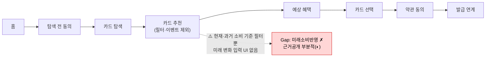
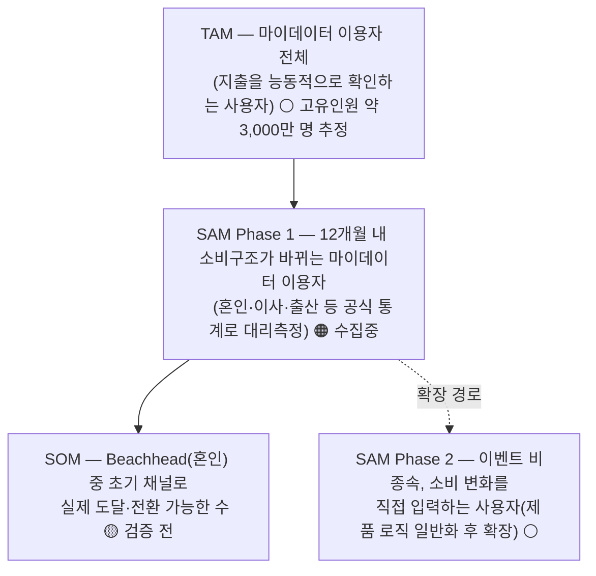
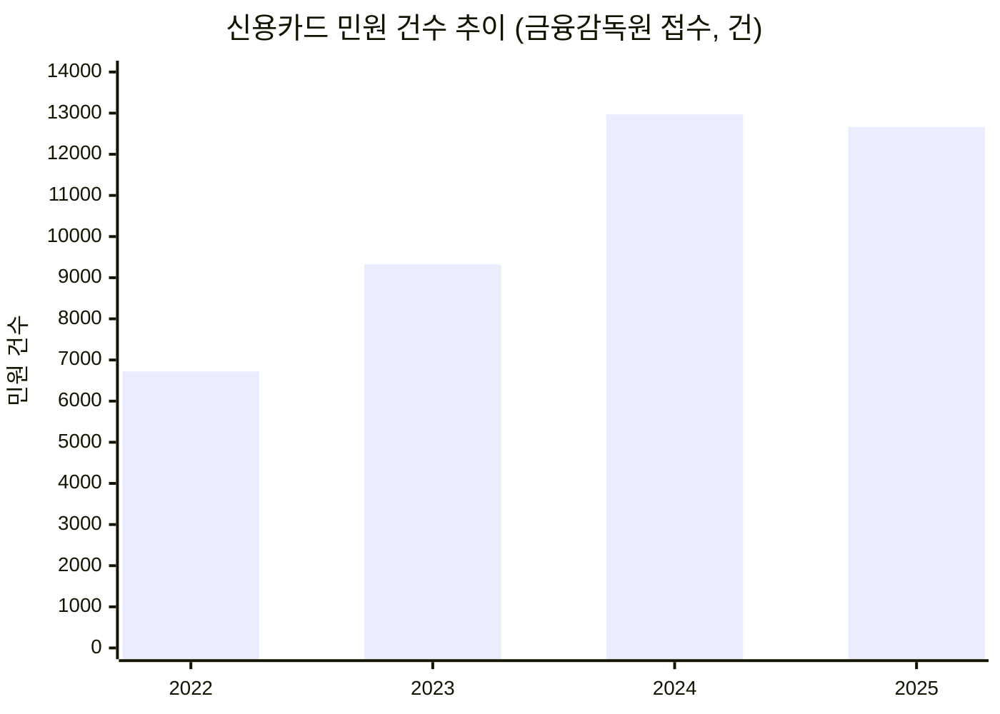

# 컨설팅 전 1페이지 브리프 — 미래지출 결제설계 서비스 (통합본)

> 2026-08-18 "Question & Role Lock" 초기 컨설팅용 요약. 윤정 초안(As-Is 여정 시각화·경쟁사 전체 비교표·민원 추이 차트)과 효진 초안(선정 이유·VP 서술·문제의 ⓐⓑⓒ 구조 분해·질문 구성)을 교차비교해 통합했습니다. 두 초안이 **가장 큰 가정("사용자가 미래 소비를 스스로 입력할 것")에서 독립적으로 같은 결론**에 도달한 점을 우선 반영했고, 그 외 항목은 근거가 더 구체적인 쪽을 채택했습니다.
>
> **[08.19 갱신]** TAM 앵커는 08.18 한때 신용카드 실사용자로 교정됐다가, 같은 날 추가 논의(`0818_TAM 정의 재논의 정리.md`)를 거쳐 08.19 **마이데이터 이용자로 재확정**되었습니다 — 신용카드 실사용자 기준은 채택 가능성 낮은 인구·디지털 비친화 인구를 과다포함한다는 반박에 따른 것입니다. 같은 날 팀은 쟁점 1도 함께 정정해 **MVP부터 마이데이터 연동(과거 소비 기록) + 사용자 직접 입력(미래 변화 지출값)을 함께 쓰는 서비스**로 확정했습니다 — 이로써 "TAM=마이데이터 이용자"가 더 이상 쟁점 1과 모순되지 않고 문자 그대로의 자격 기준이 됩니다. 대신 마이데이터 인가 취득 vs 제휴 경로 결정이 새로운 미해결 리스크로 남습니다(`0818_쟁점정리.md` 쟁점 1 참고).
> 표기: 🔵 Fact(확인) · ⚪ Inference(추정) · 🟡 Assumption(가정) · 🟠 미확인 — `방법론.md` 8장 기준

---

## 1. 기준 서비스 & 분석할 사용자 시나리오

| 항목 | 내용 |
| --- | --- |
| 기준 서비스 | 뱅크샐러드 **"카드 갈아타기 > 카드 탐색 > 내 카드보다 더 좋은 카드 보기"**(🔵 실사용 캡처·유저플로우 PDF 실측 기준, `master-deck/README.md` B-9에서 08.19 확정 — 예전에 쓰던 "나에게 딱 맞는 카드 찾기"라는 표기는 신규 카드 발급 추천 진입점이라 실제 캡처와 안 맞아 폐기). 마이데이터 기반 카드추천+발급연계(🔵 2026.05 출시). 실사용 캡처 12장 + 유저플로우 PDF로 As-Is Flow 확보 |
| 분석 시나리오 | "1~3개월 내 고액구매(혼인 등)가 예정된 사용자가, 바뀔 소비에 맞게 보유 카드 조합을 다시 짜려고 카드추천을 받는다" — 뱅크샐러드는 이 시나리오에서 **과거 소비 기준 단일 카드 추천**까지만 제공 |
| 선정 이유 | 경쟁 6곳 중 실행설계·미래소비반영을 동시에 만족하는 곳이 없고, 그중 자료 접근성(실사용 캡처 확보)이 가장 좋은 대표 사례 |

**관찰**: 추천 로직은 현재 시점 소비 데이터로 카드를 고르는 데는 강하지만, "혼인 후 식비·여행비·가전비가 이렇게 바뀔 것"이라는 미래 계획을 입력받아 재계산하는 단계가 없음 — 이 지점이 개선 서비스(F-01~F-06)가 파고드는 정확한 위치.

---

## 2. 시장 · 경쟁구도 · 예상 세그먼트

**시장**: 국내 카드시장 2026 Q2 승인실적 **336.9조원**(전년 +7.6%, 🔵). 카드추천·비교 영역은 카드고릴라(MAU 약 140만)·토스 카드라운지·뱅크샐러드(카드추천 약 130만 명)·카카오페이가 경쟁 중(🔵). 2026 트렌드 키워드 **"PIVOT"**(PLCC·준프리미엄·선택형·트래블카드)으로 카드 조합 전략의 필요성이 커지는 국면(🔵).

**경쟁구도** — 3조건(실행설계·미래소비반영·근거공개) 동시 충족 사업자 없음:

| 기업 | 실행 설계 | 미래 소비 반영 | 근거 공개 |
| --- | :---: | :---: | :---: |
| 뱅크샐러드 †† | ◐ | ✗ | ◐ |
| 카드고릴라 | ✗ | ✗ | ✗ |
| 더쎈카드 † | ✔ | ✗ | ？ |
| 토스 | ✗ | ✗ | ✗ |
| Credit Karma | ✗ | ✗ | ✗ |
| NerdWallet | ✗ | ✗ | ◐ |

† 2023년 유사 기능 제공 후 2026년 서비스 종료 — **종료 원인 🟠 미확인** (7절 위험신호 참고)

†† **[08.19 재판정, 윤정 승인]** 실행 설계를 ✗에서 ◐로 재판정 — 발급 연계까지 지원해 "추천에서 끝"은 아니지만(🔵), 보유카드 재배치·결제수단 배분은 없고 실행의 종착점이 신규 발급이라 3조건 동시 충족은 여전히 아님. 상세 근거는 `윤정/0819_01_Porters Five Forces 분석.md` §5 참고. 카드고릴라는 마이데이터를 쓰지 않는 미디어·비교 모델임이 확인됨(🔵, 동 문서 참고) — 위 표의 다른 회사와 데이터 접근 방식이 다름에 유의

**예상 세그먼트 (TAM-SAM-SOM, `0818_쟁점정리.md` 쟁점3 3차 수정 반영)** — TAM을 **마이데이터 이용자**로 잡고, "이벤트 비종속 확장"을 SOM이 아니라 **SAM의 확장 경로(Phase 2)**로 배치해 SOM⊂SAM⊂TAM 포함관계를 지킵니다:

> **[08.19 확정]** 마이데이터 가입건수(1.77억 건, 중복포함) → 고유인원 약 3,000만 명 추정을 TAM 근거로 다시 사용합니다 — "신용카드 실사용자"는 채택 가능성이 낮은 인구·디지털 비친화 인구까지 과다포함한다는 반박(`0818_TAM 정의 재논의 정리.md`)에 따른 것입니다. MVP가 마이데이터 연동을 포함하도록 쟁점 1이 함께 정정되면서, TAM=마이데이터 이용자는 더 이상 논리적 모순이 아니라 **문자 그대로의 이용 자격 기준**입니다(`0818_쟁점정리.md` 쟁점 1 참고). 혼인 1인당 카드결제 대상 지출 **1,473~2,203만원**(🔵, 결혼비용 총계 5,912만원 중 신혼여행·혼수·웨딩패키지±예식홀)이 Q1(혼인)을 1차 Beachhead로 선정한 근거. TAM 고유인원 환산·SOM 채택 인원 등 실수치는 `효진/TAM-SAM-SOM 정의 작업안.md` 절차(KOSIS·마이데이터 통계 원자료 수집 → 중복 제거 → 3시나리오 민감도)로 윤정·효진이 공동 확정 예정.

---

## 3. 핵심 Value Proposition

사용자가 미래 소비 변화를 입력하면, 카드별 **전월실적 구간·혜택한도·연회비**를 반영해 **실행 가능한 결제조합(Payment Plan)을 계산 근거와 함께** 제시한다 — 그 결과 카드사의 일방적 자동대체·해지 유도가 아니라 **사용자가 스스로 검증 가능한 재배치 결정**을 내린다.

| 차별점 | 내용 |
| --- | --- |
| A. 실행 설계자 | 추천에서 끝나지 않고 전환 실행안까지 제시 |
| B. 과거가 못 보는 소비 | 과거 결제내역이 아닌 미래 입력값 기준 재계산 |
| C. 검증 가능한 계산 | 혜택 계산 근거를 그대로 공개 |

**1차 성과지표**: Payment Plan Selection Rate (피치덱 8장)

---

## 4. 현재 관찰한 문제와 근거

| # | 문제 | 근거 |
| --- | --- | --- |
| ① 경쟁 공백 | 6개 경쟁사 중 3조건 동시 충족 없음 | 2절 비교표 🔵 |
| ② 카드사 자동대체 불만 | 단종카드 자동대체 후 "혜택 불일치" 민원 다수 — 우리가 하려는 재배치를 카드사가 이미 일방적으로 하고 있음 | 민원 2022→2025 **+88.4%**(🔵 금감원, 3개 매체 교차확인), 발급매수 증가(+8.5%)보다 10배 빠름 |
| ③ 해지 실행 마찰 | 계산상 유리해도 실제 해지는 상담사 만류·절차 복잡 등으로 실행이 어려움 | 🔵 뉴스토마토 2025.10.13 |

문제 ③ 때문에 F-05는 "해지 대행"이 아니라 "판단 근거 + 유의사항 안내"로 스코프를 좁혀야 함(🟠 유형별 정량 비중은 미공개).

---

## 5. 문제의 구조적 정의 (기능명 없이)

> 소비 패턴 변화가 예상되는 사용자가, 카드별 전월실적 구간·혜택한도·연회비 조건이 복잡하게 얽혀 있어 스스로 최적 카드 조합을 판단하지 못하고, 결과적으로 카드사의 일방적 자동대체나 과거 소비 기준 추천에 의존하게 된다.

분해하면 세 개의 탐색 영역: **ⓐ 조건 비교·선택지 축소** · **ⓑ 조건 변화 시 재계산** · **ⓒ 자동 재배치의 근거 공개**

---

## 6. 탐색해 보고 싶은 다른 산업·서비스 후보

| 영역 | 후보 | 대응 문제 | 근거 |
| --- | --- | --- | --- |
| 교차 산업(1순위) | 대환대출 자동전환 · 통신 요금제 자동전환 · 전력 시간대 요금 최적화 | ⓑⓒ | 조건이 바뀌면 최적안을 재계산해 근거와 함께 제안 — F-03과 동일 메커니즘 |
| 인접 도메인 | 대출비교(핀다·토스) · 보험비교(보험다모아) | ⓐ | 선택지 많고 조건 복잡해 스스로 판단하기 어려운 동일 구조 |
| 동일 도메인 | 카드고릴라·토스·카카오페이 카드추천 UX | ⓐⓑⓒ | 같은 문제를 다루지만 미래소비반영·실행설계 공백이 이미 확인됨(UX 캡처 🟠 5곳 미확보) |
| 보조 후보 | 배송추적형 상태 가시화 · SaaS 온보딩 단계화 | ⓒ | 전환 "진행상태" 불확실성 해소·복잡한 혜택구조 설명 방식에 참고 |

---

## 7. 가장 큰 가정 & 강사에게 확인받을 질문

**가장 큰 가정** 🟡: 사용자가 몇 개월 앞선 미래 소비 변화를 스스로 예측하고 입력할 의향과 능력이 있다는 것 — F-01의 전제. **[08.19 갱신]** 여기에 두 번째 축이 추가됨 — 마이데이터 연동(과거 소비 기록 확보)이 MVP부터 전제 조건이 됨. 무너지면 F-01~F-06이 동시에 무의미해짐. **위험 신호**: 유사 기능(미래 소비항목 반영)을 제공했던 더쎈카드가 2026년 서비스 종료 — 원인 🟠 미확인이라는 점이 이 가정의 최대 리스크. (부차 가정: TAM 고유인원 환산·SOM 채택 인원 모두 미확보 — 2절 참고)

**강사에게 확인받을 질문**:
1. 제품 로직은 이벤트 비종속(일반화)으로 유지하되 Beachhead는 혼인으로 특정했는데, 컨설팅 단계에서는 일반화와 특정화 중 어느 쪽에 더 무게를 둬야 하는가?
2. 더쎈카드 종료 원인이 확인 불가한데, 실패 사례를 "원인 미확정" 표기로 우리 서비스의 존재 근거에 인용하는 것이 허용되는가? (평가항목 "근거와 추론의 투명성" 10점 관련)
3. 카드 혜택 계산 결과 제공이 "재무 자문"으로 분류될 규제 리스크가 있는가? 있다면 계산 근거 공개(F-06)와 면책 문구만으로 충분한 완화장치인가?
4. 32시간 스코프에서 TAM을 "미획득 혜택률"까지 반영한 금액(₩) 기준으로 추정해도 되는지, 아니면 사용자 수(명) 기준만으로 시장 규모를 서술해야 하는지?
5. **[08.19 갱신]** MVP부터 마이데이터 연동이 전제라면, 32시간 컨설팅 프로젝트 스코프에서 직접 마이데이터 인가 취득은 비현실적인데 "기존 인가 사업자와의 제휴를 가정"하는 서술만으로 컨설팅·심사에서 충분한가, 아니면 제휴 상대·방식까지 구체화해야 하는가?

---

## 오늘 함께 확정할 것

- [ ] 2절 세그먼트 교정 구조(SAM Phase1/Phase2 분리) 승인 — 쟁점정리 쟁점 3 다이어그램 대체
- [ ] **담당 충돌 해소**: `0818_역할·작업계획 확정.md`는 04(TAM-SAM-SOM)를 윤정에게 배정했으나, 실제 작업안 초안은 효진이 작성(`효진/TAM-SAM-SOM 정의 작업안.md`) — 공동 진행 또는 담당 재조정 필요
- [ ] 7절 "가장 큰 가정" 1개 + 질문 4개 중 우선순위 확정
- [ ] 위 결과를 `decision-log/decision-log.md` 2026-08-18 표에 새 행으로 기록 + `ai-usage-log/ai-usage-log.md` 반영

**연결 문서**: `0818_쟁점정리.md` · `0814_미래지출 결제설계 서비스 피치덱.md` · `국내 신용카드 시장 리서치.md` · `0818_서비스 기초 컨설팅 점검.md` · `0818_역할·작업계획 확정.md` · `효진/TAM-SAM-SOM 정의 작업안.md` · `효진/컨설팅 전 1페이지 브리프.md`
