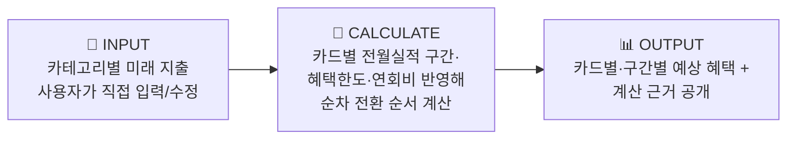
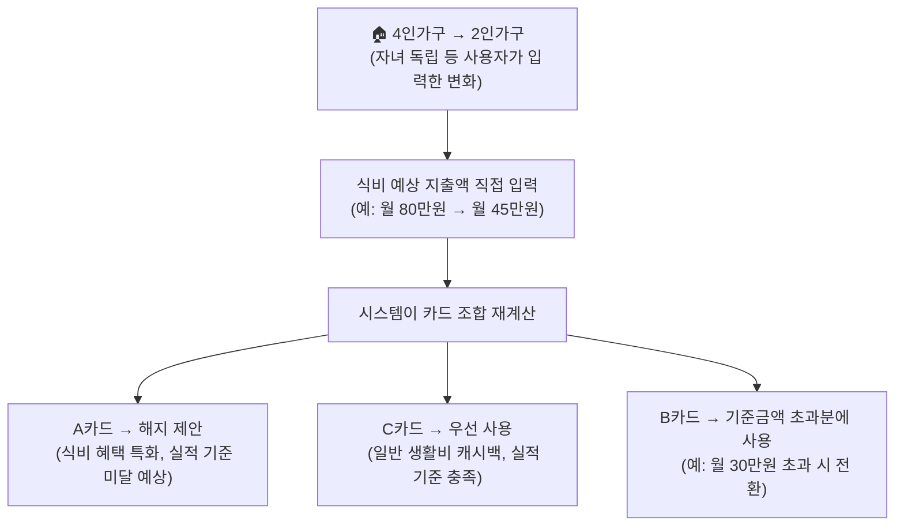
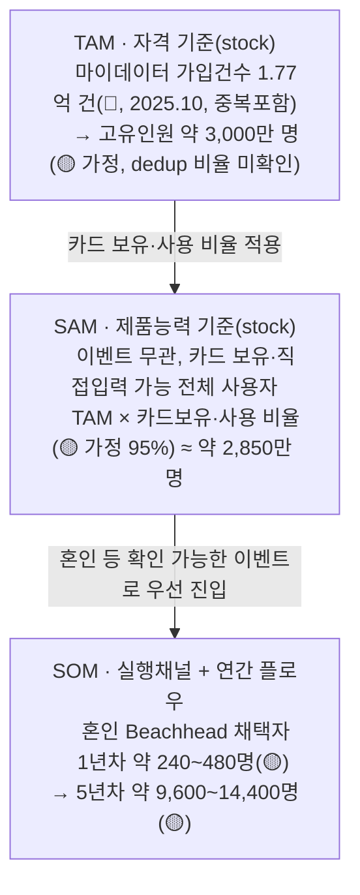

# 미래지출 결제설계 서비스 — 팀 논의용 쟁점 정리

> 개인 아이디어로 시작해 팀 최종후보(2026-08-14 Decision Log)로 채택된 "미래지출 결제설계 서비스"를 팀 프로젝트로 넘기면서, 아직 결정되지 않은 지점들을 정리한 문서입니다. 결론이 아니라 **논의를 위한 판단 초안**이며, 팀 합의 후 결과는 `decision-log/decision-log.md`에 새 행으로 기록해 주세요.
>
> 근거 구분은 `방법론.md`의 Fact/Inference/Assumption 표기를 그대로 씁니다 — 🔵 Fact(재확인 가능한 사실) · ⚪ Inference(복수 근거 기반 추론) · 🟡 Assumption(미확인 가정, 검증 필요).

---

## 1. 서비스 한눈에 보기

**한 줄 정의**: 사용자가 직접 입력한 미래 소비 변화를 바탕으로, 보유·신규 카드의 혜택 조건을 계산해 실행 가능한 결제 조합(Payment Plan)을 설계해주는 서비스.

**구체 예시** (F-03 워크스루 — 카테고리 지출 변화 → 카드 리밸런싱):

| 항목 | 현재 정의 |
| --- | --- |
| Beachhead(초기 타겟) | 신혼·입주 등 1~3개월 내 고액구매 예정 카드 사용자 |
| 핵심 문제 | 경쟁사 6곳 중 "실행설계·미래소비반영·근거공개"를 동시에 만족하는 곳 없음 |
| MVP 핵심기능 | F-01 미래지출 입력 · F-02 보유카드/제약조건 입력 · F-03 시나리오 계산 · F-04 신규카드 포함/미포함 비교 · F-05 결제수단 배분 설계 · F-06 계산 근거 공개 |
| MVP Out-of-Scope | 실제 마이데이터 연동, 카드 자동발급, 자동결제, 대출·BNPL |

---

## 2. 근거 자료 (검증된 시장 데이터)

| 지표 | 수치 | 구분 | 출처 |
| --- | --- | --- | --- |
| 마이데이터 가입 건수 | 1억 7,734만 건 (2025.10, 중복포함) · 고유인원 약 3,000만 명 추정 | 🔵 Fact / ⚪ Inference(고유인원 환산) | 마이데이터·카드시장 리서치 |
| 개인 신용카드 국내 사용액 | 월 50조원+ (2025.01) | 🔵 Fact | 동 리서치 |
| 뱅크샐러드 카드추천 이용자 | 약 130만 명 | 🔵 Fact | 동 리서치 |
| 카드고릴라 2026 트렌드 키워드 | "PIVOT" — 생활비 카드 + 특화 카드 병행 사용(카드조합 전략) 확산 | 🔵 Fact | 카드고릴라 2026 트렌드 발표 |
| 혼인 관련 1인당 카드결제 대상 지출 | 1,473 ~ 2,203만원 | 🔵 Fact | 경쟁사·시장 공개자료(E-03~E-06) |

### 경쟁사 비교 (실행설계 · 미래소비반영 · 근거공개)

| 기업 | 실행 설계 | 미래 소비 반영 | 근거 공개 |
| --- | :---: | :---: | :---: |
| 뱅크샐러드 | ✗ | ✗ | ◐ |
| 카드고릴라 | ✗ | ✗ | ✗ |
| 더쎈카드 † | ✔ | ✗ | ？ |
| 토스 | ✗ | ✗ | ✗ |
| Credit Karma | ✗ | ✗ | ✗ |
| NerdWallet | ✗ | ✗ | ◐ |

† 더쎈카드는 2023년 미래 소비항목 반영 기능을 제공했으나 2026년 사업보고서에 서비스 종료가 기재되어 있음(실패 원인 미확정) — **6개 기업 중 세 조건을 동시에 만족하는 곳은 없음**이 이 서비스의 존재 근거.

---

## 3. 아직 결정 안 된 4가지 쟁점

### 쟁점 1 — 마이데이터 사업자 vs 마이데이터 활용 서비스

| | 내용 |
| --- | --- |
| 질문 | 우리가 마이데이터 사업자(직접 인가)가 될지, 뱅크샐러드·토스처럼 마이데이터를 "활용"하는 입장일지 |
| 확인된 사실 🔵 | 뱅크샐러드·토스 모두 실제로는 금융위 마이데이터(본인신용정보관리업) 인가를 **직접 보유**한 사업자임. 특히 토스는 은행·증권·PG업까지 겸영하는 대형 금융그룹이라 "가벼운 제3자 서비스" 비유 대상으로 적절하지 않음 |
| 판단 | MVP 단계에서는 라이선스 취득도, 제휴도 필요 없이 **사용자 직접 입력 방식**으로 시작 (이미 피치덱 MVP 스코프와 일치) |
| 향후 검증과제 🟡 | 서비스 확장 시 (a) 직접 마이데이터 인가 취득 또는 (b) 기존 인가 사업자와 제휴, 두 경로 중 선택 — 지금 결정할 필요 없음 |

### 쟁점 2 — 이벤트 종류 무관, 사용자 직접 입력

| | 내용 |
| --- | --- |
| 질문 | "혼인"처럼 특정 생애 이벤트를 전제할지, 이벤트 종류와 무관하게 사용자가 소비 변화를 직접 입력하게 할지 |
| 판단 | **이벤트 비종속**으로 확정. 혼인·이사·자녀독립 등은 "이 서비스가 왜 필요한가"를 설명하는 예시일 뿐, 실제 기능은 카테고리별 지출 변화값 입력만 받으면 됨 |
| 근거 | 원칙 2(기능 외형이 아니라 메커니즘)에 부합 — 어떤 이벤트인지가 아니라 입력된 변화값이 계산의 핵심 |
| 유의점 ⚠️ | 제품 로직(이벤트 비종속)과 Beachhead(초기 타겟, 이벤트 특정)를 **분리해서 관리**해야 함 — 마케팅·초기 검증 타겟은 여전히 혼인 등 구체적 이벤트로 좁히는 것이 유리 |

### 쟁점 3 — TAM-SAM-SOM 시장 세그먼트 (2026-08-18 재분석·확정)

> 기존 "투트랙 구조"(SAM=이벤트로 좁힘, SOM=이벤트 무관 확장)는 SAM보다 SOM이 더 넓어지는 역전 구조라 표준 TAM⊇SAM⊇SOM 포함관계와 맞지 않았습니다. 아래는 세 층의 역할을 **"누가(TAM, 자격) → 뭘로(SAM, 제품능력) → 언제·어디서(SOM, 실행채널+연간 플로우)"**로 재정의해 포함관계를 바로잡은 버전입니다. 표기: 🔵 Fact(확인) · ⚪ Inference(추정) · 🟡 Assumption(가정) — `방법론.md` 8장 기준.

**구조도**

**세 층의 정의**

| 층 | 정의 | 값 | 상태 |
| --- | --- | --- | --- |
| TAM | 핵심 JTBD("미래 소비 변화에 맞춰 카드 결제조합을 설계하고 싶다")를 가질 자격이 있는 전체 인구 | 마이데이터 가입건수 1.77억 건 → 고유인원 약 3,000만 명 | 🔵 확인(가입건수) / 🟡 가정(고유인원) |
| SAM | TAM 중 이 서비스가 **직접입력 방식으로, 이벤트 종류와 무관하게** 실제 기능을 제공할 수 있는 범위 — 쟁점 1·2 판단(마이데이터 연동·카드사 제휴 불필요)에 따라 카드 보유·사용 여부만 필터로 적용 | TAM × 카드보유·사용 비율(가정 95%) ≈ 약 2,850만 명 | 🟡 가정(95%는 마이데이터 이용 목적 자체가 카드·계좌 통합관리라는 추론) |
| SOM | SAM 중 **초기 유통채널로 실제 확보할 Beachhead** — 신혼·입주 등 1~3개월 내 고액구매 예정 카드 사용자(피치덱 Beachhead 정의와 일치). 여기서 처음으로 연간(flow) 시간축이 들어감 | 혼인 연간 발생 약 48만 명(240,326건×2, ⚪ 추정) 중 1년차 채택률 0.05~0.1%→약 240~480명, 5년차 2~3%→약 9,600~14,400명 | 🟡 가정(채택률은 근거 없는 초기 placeholder — 검증 전 확정치처럼 사용 금지) |

**핵심 변경점**: 기존 "SAM=좁음(이벤트), SOM=넓음(이벤트 무관)" 역전 구조를 "SAM=넓음(이벤트 무관, 제품이 기능적으로 서비스 가능한 전체), SOM=좁음(혼인 Beachhead, 연간 플로우)"으로 바로잡았습니다. **이벤트 무관 확장은 SAM 자체가 이미 갖고 있던 성격**이므로, "SOM(혼인)에서 시작해 SAM 전체(모든 생애이벤트+이벤트 무관 직접입력)로 자연 확장"이라는 로드맵 서술이 표준 포함관계(SOM⊂SAM⊂TAM)와 충돌 없이 유지됩니다. 쟁점 2(이벤트 비종속 제품 로직)의 결론은 그대로 살아있습니다 — 바뀐 것은 SAM·SOM의 크기 관계뿐입니다.

**Segment Map — Beachhead 우선순위** (SAM 내부를 Trigger 감지가능성 × 1인당 지출강도로 나눈 사분면)

| 세그먼트 | Trigger 감지가능성 | 1인당 지출강도 | 우선순위 |
| --- | --- | --- | --- |
| Q1. 혼인 | 높음(웨딩업체 신호로 감지 용이) | 최고 — 카드결제 대상 지출 1,473만원(확실)~2,203만원(조건부 포함), 🔵 E-03~E-06 | **1차 표적(SOM)** |
| Q2. 입주(이사) | 낮음(부동산 중개 파편화) | 🟠 확인 안 됨 | 2차 — 강도 데이터 확보 시 Q1 능가 가능, 리서치 우선순위 1위 |
| Q3. 해외여행(일반) | 낮음(OTA 제휴 필요) | 낮음(1건당 약 102만원) | 대상 아님 — 단, 신혼여행(1,030만원, 일반 해외여행의 약 10배)은 Q1에 포함되는 고강도 항목 |
| Q4. 카드 갱신 일반군 | 매우 높음(카드사 자체 데이터) | 낮음(무차별 대상) | 대상 아님 — 세그먼트가 아니라 향후 채널 후보 |

> ⚠️ Q1~Q4는 사건의 전체 목록이 아니라 이번 리서치로 데이터를 확보할 수 있었던 사건일 뿐입니다. 자녀 입학·유학·출산·은퇴 등도 같은 JTBD를 발생시키며, 특히 유학·은퇴처럼 소비가 감소하는 사건은 지출 방향이 반대라 별도 설계가 필요합니다(쟁점 2의 "이벤트 비종속" 판단과 연결 — 혼인은 "먼저 이길 시장"이지 서비스의 전부가 아닙니다).

**혼인(Q1) 지출강도 근거**: 결혼비용 총계 5,912만원(주택자금 제외, 🔵 듀오 2026) 중 카드결제 확실 항목(신혼여행 1,030만원+혼수 1,445만원+웨딩패키지 471만원=2,946만원, 1인당 1,473만원)과 조건부 포함 시(+예식홀 1,460만원, 1인당 2,203만원)로 구분. 예단·예물(1인당 675.5만원)은 현금 관행이 강해 카드결제 대상에서 제외.

**판단**: 제품 로직(F-01~F-06)은 이벤트 비종속으로 유지하되(쟁점 2), TAM-SAM-SOM 슬라이드에서는 위 표준 포함관계를 사용 — SAM(약 2,850만 명, 이벤트 무관 전체)이 "천장"이고, SOM(혼인 Beachhead)이 초기 진입점입니다. Master Deck에는 SOM→SAM 확장 로드맵으로 서술.

**한계 및 검증 필요 항목**:
- TAM 고유인원(3,000만 명)은 dedup 비율 미확인 가정 — 금융위원회·신용정보원 1차 통계로 재검증 필요
- SAM의 카드보유·사용 비율(95%)은 실측치 아님
- SOM 채택률(0.05~3%)은 근거 없는 placeholder — 검증 전 Master Deck에 확정치처럼 제시 금지
- 입주(Q2) 세그먼트의 1인당 지출강도 데이터 미확보 — Q1을 능가할 가능성이 있어 우선 리서치 대상
- 혼인 지출 항목별 실제 카드결제 비율(🟡 표기 항목)은 관행 추론이며 1차 통계 미확인

> 참고: 위 구조·수치는 개인 초안 자료([jennie-brain/idea 저장소](https://github.com/jennie-brain/idea) `Industry and Business Analysis/04_TAM-SAM-SOM_마켓세그먼트`)의 확인(🔵)·추정(⚪) 표기 항목만 선별해 재구성했습니다. 해당 초안의 사업모델 가정(카드사 제휴 기반 리드매칭, 제휴 카드사 점유율 15% 등)은 쟁점 1의 팀 결정(MVP는 마이데이터 연동·카드사 제휴 없이 사용자 직접입력)과 맞지 않아 제외했습니다.

### 쟁점 4 — 리밸런싱: 신규카드 제안 vs 기존카드 활용

| | 내용 |
| --- | --- |
| 질문 | 카드 조합을 다시 짤 때 신규카드를 제안할지, 기존 보유카드만으로 재배치할지 |
| 판단 | **이미 F-04(신규카드 포함/미포함 시나리오 비교)에 정의되어 있음** — 둘 다 계산해서 나란히 제시하고 사용자가 선택하게 하면 됨. 새로 정할 필요 없이 기존 스펙대로 진행 |
| 유의점 ⚠️ | Guardrail G-04(불필요한 신규카드 추천 방지)와 충돌하지 않도록, "포함 시 이만큼 이득 / 미포함 시 이만큼"이라는 근거를 투명하게 공개하는 것이 안전장치 — 차별점 C(검증 가능한 계산)와도 연결됨 |

---

## 4. 다음 액션

- [ ] 팀 회의에서 쟁점 1~4 순서로 논의
- [ ] 합의된 내용은 `decision-log/decision-log.md`에 새 행으로 기록 (기존 행 수정 금지, 표 맨 아래 추가)
- [ ] 쟁점 3(TAM-SAM-SOM 재분석)은 08.18 확정 완료 — Master Deck·Workbook에 반영
- [ ] 확정된 스코프를 `방법론.md`의 메커니즘 전이 분석표 양식으로 옮겨, 교차산업 벤치마킹(대환대출·통신 요금제 자동전환·전력 시간대 요금 최적화 등) 근거 보강 작업 착수
