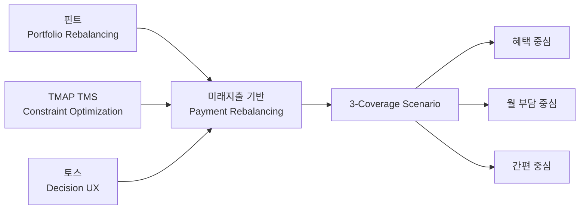
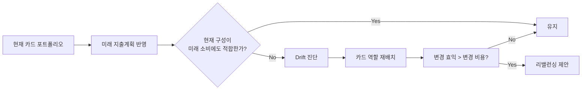
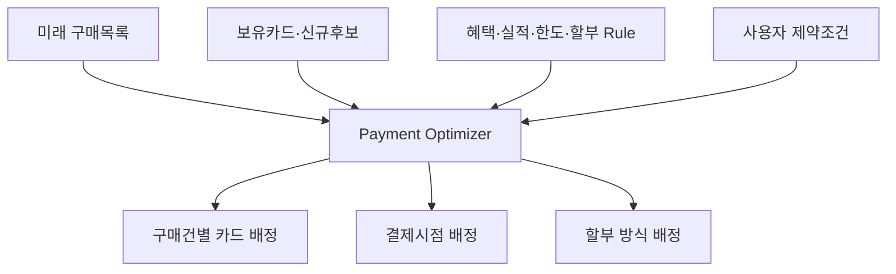
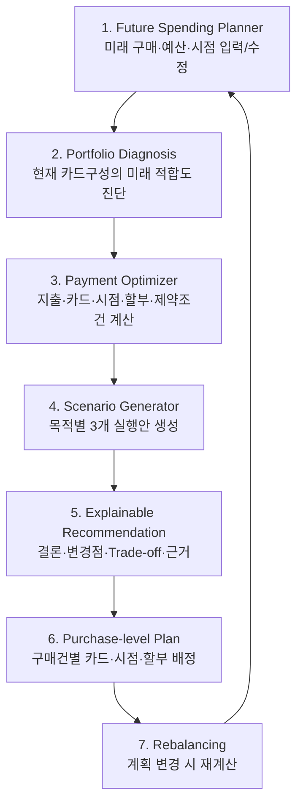

# 미래지출 기반 카드·결제 리밸런싱 서비스
## 역기획 벤치마킹 및 제품 메커니즘 설계 보고서

> **Benchmark:** 핀트(Fint) × TMAP TMS × 토스(Toss)  
> **문서 목적:** 미래지출 기반 결제설계 서비스의 핵심 작동원리와 벤치마킹 포인트를 구조화하고, MVP·UX·검증과제로 연결한다.  
> **작성 기준일:** 2026-08-19

---

## Summary

### 결론

선정한 **핀트–TMAP TMS–토스** 조합은 적절하다. 세 서비스가 서로 다른 문제를 해결하기 때문에 벤치마킹 포인트가 겹치지 않고, 하나의 제품 메커니즘으로 연결할 수 있다.

- **핀트:** 현재 상태와 목표 상태의 차이를 감지하고 포트폴리오를 다시 구성하는 **리밸런싱 원리**
- **TMAP TMS:** 다수의 대상과 제약조건을 동시에 고려해 최적 배분안을 만드는 **최적화 원리**
- **토스:** 복잡한 금융 의사결정 결과를 사용자가 빠르게 이해하고 선택할 수 있게 만드는 **의사결정 UX 원리**

이를 결합하면 서비스의 핵심 구조는 다음과 같이 정의할 수 있다.

> **미래 지출 변화를 반영해 현재 카드 포트폴리오의 비효율을 진단하고, 여러 제약조건 아래에서 결제수단·결제시점·할부를 재배분한 뒤, 서로 다른 목적을 가진 복수의 실행안을 사용자가 비교·선택할 수 있게 한다.**

### 핵심 서비스 가치 가설: 3가지 Coverage

현재 단계에서는 사용자가 하나의 ‘정답’보다 **서로 다른 목적을 가진 실행 가능한 대안**을 비교할 수 있도록 세 가지 안을 제공하는 방향이 유효하다.

| Coverage | 최적화 목표 | 사용자에게 주는 가치 |
|---|---|---|
| **혜택 중심** | 순혜택 최대화 | 할인·캐시백·포인트 등 경제적 효익을 최대화 |
| **월 부담 중심** | 현금흐름 안정화 | 구매시점·할부를 조정해 월별 카드대금 부담을 관리 |
| **간편 중심** | 실행 복잡도 최소화 | 신규카드·사용카드 수와 실적관리 부담을 최소화 |

> **주의:** 위 3개 축은 현재의 **제품 가설**이다. Persona/JTBD 조사에서 실제 사용자가 중요하게 비교하는 Trade-off를 검증한 뒤 확정해야 한다.

---

# 1. 역기획의 목적과 분석 원칙

이번 역기획은 기능을 복제하기 위한 벤치마킹이 아니다. 서로 다른 산업에서 이미 검증된 **작동원리(Mechanism)**를 추출해 미래지출 기반 결제설계 문제에 번역하는 것이 목적이다.

### Evidence Discipline

- **FACT:** 각 벤치마크 서비스가 공식적으로 제공한다고 확인되는 기능·원리
- **DESIGN TRANSLATION:** 해당 원리를 카드·결제설계 문제에 적용한 설계안
- **HYPOTHESIS:** 아직 사용자 검증이 필요한 가치·우선순위·시나리오

이 구분을 유지해야 “벤치마크 서비스가 성공했으니 우리 서비스도 성공한다”는 잘못된 추론을 피할 수 있다.

---

# 2. 벤치마킹 구조



| Benchmark | 검증된 원리 | 우리 서비스에 가져올 포인트 | 결과물 |
|---|---|---|---|
| **핀트** | 포트폴리오 구성·리밸런싱 | 미래지출 변화에 따라 기존 카드 역할을 재평가 | Card Portfolio Rebalancing |
| **TMAP TMS** | 다중 배송지·차량·시간·거리 등 제약을 고려한 최적화 | 다중 지출·카드·시점·할부 조건의 동시 배분 | Payment Allocation Engine |
| **토스** | 일관된 디자인 시스템과 간결한 UX Writing | 복잡한 결과를 결론→변경점→근거 순으로 단계적 제공 | Decision UX / Explainability |
| **우리의 설계 가설** | Multi-objective Scenario | 하나의 최적답이 아닌 목적별 실행안 제공 | 3-Coverage Scenario Generator |

---

# 3. Benchmark 01 — 핀트: Card Portfolio Rebalancing

## 3.1 확인된 작동원리 [FACT]

핀트 공식 자료에 따르면 AI 투자 서비스는 투자전략·투자성향·시장상황 등을 바탕으로 포트폴리오를 구성·추천하고, 필요 시 리밸런싱을 수행한다. 일임형은 엔진이 자동으로 매매하고, 자문형은 리밸런싱 리포트를 제시한 뒤 고객 요청에 따라 실행한다. 또한 리밸런싱 효익이 거래비용보다 작다고 판단되면 매매를 미룰 수 있다고 설명한다.[^1]

핵심은 **변화가 발생할 때마다 무조건 행동하는 것이 아니라, 현재 상태와 목표 상태의 차이와 변경 비용을 함께 판단한다는 점**이다.

## 3.2 카드 서비스로의 번역 [DESIGN TRANSLATION]



### 벤치마킹 포인트

1. **Current vs Target 비교**  
   현재 카드구성과 미래지출을 반영한 목표구성을 한 화면에서 비교한다.

2. **Rebalancing Trigger**  
   지출계획의 변화가 일정 수준 이상일 때 재설계를 제안한다. 모든 변화에 반응하지 않는다.

3. **Net Benefit 관점**  
   신규카드의 예상혜택만 보지 않고 연회비·실적부담·관리복잡도·할부비용 등을 차감한 순효익을 본다.

4. **Human-in-the-loop 실행**  
   시스템이 안을 계산하되, 사용자가 선택·수정·확정할 수 있어야 한다.

## 3.3 제품 요구사항으로 변환

| 요구사항 | 설명 |
|---|---|
| 카드 포트폴리오 진단 | 보유카드별 현재 역할과 미래지출 적합도를 계산 |
| Drift 설명 | 어떤 미래지출 때문에 현재 구성이 비효율적인지 설명 |
| 변경비용 계산 | 연회비·실적·카드 수·할부비용 등 반영 |
| 유지 옵션 | 변경 효익이 작으면 ‘현재 카드 유지’도 정식 결과로 제시 |

---

# 4. Benchmark 02 — TMAP TMS: Payment Allocation Optimization

## 4.1 확인된 작동원리 [FACT]

TMAP은 경로최적화 서비스에서 다중 경유지의 방문순서와 경로를 최적화하고, TMS API에서는 여러 차량과 배송지를 대상으로 배송거리·화물량·배송시간 등을 최적화해 배차정보, 도착예정시간, 운행경로·시간·거리 등을 제공한다고 설명한다.[^2]

핵심은 **하나의 대상을 추천하는 것이 아니라, 여러 대상과 여러 제약조건을 동시에 계산해 전체 배분계획을 만드는 것**이다.

## 4.2 카드 서비스로의 번역 [DESIGN TRANSLATION]

| TMAP TMS | 결제설계 서비스 |
|---|---|
| 배송지 | 미래 구매건 |
| 차량 | 보유카드·신규카드 후보 |
| 배송시간 | 결제 예정시점 |
| 적재량·운행 제약 | 전월실적·혜택한도·연회비·할부조건·월 예산 |
| 배차 | 구매건별 카드 배정 |
| 재배차 | 예산·시점 변경 시 전체 결제계획 재계산 |



### 벤치마킹 포인트

1. **Multi-object Optimization**  
   카드 한 장씩 추천하지 않고 전체 구매목록을 동시에 계산한다.

2. **Constraint-aware Optimization**  
   사용자가 직접 “신규카드 최대 1장”, “월 카드대금 상한”, “할부 최대 개월”, “특정 카드 제외” 같은 조건을 설정할 수 있어야 한다.

3. **Allocation 결과**  
   최종 결과는 카드 리스트가 아니라 **구매건 × 카드 × 시점 × 할부**의 실행계획이어야 한다.

4. **Re-routing / Re-optimization**  
   구매금액·구매시점·예산이 바뀌면 전체 계획을 다시 계산한다.

---

# 5. Benchmark 03 — 토스: Decision UX & Explainability

## 5.1 확인된 작동원리 [FACT]

토스는 TDS(Toss Design System)를 공통 디자인 언어로 활용해 일관된 제품 경험을 제공한다고 설명한다. 공식 UX Writing 가이드에서는 해요체, 능동형 문장, 긍정적 표현을 기본 원칙으로 제시하고 있으며, 그래픽은 장식보다 이해를 돕는 역할에 집중하도록 안내한다.[^3]

핵심은 **정보를 많이 보여주는 것이 아니라, 사용자가 지금 결정해야 할 내용을 쉽게 이해하게 만드는 것**이다.

## 5.2 카드 서비스로의 번역 [DESIGN TRANSLATION]

### 결과 정보 계층

1. **결론** — 어떤 안이 무엇을 최적화하는가
2. **핵심 변화** — 카드 추가·제외, 결제시점 변경, 할부 변경
3. **Trade-off** — 혜택, 월 부담, 관리복잡도 사이의 차이
4. **근거** — 카드 혜택조건, 한도, 실적, 계산 기준
5. **상세 Rule** — 데이터 기준일·예외조건·불확실성

### UX 원칙

- **Result First:** 첫 화면에서 결론을 먼저 제시
- **Progressive Disclosure:** 상세 계산은 단계적으로 펼쳐보기
- **Compare, Don’t Decode:** 사용자가 계산식을 해석하지 않아도 안별 차이를 비교 가능하게 설계
- **Explain the Change:** “왜 바뀌었는지”를 미래지출 항목과 연결
- **User Control:** 사용자 제약조건을 언제든 수정하고 즉시 재계산
- **Evidence Link:** 혜택 Rule의 근거·기준일을 확인할 수 있게 설계

---

# 6. 핵심 서비스 메커니즘



### 핵심 제품 정의

> **Future Spending 기반 Multi-objective Payment Rebalancing**  
> 미래 소비계획과 카드 Rule을 함께 계산해 현재 카드 포트폴리오를 재설계하고, 서로 다른 목적을 가진 복수의 결제 시나리오를 제시하는 의사결정 지원 서비스.

---

# 7. 3-Coverage Scenario 설계

## 7.1 Coverage A — 혜택 중심

**사용자 질문:** “가능한 범위에서 가장 많이 아끼려면 어떻게 결제해야 하지?”

- **목표:** 예상 순혜택 최대화
- **주요 변수:** 할인·캐시백·포인트·신규발급 혜택·연회비·할부비용
- **허용 가능한 Trade-off:** 카드 수 증가, 실적관리 복잡도 증가
- **결과 형태:** 최대 순혜택 / 필요한 카드 변경 / 구매건별 배정

## 7.2 Coverage B — 월 부담 중심

**사용자 질문:** “한 번에 돈이 너무 많이 나가지 않게 결제하고 싶어.”

- **목표:** 월별 카드대금 변동성과 최대 부담 최소화
- **주요 변수:** 결제시점·무이자/유이자 할부·월 예산·고정지출
- **허용 가능한 Trade-off:** 일부 혜택 감소
- **결과 형태:** 월별 결제계획 / 최대 월 부담 / 할부·시점 조정내역

## 7.3 Coverage C — 간편 중심

**사용자 질문:** “조금 덜 아껴도 복잡하게 관리하고 싶지는 않아.”

- **목표:** 신규카드·사용카드 수·실적관리 최소화
- **주요 변수:** 기존 카드 활용도·추가발급 여부·카드별 역할 단순화
- **허용 가능한 Trade-off:** 최대 혜택 일부 포기
- **결과 형태:** 필요한 최소 카드 수 / 신규발급 여부 / 단순 결제계획

### 3개 안의 비교 원칙

| 비교축 | 혜택 중심 | 월 부담 중심 | 간편 중심 |
|---|---|---|---|
| 경제적 혜택 | 가장 중요 | 중요 | 보조 |
| 월 현금흐름 | 보조 | 가장 중요 | 중요 |
| 신규카드 허용 | 상대적으로 높음 | 중간 | 낮음 |
| 카드 관리 복잡도 | 높아질 수 있음 | 중간 | 최소화 |
| 주요 사용자 가치 | 절약 | 안정 | 편의 |

> **설계 원칙:** 세 안은 단순히 이름만 다른 결과가 아니라 **목적함수와 제약조건이 실제로 다른 시나리오**여야 한다.

---

# 8. 추천 UI 정보구조

## 8.1 첫 화면 — 3안 비교

```text
┌────────────────────────────────────────────┐
│ 나에게 맞는 결제계획 3가지                │
├──────────────┬──────────────┬──────────────┤
│ 혜택 중심    │ 월 부담 중심 │ 간편 중심    │
│ 순혜택 최대  │ 월 부담 안정 │ 관리 최소    │
│ 카드 변경 ↑  │ 할부/시점 조정│ 신규카드 ↓   │
└──────────────┴──────────────┴──────────────┘
```

각 안에서 사용자가 즉시 확인해야 할 정보는 4개 이내로 제한한다.

- 핵심 결과
- 필요한 변경
- 가장 큰 장점
- 가장 큰 Trade-off

## 8.2 상세 화면 — 구매건별 실행계획

| 구매 예정 | 추천 카드 | 결제시점 | 결제방식 | 추천 이유 |
|---|---|---|---|---|
| 냉장고 | 카드 C | 9월 | 일시불 | 가전 혜택·한도 활용 |
| 세탁기 | 카드 C | 9월 | 3개월 | 월 부담 조정 |
| 침대 | 기존 B | 10월 | 일시불 | 기존 혜택 활용 |

> 위 표는 화면구조 예시이며 실제 카드·혜택 값이 아니다.

---

# 9. MVP 권고 범위

### P0 — 반드시 구현

- 미래 지출항목·예산·구매시점 직접 입력/수정
- 보유카드 및 지원 카드 Rule 입력/조회
- 사용자 제약조건 설정
- 구매건별 결제 배분
- 3개 Coverage 결과 생성
- Current vs Proposed 비교
- 결과 근거·Rule 기준일 표시
- 입력값 변경 시 재계산

### P1 — 검증 후 확장

- 마이데이터 기반 보유카드·과거 소비 자동 연결
- 실시간 카드 프로모션/가맹점 혜택 연동
- 배우자·가구 단위 공동 카드 포트폴리오
- 구매예정 상품 가격·프로모션 모니터링
- 신규카드 발급 연결

### MVP에서 의도적으로 제외할 것

- 모든 카드·가맹점의 실시간 완전 커버리지
- 완전 자동 카드 발급·해지
- 사용자의 선택 없이 결제를 자동 실행하는 기능

---

# 10. 검증해야 할 핵심 가설

| ID | 가설 | 검증 질문 |
|---|---|---|
| H1 | 미래지출 변화는 기존 카드구성을 다시 검토하게 만드는 충분한 Trigger다 | 신혼·이사 등에서 실제로 카드 조합을 다시 찾는가? |
| H2 | 사용자는 하나의 추천보다 2~3개의 목적별 대안을 선호한다 | 복수 시나리오가 선택을 돕는가, 오히려 피로를 만드는가? |
| H3 | 혜택·월 부담·간편성이 주요 Trade-off다 | 실제 사용자가 가장 중요하게 비교하는 기준은 무엇인가? |
| H4 | 구매건별 배정이 단순 카드 추천보다 실행가치를 높인다 | 사용자는 추천카드보다 결제계획표를 더 유용하게 느끼는가? |
| H5 | 사용자는 미래지출 정보를 충분히 입력할 의향이 있다 | 어느 수준의 입력부터 이탈하는가? |
| H6 | 근거와 기준일 제시는 추천 신뢰를 높인다 | 상세근거가 실제 선택·실행률을 높이는가? |

---

# 11. 주요 리스크와 가드레일

### 11.1 Rule Freshness Risk
카드 혜택·전월실적·한도·프로모션은 변경될 수 있다. 추천값보다 **Rule의 최신성·출처·적용조건**을 관리하는 역량이 중요하다.

### 11.2 Optimization ≠ User Preference
수학적으로 가장 높은 순혜택이 사용자의 실제 최선일 수 없다. 그래서 목적별 시나리오와 사용자 제약조건이 필요하다.

### 11.3 Scenario Overload
선택지를 늘리는 것이 항상 좋은 UX는 아니다. 3개 Coverage는 검증 전 가설이며, 선택 피로가 확인되면 기본 추천 1개 + 대안 2개 구조로 조정한다.

### 11.4 Analogy Risk
핀트와 TMAP TMS는 직접 경쟁 서비스가 아니다. 이들의 성공을 시장성 근거로 사용할 수 없으며, **작동원리와 UX 메커니즘만 벤치마킹**해야 한다.

---

# 12. 최종 권고

세 벤치마크는 다음과 같이 역할을 고정하는 것이 좋다.

> **핀트에서 ‘언제 다시 구성해야 하는가’를 배운다.**  
> **TMAP TMS에서 ‘여러 조건을 어떻게 동시에 최적화하는가’를 배운다.**  
> **토스에서 ‘복잡한 결과를 어떻게 선택 가능한 의사결정으로 바꾸는가’를 배운다.**

이 조합으로 만들어야 할 독자적인 제품가치는 **카드 추천 정확도**가 아니라 다음이다.

> ### 미래 소비계획이 바뀌면 결제 포트폴리오도 함께 재설계되고, 사용자는 자신의 목적에 맞는 실행 가능한 결제안 중에서 선택할 수 있다.

## Insight

가장 중요한 제품 차별화 후보는 **“Recommendation”이 아니라 “Rebalancing + Allocation + Scenario Choice”**다.  
즉, 어떤 카드가 좋은지를 알려주는 서비스에서 끝나지 않고 **미래에 예정된 여러 지출을 어떤 카드로, 언제, 어떤 방식으로 결제할지 전체 계획을 다시 짜주는 서비스**로 정의해야 벤치마킹 조합이 실제 제품구조로 연결된다.

---

# References

[^1]: 핀트(Fint), AI 투자 상품/고객지원. 포트폴리오 구성·리밸런싱, 자문/일임 방식, 리밸런싱 효익과 거래비용 관련 설명.  
  - https://www.fint.co.kr/products?tab=ai  
  - https://www.fint.co.kr/support

[^2]: TMAP Mobility, 경로최적화 및 TMS API 공식 소개. 다중 경유지 최적화, 다차량·배송지 배차, 배송거리·화물량·배송시간 기반 최적화 설명.  
  - https://www.tmapmobility.com/support/data/route/about  
  - https://www.tmapmobility.com/service/corporate/api

[^3]: 토스, Toss Design System(TDS) 및 UX Writing 공식 가이드. 일관된 디자인 언어, 해요체·능동형·긍정형 표현, 그래픽 사용원칙.  
  - https://developers-apps-in-toss.toss.im/design/components.html  
  - https://developers-apps-in-toss.toss.im/design/ux-writing.html  
  - https://developers-apps-in-toss.toss.im/design/consumer-ux-guide.html
