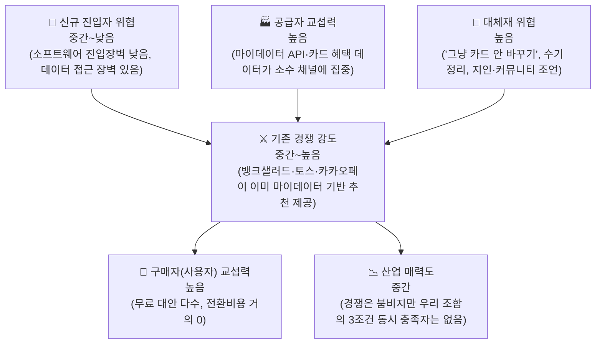

# 01. Porter's Five Forces 분석 — 미래지출 결제설계 서비스

> **서비스 정의 (고정, 이 문서 어떤 항목도 이 정의를 벗어나지 않음)**: 마이데이터로 확보한 과거 소비 기록과 사용자가 직접 입력한 미래 소비 변화(혼인·이사 등)를 함께 반영해, 보유·신규카드의 실적 구간·혜택한도·연회비를 계산 근거와 함께 공개하며 실행 가능한 카드 조합 재배치안을 제시하는 서비스.
>
> 방법론: `business-analysis-frameworks/01_Porters_Five_Forces_모델/00_방법론.md`를 따름. TAM=마이데이터 이용자(확정, `0818_쟁점정리.md` 쟁점 1·3 참고).
> 표기: 🔵 Fact · ⚪ Inference · 🟡 Assumption · 🟠 미확인 — `방법론.md` 8장 기준.
> 분석 대상 산업: **마이데이터 기반 미래지출 반영 카드조합 재설계 서비스** — 카드 발급업 자체가 아니라, 그 위에서 계산·추천·재배치를 하는 소프트웨어 레이어.

---

## 0. 구조 한눈에 보기

| 힘 | 강도 | 판단 근거 |
| --- | --- | --- |
| 공급자 교섭력 | **높음** | 카드 이용내역은 마이데이터 API로만 제공(오픈뱅킹 불가, 🔵 금융위 2024.12.30) — 채널이 사실상 하나뿐 |
| 구매자 교섭력 | **높음** | 카드고릴라·토스·카카오페이 등 무료 대안이 이미 존재, 전환비용 거의 없음 |
| 신규 진입 위협 | **중간~낮음** | 계산 엔진 자체는 소프트웨어라 자본 장벽이 낮지만, 마이데이터 데이터 접근이 실질적 장벽 |
| 대체재 위협 | **높음** | "그냥 기존 카드 유지"가 가장 강력한 대체재 — 심리적 관성이 전환비용을 대체함 |
| 기존 경쟁 강도 | **중간~높음** | MAU·발급연계 기반의 경쟁자가 이미 존재하나, 우리가 겨냥한 3조건(실행설계·미래소비반영·근거공개) 동시 충족자는 없음(🔵 `0818_1페이지 브리프.md` 2절 비교표) |

---

## 1. 공급자의 힘 — 마이데이터·카드 데이터 채널에 종속

**강해지는 조건에 해당하는 근거**:
- 카드 이용내역(결제내역)은 마이데이터 API로만 제공되고 오픈뱅킹으로는 제공되지 않음(🔵 금융위원회 보도자료 2024.12.30, `국내 신용카드 시장 리서치.md` 5절) — 대체 공급자가 없는 상태
- 마이데이터 본허가 사업자는 69개사뿐이고, 그중 7개사는 API 과금 부담으로 이미 허가를 반납(🔵 스트레이트뉴스 2025) — 채널 자체가 좁고 비용 부담이 실재함을 보여주는 선행사례
- 카드 혜택 Rule(전월실적 구간·통합할인한도·제외 항목)은 카드사별 개별 약관에만 존재하고 공식 통합 API가 없음(🔵 `국내 신용카드 시장 리서치.md` 2절) — 데이터 공급자가 카드사 8개사+겸영은행으로 파편화

**판단**: 공급자(마이데이터 인가/제휴처 + 카드사 약관 데이터) 교섭력이 **높음**. 우리 서비스가 MVP부터 마이데이터 연동을 전제로 하기로 확정(`decision-log/decision-log.md` 2026-08-19)했기 때문에, 이 힘은 이제 회피 대상이 아니라 **직접 관리해야 할 리스크**다 — 직접 인가 취득 vs 기존 인가 사업자 제휴 중 선택이 미해결 상태로 남아 있음(`0818_쟁점정리.md` 쟁점 1).

## 2. 구매자(사용자)의 힘 — 전환비용이 거의 없는 무료 대안 다수

**강해지는 조건에 해당하는 근거**:
- 카드고릴라(15년 누적 방문자 약 8,000만 명, MAU 약 140만), 뱅크샐러드(카드추천 약 130만 명), 토스 카드라운지, 카카오페이가 모두 무료로 카드 추천을 제공(🔵 `국내 신용카드 시장 리서치.md` 3절)
- 사용자가 우리 서비스를 쓰지 않아도 잃는 것이 거의 없음 — 가입비·데이터 이전 비용이 없어 전환비용이 사실상 0

**약해지는 조건(우리가 만들 수 있는 방어선)**:
- 위 경쟁자 중 "미래 소비 변화 반영 + 실행 설계(재배치) + 계산 근거 공개"를 동시에 제공하는 곳은 없음(🔵) — 이 3조건이 실제로 사용자에게 가치가 있다면 전환비용을 대신할 **차별적 가치**가 됨

**판단**: 구매자 힘은 **높음**이지만, 차별점 A·B·C(실행 설계자·과거가 못 보는 소비·검증 가능한 계산)가 실제로 작동해야만 방어가 성립하는 구조 — KSF 3(03 문서)로 연결됨.

## 3. 신규 진입자의 위협 — 소프트웨어 장벽은 낮음, 데이터 장벽은 있음

**약해지는 조건(장벽이 되는 요소)**:
- 마이데이터 신규 참여 6대 허가요건(자본금 최소 5억원, 물적설비·보안, 사업계획 타당성 등, 🟠 2020~2022 기준·최신 개정 확인 필요) — 직접 인가를 딸 경우 진입장벽으로 작동
- 카드 혜택 Rule의 최신성을 유지하려면 8개 카드사+겸영은행 약관을 지속 추적해야 함 — 후발주자가 따라오려면 동일한 데이터 운영 비용을 감당해야 함

**강해지는 조건(장벽이 낮은 요소)**:
- 계산 엔진(F-01~F-06) 자체는 규칙 기반 소프트웨어로, 특허·독점 기술 요건이 없음(🔵 `방법론.md`식 판단 — 특별한 기술 우위 없음)
- 직접 인가 대신 기존 인가 사업자 제휴로 시작할 수 있어(32시간 스코프 가정, `0818_쟁점정리.md` 쟁점 1) 초기 자본 장벽은 낮출 수 있음

**판단**: 신규 진입 위협은 **중간~낮음**. 우리 자신도 이 낮은 장벽으로 진입하려는 입장이므로, 장기적으로는 후발주자도 같은 경로로 들어올 수 있다는 점을 KSF에서 데이터 운영 역량으로 방어해야 함.

## 4. 대체재의 위협 — "아무것도 안 하기"가 가장 강력한 대체재

**강해지는 조건에 해당하는 근거**:
- 카드 조합을 바꾸는 행위 자체가 실적 재설계·해지 절차 등 마찰을 수반 — 계산상 유리해도 실행하지 않는 것이 합리적 선택이 될 수 있음(🔵 카드 해지 절차 마찰 민원, `국내 신용카드 시장 리서치.md` 1-4-1)
- 카드사가 이미 "단종카드 자동대체"로 재배치를 대신 해주고 있음(🔵 동 자료) — 사용자가 능동적으로 재설계할 필요를 못 느낄 수 있음
- 수기 가계부·지인 추천·커뮤니티(예: 카드고릴라 커뮤니티) 조언도 무료 대체재로 작동

**약해지는 조건**:
- 단종카드 자동대체 이후 "혜택 불일치" 민원이 다수 존재(🔵) — 카드사의 일방적 자동대체에 대한 불만이 이미 있다는 것은, "근거를 보여주는 재배치"라는 우리 차별점(C)이 이 대체재의 약점을 파고들 여지가 있다는 신호

**판단**: 대체재 위협은 **높음**이지만 완전히 고정된 것은 아님 — 차별점 C(계산 근거 투명성)가 대체재 대비 우위를 만들 수 있는지가 검증 가설(`0818_1페이지 브리프.md` 7절 H1~H6급 가설)로 남아 있음.

## 5. 기존 경쟁자 간의 경쟁 강도 — 붐비지만 우리 조합은 비어 있음

**강해지는 조건에 해당하는 근거**:
- 카드고릴라(MAU 140만)·뱅크샐러드(카드추천 130만+2026.05 마이데이터 기반 발급연계 신규 출시)·토스(카드라운지 방문자 11배 증가)·카카오페이(AI 마이데이터 분석 추천) 모두 활발히 경쟁 중(🔵 `국내 신용카드 시장 리서치.md` 3절)
- 카드고릴라·토스·카카오페이·뱅크샐러드 4곳 모두 마이데이터 데이터를 이미 활용 중 — 데이터 접근성 격차가 크지 않음

**약해지는 조건(경쟁 완화 요소)**:
- 6개 경쟁사(뱅크샐러드·카드고릴라·더쎈카드·토스·Credit Karma·NerdWallet) 중 "실행설계·미래소비반영·근거공개" 3조건을 동시 만족하는 곳은 없음(🔵 `0818_1페이지 브리프.md` 2절)
- 유사 기능(미래 소비항목 반영)을 제공했던 더쎈카드는 2023년 출시 후 2026년 서비스 종료(원인 🟠 미확인) — 이 세그먼트에 대한 경쟁자의 확신 있는 성공 사례는 아직 없음

**판단**: 트래픽·회원 기반 경�쟁은 **중간~높음**이지만, 우리가 겨냥한 정확한 문제(미래소비 반영형 실행설계)는 경쟁 공백 상태 — Five Forces 상 "산업 매력도는 중간이나 우리 세그먼트는 상대적으로 매력적"이라는 결론으로 이어짐.

---

## 6. 종합 판단

다섯 힘을 종합하면, 이 산업은 **구매자 힘과 대체재 위협이 강해 사용자 유입·유지가 쉽지 않고, 공급자(마이데이터·카드데이터) 의존도가 높아 운영 비용·리스크가 있는 산업**이다. 다만 **기존 경�자 대부분이 우리가 겨냥한 정확한 조합(미래소비반영+실행설계+근거공개)을 다루지 않는다**는 점이 진입을 정당화하는 핵심 근거다. 이 결론은 03(KSF) 문서에서 "무엇에 집중해야 하는가"로 이어진다.
