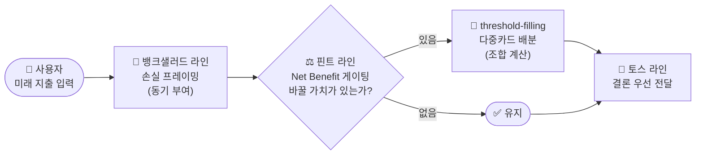
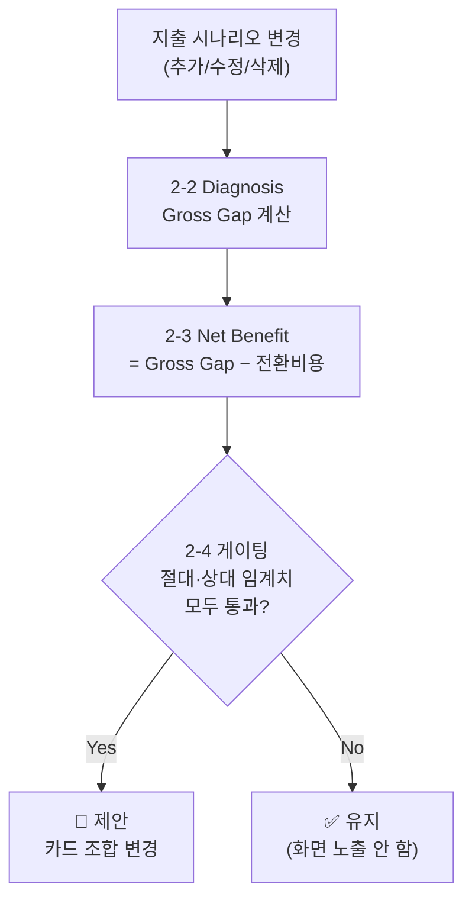
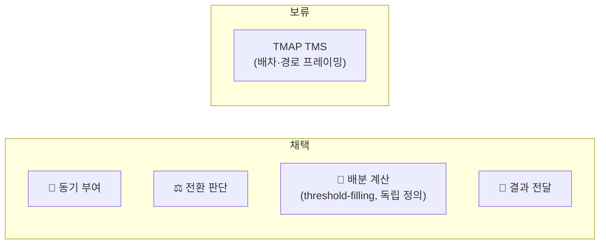

# 메커니즘 전이 분석표 (Mechanism Transfer Analysis)

> 적용 대상 서비스: **마이데이터 기반 미래지출 시나리오 × 카드조합 추천 서비스**
> 분석 대상: 🏦 뱅크샐러드(대체카드 탐색) · ⚖️ 핀트(Portfolio Rebalancing) · 🧩 TMAP TMS(Constraint Optimization) · 💬 토스(Decision UX) — 뒤 3개는 `미래지출_결제리밸런싱_역기획_벤치마킹_보고서.pdf` 기준

---

## 0. 네 메커니즘이 만드는 하나의 흐름



| 레이어 | 벤치마크 | 한 줄 역할 | 상태 |
| --- | --- | --- | :---: |
| 🏦 동기 부여 | 뱅크샐러드 | 지금 카드를 그대로 쓰면 얼마를 놓치는지 보여준다 | ✅ 채택 |
| ⚖️ 전환 판단 | 핀트 | 바꿀 가치가 있을 때만 개입한다 | ✅ 채택·구체화(§2) |
| 🧩 배분 계산 | threshold-filling(독립 정의) | 몇 장을 해지·유지·추가할지 계산한다 | ✅ 채택 |
| 💬 결과 전달 | 토스 | 계산 결과를 결론부터 이해하기 쉽게 보여준다 | ✅ 채택 |

> 네 메커니즘은 서로 다른 지점을 맡아 겹치지 않는다. 뱅크샐러드 없이는 입력 동기가 없고, 핀트 없이는 사소한 변화에도 매번 바꾸라고 해서 피로하며, threshold-filling 없이는 여러 장 조합을 계산할 수 없고, 토스 없이는 계산 결과가 사용자에게 전달되지 않는다.
>
> ⚠️ 배분 계산은 TMAP TMS를 채택한 것이 아니다. TMAP TMS는 §3에서 검토 후 **보류**했고, threshold-filling은 그와 무관하게 독립적으로 정의한 계산 방식이다.

---

## 1. 🏦 뱅크샐러드 — 보유카드 기준 대체카드 탐색·비교

> **핵심 아이디어**: 지금 카드를 계속 쓰면 얼마를 놓치고 있는지 금액으로 보여준다.

**원본에서 확인된 사실**

| 항목 | 내용 |
| --- | --- |
| 기능 | 보유카드 실적·혜택을 마이데이터 소비내역에 대입해 더 높은 예상 혜택을 주는 대체 카드를 탐색·비교(예: "지난달 소비 패턴이면 B카드로 월 12,000원 더 받을 수 있어요") |
| 메커니즘 | 과거 행동 데이터를 기준점으로 고정 → 현재(보유카드)와 대안(대체카드)의 차이를 금액으로 정량화 → 놓치는 기회비용을 가시화 |
| 작동 원리 | 손실 회피 · 기회비용 가시화 · 자기 관련성 · 앵커링(현재 카드가 기준점) |

**우리 서비스로 전이**

| 항목 | 내용 |
| --- | --- |
| 전이 방식 | 과거 대신 **미래 예상 지출**(마이데이터 예측 + 사용자 입력)을 기준으로 카드 조합을 추천 |
| 적용 형태 | 보유 카드조합 vs 최적 조합의 예상 혜택 차액을 손실 프레이밍으로 강조(예: "이 시나리오 기준 +34,000원") → 시나리오 수정 시 실시간 재계산 |

**검증 & 리스크**

| 항목 | 내용 |
| --- | --- |
| 검증 지표 | 시나리오 입력 완료율 · 추천 클릭/전환율 · 재입력 빈도 · 추천 대비 실제 채택률 |
| 리스크 | 미래 예측치는 불확실성이 커 손실 프레이밍 신뢰도가 희석될 수 있음 · 반복 입력 피로 · 제휴 수익모델과 얽히면 "최적"이 왜곡될 수 있음 · 카드 조합은 실행 복잡도가 높아 "보기만 하고 실행 안 함" 갭 |
| 보완 장치 | 예측치 근거 뱃지 표기 · 마이데이터 추정치를 기본값으로 선제공 · 추천 로직을 실적/혜택 기준으로 고정하고 제휴 구조 투명 공개 · "효과 큰 카드 1장부터" 단계적 전환 옵션 |

---

## 2. ⚖️ 핀트 — Card Portfolio Rebalancing

> **핵심 아이디어**: 바뀔 가치가 있을 때만 개입한다. 핀트는 분기 등 정기 주기로 점검하지만, 이 서비스는 정기 주기는 가져오지 않고 **게이팅 로직만** 가져온다 — Drift가 시장이 아니라 사용자의 입력 행동에서 생기므로, 정기 점검할 대상 자체가 없다.

**원본에서 확인된 사실**

| 항목 | 내용 |
| --- | --- |
| 기능 | 투자성향·시장상황 기반 포트폴리오 구성·추천, 정기 주기 점검 후 필요 시 리밸런싱 제안. 효익이 거래비용보다 작으면 매매를 미룸 |
| 메커니즘 | 현재-목표 간 괴리(Drift)를 점검하다가, 재구성 비용 대비 효익(Net Benefit)이 임계치를 넘을 때만 개입하는 비용-편익 게이팅 |
| 작동 원리 | 거래비용을 고려한 최적정지 · 현상유지를 "판단 후 유지"로 재프레이밍해 신뢰 확보 · Human-in-the-loop 통제감 |

**우리 서비스로 전이**

| 항목 | 내용 |
| --- | --- |
| 전이 방식 | Net Benefit 게이팅만 이식(정기 주기는 제외) — 지출 변화가 카드 조합을 바꿀 만큼 큰지 매번 판정해, 사소한 변화엔 "유지"를 추천해도 신뢰가 유지됨 |
| 적용 형태 | **Rebalancing Trigger Engine** — 상세 설계는 아래 2-1~2-8 |

**검증 & 리스크**

| 항목 | 내용 |
| --- | --- |
| 검증 지표 | 트리거 발생률 대비 채택률 · "유지 추천" 신뢰도(정성) · 재계산 이후 이탈률 · 임계치 조정 전후 채택률 변화 |
| 리스크 | 카드 전환비용은 투자상품보다 정량화가 어려움 · "유지하세요"가 반복되면 서비스 존재 이유가 희석됨 · 트리거가 너무 잦으면 피로 · 임계치가 낮으면 아슬아슬한 이득으로 전환시켜 손해가 될 수 있음 |
| 보완 장치 | 전환비용을 연회비·실적초기화·발급대기로 분해해 투명 공개(2-3) · 절대·상대 이중 임계치로 아슬아슬한 제안 필터링(2-4) · 임계치는 하드코딩으로 시작 후 실사용 데이터로 튜닝 |

### Rebalancing Trigger Engine 파이프라인



### 2-1. 트리거 — 언제 계산이 도는가

기본값은 **침묵**이다. 아무것도 입력하지 않으면 아무 화면도 뜨지 않는다. 캘린더 기반 정기 알림은 채택하지 않는다.

| 트리거 | 채택 여부 | 이유 |
| --- | :---: | --- |
| (a) 지출 시나리오 변경(카테고리·금액·예상 결제월 추가/수정/삭제) | ✅ MVP 채택 | H1 가설(지출 입력 변화가 실제 재검토 트리거가 되는가)을 이 하나로 검증 |
| (b) 카드 Rule 변경(연회비·혜택율·실적조건 변경) | 🔶 2차(P1) | 뱅크샐러드 라인(§1)이 "기존 진단이 오래됐다"는 신호를 보내는 인프라가 아직 없음. MVP P0 항목("Rule 근거·기준일 표시")이 최소 안전장치 역할을 대신함 |

한 세션에서 지출 항목을 여러 개 연속 입력해도(예: 이사 준비로 5개 항목) 항목마다 계산하지 않고 **저장 시점에 1회 배치 계산**한다 — 계산은 공짜지만 반복 알림은 사용자에게 피로 비용을 물리기 때문이다.

### 2-2. Diagnosis — Gross Gap 계산식

```
Gross Gap = Σ(신규/변경 지출 항목) [ 최적카드 예상혜택(항목) − 현재카드 예상혜택(항목) ]
예상혜택(항목) = 항목 금액 × 카드의 해당 카테고리 적립률/할인율
              (카드별 월 통합한도·전월실적 구간 충족 여부로 캡핑)
```

### 2-3. Net Benefit — 전환비용 3요소

```
Net Benefit = Gross Gap − 전환비용
전환비용 = a(연회비 차액) + b(실적 재적립 손실) + c(발급 대기 지연비용)
```

| 요소 | 정의 |
| --- | --- |
| a. 연회비 차액 | 신규카드 연회비 − 기존카드 연회비(첫해 실제 청구액 기준, 월할 환산 병행) |
| b. 실적 재적립 손실 | 이번 결제월에 기존카드가 채워둔 전월실적 진행분 중 전환 시 사라지는 혜택(예: 30만원 구간에 26만원 채운 상태에서 전환하면 이번 달 혜택 전체를 놓침) |
| c. 발급 대기 지연비용 | 신규카드 신청→심사→배송 기간 동안은 기존카드로 결제해야 하므로, 그 기간 지출은 Gross Gap에서 제외 |

### 2-4. 게이팅 — "유지" vs "제안" 분기

두 조건을 **모두** 만족해야 "제안", 하나라도 미달이면 "유지"다.

| 조건 | 기준 | 목적 |
| --- | --- | --- |
| 절대 임계치 | Net Benefit ≥ 고정값(예: 월 환산 10,000원) | 반올림 오차·심리적 사소함 걸러내기 |
| 상대 임계치 | Net Benefit ≥ 전환비용 × 배수(예: 1.5배) | 겨우 전환비용을 넘기는 아슬아슬한 제안 걸러내기 |

두 값은 사용자 노출 설정이 아니라 서버 측 하드코딩 파라미터로 시작해, H3·H6 가설 검증 데이터로 사후 튜닝한다.

### 2-5. UX 흐름

- **"유지" 결과**: 별도 화면을 띄우지 않거나, 사용자가 진단 화면에 직접 들어갔을 때만 "지금 조합이 최선이에요"로 표시
- **"제안" 결과**: 카드 조합 변경안 제시. 예시 문구 — *"여행 지출 40만원, 지금 카드로 쓰면 혜택 0원이지만 B카드로 바꾸면 8,000원 더 받아요 (연회비 3,000원 반영 후)"*
- 자동 발급·자동 결제는 하지 않는다 — "적용"을 눌러도 실제 카드 신청은 사용자 책임

<details>
<summary>2-6. 필요 데이터 · 2-7. Edge Case (펼쳐보기)</summary>

**2-6. 카드 Rule DB 최소 필드**

연회비(국내전용/해외겸용) · 카테고리별 적립률/할인율 및 카테고리 정의 · 전월실적 구간과 구간별 혜택 캡 · 실적 인정 제외 항목(할부·상품권 등) · 월 통합 할인한도 · 신규 발급 프로모션(기간 한정) · 평균 발급 소요기간 · 해지 시 위약금/연회비 환급 규정

**2-7. Edge Case**

- 지출 항목을 **삭제**해 시나리오가 줄어드는 경우 → 재계산은 하되, 이미 수락된 과거 전환 제안을 되돌리는 로직은 P1으로 미룸(MVP는 신규 진단만)
- 카드 Rule 변경 트리거((b))가 나중에 추가되면, 문구는 "당신의 지출이 바뀌어서"가 아니라 "카드 혜택 조건이 바뀌어서"로 구분한다 — 원인을 사용자 탓처럼 보이지 않게 함

</details>

### 2-8. 다중카드 배분

카드 5장을 몇 장으로 줄일지, 카드 1장을 몇 장으로 늘릴지(`0818_쟁점정리.md` 쟁점4) 같은 시나리오는 "지출 항목별 카드 1장 교체"만으로 다룰 수 없다. 그래서 **다중카드 배분(여러 장 해지 + 여러 장 추가를 함께 계산)**을 스코프에 넣는다. 사용자에게 보여주는 결과는 여전히 하나다 — "해지안/유지안/추가안"을 나열해서 고르게 하지 않고, Net Benefit(§2-3)이 가장 큰 조합 하나만 "A·B카드 해지, C카드 유지, D카드 신규 추가" 같은 단일 결론으로 제시한다. 유지보다 나은 조합이 없으면 결론은 "유지"다(§2-4 게이팅을 다중카드로 확장 적용). 이 계산 로직은 TMAP TMS(§3, 보류)의 배차·경로 프레이밍과 무관하게 **threshold-filling**(카드별 실적구간·한도·혜택조건을 제약으로 하는 배분 최적화)으로 독립적으로 정의한다.

---

## 3. 🧩 TMAP TMS — Payment Allocation Optimization (보류)

> **상태: 보류(미채택).** 원본(경로 최적화)과 대상(카드 실적구간 채우기)의 수학적 구조가 달라 TMAP의 배차·경로 프레이밍은 채택하지 않는다. 아래는 검토 과정을 남긴 기록이다.

**원본에서 확인된 사실**

| 항목 | 내용 |
| --- | --- |
| 기능 | 다중 경유지/차량을 대상으로 배송거리·화물량·배송시간 등을 동시에 고려해 배차·경로·도착예정시간을 산출하는 최적화 API |
| 메커니즘 | 여러 개체(차량)와 여러 목적지(배송지)를 제약조건(적재량·시간창) 하에서 동시에 매칭하는 다대다 조합 최적화 — 부분 최적이 아니라 전체 배분을 한 번에 계산 |
| 작동 원리 | 인지부하 위임(시스템이 조합을 대신 풀어줌) · 복잡성을 숨기고 결과만 제시하는 자동화 신뢰 |

**전이하지 않는 이유**

| 항목 | 내용 |
| --- | --- |
| 구조 불일치 | TMAP은 이동거리·시간창이라는 연속 비용과 방문 순서(시퀀싱)가 핵심 구조다. 카드 배분 문제는 지출 건 사이에 이동거리·순서 개념이 없는 **실적구간 채우기**(threshold-filling) 문제라 원본-대상 구조가 다르다 |
| 남는 것 | "다대다 제약 최적화를 자동화한다"는 가장 일반적인 사실뿐이며, 이는 TMAP 고유 특징이 아니라 모든 최적화 엔진의 일반론이다. TMAP의 이름과 배차·경로·재배차 은유를 가져오면 잘못된 직관을 심을 수 있다 |
| 대체 | 다중카드 배분이 필요한 부분(§2-8)은 TMAP TMS와 무관하게 **threshold-filling**으로 독립적으로 정의해 채택한다 |

---

## 4. 💬 토스 — Decision UX & Explainability

> **핵심 아이디어**: 복잡한 계산 결과를 결론부터 이해하기 쉽게 압축해서 보여준다.

**원본에서 확인된 사실**

| 항목 | 내용 |
| --- | --- |
| 기능 | 공통 디자인 언어 + 해요체·능동형·긍정 표현의 UX Writing 원칙. 정보를 결론 → 핵심 변화 → 장단점 → 근거 → 상세 순으로 계층화 |
| 메커니즘 | 정보 위계화(단계적 공개) + 결과 우선 노출 + 비교를 통한 의사결정 지원 |
| 작동 원리 | 인지부하 이론(단계적 공개로 과부하 방지) · 만족화 의사결정(최적해를 직접 계산시키지 않고 비교 가능한 옵션만 제시) · 근거 링크가 신뢰를 만든다는 원리 |

**우리 서비스로 전이**

| 항목 | 내용 |
| --- | --- |
| 전이 방식 | 최적화 엔진(threshold-filling)과 리밸런싱 게이팅(핀트)이 만들어낸 계산 결과를 그대로 노출하면 이해·신뢰하지 못해 이탈할 위험이 큼 — 결론 우선·단계적 공개·장단점 명시 원칙을 이식해 이탈 없이 실행률을 높인다 |
| 적용 형태 | 첫 화면엔 **핵심 결과·필요한 변경·가장 큰 장점·가장 큰 단점** 4개 정보만 노출. 상세화면에서 구매건별 결제계획표(근거·기준일 포함)를 제공. 문구는 해요체·능동형으로 통일 |

**검증 & 리스크**

| 항목 | 내용 |
| --- | --- |
| 검증 지표 | 첫 화면 체류시간/이탈률 · 상세화면 진입률(근거 확인 의향) · 문구 이해도(정성 인터뷰) |
| 리스크 | 과도한 단순화는 "왜 이런 결과가 나왔는지" 불신으로 이어질 수 있음 · 해요체 톤이 금융 의사결정의 신중함과 안 맞는다고 느끼는 사용자층이 있을 수 있음 |
| 보완 장치 | 근거는 항상 1탭 안에서 접근 가능하게 유지 · 톤앤매너는 A/B 테스트로 검증 |

---

## 5. 종합



| 레이어 | 벤치마크 | 우리 서비스에 전이되는 원리 | 상태 |
| --- | --- | --- | :---: |
| 🏦 동기 부여 | 뱅크샐러드 | 손실 프레이밍으로 지출 입력·비교 열람을 유도 | ✅ 채택 |
| ⚖️ 전환 판단 | 핀트 | 바뀔 가치가 있을 때만 카드 조합 교체를 트리거(비용-편익 게이팅, 정기 주기는 제외) | ✅ 채택·구체화(§2) |
| 🧩 배분 계산 | threshold-filling(독립 정의) | 구매건×카드×시점×할부의 다대다 최적 배분 | ✅ 채택 |
| — | TMAP TMS | 배차·경로 프레이밍 — 원본-대상 구조 불일치 | 🔶 보류(§3) |
| 💬 결과 전달 | 토스 | 계산 결과를 결론 우선·단계적 공개로 압축 | ✅ 채택 |

다중카드 배분(여러 장 해지 + 여러 장 추가)은 카드 5장을 몇 장으로 줄일지, 카드 1장을 몇 장으로 늘릴지 같은 실제 시나리오(쟁점4)를 계산 범위에 넣는다. §2-4의 게이팅 원칙은 그대로 유지한다 — 여러 조합을 나열해서 고르게 하지 않고, Net Benefit이 가장 큰 조합 하나만 계산해서 결론으로 제시하며, 못 미치면 "유지"다.
