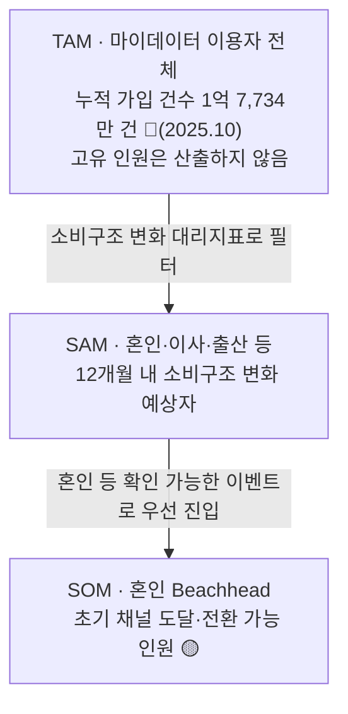

# 04. TAM-SAM-SOM 과 Market Segment Map — CardFit

> **CardFit**은 소비가 바뀔 사람을 위해 카드 조합을 다시 계산해주는 서비스다.
> 마이데이터로 확보한 과거 소비 기록과 사용자가 직접 입력한 미래 소비 변화를 함께 반영해, 보유·신규카드의 실적 구간·혜택한도·연회비를 계산 근거와 함께 공개하며 실행 가능한 카드 조합 재배치안을 제시한다.
>
> 표기: 🔵 Fact · ⚪ Inference · 🟡 Assumption · 🟠 미확인

---

## 1. TAM — 마이데이터 이용자

**정의**: 마이데이터 서비스(뱅크샐러드·토스·카카오페이 등)를 이용해 본인 지출을 능동적으로 확인하는 사용자 전체.

**측정값**: 마이데이터 누적 가입 건수 **1억 7,734만 건**(🔵 마이데이터 종합포털, 2025년 10월 기준, 서비스별 중복 가입 포함).

개인별 중복 가입을 제거한 고유 이용자 수는 공개되지 않는 지표다(🟠). "이용자 수"라는 이름으로 함께 유통되는 1억 6,531만 명(2025년 5월 말 기준)도 고유 인원으로 볼 수 없다 — 한국 인구가 약 5,170만 명인 것과 비교하면 두 수치 모두 인구 규모를 크게 초과하며(⚪ 추론), 이는 서비스별 가입을 중복 합산한 지표이지 실제 사람 수가 아니라는 뜻이다. 따라서 이 문서는 TAM을 **사람 수가 아니라 누적 가입 건수**로 표기하며, 임의의 환산 배수를 적용해 인원수로 바꾸지 않는다.

신용카드 발급매수(1억 3,466만 매, 2025)와 개인카드 국내 이용액(약 275.97조원)은 카드 보유·결제 규모를 나타낼 뿐 마이데이터 이용 여부와 무관해 TAM에서 제외한다.

이 서비스는 마이데이터 연동으로 확보한 과거 소비 기록을 계산의 출발점으로 삼는다 — 그래서 TAM을 마이데이터 이용자로 잡는 것은 대안 중 하나를 고른 것이 아니라, 서비스 자격 조건 자체와 그대로 맞물리는 정의다. 마이데이터를 쓰지 않는 사람은 이 서비스가 계산에 필요로 하는 과거 소비 데이터를 애초에 제공할 수 없으므로, 자연스럽게 대상에서 제외된다.

---

## 2. SAM — 12개월 내 소비구조 변화가 예상되는 사용자

**정의**: TAM 중 향후 12개월 내 소비구조가 유의미하게 바뀔 것으로 예상되는 사용자 — 혼인·이사·출산 등 생애이벤트 대리지표로 측정한다.

```
SAM = [ Σ(연간 소비변화 이벤트 발생 인원) − 이벤트 간 중복 ] × 마이데이터 이용률
```

| 대리지표 | 값 | 주의점 |
| --- | --- | --- |
| 혼인 건수 × 2(양 당사자) | 24만 건(+8.1%), 🔵 국가데이터처 2026.03.19 | 재혼 포함 여부 명시 필요 |
| 주민등록 전입(이사) 세대 수 | 이동자 611.8만 명, 주택사유 33.7%, 🔵 | 혼인 지출과 중복이 커 독립 계상하지 않음(아래 §4) |
| 출생아 수 | 🟠 미수집 | 혼인·이사와 강하게 중복 |
| 이직·전직자 수 | 🟠 미수집 | 소비변화 유의성이 위 셋보다 약함 |

혼인이 가장 데이터 신뢰도가 높은 원인이라 1차 Beachhead로 채택한다. 자녀 입학·유학·은퇴 등도 같은 소비구조 변화를 만들지만, 유학·은퇴처럼 소비가 감소하는 이벤트는 지출 방향이 반대라 별도 설계가 필요하다.

**중복 제거 원칙**: 신혼 1쌍은 혼인+이사+(경우에 따라)출산에 모두 잡힐 수 있어 세대(가구) 단위로 카운트한다. 중복률·마이데이터 이용률 가정에 따라 보수(중복률 0.8·낮은 이용률)·기본(0.65)·공격(중복률 0.5·높은 이용률) 3개 시나리오로 산출한다 — 실제 비율은 대리지표 실수치 확보 후 채운다.

---

## 3. SOM — 혼인 Beachhead 채택자

**정의**: SAM 중 혼인 Beachhead를 통해 실제로 서비스에 도달·전환하는 사용자.

```
SOM = SAM × Beachhead 비중 × 초기 채널 도달률 × Payment Plan Selection Rate
```

세 변수(비중·도달률·선택률) 모두 검증 전이다(🟡). 카드고릴라 MAU 140만·뱅크샐러드 130만은 상한 벤치마크로만 참고하며, 근거 없는 확정 인원수는 제시하지 않는다.

---

## 4. Market Segment Map — Beachhead 우선순위

세그먼트 축은 **Trigger 감지가능성 × 1인당 지출강도**를 사용한다 — 실측 데이터가 채워진 축이기 때문이다. "소비변화 예측가능성 × 보유카드 수" 축도 후보로 검토했으나, 이 축은 실측 데이터가 없어 채택하지 않았다.

| 세그먼트 | Trigger 감지가능성 | 1인당 지출강도 | 우선순위 |
| --- | --- | --- | --- |
| Q1. 혼인 | 높음(웨딩업체 신호로 감지 용이) | 최고 — 카드결제 대상 지출 1,473만~2,203만원(🔵) | **1차 표적(SOM)** |
| Q2. 입주(이사) | 낮음(부동산 중개 파편화) | 🟠 확인 안 됨 | 대상 아님 — 혼인 지출(혼수 포함)과 중복이 커 독립 계상 어려움 |
| Q3. 해외여행(일반) | 낮음 | 낮음(1건당 약 102만원) | 대상 아님(단, 신혼여행은 Q1에 포함) |
| Q4. 카드 갱신 일반군 | 매우 높음 | 낮음(무차별) | 대상 아님 — 채널 후보로만 참고 |

**혼인(Q1) 지출강도 근거**: 결혼비용 총계 5,912만원(주택자금 제외, 🔵 듀오 2026) 중 카드결제 확실 항목(신혼여행 1,030만원+혼수 1,445만원+웨딩패키지 471만원=2,946만원, 1인당 1,473만원)과 조건부 포함 시(+예식홀 1,460만원, 1인당 2,203만원)로 구분한다. 예단·예물(1인당 675.5만원)은 현금 관행이 강해 카드결제 대상에서 제외한다.

Q1~Q4는 데이터를 확보할 수 있었던 사건일 뿐이며, 자녀 입학·유학·은퇴 등도 같은 소비구조 변화를 만든다.

---

## 5. TAM·SAM·SOM 종합

| 층 | 정의 | 값 |
| --- | --- | --- |
| TAM | 마이데이터 이용자 전체 | 누적 가입 건수 1억 7,734만 건(🔵, 2025.10 기준, 중복 포함) — 고유 인원은 산출하지 않음 |
| SAM | TAM 중 12개월 내 소비구조 변화 예상자 | 혼인 등 대리지표 합산 예정(🟠 대리지표 실수치 일부 수집 중) |
| SOM | SAM 중 혼인 Beachhead 채택자 | 3개 변수 모두 검증 전(🟡) |


