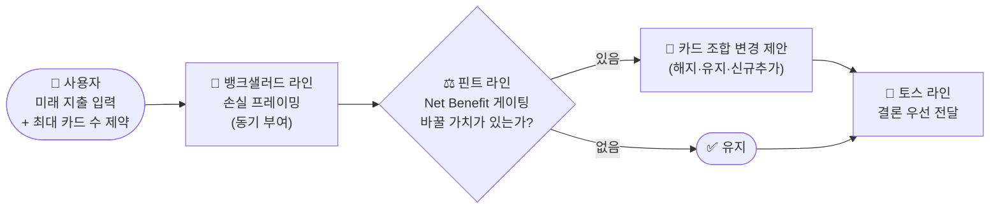
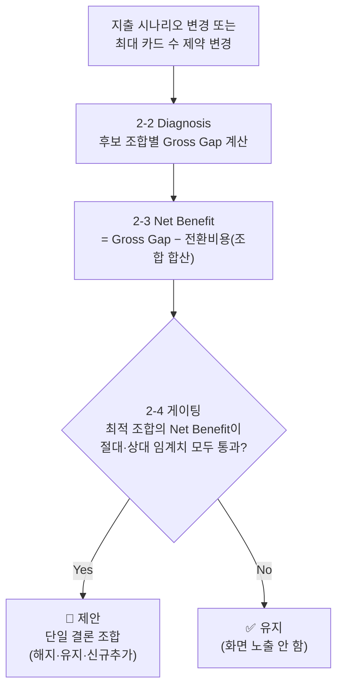
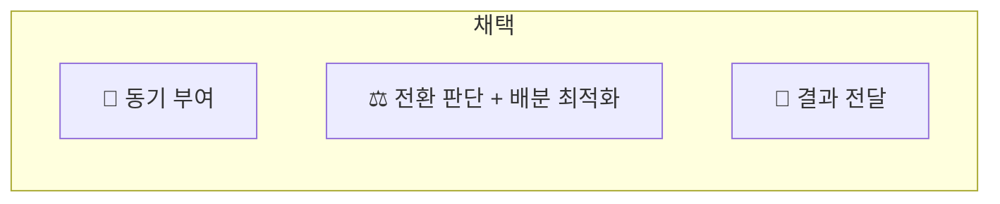

# 메커니즘 벤치마킹 분석 리포트

> 적용 대상 서비스: **CardFit** — 마이데이터 연동으로 확보한 과거 소비 기록 + 사용자가 입력하는 미래 변화 지출값을 함께 반영해 카드 조합을 재배치하는 서비스.
> 3개 벤치마크(🏦 뱅크샐러드 · ⚖️ 핀트 · 💬 토스)를 검토해 2026-08-20 기준으로 확정된 결론만 정리한 문서입니다. 이전 버전은 `윤정/0819/메커니즘_벤치마킹_분석_리포트.md`에 있습니다. 검토 경위·번복 이력은 `decision-log/decision-log.md` 참고.

---

## 0. 전체 흐름



| 레이어 | 벤치마크 | 한 줄 역할 | 상태 |
| --- | --- | --- | :---: |
| 🏦 동기 부여 | 뱅크샐러드 | 지금 카드를 그대로 쓰면 얼마를 놓치는지 보여준다 | ✅ 채택 |
| ⚖️ 전환 판단 + 배분 최적화 | 핀트 | 최대 카드 수 제약 안에서, 바꿀 가치가 있는 조합만 제안한다 | ✅ 채택 |
| 💬 결과 전달 | 토스 | 계산 결과를 결론부터 이해하기 쉽게 보여준다 | ✅ 채택 |

세 메커니즘은 서로 다른 지점을 맡아 겹치지 않는다. 뱅크샐러드 없이는 입력 동기가 없고, 핀트 없이는 사소한 변화에도 매번 바꾸라고 해서 피로하며, 토스 없이는 계산 결과가 사용자에게 전달되지 않는다.

---

## 1. 🏦 뱅크샐러드 — 보유카드 기준 대체카드 탐색·비교

> **핵심 아이디어**: 지금 카드를 계속 쓰면 얼마를 놓치고 있는지 금액으로 보여준다.

**원본에서 확인된 사실**

| 항목 | 내용 |
| --- | --- |
| 기능 | 보유카드 실적·혜택을 마이데이터 소비내역에 대입해 더 높은 예상 혜택을 주는 대체 카드를 탐색·비교(예: "지난달 소비 패턴이면 B카드로 월 12,000원 더 받을 수 있어요") |
| 메커니즘 | 과거 행동 데이터를 기준점으로 고정 → 현재(보유카드)와 대안(대체카드)의 차이를 금액으로 정량화 → 놓치는 기회비용을 가시화 |
| 작동 원리 | 손실 회피 · 기회비용 가시화 · 자기 관련성 · 앵커링(현재 카드가 기준점) |

**우리 서비스로 전이**

| 항목 | 내용 |
| --- | --- |
| 전이 방식 | 과거 대신 **미래 예상 지출**(마이데이터 예측 + 사용자 입력)을 기준으로 카드 조합을 추천 |
| 적용 형태 | 보유 카드조합 vs 최적 조합의 예상 혜택 차액을 손실 프레이밍으로 강조(예: "이 조합 기준 +34,000원") → 시나리오 수정 시 실시간 재계산 |

**검증 & 리스크**

| 항목 | 내용 |
| --- | --- |
| 검증 지표 | 시나리오 입력 완료율 · 추천 클릭/전환율 · 재입력 빈도 · 추천 대비 실제 채택률 |
| 리스크 | 미래 예측치는 불확실성이 커 손실 프레이밍 신뢰도가 희석될 수 있음 · 반복 입력 피로 · 제휴 수익모델과 얽히면 "최적"이 왜곡될 수 있음 · 카드 조합은 실행 복잡도가 높아 "보기만 하고 실행 안 함" 갭 |
| 보완 장치 | 예측치 근거 뱃지 표기 · 마이데이터 추정치를 기본값으로 선제공 · 추천 로직을 실적/혜택 기준으로 고정하고 제휴 구조 투명 공개 · "효과 큰 카드부터" 단계적 전환 옵션 |

---

## 2. ⚖️ 핀트 — Card Portfolio Rebalancing (다중카드 배분 포함)

> **핵심 아이디어**: 바뀔 가치가 있을 때만 개입한다. 핀트는 분기 등 정기 주기로 점검하지만, 이 서비스는 정기 주기는 가져오지 않고 **게이팅 로직만** 가져온다 — Drift가 시장이 아니라 사용자의 입력 행동에서 생기므로, 정기 점검할 대상 자체가 없다.

**원본에서 확인된 사실**

| 항목 | 내용 |
| --- | --- |
| 기능 | 투자성향·시장상황 기반 포트폴리오 구성·추천, 정기 주기 점검 후 필요 시 리밸런싱 제안. 효익이 거래비용보다 작으면 매매를 미룸 |
| 메커니즘 | 현재-목표 간 괴리(Drift)를 점검하다가, 재구성 비용 대비 효익(Net Benefit)이 임계치를 넘을 때만 개입하는 비용-편익 게이팅 |
| 작동 원리 | 거래비용을 고려한 최적정지 · 현상유지를 "판단 후 유지"로 재프레이밍해 신뢰 확보 · Human-in-the-loop 통제감 |

**우리 서비스로 전이**

| 항목 | 내용 |
| --- | --- |
| 전이 방식 | Net Benefit 게이팅만 이식(정기 주기는 제외) — 지출 변화가 카드 조합을 바꿀 만큼 큰지 매번 판정해, 사소한 변화엔 "유지"를 추천해도 신뢰가 유지됨 |
| 적용 형태 | **Rebalancing Optimization Engine** — 카드 1장이 아니라, **사용자가 설정한 최대 카드 수 제약 안에서 해지·유지·신규추가를 함께 고려한 조합 전체**에 게이팅을 적용한다. 조합의 카드 수 자체에는 별도 상한을 두지 않는다 — 제약은 오직 사용자가 지정한 최대 카드 수 하나뿐이다. 상세 설계는 아래 2-1~2-8 |

**검증 & 리스크**

| 항목 | 내용 |
| --- | --- |
| 검증 지표 | 트리거 발생률 대비 채택률 · "유지 추천" 신뢰도(정성) · 재계산 이후 이탈률 · 임계치 조정 전후 채택률 변화 |
| 리스크 | 카드 전환비용은 투자상품보다 정량화가 어려움 · "유지하세요"가 반복되면 서비스 존재 이유가 희석됨 · 트리거가 너무 잦으면 피로 · 임계치가 낮으면 아슬아슬한 이득으로 전환시켜 손해가 될 수 있음 · 조합 단위 계산은 단일 카드 비교보다 후보 조합 수가 많아 계산 부담이 커질 수 있음 |
| 보완 장치 | 전환비용을 카드별로 분해해 투명 공개(2-3) · 절대·상대 이중 임계치로 아슬아슬한 제안 필터링(2-4) · 신규카드 후보군을 대표 카드 소수로 제한해 계산량 통제(2-8) · 임계치는 하드코딩으로 시작 후 실사용 데이터로 튜닝 |

### Rebalancing Optimization Engine 파이프라인



### 2-1. 트리거 — 언제 계산이 도는가

기본값은 **침묵**이다. 아무것도 입력하지 않으면 아무 화면도 뜨지 않는다. 캘린더 기반 정기 알림은 채택하지 않는다.

| 트리거 | 범위 | 근거 |
| --- | :---: | --- |
| (a) 지출 시나리오 변경(카테고리·금액·예상 결제월 추가/수정/삭제) | ✅ MVP | H1 가설(지출 입력 변화가 실제 재검토 트리거가 되는가)을 이 하나로 검증 |
| (b) 최대 카드 수 제약 변경(사용자가 직접 조정) | ✅ MVP | 제약이 바뀌면 최적 조합 자체가 달라지므로 즉시 재계산 대상 |
| (c) 카드 Rule 변경(연회비·혜택율·실적조건 변경) | 🔶 P1(2차) | 뱅크샐러드 라인(§1)이 "기존 진단이 오래됐다"는 신호를 보내는 인프라가 아직 없음. MVP P0 항목("Rule 근거·기준일 표시")이 최소 안전장치 역할을 대신함 |

한 세션에서 지출 항목을 여러 개 연속 입력해도(예: 이사 준비로 5개 항목) 항목마다 계산하지 않고 **저장 시점에 1회 배치 계산**한다 — 계산은 공짜지만 반복 알림은 사용자에게 피로 비용을 물리기 때문이다.

### 2-2. Diagnosis — 후보 조합과 Gross Gap 계산식

```
후보 조합 C = (보유카드 부분집합) ∪ (신규카드 후보군 부분집합), |C| ≤ 사용자 지정 최대 카드 수

조합 예상혜택(C) = Σ(전체 지출 항목) [ 그 항목에 조합 C 안에서 가장 유리한 카드의 예상혜택 ]
예상혜택(카드, 항목) = 항목 금액 × 카드의 해당 카테고리 적립률/할인율(캐시백·페이백 포함)
                    (카드별 월 통합한도·전월실적 구간 충족 여부로 캡핑)

Gross Gap(C) = 조합 예상혜택(C) − 현재 보유 조합 예상혜택
최적 조합 C* = 유효한 후보 조합 중 Net Benefit(C)이 가장 큰 조합(2-3)
```

카드 수 자체에는 상한을 두지 않는다 — 유일한 제약은 사용자가 지정한 최대 카드 수(|C| ≤ N)뿐이며, 이 안에서 해지·유지·신규추가를 자유롭게 조합해 계산한다.

### 2-3. Net Benefit — 조합 단위 전환비용 합산

```
Net Benefit(C) = Gross Gap(C) − 전환비용(C)
전환비용(C) = Σ(C로 전환하며 해지되는 카드) 위약금/연회비 환급 손실
            + Σ(C에 신규로 추가되는 카드) [ a(연회비) + b(실적 재적립 손실) + c(발급 대기 지연비용) ]
```

| 요소 | 정의 |
| --- | --- |
| a. 연회비 | 신규 추가 카드의 첫해 실제 청구액(월할 환산 병행) |
| b. 실적 재적립 손실 | 해지되는 카드가 채워둔 전월실적 진행분 중 전환 시 사라지는 혜택(예: 30만원 구간에 26만원 채운 상태에서 해지하면 이번 달 혜택 전체를 놓침) |
| c. 발급 대기 지연비용 | 신규카드 신청→심사→배송 기간 동안은 기존카드로 결제해야 하므로, 그 기간 지출은 Gross Gap에서 제외 |

전환비용은 조합에서 **바뀌는 카드마다** 계산해 합산한다 — 카드 1장이 바뀌든 여러 장이 동시에 바뀌든 같은 방식으로 확장된다.

### 2-4. 게이팅 — "유지" vs "제안" 분기

두 조건을 **모두** 만족해야 "제안", 하나라도 미달이면 "유지"다.

| 조건 | 기준 | 목적 |
| --- | --- | --- |
| 절대 임계치 | Net Benefit(C*) ≥ 고정값(예: 월 환산 10,000원) | 반올림 오차·심리적 사소함 걸러내기 |
| 상대 임계치 | Net Benefit(C*) ≥ 전환비용(C*) × 배수(예: 1.5배) | 겨우 전환비용을 넘기는 아슬아슬한 제안 걸러내기 |

두 값은 사용자 노출 설정이 아니라 서버 측 하드코딩 파라미터로 시작해, H3·H6 가설 검증 데이터로 사후 튜닝한다. 최적 조합이 현재 보유 조합과 같으면(=C* = 현재 조합) 자동으로 "유지"가 된다.

### 2-5. UX 흐름

- **"유지" 결과**: 별도 화면을 띄우지 않거나, 사용자가 진단 화면에 직접 들어갔을 때만 "지금 조합이 최선이에요"로 표시
- **"제안" 결과**: 여러 안을 나열하지 않고, 계산으로 압축된 **하나의 결론**만 제시한다. 예시 문구 — *"A·B카드는 해지하고, C카드는 그대로 쓰고, D카드를 새로 추가하세요 — 이 조합이 지금보다 연 34,000원 더 유리해요 (전환비용 반영 후)"*
- 자동 발급·자동 결제는 하지 않는다 — "적용"을 눌러도 실제 카드 신청·해지는 사용자 책임

### 2-6. 필요 데이터 — 카드 Rule DB 최소 필드

연회비(국내전용/해외겸용) · 카테고리별 적립률/할인율(캐시백·페이백 포함) 및 카테고리 정의 · 전월실적 구간과 구간별 혜택 캡 · 실적 인정 제외 항목(할부·상품권 등) · 월 통합 할인한도 · 신규 발급 프로모션(기간 한정) · 평균 발급 소요기간 · 해지 시 위약금/연회비 환급 규정 · 사용자가 지정한 최대 카드 수 제약값

### 2-7. Edge Case

- 지출 항목을 **삭제**해 시나리오가 줄어드는 경우 → 재계산은 하되, 이미 수락된 과거 전환 제안을 되돌리는 로직은 P1으로 미룸(MVP는 신규 진단만)
- 사용자가 최대 카드 수 제약을 보유 카드 수보다 작게 설정 → 반드시 일부 해지가 포함된 조합만 후보가 됨을 안내 문구로 명시
- 카드 Rule 변경 트리거((c))가 나중에 추가되면, 문구는 "당신의 지출이 바뀌어서"가 아니라 "카드 혜택 조건이 바뀌어서"로 구분한다 — 원인을 사용자 탓처럼 보이지 않게 함

### 2-8. 계산 복잡도 통제

신규카드 후보군을 트렌드별 대표 카드 소수(5~10종 정도)로 제한해두면, 보유카드와 후보군을 합쳐 조합을 계산해도 부담이 크게 늘지 않는다. Guardrail G-04(불필요한 신규카드 추천 방지)·G-05(카드 수 통제)를 유지한다 — 결론은 하나뿐이지만, "지금 그대로 두면 얼마를 놓치는지"와 계산 근거는 함께 공개한다.

---

## 3. 💬 토스 — Decision UX & Explainability

> **핵심 아이디어**: 복잡한 계산 결과를 결론부터 이해하기 쉽게 압축해서 보여준다.

**원본에서 확인된 사실**

| 항목 | 내용 |
| --- | --- |
| 기능 | 공통 디자인 언어 + 해요체·능동형·긍정 표현의 UX Writing 원칙. 정보를 결론 → 핵심 변화 → 장단점 → 근거 → 상세 순으로 계층화 |
| 메커니즘 | 정보 위계화(단계적 공개) + 결과 우선 노출 + 비교를 통한 의사결정 지원 |
| 작동 원리 | 인지부하 이론(단계적 공개로 과부하 방지) · 만족화 의사결정(최적해를 직접 계산시키지 않고 비교 가능한 옵션만 제시) · 근거 링크가 신뢰를 만든다는 원리 |

**우리 서비스로 전이**

| 항목 | 내용 |
| --- | --- |
| 전이 방식 | 리밸런싱 게이팅(핀트, §2)이 만들어낸 계산 결과를 그대로 노출하면 이해·신뢰하지 못해 이탈할 위험이 큼 — 결론 우선·단계적 공개 원칙은 이식하되, 장점·단점을 나란히 병렬 제시하지는 않는다. §2-4 게이팅을 통과한 제안은 전환비용을 넘어서는 순혜택이 이미 보장되므로, 비용은 독립 항목이 아니라 순혜택 숫자 안에 종속시켜 하나의 결론 문장으로 보여준다 — "단점"이라는 이름의 별도 항목이 이미 순혜택이 보장된 제안에 재고 명분(이탈 유인)을 만드는 것을 막기 위함이다 |
| 적용 형태 | 첫 화면엔 **핵심 결과(변경되는 카드 목록)·필요한 변경·순혜택(전환비용을 이미 반영한 숫자)** 3개 정보만 노출 — 예: "연 34,000원 더 유리해요 (해지 위약금 3,000원 반영 후)"처럼 비용을 순혜택 문장에 종속시켜 표기한다(2-5 예시 문구 참고). 상세화면에서 카드별 계산 근거(전환비용 내역·기준일 포함)를 제공. 문구는 해요체·능동형으로 통일 |

**검증 & 리스크**

| 항목 | 내용 |
| --- | --- |
| 검증 지표 | 첫 화면 체류시간/이탈률 · 상세화면 진입률(근거 확인 의향) · 문구 이해도(정성 인터뷰) |
| 리스크 | 여러 카드가 동시에 바뀌는 조합은 단일 카드 교체보다 설명이 복잡해져, 과도한 단순화가 "왜 이런 결과가 나왔는지" 불신으로 이어질 수 있음 · 해요체 톤이 금융 의사결정의 신중함과 안 맞는다고 느끼는 사용자층이 있을 수 있음 · 전환비용을 "단점"이라는 별도 항목으로 노출하면, 이미 게이팅을 통과해 순혜택이 보장된 제안인데도 재고 명분(이탈 유인)을 줄 수 있음 |
| 보완 장치 | 근거는 항상 1탭 안에서 접근 가능하게 유지, 카드별로 나눠서 제공 · 톤앤매너는 A/B 테스트로 검증 · 전환비용은 독립 항목으로 노출하지 않고 순혜택 숫자에 종속시켜 표기 — 항목별 세부 내역은 상세화면에서만 공개 |

---

## 4. 종합



| 레이어 | 벤치마크 | 우리 서비스에 전이되는 원리 | 상태 |
| --- | --- | --- | :---: |
| 🏦 동기 부여 | 뱅크샐러드 | 손실 프레이밍으로 지출 입력·비교 열람을 유도 | ✅ 채택 |
| ⚖️ 전환 판단 + 배분 최적화 | 핀트 | 최대 카드 수 제약 안에서, 바뀔 가치가 있는 조합만 트리거(비용-편익 게이팅, 정기 주기는 제외) | ✅ 채택 |
| 💬 결과 전달 | 토스 | 계산 결과를 결론 우선·단계적 공개로 압축 | ✅ 채택 |

MVP는 §2-4 게이팅 원칙을 카드 조합 단위로 적용한다 — 여러 안을 나열해서 고르게 하지 않고, Net Benefit이 기준을 넘는 조합 하나만 결론으로 제시하며, 못 미치면 "유지"다.

---

**연결 문서**: 서비스 정의·범위는 [`쟁점정리.md`](../0818/쟁점정리.md) · 시장 방어선 논리는 [`03_KSF 분석.md`](../0819/03_KSF%20분석.md) §3 · [`01_Porters Five Forces 분석.md`](../0819/01_Porters%20Five%20Forces%20분석.md) §4 참고. 검토·번복 이력은 `decision-log/decision-log.md` 참고. 이전 버전(카드 1장 교체 단위)은 [`윤정/0819/메커니즘_벤치마킹_분석_리포트.md`](../0819/메커니즘_벤치마킹_분석_리포트.md) 참고.
