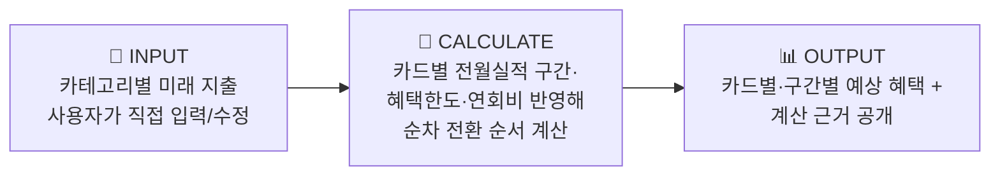
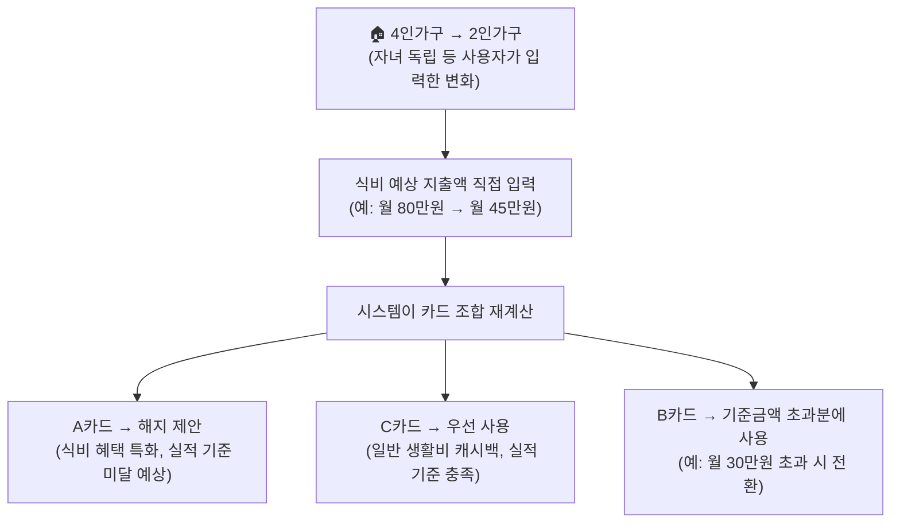
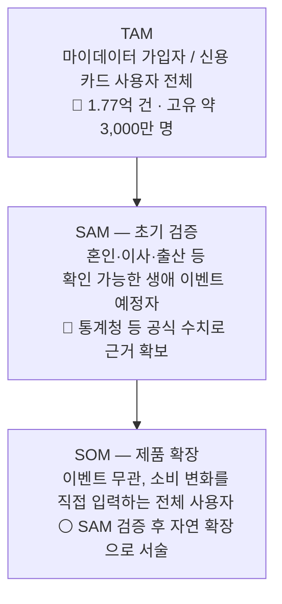

# 미래지출 결제설계 서비스 — 팀 논의용 쟁점 정리

> 개인 아이디어로 시작해 팀 최종후보(2026-08-14 Decision Log)로 채택된 "미래지출 결제설계 서비스"를 팀 프로젝트로 넘기면서, 아직 결정되지 않은 지점들을 정리한 문서입니다. 결론이 아니라 **논의를 위한 판단 초안**이며, 팀 합의 후 결과는 `decision-log/decision-log.md`에 새 행으로 기록해 주세요.
>
> 근거 구분은 `방법론.md`의 Fact/Inference/Assumption 표기를 그대로 씁니다 — 🔵 Fact(재확인 가능한 사실) · ⚪ Inference(복수 근거 기반 추론) · 🟡 Assumption(미확인 가정, 검증 필요).

---

## 1. 서비스 한눈에 보기

**한 줄 정의**: 사용자가 직접 입력한 미래 소비 변화를 바탕으로, 보유·신규 카드의 혜택 조건을 계산해 실행 가능한 결제 조합(Payment Plan)을 설계해주는 서비스.

**구체 예시** (F-03 워크스루 — 카테고리 지출 변화 → 카드 리밸런싱):

| 항목 | 현재 정의 |
| --- | --- |
| Beachhead(초기 타겟) | 신혼·입주 등 1~3개월 내 고액구매 예정 카드 사용자 |
| 핵심 문제 | 경쟁사 6곳 중 "실행설계·미래소비반영·근거공개"를 동시에 만족하는 곳 없음 |
| MVP 핵심기능 | F-01 미래지출 입력 · F-02 보유카드/제약조건 입력 · F-03 시나리오 계산 · F-04 신규카드 포함/미포함 비교 · F-05 결제수단 배분 설계 · F-06 계산 근거 공개 |
| MVP Out-of-Scope | 실제 마이데이터 연동, 카드 자동발급, 자동결제, 대출·BNPL |

---

## 2. 근거 자료 (검증된 시장 데이터)

| 지표 | 수치 | 구분 | 출처 |
| --- | --- | --- | --- |
| 마이데이터 가입 건수 | 1억 7,734만 건 (2025.10, 중복포함) · 고유인원 약 3,000만 명 추정 | 🔵 Fact / ⚪ Inference(고유인원 환산) | 마이데이터·카드시장 리서치 |
| 개인 신용카드 국내 사용액 | 월 50조원+ (2025.01) | 🔵 Fact | 동 리서치 |
| 뱅크샐러드 카드추천 이용자 | 약 130만 명 | 🔵 Fact | 동 리서치 |
| 카드고릴라 2026 트렌드 키워드 | "PIVOT" — 생활비 카드 + 특화 카드 병행 사용(카드조합 전략) 확산 | 🔵 Fact | 카드고릴라 2026 트렌드 발표 |
| 혼인 관련 1인당 카드결제 대상 지출 | 1,473 ~ 2,203만원 | 🔵 Fact | 경쟁사·시장 공개자료(E-03~E-06) |

### 경쟁사 비교 (실행설계 · 미래소비반영 · 근거공개)

| 기업 | 실행 설계 | 미래 소비 반영 | 근거 공개 |
| --- | :---: | :---: | :---: |
| 뱅크샐러드 | ✗ | ✗ | ◐ |
| 카드고릴라 | ✗ | ✗ | ✗ |
| 더쎈카드 † | ✔ | ✗ | ？ |
| 토스 | ✗ | ✗ | ✗ |
| Credit Karma | ✗ | ✗ | ✗ |
| NerdWallet | ✗ | ✗ | ◐ |

† 더쎈카드는 2023년 미래 소비항목 반영 기능을 제공했으나 2026년 사업보고서에 서비스 종료가 기재되어 있음(실패 원인 미확정) — **6개 기업 중 세 조건을 동시에 만족하는 곳은 없음**이 이 서비스의 존재 근거.

---

## 3. 아직 결정 안 된 4가지 쟁점

### 쟁점 1 — 마이데이터 사업자 vs 마이데이터 활용 서비스

| | 내용 |
| --- | --- |
| 질문 | 우리가 마이데이터 사업자(직접 인가)가 될지, 뱅크샐러드·토스처럼 마이데이터를 "활용"하는 입장일지 |
| 확인된 사실 🔵 | 뱅크샐러드·토스 모두 실제로는 금융위 마이데이터(본인신용정보관리업) 인가를 **직접 보유**한 사업자임. 특히 토스는 은행·증권·PG업까지 겸영하는 대형 금융그룹이라 "가벼운 제3자 서비스" 비유 대상으로 적절하지 않음 |
| 판단 | MVP 단계에서는 라이선스 취득도, 제휴도 필요 없이 **사용자 직접 입력 방식**으로 시작 (이미 피치덱 MVP 스코프와 일치) |
| 향후 검증과제 🟡 | 서비스 확장 시 (a) 직접 마이데이터 인가 취득 또는 (b) 기존 인가 사업자와 제휴, 두 경로 중 선택 — 지금 결정할 필요 없음 |

### 쟁점 2 — 이벤트 종류 무관, 사용자 직접 입력

| | 내용 |
| --- | --- |
| 질문 | "혼인"처럼 특정 생애 이벤트를 전제할지, 이벤트 종류와 무관하게 사용자가 소비 변화를 직접 입력하게 할지 |
| 판단 | **이벤트 비종속**으로 확정. 혼인·이사·자녀독립 등은 "이 서비스가 왜 필요한가"를 설명하는 예시일 뿐, 실제 기능은 카테고리별 지출 변화값 입력만 받으면 됨 |
| 근거 | 원칙 2(기능 외형이 아니라 메커니즘)에 부합 — 어떤 이벤트인지가 아니라 입력된 변화값이 계산의 핵심 |
| 유의점 ⚠️ | 제품 로직(이벤트 비종속)과 Beachhead(초기 타겟, 이벤트 특정)를 **분리해서 관리**해야 함 — 마케팅·초기 검증 타겟은 여전히 혼인 등 구체적 이벤트로 좁히는 것이 유리 |

### 쟁점 3 — TAM-SAM-SOM을 어떻게 잡을 것인가

쟁점 2의 결론(이벤트 비종속) 때문에 SAM을 좁히기 더 어려워짐 — "소비가 바뀔 거라 예상하는 사람"의 비율을 뒷받침할 공식 통계가 없음. **투트랙 구조**를 제안:

| | 내용 |
| --- | --- |
| 판단 | 제품 로직은 일반화하되, TAM-SAM-SOM 슬라이드에서는 **초기 SAM을 이벤트로 좁혀 근거 있는 숫자를 확보**하고, SOM에서 "이벤트 무관 일반 입력"으로 자연 확장된다고 서술 |

### 쟁점 4 — 리밸런싱: 신규카드 제안 vs 기존카드 활용

| | 내용 |
| --- | --- |
| 질문 | 카드 조합을 다시 짤 때 신규카드를 제안할지, 기존 보유카드만으로 재배치할지 |
| 판단 | **이미 F-04(신규카드 포함/미포함 시나리오 비교)에 정의되어 있음** — 둘 다 계산해서 나란히 제시하고 사용자가 선택하게 하면 됨. 새로 정할 필요 없이 기존 스펙대로 진행 |
| 유의점 ⚠️ | Guardrail G-04(불필요한 신규카드 추천 방지)와 충돌하지 않도록, "포함 시 이만큼 이득 / 미포함 시 이만큼"이라는 근거를 투명하게 공개하는 것이 안전장치 — 차별점 C(검증 가능한 계산)와도 연결됨 |

---

## 4. 추가로 짚어야 할 질문 (팀 논의 필요)

| # | 질문 | 판단 초안 |
| --- | --- | --- |
| 5 | 입력 단위는? (카테고리별 %증감 vs 절대금액, 기간은 언제까지) | 절대금액은 계산이 쉽지만 입력 부담이 큼 → **%증감 + 기본 기간 3~6개월**로 시작 제안 |
| 6 | 카드 혜택 Rule(전월실적 구간·캐시백율 등) 데이터를 어디서, 어떻게 최신 상태로 유지하나 | 카드사 공식 약관은 🔵 Fact로 확보 가능하나 자주 변경됨(Guardrail G-02 Stale Promotion Rate와 직결) → **MVP는 카드 후보군을 소수로 제한**하고 갱신 주기를 명시 |
| 7 | 일회성 계산 vs 지속형(변화 생길 때마다 재계산·알림) 서비스인가 | 리텐션·BM에 큰 영향. **32시간 스코프에서는 일회성 설계로 시작**, 지속형은 로드맵으로만 언급 제안 |
| 8 | 이벤트 비종속화로 차별점 B("과거가 못 보는 소비")의 근거(혼인 지출 통계)가 약해지지 않는가 | 맞음 — 일반화된 버전에서도 통할 **추가 근거 보강 필요** (예: 카드고릴라 "카드조합 전략" 트렌드, 생애주기 소비변화 관련 별도 리서치) |
| 9 | 카드 혜택 계산이 "재무 자문"으로 분류될 규제 리스크는 없는가 | 원칙 5(도메인별 책임을 설계 조건으로) 관련. F-06(계산 근거 공개)이 완화 장치로 이미 작동 중 → **면책 문구·근거 공개 수준을 PRD에 명시** |

---

## 5. 다음 액션

- [ ] 팀 회의에서 쟁점 1~4 + 질문 5~9 순서로 논의
- [ ] 합의된 내용은 `decision-log/decision-log.md`에 새 행으로 기록 (기존 행 수정 금지, 표 맨 아래 추가)
- [ ] 쟁점 3(TAM-SAM-SOM 투트랙)·질문 8(차별점 근거 보강)은 시장분석 담당(윤정) 작업에 직접 영향 → 우선순위 상위 권장
- [ ] 확정된 스코프를 `방법론.md`의 메커니즘 전이 분석표 양식으로 옮겨, 교차산업 벤치마킹(대환대출·통신 요금제 자동전환·전력 시간대 요금 최적화 등) 근거 보강 작업 착수
