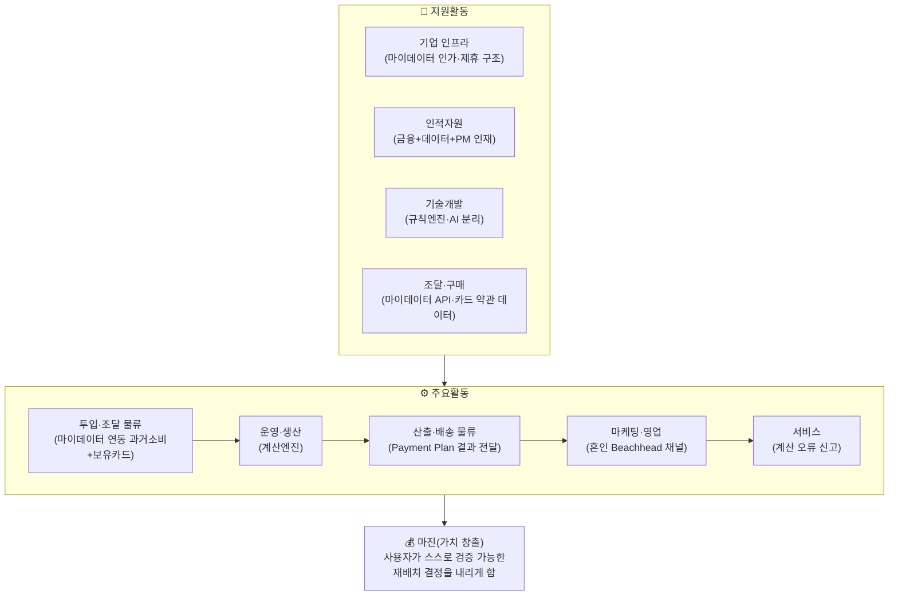

# 🔗 기업 내부 활동의 가치사슬 분석

> **CardFit**은 소비가 바뀔 사람을 위해 카드 조합을 다시 계산해주는 서비스다.
> 마이데이터로 확보한 과거 소비 기록과 사용자가 직접 입력한 미래 소비 변화를 함께 반영해, 보유·신규카드의 실적 구간·혜택한도·연회비를 계산 근거와 함께 공개하며 실행 가능한 카드 조합 재배치안을 제시한다.
>
> 표기: 🔵 확인된 사실 · ⚪ 추론 · 🟡 가정

---

## 🧭 구조 한눈에 보기

---

## 🎯 차별화 활동 축 — 경쟁자 체인 vs 우리 체인

표준 가치사슬 5개 활동 버킷(투입물류·운영·산출물류·마케팅·서비스) 안에 차별점이 흩어져 있어 한눈에 보이지 않는다. 실제로 경쟁을 가르는 것은 다음 단계들이다.

- **경쟁자(뱅크샐러드·토스·카카오페이) 체인**: 과거 소비 조달(마이데이터) → 단일 카드 매칭(Rule 대입) → 결과 표시(발급 연계) — 2단계
- **우리 체인**: **미래 의도 포착**(사용자가 미래 소비 변화를 직접 입력) → **시나리오 모델링**(제약조건+시나리오 계산) → **제약 최적화**(해지·유지·신규를 함께 계산해 Net Benefit이 가장 큰 하나의 조합으로 압축) → **결제수단 배분** → **카드사 신청 페이지 연결**(신규 카드로 결론이 나면 해당 카드사의 공식 신청 페이지로 이동) — 5단계

경쟁자 체인에는 중간 두 단계(제약 최적화, 결제수단 배분)가 아예 없다 — "과거 소비 조달 → 단일 카드 매칭 → 발급 연계"로 끝난다(🔵).

마지막 단계(카드사 신청 페이지 연결)는 경쟁자도 이미 하는 일이다. 차별점은 이 단계의 유무가 아니라, 이 단계에 도달하기 전에 조합 재배치·결제수단 배분을 거치느냐에 있다 — 신청 연결은 실행의 마지막 다리일 뿐, 우리 체인의 핵심 차별화 구간은 여전히 중간 두 단계다.

---

## ⚙️ 주요활동 (Primary Activities)

### 1. 투입·조달 물류 — 마이데이터 연동으로 과거 소비·보유카드 확보

| 구분 | 내용 |
| --- | --- |
| 🏗️ 핵심 투입자원 | 마이데이터 API로 확보한 **과거 소비 기록**(가맹점·업종·금액)과 **보유카드 목록**, 사용자가 직접 입력하는 **미래 소비 변화값**(카테고리·금액·시점) — 두 축이 계산의 원자재다 |
| 🏗️ 마이데이터 확보 방식 | MVP부터 마이데이터 연동을 포함한다. 직접 인가 취득 또는 기존 인가 사업자(뱅크샐러드·토스류) 제휴를 통해 데이터 접근권을 확보한다 |
| 🏗️ 자체 확보 vs 제휴 | 과거 소비 데이터는 마이데이터 API로 외부 확보하고, 카드 혜택 Rule(전월실적·한도·제외항목)은 카드사별 공식 약관에서 직접 수집한다(🔵) — 통합 API가 없어 수작업 수집이 불가피하다 |
| 🚀 채널 의존도 완화 | 단일 채널(마이데이터 API)만 존재해 대체 경로가 없다 — API 장애 시 "최근 확인된 데이터 기준" 경고로 완화한다 |
| 🚀 약관 데이터 정확성·최신성 | 카드혜택 Rule 버전관리(적용 시작일·종료일 기록)와 최신성 경고 표시를 기술설계 원칙에 포함한다 |

### 2. 운영·생산 — 미래 소비 변화를 반영한 카드조합 계산

| 구분 | 내용 |
| --- | --- |
| 🏗️ 핵심 처리 | 과거 소비(마이데이터) + 미래 변화(직접입력)를 카드별 전월실적 구간·혜택한도·연회비 규칙에 대입해 예상 순혜택을 산출한다 |
| 🏗️ 흐름 설계 | 마이데이터 연동(과거 소비·보유카드 확인) → 미래 소비 변화 입력 → 제약조건 입력(최대 카드 수 포함) → 시나리오 계산 → 해지·유지·신규추가를 함께 계산해 Net Benefit이 가장 큰 하나의 조합으로 압축 → 결제수단 배분 → 근거 공개 |
| 🏗️ 자동화와 수동 판단의 경계 | 혜택 금액 계산은 결정론적 규칙 엔진, AI는 계산 근거를 사용자 언어로 설명하는 역할에 한정한다 — 이 경계가 무너지면 "혜택을 보장한다"는 오해로 이어지는 규제 리스크가 있다 |
| 🚀 처리 정확도 | 전월실적 1원 부족, 월 한도 초과, 실적 충돌 등 필수 테스트 케이스로 경계값을 검증한다 |
| 🚀 부정확한 데이터 대응 | 필수 데이터 누락 시 추천을 중단하고, 데이터가 오래되면 사용자에게 경고한다 |

### 3. 산출·배송 물류 — Payment Plan 결과 전달

| 구분 | 내용 |
| --- | --- |
| 🏗️ 결과 형식 | 계산으로 압축된 **하나의 최종 추천 조합**(예: "A·B카드 해지, C카드 유지, D카드 신규 추가"), 카드별 역할·배분금액, 지금 그대로 두면 놓치는 금액과 계산 근거, 적용되지 않은 조건을 함께 제시한다. 신규 추가로 결론이 난 카드에는 해당 카드사의 공식 신청 페이지로 이동하는 링크를 함께 붙인다 |
| 🏗️ 즉시 이해 가능성 | 결론 → 핵심 변화 → Trade-off → 근거 → 상세 Rule 순으로 정보를 계층화한다 |
| 🚀 정보 우선순위 | 첫 화면에는 핵심 결과·필요한 변경·순혜택(전환비용을 이미 반영한 숫자)만 보여주고, 세부 계산 과정은 사용자가 눌러야 펼쳐 보이도록 단계적으로 숨긴다 |

### 4. 마케팅 및 영업 — 혼인 Beachhead 채널

| 구분 | 내용 |
| --- | --- |
| 🏗️ 핵심 고객 | Beachhead(혼인·이사 등 1~3개월 내 고액구매 예정 + 마이데이터 이용자), 초기 채택자는 혼인 세그먼트 |
| 🏗️ 선택 이유 | 뱅크샐러드·토스·카카오페이는 과거 소비만 보고 카드 1장을 추천하지만, 이 서비스는 미래 변화를 반영해 조합을 재설계하고 근거를 공개한다 |
| 🏗️ 유치 채널 | 웨딩업체 제휴 등 소비 변화 신호를 감지하기 좋은 채널 |
| 🚀 획득비용 대비 수익 | 사람이 직접 수동으로 응대하며 실제 수요를 미리 확인하는 초기 검증(Concierge Test)으로 Payment Plan Selection Rate(사용자가 제시된 카드조합 안을 실제로 선택하는 비율)를 실측한다 |

### 5. 서비스 — 계산 오류 신고와 정정

| 구분 | 내용 |
| --- | --- |
| 🏗️ 필요한 사후지원 | 계산 오류 신고·정정 절차. 이것이 유일한 사후지원 활동이다 |
| 🏗️ 카드 신청·해지 실행을 직접 대행하지 않는 이유 | 카드 해지 절차 자체의 마찰(상담사 만류·복잡한 절차)이 실제 민원으로 확인된다(🔵). 해지 상담·해지 신청 대행은 어떤 형태로도 제공하지 않는다 — "이 카드를 해지하세요"라고 계산 결과를 제안하는 것과, 실제 해지 절차를 대신 처리하거나 안내하는 것은 다른 일이며, 후자는 카드사의 책임 영역이다. 다만 신규 카드 신청은 뱅크샐러드와 동일하게, 카드사의 공식 신청 페이지로 이동하는 링크를 제공한다 — 신청서 작성·제출을 대신하는 것이 아니라 이동 경로만 연결하는 것이라 "대행"에 해당하지 않는다 |
| 🏗️ 포인트 소멸·자동납부 승계 같은 부수 비용 | 별도의 "해지 안내" 활동이 아니라 근거 공개 원칙의 일부다 — 계산에 포함되지 않은 비용이 있다면 "이 계산에는 포함되지 않았습니다"라고 밝혀 계산 정확성의 한계를 투명하게 드러낸다 |
| 🚀 반복 문의 감소 | 계산 오류율·불필요한 신규카드 추천 비율을 검증지표로 추적한다 |

---

## 🧩 지원활동 (Support Activities)

### 1. 기업 인프라 — 마이데이터 인가/제휴 구조

| 구분 | 내용 |
| --- | --- |
| 🏗️ 담당 법인·조직 | 직접 인가 취득 또는 기존 인가 사업자 제휴 중 한 경로로 마이데이터 데이터 접근권을 확보한다 |
| 🏗️ 규제 반영 | 여신전문금융업법·개인정보보호법 전송요구권 확대, 마이데이터 허가요건(자본금 5억원 등)을 전제로 사업계획을 수립한다 |
| 🚀 성장 vs 리스크 기준 | 규제 리스크(재무자문 분류 여부, 카드사 신청 페이지 연결이 여신전문금융업법상 모집인 등록 대상인지 여부)가 해소되기 전까지는 리스크를 우선한다 |

### 2. 인적자원 관리 — 금융+데이터+제품 역량 결합

| 구분 | 내용 |
| --- | --- |
| 🏗️ 필요 인재 | 금융(카드 약관·마이데이터 규제 이해), 데이터(혜택 Rule 파싱·버전관리), 제품(계산 로직 설계) 역량의 결합 |

### 3. 기술 개발 — 규칙엔진과 AI 설명의 분리

| 구분 | 내용 |
| --- | --- |
| 🏗️ 핵심 경쟁력 기술 | 카드혜택 계산은 **결정론적 규칙 엔진**, AI는 약관 요약·추천 근거의 자연어 설명에만 사용한다 — "AI가 혜택금액을 임의 계산하지 않는다"는 원칙 |
| 🏗️ 다수 카드사 데이터 처리 | 카드사별 혜택 Rule을 별도 레이어로 관리하고, 정책혜택(K-패스 등)과 카드사 자체 혜택을 분리한다 |
| 🚀 배포속도와 안정성 | 경계값 자동 테스트, 계산 과정·적용 규칙 로그 보존으로 재현 가능성을 확보한다 |

### 4. 조달·구매 — 마이데이터 API·카드 데이터 소스 확보

| 구분 | 내용 |
| --- | --- |
| 🏗️ 필요 외부 솔루션 | 마이데이터 표준 API(카드 업권 정보제공 API 규격), 카드사별 공식 약관 데이터 |
| 🏗️ 공급자 장애 대응 | 마이데이터 API 접근이 단일 채널이라 대체 공급자가 없으므로, 데이터 최신성 경고로 부분 완화한다 |

---

## 📌 종합 — 병목과 개선 기회

| 병목 지점 | 원인 | 개선 기회 |
| --- | --- | --- |
| 투입·조달 물류 | 마이데이터가 단일 채널이고 카드 혜택 Rule이 파편화되어 있음 | 인가/제휴 경로 조기 확정, 혜택 Rule 버전관리 체계 구축 |
| 운영·생산 | 계산 로직과 AI 설명의 경계가 흐려지면 규제 리스크로 이어짐 | 계산과 설명의 분리 원칙을 시스템 설계 단계에서 강제 |
| 서비스 | 해지 실행을 서비스 범위로 착각하면 사용자 기대와 서비스 능력 사이 괴리를 만듦 | 서비스 범위를 "계산 근거 제공 + 신규 카드는 카드사 신청 페이지 연결까지, 해지는 실행 지원 없음"으로 명확히 제한 |
| 기업 인프라 | 마이데이터 법인 구조가 핵심 성공 요인으로 직결됨 | 데이터 접근 안정성 확보를 최우선 과제로 추진 |
