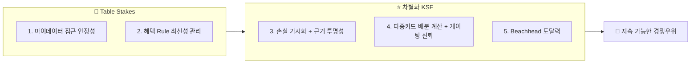

# 🏆 Top 5 핵심 성공 요인 (KSF)

> **CardFit**은 소비가 바뀔 사람을 위해 카드 조합을 다시 계산해주는 서비스다.
> 마이데이터로 확보한 과거 소비 기록과 사용자가 직접 입력한 미래 소비 변화를 함께 반영해, 보유·신규카드의 실적 구간·혜택한도·연회비를 계산 근거와 함께 공개하며 실행 가능한 카드 조합 재배치안을 제시한다.
>
> 1·2번은 **Table Stakes**(없으면 계산 자체가 성립하지 않는 진입 전제조건 — 기존 사업자는 이미 갖고 있어 경쟁우위를 주지 않음)이고, 3~5번이 **실제 차별화 KSF**(기존 사업자 대비 이길 수 있는 지점)다.

---

## 1. 🔐 마이데이터 데이터 접근의 안정적 확보

카드 이용내역은 마이데이터 API로만 제공되고 오픈뱅킹으로는 제공되지 않는다(🔵). 이 채널은 대체 공급자가 없는 높은 공급자 교섭력을 형성하며, 투입·조달 물류의 핵심 원자재이자 기업 인프라 단계의 핵심 과제(직접 인가 vs 제휴)이기도 하다. 마이데이터 본허가 사업자는 2022년 1월 전면 시행 당시 69개사로 출발했으나 2024~2025년 사이 최소 9개사가 허가를 반납했고(🔵), 현재 유효 사업자 수는 그보다 적을 것으로 보인다(⚪, 정확한 수치는 확인 필요). 이 데이터 채널이 없으면 서비스 전체가 성립하지 않으므로, 인가 취득 또는 제휴 계약의 **법적 안정성과 지속성**이 다른 모든 성공 요인의 전제조건이다.

## 2. 📋 카드 혜택 Rule의 최신성·정확성 관리 역량

카드 혜택 Rule(전월실적 구간·통합할인한도·제외 항목)이 8개 카드사와 겸영은행 약관에 파편화되어 있고 통합 공식 API가 없다(🔵). 이 데이터 운영 비용은 후발주자에게도 동일하게 적용되는 진입장벽이다. 이 Rule을 얼마나 빠르고 정확하게 갱신·검증하는가가 계산 결과의 신뢰도를 직접 결정하며, 4번(다중카드 배분 계산)의 정확성도 결국 이 Rule 데이터 품질 위에서만 성립한다.

## 3. 💡 놓치는 혜택을 손실로 보여주고, 그 숫자를 믿게 만드는 것 (동기 + 신뢰)

구매자 교섭력과 대체재 위협이 모두 높으며, "그냥 기존 카드를 유지하는 것"이 가장 강력한 대체재다. 이 힘을 상쇄하려면 두 가지가 함께 필요하다.

- **① 동기**: 지금 카드를 그대로 쓰면 이번 지출에서 얼마를 놓치고 있는지를 손실로 보여준다(예: "지금 카드로는 혜택 0원, B카드로 바꾸면 8,000원 더 받는다").
- **② 신뢰**: 그 격차 숫자가 진짜 계산이라는 걸 사용자가 검증할 수 있게 계산 근거를 그대로 공개한다.

①만 있으면 "과장 광고 아니냐"는 의심을 사고, ②만 있으면 숫자는 투명한데 "그래서 뭐가 달라지는데"라는 무관심을 부른다 — 둘이 같이 있어야 실제로 카드를 바꾸는 행동까지 이어진다. "계산은 규칙 엔진, AI는 설명"이라는 원칙이 ②(신뢰)의 기술적 구현 조건이다. 단종카드 자동대체 후 "혜택 불일치" 민원이 이미 존재한다는 사실(🔵)은 근거 없는 자동 재배치에 대한 불신이 시장에 이미 형성되어 있다는 뜻이라 ②가 왜 필요한지를 뒷받침하지만, 실제로 "유지하기"라는 대체재를 이기는 힘은 ①(손실 가시화)에서 나온다.

## 4. ⚙️ 다중카드 배분 계산의 정확성과 게이팅 신뢰 확보

경쟁자 체인은 "과거 소비 조달 → 단일 카드 매칭 → 결과 표시"에서 끝나지만, 이 서비스는 해지·유지·신규추가를 하나의 결론으로 압축하는 단계가 더해진다. 뱅크샐러드 3조건 판정에서도 조합 배분은 미제공(단일 카드 추천+발급 연계에서 종료)이라(🔵), 이 마지막 단계 자체가 경쟁자에게 없는 차별점이다.

이 단계는 사용자가 지정한 최대 카드 수 제약 안에서 해지·유지·신규추가 조합을 계산하고, 조합별 전환비용(연회비·실적 재적립 손실·발급 대기 지연비용)을 반영한 Net Benefit이 절대·상대 임계치를 모두 넘을 때만 제안하는 방식으로 설계된다. 이 계산이 틀리면 3번(손실 가시화)이 만든 동기 자체가 무의미해지고, 게이팅이 부정확하면(너무 자주 제안하거나 근거 없이 "유지"만 반복하면) 대체재 위협("아무것도 안 하기")을 이기지 못한다. 실행 스코프는 계산·근거 제공까지로 한정하며, 실제 카드 신청·해지는 사용자 책임으로 남긴다 — 해지 상담·신청 대행 등 실행 지원은 어떤 형태로도 제공하지 않는다.

## 5. 🎯 Beachhead(혼인) 채널을 통한 초기 도달력 확보

카드고릴라(MAU 140만)·뱅크샐러드(카드추천 130만) 등 기존 경쟁자는 이미 큰 트래픽을 확보했다. 이 격차를 정면으로 좁히기보다, 혼인 Beachhead(Trigger 감지 가능성이 높은 세그먼트, 웨딩업체 채널 등)를 통해 좁지만 확실한 초기 진입로를 확보하는 것이 현실적 성공 요인이다. 입주(이사) 세그먼트는 혼인 지출과 중복이 커 별도 계상이 어렵다고 판단되어, 혼인 단일 Beachhead 채택의 근거는 더 뚜렷하다. TAM(마이데이터 이용자)에서 SAM(12개월 내 소비구조 변화 이벤트 발생자)으로, 다시 SOM(혼인 채택자)으로 좁혀가는 구조가 이 KSF의 실행 경로다.

---

## 📌 KSF 우선순위와 자원 배분 시사점

| 순위 | KSF | 구분 | 의미 |
| --- | --- | :---: | --- |
| 1 | 마이데이터 접근 안정성 | 🧱 Table Stakes | 인가 vs 제휴 결정을 가장 먼저 확정해야 나머지가 성립 — 기존 사업자는 이미 보유, 경쟁우위 아님 |
| 2 | 혜택 Rule 최신성 관리 | 🧱 Table Stakes | 초기에는 트렌드 키워드별 대표 카드 1~2종으로 범위를 좁혀 관리 부담을 낮춘다 |
| 3 | 손실 가시화 + 계산 근거 투명성 | ⭐ 차별화 KSF | 놓치는 혜택을 손실로 보여주는 문구 설계와, 계산·설명 분리 원칙을 시스템 설계 초기부터 함께 반영해야 나중에 되돌리기 어렵다 |
| 4 | 다중카드 배분 계산 + 게이팅 신뢰 | ⭐ 차별화 KSF | Net Benefit 계산·임계치 튜닝이 실제 구현 난이도가 가장 높은 항목 — PRD Acceptance Criteria로 조기 명문화 필요 |
| 5 | Beachhead 도달력 | ⭐ 차별화 KSF | 초기 검증(Concierge Test)으로 도달률·전환율을 실측해야 함 |

**선택과 집중**: 순서를 정하는 기준은 의존성이다 — 마이데이터 접근·Rule 데이터 없이는 계산 자체가 성립하지 않으니 1·2번은 Table Stakes로 항상 선행되어야 한다. 3번이 사용자를 움직이는 동기라면, 4번은 그 동기가 틀리지 않게 만드는 계산 엔진이다 — 이 둘이 함께 작동해야 대체재 위협("아무것도 안 하기")을 이긴다. 5번은 이 계산·신뢰 구조가 갖춰진 다음에 도달력으로 증명하는 단계다.
