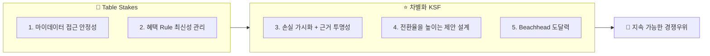

# 🏆 Top 5 핵심 성공 요인 (KSF)

> 분석 대상: 마이데이터 기반 미래지출 반영 카드조합 재설계 서비스.
> 1·2번은 **Table Stakes**(없으면 계산 자체가 성립하지 않는 진입 전제조건 — 기존 사업자는 이미 갖고 있어 경쟁우위를 주지 않음)이고, 3~5번이 **실제 차별화 KSF**(기존 사업자 대비 이길 수 있는 지점)다.

---

## 1. 🔐 마이데이터 데이터 접근의 안정적 확보

카드 이용내역은 마이데이터 API로만 제공되고 오픈뱅킹으로는 제공되지 않는다(🔵). 이 채널은 대체 공급자가 없는 높은 공급자 교섭력을 형성하며, 투입·조달 물류의 핵심 원자재이자 기업 인프라 단계의 핵심 과제(직접 인가 vs 제휴)이기도 하다. 이 데이터 채널이 없으면 서비스 전체가 성립하지 않으므로, 인가 취득 또는 제휴 계약의 **법적 안정성과 지속성**이 다른 모든 성공 요인의 전제조건이다.

## 2. 📋 카드 혜택 Rule의 최신성·정확성 관리 역량

카드 혜택 Rule(전월실적 구간·통합할인한도·제외 항목)이 8개 카드사와 겸영은행 약관에 파편화되어 있고 통합 공식 API가 없다(🔵). 이 데이터 운영 비용은 후발주자에게도 동일하게 적용되는 진입장벽이다. 이 Rule을 얼마나 빠르고 정확하게 갱신·검증하는가가 계산 결과의 신뢰도를 직접 결정하며, 경쟁자와의 격차를 만드는 지속 가능한 우위가 된다.

## 3. 💡 놓치는 혜택을 손실로 보여주고, 그 숫자를 믿게 만드는 것 (동기 + 신뢰)

구매자 교섭력과 대체재 위협이 모두 높으며, "그냥 기존 카드를 유지하는 것"이 가장 강력한 대체재다. 이 힘을 상쇄하려면 두 가지가 함께 필요하다.

- **① 동기**: 지금 카드를 그대로 쓰면 이번 지출에서 얼마를 놓치고 있는지를 손실로 보여준다(예: "지금 카드로는 혜택 0원, B카드로 바꾸면 8,000원 더 받는다").
- **② 신뢰**: 그 격차 숫자가 진짜 계산이라는 걸 사용자가 검증할 수 있게 계산 근거를 그대로 공개한다.

①만 있으면 "과장 광고 아니냐"는 의심을 사고, ②만 있으면 숫자는 투명한데 "그래서 뭐가 달라지는데"라는 무관심을 부른다 — 둘이 같이 있어야 실제로 카드를 바꾸는 행동까지 이어진다. "계산은 규칙 엔진, AI는 설명"이라는 원칙이 ②(신뢰)의 기술적 구현 조건이다. 단종카드 자동대체 후 "혜택 불일치" 민원이 이미 존재한다는 사실(🔵)은 근거 없는 자동 재배치에 대한 불신이 시장에 이미 형성되어 있다는 뜻이라 ②가 왜 필요한지를 뒷받침하지만, 실제로 "유지하기"라는 대체재를 이기는 힘은 ①(손실 가시화)에서 나온다.

## 4. 📈 전환율을 높이는 제안 설계 역량

계산상 유리한 조합을 제시해도 사용자가 실제로 전환하지 않으면 서비스의 가치(Payment Plan Selection Rate)는 증명되지 않는다. 전환율은 사용자가 부담 없이 실행할 수 있도록 제안 자체를 설계하는 데서 나온다 — 여러 카드를 한 번에 바꾸라고 하지 않고 효과가 가장 큰 카드부터 단계적으로 전환하게 하는 것, 여러 안을 늘어놓지 않고 결론을 하나로 압축해 선택 부담을 줄이는 것이 핵심이다.

## 5. 🎯 Beachhead(혼인) 채널을 통한 초기 도달력 확보

카드고릴라(MAU 140만)·뱅크샐러드(카드추천 130만) 등 기존 경쟁자는 이미 큰 트래픽을 확보했다. 이 격차를 정면으로 좁히기보다, 혼인 Beachhead(Trigger 감지 가능성이 높은 세그먼트, 웨딩업체 채널 등)를 통해 좁지만 확실한 초기 진입로를 확보하는 것이 현실적 성공 요인이다. TAM(마이데이터 이용자)에서 SAM(12개월 내 소비구조 변화 이벤트 발생자)으로, 다시 SOM(혼인 채택자)으로 좁혀가는 구조가 이 KSF의 실행 경로다.

---

## 📌 KSF 우선순위와 자원 배분 시사점

| 순위 | KSF | 구분 | 의미 |
| --- | --- | :---: | --- |
| 1 | 마이데이터 접근 안정성 | 🧱 Table Stakes | 인가 vs 제휴 결정을 가장 먼저 확정해야 나머지가 성립 — 기존 사업자는 이미 보유, 경쟁우위 아님 |
| 2 | 혜택 Rule 최신성 관리 | 🧱 Table Stakes | 초기에는 트렌드 키워드별 대표 카드 1~2종으로 범위를 좁혀 관리 부담을 낮춘다 |
| 3 | 손실 가시화 + 계산 근거 투명성 | ⭐ 차별화 KSF | 놓치는 혜택을 손실로 보여주는 문구 설계와, 계산·설명 분리 원칙을 시스템 설계 초기부터 함께 반영해야 나중에 되돌리기 어렵다 |
| 4 | 전환율을 높이는 제안 설계 | ⭐ 차별화 KSF | 계산 결과 제시만으로는 전환이 보장되지 않아, 부담을 낮추는 제안 설계 자체가 경쟁력이 됨 |
| 5 | Beachhead 도달력 | ⭐ 차별화 KSF | 초기 검증(Concierge Test)으로 도달률·전환율을 실측해야 함 |

**선택과 집중**: 순서를 정하는 기준은 의존성이다 — 마이데이터 접근·Rule 데이터 없이는 계산 자체가 성립하지 않으니 1·2번은 Table Stakes로 항상 선행되어야 한다. 3번(손실가시화+근거투명성)이 기존 사업자 대비 실제로 이길 수 있는 지점이라 핵심 KSF다.
