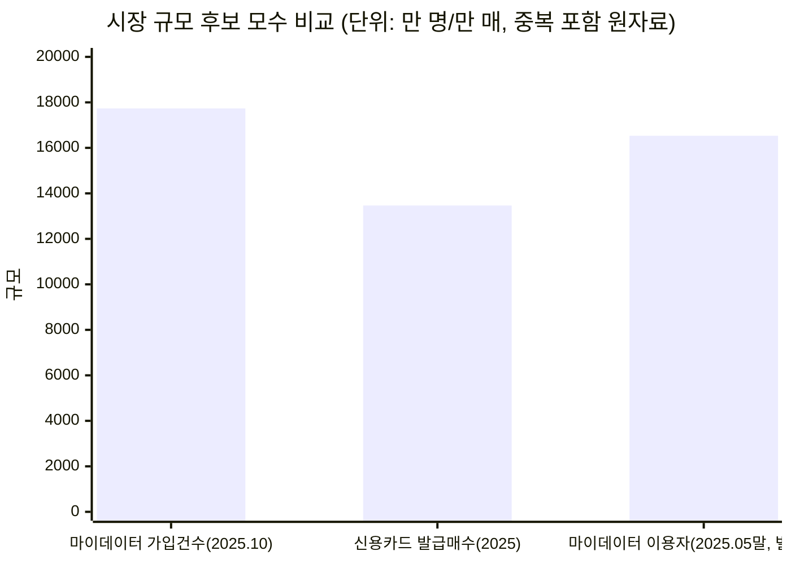
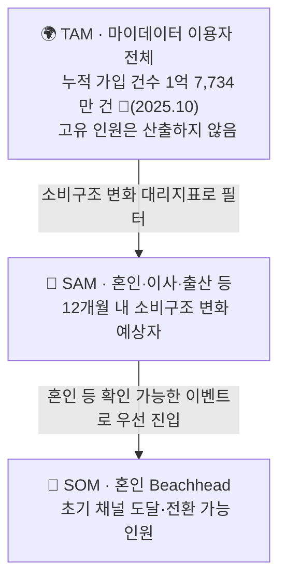

# 🌍 TAM-SAM-SOM & Market Segment Map

> **CardFit**은 소비가 바뀔 사람을 위해 카드 조합을 다시 계산해주는 서비스다.
> 마이데이터로 확보한 과거 소비 기록과 사용자가 직접 입력한 미래 소비 변화를 함께 반영해, 보유·신규카드의 실적 구간·혜택한도·연회비를 계산 근거와 함께 공개하며 실행 가능한 카드 조합 재배치안을 제시한다.
>
> 표기: 🔵 확인된 사실 · ⚪ 추론 · 🟡 가정

---

## 1. 시장 규모 후보 지표

| 후보 지표 | 값 | 집계 기준 | TAM으로 사용 |
| --- | --- | --- | :---: |
| 마이데이터 가입 건수 | 1억 7,734만 건(2025.10) | 서비스별 가입 누계, 중복 포함 | ✅ 채택 |
| 마이데이터 이용자 수(별도 집계) | 약 1억 6,531만 명(2025.05말) | 상이한 산정 기준 | ✗ 참고용(아래 설명) |
| 신용카드 발급매수 | 1억 3,466만 매(2025) | 카드 장수, 1인 다중보유 포함 | ✗ 사람 수 아님 |
| 개인카드 국내 이용액 누계 | 약 275.97조원 | 누계 거래액 | ✗ 사람 수 아님 |

마이데이터 가입 건수만이 "지출을 능동적으로 확인하는 사람"이라는 서비스 자격 기준과 직접 연결된다. 신용카드 발급매수는 카드 보유 여부만 나타내고 마이데이터 이용 여부와는 무관하다.



세 수치는 서로 집계 기준이 달라 단순 비교가 위험하다 — 신용카드 발급매수는 TAM에서 제외한다.

---

## 2. TAM 정의

**TAM = 마이데이터 서비스(뱅크샐러드·토스·카카오페이 등)를 이용해 본인 지출을 능동적으로 확인하는 사용자 전체.**

이 지표는 **마이데이터 누적 가입 건수**로 측정한다 — 1억 7,734만 건(🔵, 2025년 10월 기준, 서비스별 중복 가입 포함).

개인별 중복 가입을 제거한 고유 이용자 수는 공개되지 않는 지표다(🟠). "이용자 수"로 함께 유통되는 1억 6,531만 명(2025.05말)도 고유 인원으로 볼 수 없다 — 한국 인구가 약 5,170만 명인 것과 비교하면 두 수치 모두 인구 규모를 크게 초과하며, 이는 서비스별 가입을 중복 합산한 지표이지 실제 사람 수가 아니라는 뜻이다(⚪ 추론). 따라서 TAM은 **사람 수가 아니라 누적 가입 건수**로 표기하며, 임의의 환산 배수로 인원수를 만들지 않는다.

신용카드 실사용자를 앵커로 잡으면 채택 가능성이 낮은 인구와 디지털 비친화 인구까지 과다포함해 필터링 기능을 하지 못한다. 마이데이터 이용자는 지출을 능동적으로 확인하려는 의향과 디지털 앱 사용 능숙도를 동시에 가진 집단이고, MVP가 마이데이터 연동을 전제하므로 이 정의가 실제 이용 자격과 일치한다.

---

## 3. 수요 발생 원인 — 생애이벤트

| 원인 | Trigger 감지 가능성 | 1인당 지출강도 |
| --- | --- | --- |
| 혼인 | 높음(웨딩업체 신호로 감지 용이) | 최고 — 카드결제 대상 지출 1,473만~2,203만원(🔵) |
| 입주(이사) | 낮음(부동산 중개 파편화) | 확인 안 됨 — 혼인 지출과 중복이 커 독립 계상 어려움 |
| 출산 | 혼인·이사와 강하게 중복 | 미수집 |
| 이직·전직 | — | 소비변화 유의성이 위 셋보다 약함 |

혼인이 가장 데이터 신뢰도가 높은 원인이므로 1차 Beachhead로 채택한다. 다만 자녀 입학·유학·은퇴 등 다른 원인도 같은 수요를 만들며, 유학·은퇴처럼 소비가 감소하는 방향의 이벤트는 별도 설계가 필요하다.

---

## 4. SAM·SOM 산식

```
SAM = [ Σ(연간 소비변화 이벤트 발생 인원) − 중복 ] × 마이데이터 이용률
SOM = SAM × Beachhead 비중 × 초기 채널 도달률 × Payment Plan Selection Rate
```

| 대리지표 | 값 | 주의점 |
| --- | --- | --- |
| 혼인 건수 × 2(양 당사자) | 24만 건(+8.1%), 🔵 국가데이터처 2026.03.19 | 재혼 포함 여부 명시 필요 |
| 주민등록 전입(이사) 세대 수 | 이동자 611.8만 명, 주택사유 33.7%, 🔵 | 세대 기준으로 잡아야 중복 감소, 혼인과 중복분 제외 필요 |
| 출생아 수 | 🟠 미수집 | 혼인·이사와 강하게 중복 |
| 이직·전직자 수 | 🟠 미수집 | 소비변화 유의성이 약함 |

중복 제거 원칙: 신혼 1쌍은 혼인+이사+(경우에 따라)출산에 모두 잡힐 수 있어 "세대(가구) 단위" 카운트로 통일한다.

**3시나리오 민감도**

| 시나리오 | 중복률 가정 | 마이데이터 이용률 가정 | 산출 방식 |
| --- | --- | --- | --- |
| 보수 | 0.8(중복 많음) | 낮음 | SAM 최소값 |
| 기본 | 0.65 | 중간 | SAM 중심값 |
| 공격 | 0.5(중복 적음) | 높음 | SAM 최대값 |

---

## 5. TAM-SAM-SOM 구조



| 층 | 정의 | 값 |
| --- | --- | --- |
| TAM | 마이데이터 서비스를 이용해 본인 지출을 능동적으로 확인하는 사용자 전체 | 누적 가입 건수 1억 7,734만 건(🔵, 중복 포함) — 고유 인원은 산출하지 않음 |
| SAM | TAM 중 향후 12개월 내 소비구조가 유의미하게 바뀔 것으로 예상되는 사용자 | 혼인 연간 약 48만 명(24만 건 × 2) 등 대리지표 합산 예정 |
| SOM | SAM 중 Beachhead(혼인) 채택자 | 비중·도달률·선택률은 카드고릴라 MAU 140만·뱅크샐러드 130만을 상한 참고치로 사용 |

---

## 6. Market Segment Map — Beachhead 우선순위

세그먼트 축은 **Trigger 감지가능성 × 1인당 지출강도**를 사용한다 — 실측 데이터가 채워진 축이기 때문이다. "소비변화 예측가능성 × 보유카드 수" 축도 후보로 검토했으나, 실측 데이터가 없어 채택하지 않았다.

| 세그먼트 | Trigger 감지가능성 | 1인당 지출강도 | 우선순위 |
| --- | --- | --- | :---: |
| Q1. 혼인 | 높음 | 최고(1,473만~2,203만원, 🔵) | 🥇 1차 표적(SOM) |
| Q2. 입주(이사) | 낮음 | 확인 안 됨 — 혼인(Q1) 지출과 중복 | 대상 아님 — 혼인 지출과 중복이 커 독립 계상 어려움 |
| Q3. 해외여행(일반) | 낮음 | 낮음(1건당 약 102만원) | 대상 아님(신혼여행은 Q1에 포함) |
| Q4. 카드 갱신 일반군 | 매우 높음 | 낮음(무차별) | 대상 아님 — 채널 후보로만 참고 |

Q1~Q4는 이번 리서치로 데이터를 확보한 사건이며, 자녀 입학·유학·은퇴 등도 같은 수요를 만든다.

---

## 📌 종합

| 층 | 최종 앵커 |
| --- | --- |
| TAM | 마이데이터 이용자(누적 가입 건수 1억 7,734만 건, 고유 인원은 산출 불가) |
| SAM | 혼인·이사·출산 등 12개월 내 소비변화 이벤트 발생자(마이데이터 이용률 필터) |
| SOM | 혼인 Beachhead 채택자 |
