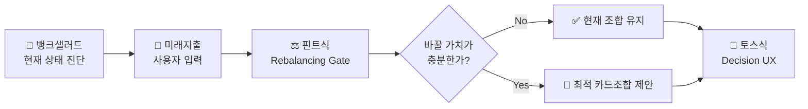
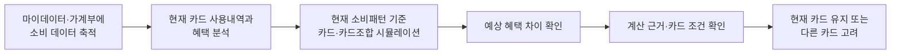
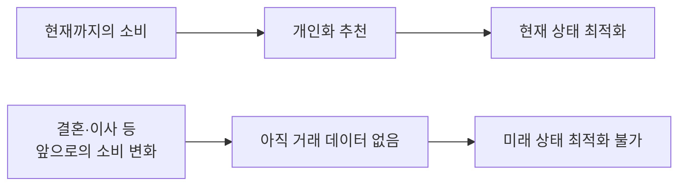
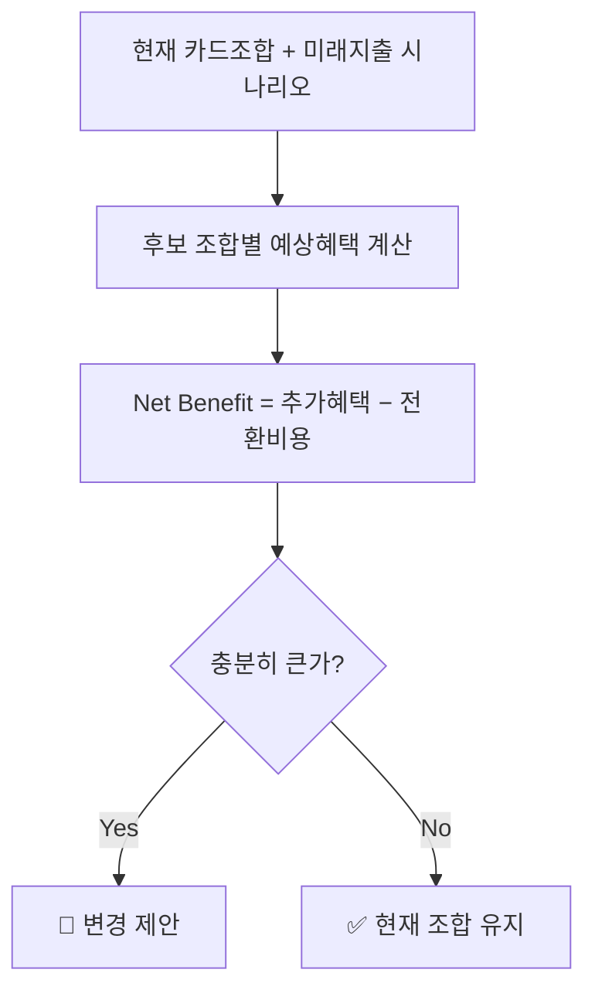
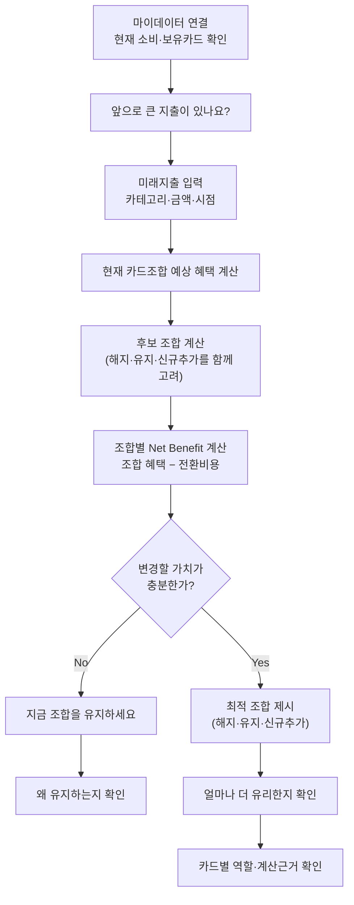

# 🔀 Benchmark & Mechanism Transfer

> 표기: 🔵 확인된 사실 · ⚪ 추론 · 🟡 가설

---

## 🧭 한눈에 보기

세 서비스는 서로 다른 역할을 맡는다.

| 역할 | 기준·벤치마크 | 가져오는 메커니즘 |
| --- | --- | --- |
| 현재 상태 진단 | 🏦 뱅크샐러드 | 실제 소비 데이터를 기준으로 카드 혜택과 놓치는 금액을 계산 |
| 미래 상태 전환 판단 | ⚖️ 핀트 | 현재-목표 상태 차이 + 변경비용을 고려한 리밸런싱 게이트 |
| 결과 이해·신뢰 | 💬 토스 | 결과를 먼저 이해시키고 세부 근거는 단계적으로 공개 |

---

## 1. 🏦 기준 서비스 분석 — 뱅크샐러드

### 현재 제공 가치

뱅크샐러드의 카드 추천은 가계부에 등록된 실제 소비 데이터를 카드 상품 데이터와 비교하는 방식이다(🔵). 기존 카드로 지출한 가맹점·업종·결제금액을 이용해 다른 카드를 사용했을 경우 받을 수 있었던 혜택을 시뮬레이션하며, 연회비·전월실적 조건·통합할인한도가 계산에 반영된다. 추천 카드 상세 화면에서는 예상 연 혜택 금액의 계산 근거도 확인할 수 있다. 여기에 더해 소비 패턴을 분석해 최적의 카드 조합을 추천하고 불필요한 연회비를 찾는 "내 카드 사용법" 기능도 제공한다(🔵).

> **핵심 가치**: 이미 발생한 소비를 분석해 지금 사용 중인 카드 구성이 얼마나 효율적인지 진단하고, 더 많은 혜택을 받을 수 있는 카드 또는 카드 조합을 발견하게 한다.

### As-Is 흐름

### 핵심 이탈 지점

| 단계 | 사용자 상태 | 이탈 가능 원인 | 근거 수준 |
| --- | --- | --- | :---: |
| 데이터 준비 | 개인화 추천을 기대함 | 등록된 소비 내역이 1개월 미만이면 추천 정확도가 낮아짐 | 🔵 |
| 데이터 매칭 | "내 카드 분석이 왜 안 되지?" | 카드사 카드명과 서비스 DB 카드명이 다르면 혜택 계산 자체가 불가능해짐 | 🔵 |
| 추천 확인 | 추천 금액을 확인함 | 과거 소비는 잘 설명하지만, 곧 발생할 고액지출·생활변화를 반영하지 못하면 자신의 앞으로 상황과 맞지 않는다고 판단할 수 있음 | ⚪ |
| 변경 판단 | 더 유리한 카드·조합을 확인함 | "지금 굳이 새 카드를 만들어야 하는가", "연회비·실적관리를 감수할 만큼 차이가 큰가"라는 판단이 추가로 필요함 | 🟡 |
| 신뢰 판단 | 예상 혜택을 확인함 | 자신의 실제 미래 소비가 아직 없는 상태에서는 제시된 혜택이 실제로 발생할지 확신하기 어려움 | 🟡 |

세 이탈 원인은 하나의 구조로 수렴한다.

> **개인화 수준이 높아질수록 추천의 품질은 사용 가능한 행동 데이터의 품질과 양에 강하게 의존한다.**

가장 중요한 지점은 "변경 판단"과 "신뢰 판단" 두 단계다 — 추천을 받아도 "앞으로 내 소비가 지금과 달라진다면 이 추천을 그대로 믿어도 되는가", "새 카드를 만들 만큼 차이가 큰가"라는 질문 앞에서 결정을 보류하게 된다. 여기서 실질적인 경쟁자는 다른 카드추천 서비스가 아니라 **"그냥 지금 카드를 계속 사용하는 것"**이다.

---

## 2. 🧩 문제 구조 추상화

**낮은 수준의 정의**: 뱅크샐러드에는 미래지출을 직접 입력해 카드조합을 계산하는 기능이 부족하다. — 이 표현은 기능 추가 제안에 머문다.

**구조적 정의**: 개인화 추천이 과거 행동 데이터에 의존할 경우, 소비구조가 크게 변하기 직전에는 추천에 필요한 데이터가 아직 존재하지 않는다. 따라서 사용자는 중요한 결제 의사결정을 내려야 하는 시점에 미래의 자신에게 적합한 결제수단을 판단하기 어렵다.

문제의 본질은 추천 정확도가 아니라 **시간축**이다.

- 현재 시스템이 푸는 질문: *"지금까지 이렇게 소비했다면 어떤 카드 구성이 유리했는가?"*
- 이 서비스가 푸는 질문: *"앞으로 이렇게 소비할 예정이라면 지금 어떤 카드 구성을 준비해야 하는가?"*

이렇게 추상화하면 카드 추천을 넘어 다음 문제들과 같은 구조를 갖는다.

| 구조 | 유사 문제 |
| --- | --- |
| 현재 상태와 미래 목표 상태의 차이 | 투자 포트폴리오 리밸런싱 |
| 변경의 효익과 변경비용 비교 | 자산배분·설비교체·SaaS 마이그레이션 |
| 여러 제약 안에서 최적 구성 결정 | 포트폴리오 최적화·자원배분 |
| 복잡한 계산을 사람이 판단 가능한 형태로 전달 | 금융자문·보험설계·대출비교 |
| 미래 입력값이 바뀌면 다시 계산 | 시나리오 플래닝 |

이 지점에서 핀트와 토스를 함께 참고하는 논리가 성립한다.

---

## 3. ⚖️ 핀트 — 전환 판단 + 배분 최적화

### 가져오는 문제 구조

핀트는 리밸런싱 효익이 거래비용보다 작다고 판단되면 매매를 미룬다(🔵). 가져오는 것은 투자상품이나 AI 모델이 아니라 다음 메커니즘이다.

> 현재 상태와 목표 상태가 다르다고 해서 무조건 변경하지 않는다. 변경으로 얻는 효익이 변경 비용보다 충분히 클 때만 행동을 제안한다.

### 카드 문제로 번역 — Rebalancing Optimization Engine

사용자가 지정한 최대 카드 수 안에서 유지·해지·신규추가를 함께 계산하고, Net Benefit(추가로 받는 혜택에서 연회비·실적 재적립 손실·발급 대기 비용을 뺀 값)이 절대·상대 기준을 모두 넘는 조합에 대해서만 변경을 제안한다. 넘지 못하면 결론은 "유지"다.

### 해결하는 이탈 지점

"새 카드를 만들 만큼 가치가 있는가?" — 추천의 목표를 "더 좋은 카드 찾기"에서 **"바꿀 가치가 있는 경우만 알려주기"**로 바꾼다.

---

## 4. 💬 토스 — 결과 전달

### 가져오는 문제 구조

토스는 해요체·능동형·긍정형 표현으로 복잡한 정보를 읽기 쉽게 전달하도록 UX Writing을 규칙화한다(🔵). 가져오는 것은 UI 외형이 아니라 다음 정보 위계다.

> 복잡한 계산을 사용자가 다시 해석하도록 하지 않고, 지금 알아야 할 결과와 다음 행동을 먼저 이해시킨다.

### 카드 문제로 번역

첫 결과 화면에는 결론 하나만 제시한다.

> **"A카드는 유지하고, B카드는 정리하고, C카드를 추가하는 조합이에요 — 지금보다 연 34,000원 더 받을 수 있어요."**

필요할 때만 상세 화면에서 카드별 예상 혜택, 전월실적·할인한도·연회비, 전환비용, 계산 기준일을 확인한다.

### 해결하는 이탈 지점

"혜택이 정말 이만큼 나오는가?" — 결론을 단순화하되 근거는 없애지 않는다.

---

## 5. 📌 믹스매치 종합

| 역할 | 기준·벤치마크 | 전이 원리 | 상태 |
| --- | --- | --- | :---: |
| 현재 상태 진단 | 뱅크샐러드 | 실제 소비 데이터 기준 혜택·손실 가시화 | ✅ 채택 |
| 전환 판단 + 배분 최적화 | 핀트 | Net Benefit 게이팅 — 바뀔 가치가 있을 때만 제안 | ✅ 채택 |
| 결과 전달 | 토스 | 결론 우선·단계적 근거 공개 | ✅ 채택 |

---

## 6. 🎯 To-Be 핵심 흐름

카드 한 장을 고르는 게 아니라, 해지·유지·신규추가를 함께 계산해 하나의 조합으로 압축한다. 무조건 신규카드를 추천하지도 않는다 — "유지" 역시 정상적인 추천 결과다.
