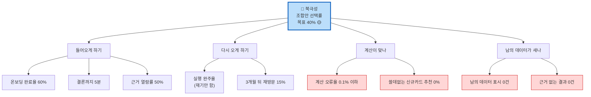

# 📊 제품 지표(KPI) 설계 — CardFit

> PRD(`효진/0820/09_PRD_Requirement_Trace_v0.1.md`)가 "무엇을 잰다"까지 정했다면, 이 문서는 **"그 숫자를 어떻게 세나"**를 정한다.
> 지표 이름만 있으면 개발자가 로그를 못 심고, 같은 로그에서 두 개의 값이 나온다. 그래서 세는 방법까지 못 박는다.
>
> 작성: 효진 · 2026-08-20 · 근거 등급 🔵 공식 · 🟡 팀 추정 · 🟠 아직 안 재봄 · ⚪ 사례 1건

---

## 1. 🎯 북극성 지표는 "조합안 선택률" 하나다

계산 결과를 받은 사람 중에서 **제시된 카드 조합을 실제로 저장·확정한 사람의 비율**이다. 100명이 결과 화면을 봤고 그중 40명이 "이 조합으로 하겠다"를 눌렀으면 40%다.

이걸 고른 이유는 단순하다. 우리 서비스가 하는 일은 "복잡한 계산을 대신해서 결론 하나를 준다"이고, 그 결론을 사용자가 받아들였는지가 곧 성공이다. 화면을 몇 번 봤는지, 몇 명이 가입했는지는 우리가 잘했는지를 알려주지 않는다.

무엇보다 이 숫자는 **나쁘면 내려간다.** 조합안이 엉터리면 아무도 저장하지 않으니 바로 표시가 난다. 반대로 "누적 가입자 수"는 서비스가 망해가는 중에도 계속 올라간다. 그래서 가입자 수는 안 쓴다.

그리고 이 숫자가 실제로 결정을 바꾼다. Concierge Test(사람이 직접 계산해서 30명에게 전달하는 실험)에서 이 값이 **20%에 못 미치면 "사람들이 미래 지출을 입력할 것"이라는 우리의 가장 큰 전제가 틀린 것**이고, 그때는 기능을 고치는 게 아니라 방향을 다시 잡는다.

---

## 2. 🧮 이 숫자를 어떻게 세나

지표 이름만 정하면 사람마다 다르게 센다. 세 가지를 못 박는다.

**① 사람 단위로 센다.** 한 사람이 조건을 바꿔서 계산을 5번 돌려도 1명이다. 화면 조회 횟수로 세면 이탈한 사람이 분모를 부풀려서 실제보다 나쁘게 나온다.

**② 결과를 본 날부터 7일 안에 저장하면 인정한다.** 금요일에 결과를 보고 주말에 고민하다가 월요일에 저장하는 사람이 있다. "이번 주에 본 사람 중 이번 주에 저장한 사람"으로 세면 이 사람이 통째로 사라진다. 그래서 주간 표는 참고로만 보고, **판단은 7일 기준 값으로 한다.**

**③ 계산에서 빼야 할 사람이 있다.** 이게 가장 중요하다.

우리 서비스는 카드를 바꿔서 얻는 이득이 전환비용보다 작으면 **"지금 카드 그대로 쓰세요"를 정답으로 내놓는다.** 이게 뱅크샐러드와 다른 우리 차별점이다. 그런데 이 답을 받은 사람은 **저장할 조합안 자체가 없다.** 이 사람을 분모에 넣으면 이상한 일이 생긴다 — 정직하게 "유지하세요"라고 잘 말할수록 북극성 점수가 떨어진다. 잘하면 점수가 내려가는 지표는 지표가 아니다.

그래서 이 사람들은 분모에서 빼고, **"유지하세요 답변 비율"이라는 별도 숫자로 따로 본다.** 계산이 실패한 사람과 내부 테스트 계정도 빼다.

> ⚠️ 단, 빠지는 사람이 너무 많으면 남는 모수가 얇아져서 값이 들쭉날쭉해진다. **빠지는 비율이 30%를 넘으면 세는 방법을 다시 설계한다.** Concierge Test에서 이 비율을 먼저 확인한다.

---

## 3. 📉 북극성만 보면 놓치는 사람 — 실행 완주율

조합안 선택률은 "골랐는지"까지만 잰다. 그런데 신은서 님은 카드를 해지하려고 3번 전화했고 3번 다 상담사가 만류해서 결국 못 했다(⚪). 이 분은 우리 화면에서 조합안을 골랐으니 **지표상으로는 성공으로 잡힌다.** 실제로는 아무것도 달라지지 않았는데도.

이 사각지대를 드러내기 위해 **실행 완주율**을 나란히 둔다. 조합안을 고른 사람에게 30일 뒤에 "실제로 바꾸셨어요?"를 물어서 재는 숫자다.

**중요한 건 이걸 재기만 하고 개입하지 않는다는 것이다.** 마이데이터 기반 서비스에는 해지·전환을 대신 해줄 권한이 없다(`윤정/확정본/02_Value_Chain.md` 5절). 상담 대행, 만류 대응 안내 같은 기능은 만들지 않는다. 사각지대를 눈에 보이게만 만든다.

**대답을 안 한 사람은 "못 한 것"으로 센다.** 무응답을 모수에서 빼면 숫자가 실제보다 좋게 나온다. 이 지표는 자랑용이 아니라 우리 스스로를 반박하는 용도라서, 좋게 나올 여지를 일부러 없앤다. 다만 응답률이 절반 아래면 이 값은 "최소한 이만큼은 실패했다"는 하한선으로만 읽는다.

두 숫자는 **항상 나란히 보고한다.** 선택률은 높은데 완주율이 20%p 이상 낮으면 경보로 다룬다.

---

## 4. 📋 지표 4계열 설계표

### 왜 계열 이름이 교안과 다른가

핀테크 지표는 보통 **들어오게 하기(전환) · 다시 오게 하기(유지) · 정산 · 부정거래** 네 묶음으로 본다. 그런데 우리는 뒤의 둘이 그대로 안 맞는다.

**정산은 아예 없다.** 우리는 돈을 만지지 않는다. 결제도 정산도 선불충전금도 없으니 "정산 오차 0건"을 적을 데가 없다. 대신 이 계열이 진짜 묻는 것 — **숫자가 틀리면 사용자가 돈을 잃는다** — 는 우리에게 그대로 있다. 혜택 계산이 틀리면 사용자는 잘못된 카드로 바꿔서 손해를 본다. 그래서 이 자리에 **계산이 맞나**를 넣었다.

**부정거래(FDS)도 없다.** 결제를 처리하지 않으니 도난카드나 chargeback이 없다. 대신 마이데이터는 대체 공급자가 없는 단일 채널이라(🔵) **남의 카드 내역이 내 화면에 뜨는 사고**가 같은 급이다. 그래서 **남의 데이터가 새나**를 넣었다.

돈을 안 만지는 서비스에 정산 오차율을 적는 게 오히려 도메인을 모르는 것이다.

### 표

| 계열 | 지표 | 지금 값 | 목표 | 어떻게 세나 | 같이 봐야 하는 숫자 | 아직 모르는 것 |
| :---: | --- | :---: | :---: | --- | --- | --- |
| **들어오게** | 🎯 **조합안 선택률** | 🟠 | **40%** 🟡 | 저장 누른 사람 ÷ 결과 본 사람 (2절 규칙) | 쓸데없는 신규카드 추천 **0%** | 40%가 맞는 눈금인지 → Concierge Test 30명으로 실측 |
| **들어오게** | 결론까지 걸린 시간 | 🟠 (수기 240분 ⚪) | **5분 이내** | 입력 완료 → 결과 표시까지. 상위 5% 느린 케이스 기준 | 계산 오류율 0.1% — 빠르게 하려고 규칙을 건너뛰면 안 됨 | 240분은 최유리 님 1명 진술 → 인터뷰 15명으로 분포 확인 |
| **들어오게** | 온보딩 완료율 | 🟠 | **60%** | 미래지출 입력 끝낸 사람 ÷ 마이데이터 동의한 사람 | 자유 입력 비율 급증 — 자동 채운 값을 확인 없이 넘기는지 | 자동 채우기가 이탈을 줄이는지 → A/B 500명 |
| **들어오게** | 근거 열람률 | 🟠 | **50%** | 근거 펼쳐본 사람 ÷ 결과 본 사람 | 근거 없이 나간 결과 **0건** | 낮게 나오면 관심이 없는 건지 근거가 부실한 건지 구분 필요 |
| **다시 오게** | **실행 완주율** | **0%** ⚪ | **목표 없음 — 실태 파악용** | 30일 뒤 "바꿨다" 답한 사람 ÷ 조합안 고른 사람 (무응답=못함) | 선택률과의 격차 **20%p 넘으면 경보** | 응답률이 절반은 넘는지 |
| **다시 오게** | 이벤트 없이 들어온 비율 | 🟠 | **20%** | 결혼·이사 같은 태그를 안 고르고 입력을 끝낸 비율 | 자유 입력 카테고리의 계산 실패율 | 이런 수요가 실제로 있는지 → 인터뷰 |
| **다시 오게** | 3개월 뒤 재방문율 | 🟠 | **15%** 🟡 | 첫 선택 후 83~97일 사이 앱을 다시 연 사람 비율 | — | ⚠️ **이번 검증 기간에는 못 잰다**(8절) |
| **계산이 맞나** | 계산 오류율 | 🟠 | **0.1% 이하** | 경계값 테스트 실패 건수 ÷ 전체. 같은 입력 두 번 넣어서 답이 다르면 0건이어야 함 | 이 자체가 브레이크 — **넘으면 즉시 중단** | 테스트 200건이 카드사 8곳을 덮는지 |
| **계산이 맞나** | 쓸데없는 신규카드 추천률 | 🟠 | **0%** | 이득이 전환비용보다 작은데도 "바꾸세요"라고 한 건수 | 이 자체가 브레이크 — **1건이라도 즉시 중단** | 이득/비용 눈금 위치 → 전환비용 실측 후 재조정 |
| **데이터가 새나** | 남의 데이터 표시 | 🟠 | **0건** | 마이데이터 응답의 주인과 로그인한 사람이 다른 건수 | 이 자체가 브레이크 — **1건이면 서비스 중단·신고** | 마이데이터 쪽이 이걸 보장하는지 → 제휴 계약서 확인 |
| **데이터가 새나** | 근거 없는 결과 노출 | 🟠 | **0건** | 공개 항목이 6개 미달인 결과 건수 (설계상 응답 자체를 거부) | 이 자체가 브레이크 | 6개가 충분한지 → 실험 참가자에게 "뭐가 더 궁금했나" 물어봄 |
| **데이터가 새나** | 실행 대행으로 오해될 문구 | 🟠 | **0건** | 금지어 검사기가 잡은 건수 | 이 자체가 브레이크 — 규제 위반 | ⚠️ **금지어 목록이 아직 없다** — 0건인지 판단할 기준 자체가 없음 |

---

## 5. 🖱 어떤 클릭을 기록해야 하나

PRD에 적힌 "로그"는 응답 시간, 적용한 규칙 번호 같은 **시스템 로그**다. 개발자가 서버 상태를 보려고 남기는 것이지 위 지표를 계산할 수 없다. 사용자가 어디서 무엇을 눌렀는지 따로 기록해야 한다.

모든 기록에 공통으로 붙는 것: **누가(user_id) · 어느 접속(session_id) · 언제(한국 시각) · 내부 테스트인지 · 어느 페르소나층인지 · 어느 채널로 들어왔는지**

| 기록할 순간 | 어느 기능 | 함께 남길 값 | 어느 지표에 쓰나 |
| --- | :---: | --- | :---: |
| 마이데이터 동의를 마쳤다 | F-02 | 동의 범위 | 온보딩 완료율 **분모** |
| 마이데이터 응답이 왔다 | F-02 | 성공/실패 코드, 카드 개수, 걸린 시간 | 남의 데이터 표시, 가용성 |
| 자동 채운 초기값을 보여줬다 | F-11 | 어디서 가져왔는지, 몇 칸 | A/B 실험 군 나누기 |
| 미래지출 입력을 저장했다 | F-01 | 카테고리 수, 자유 입력인지, **이벤트 태그를 골랐는지**, 입력에 걸린 시간 | 온보딩 완료율 **분자**, 이벤트 비종속 |
| 계산을 요청했다 | F-03 | 계산 번호 | 소요시간 시작점 |
| 계산 결과가 나왔다 | F-03·F-04 | 계산 번호, 적용 규칙 버전, 걸린 시간, 후보 수, **"바꾸세요"인지 "유지하세요"인지** | 소요시간, **빼야 할 사람 판정** |
| 계산이 실패했다 | F-03 | 오류 코드 | 분모에서 제외 |
| 결과 화면을 처음 봤다 | F-05 | 계산 번호 | 북극성 **분모** |
| 근거를 펼쳐봤다 | F-06 | 공개된 항목 개수 | 근거 열람률 |
| **조합안을 저장했다** | F-05 | 계산 번호, 조합 번호, 예상 순이익 | 북극성 **분자** |
| 스코프 경계 고지를 봤다 | F-12 | 머문 시간 | 범위 인지율 |
| 신뢰도 설문에 답했다 | — | 점수(1~5), 근거 공개군인지 | 계산 신뢰 응답률 |
| 30일 뒤 완주 여부에 답했다 | F-13 | 했는지, 못 한 이유 | 실행 완주율 |
| 앱을 다시 열었다 | — | 첫 선택으로부터 며칠 됐는지 | 재방문율 |

### AI 지표는 안 만든다

우리 계산부는 **규칙 엔진**이다. 같은 입력에 항상 같은 답이 나온다. 그래서 AI 모델에 쓰는 지표(추론 정확도, 성능이 시간에 따라 떨어지는지, 재학습 후 성능 보장)는 필요 없다. 우리한테 그 자리를 대신하는 건 **규칙 버전을 바꿀 때마다 경계값 테스트를 다시 돌리는 것**이다.

단, 나중에 "효과 큰 카드부터 단계적으로 제안하기"(F-07)에 개인화 모델이 들어가면 이 판단은 무효가 되고 모델 지표를 새로 만들어야 한다.

---

## 6. ⚠️ 짝지어 봐야 하는 숫자들

지표 하나만 보고 달리면 반드시 다른 하나가 망가진다. 네 쌍을 미리 못 박는다.

**① 온보딩 완료율 ↔ 입력 정확도.** 과거 소비 패턴으로 초기값을 미리 채워주면 완료율은 오른다. 그런데 사용자가 **틀린 값을 확인도 안 하고 그냥 넘길 수 있다.** 완료율은 60%를 넘겼는데 계산은 엉뚱한 숫자로 돌아가는 상태가 최악이다. 자유 입력 비율과 재계산 요청률로 감시한다.

**② 결론까지 5분 ↔ 계산 오류율·근거 항목 수.** 5분을 맞추는 제일 쉬운 방법은 규칙을 몇 개 건너뛰거나 근거 공개를 6개 미만으로 깎는 것이다. 그러면 "계산 근거를 다 보여준다"는 우리 차별점이 사라진다.

**③ 조합안 선택률 ↔ 쓸데없는 신규카드 추천 0%.** 이게 우리 제품의 핵심 긴장이다. 선택률을 올리는 가장 쉬운 방법은 **혜택 좋아 보이는 신규카드를 슬쩍 끼워 넣는 것**이다. 그러면 숫자는 오르지만 "바꿀 가치가 있을 때만 권한다"는 원칙이 무너지고, 뱅크샐러드와 다를 게 없어진다. 그래서 이 숫자는 목표 0%가 아니라 **1건이라도 나오면 즉시 중단**으로 걸어놨다.

**④ 어떤 편의성 숫자든 ↔ 남의 데이터 표시 0건·오해 문구 0건.** 이 둘은 협상 대상이 아니다. 다른 지표가 얼마나 좋아졌든 상관없이 1건이면 멈춘다.

---

## 7. 🚫 쓰지 않기로 한 지표

| 안 쓰는 것 | 왜 | 대신 |
| --- | --- | --- |
| 누적 가입자 수 | 마이데이터 동의만 하고 계산은 안 받은 사람이 섞인다 | 온보딩 완료율 |
| 앱 다운로드 수 | 웨딩 채널 광고 성과와 제품이 좋은지가 구분되지 않는다 | 첫 계산까지 도달한 비율 |
| 결과 화면 조회 수 | 한 사람이 조건 바꿔가며 5번 보면 5로 잡힌다 | 사람 단위 북극성 |
| 계산 요청 건수 | 마이데이터는 **부를 때마다 돈이 나간다**(🔵). 호출량은 비용이지 성과가 아니다 | 계산 한 번당 선택 전환율 |
| "예상 절감액 합계 O억" | 실제로 실행되지 않은 돈이다. 신은서 님 사례가 그대로 성과로 잡힌다 | 실행 완주율을 곱해서만 |

---

## 8. ⏰ 언제부터 잴 수 있나

| 지표 | 처음 재는 실험 | 시점 |
| --- | :---: | --- |
| 🎯 조합안 선택률 | **Concierge Test** (30명, 사람이 직접 계산) | 착수 +5~7주 |
| 근거 열람률·신뢰 응답 | 같은 실험 (근거 공개군 15명 / 미공개군 15명) | 착수 +5~7주 |
| 결론까지 걸린 시간 | Concierge → A/B | +5~7주는 **사람이 계산한 시간**이라 대조군 값. 제품 속도는 A/B부터 |
| 온보딩 완료율 | A/B (500명, 250 대 250) | 착수 +9~11주 |
| 계산 오류율 | 경계값 회귀 테스트 (200건 이상) | 착수 +9~11주 |
| 실행 완주율 | Concierge 참가자에게 30일 뒤 확인 | 착수 +9~11주 |
| **3개월 뒤 재방문율** | — | ⚠️ **못 잰다** |

3개월 재방문율은 첫 선택자가 나오는 시점(+7주)에 90일을 더해야 하니 **착수 +20주**다. 전체 검증 기간이 15~17주라서 이 안에 값이 나오지 않는다. 애초에 "지속 사용 동기"는 이번 범위에서 빼기로 한 것과도 맞다. 그래서 지표판에는 **"베타 이후 측정 예정"으로 적고 목표 15%는 미확정으로 내린다.**

---

## 9. ❓ 아직 모르는 것

확정 사실은 그냥 적고, 가정에는 "무엇으로 확인하면 이 판단이 뒤집히나"를 붙인다.

| # | 가정 | 등급 | 뒤집히는 조건 | 확인 방법 | 담당 |
| :---: | --- | :---: | --- | --- | :---: |
| 1 | 선택률 40%가 맞는 눈금 | 🟡 | 실험에서 20% 미달 | Concierge Test 30명 | 효진 |
| 2 | 분모에서 빠지는 사람이 30% 미만 | 🟠 | 30% 넘으면 세는 법 재설계 | 같은 실험에서 "유지하세요" 비율 확인 | 효진 |
| 3 | **금지어 목록이 있다** | 🟠 **없음** | — (지금 없다) | **착수 전에 만들어야 함** | 효진 |
| 4 | 계산부가 계속 규칙 엔진이다 | 🟡 | F-07에 개인화 모델 들어가면 | v2 로드맵 검토 시 | 윤정 |
| 5 | 마이데이터 쪽이 데이터 주인을 보장한다 | 🟠 | 오조회 1건 발생 | 인가·제휴 계약서 확인 | 윤정 |
| 6 | 완주 응답률이 절반은 넘는다 | 🟠 | 미달이면 하한선으로만 읽음 | 30일 확인 실험 | 효진 |
| 7 | **목표 숫자들의 외부 근거** | 🟠 **없음** | — | `윤정/확정본/11_Benchmark_Transfer.md`에 전환율 벤치마크가 없음을 확인. **"팀 합의 눈금"으로 성격을 바꿔 표기** | 효진 |
| 8 | 테스트 200건이 카드사 8곳을 덮는다 | 🟡 | 실적구간 조합이 200개를 넘으면 | 약관 실물 대조 | 윤정 |

**3번과 7번이 실제 걸림돌이다.** 3번은 오늘 만들 수 있다. 7번은 없는 근거를 만들어 붙이지 않고, **외부 벤치마크가 없다는 사실 자체를 적는 것**으로 처리한다.

---

## 📌 정리

| 항목 | 결론 |
| --- | --- |
| 북극성 | 조합안 선택률 하나 — 사람 단위, 7일 기준, "유지하세요" 받은 사람은 제외 |
| 반드시 짝으로 | 실행 완주율(재기만 함) · 쓸데없는 신규카드 추천 0% |
| 브레이크 | 계산 오류·불필요 추천·남의 데이터·근거 누락·오해 문구 — **넘으면 멈춘다** |
| 안 쓰는 것 | 가입자 수, 다운로드 수, 조회 수, 호출 건수, 예상 절감액 합계 |
| 지금 상태 | **재는 방법은 정했고 값은 하나도 없다.** 기준선 11개 전부 🟠 |
| 값을 얻는 경로 | **Concierge Test 하나뿐이다** (30명, 사람이 직접 계산) |

**선택과 집중**: 이 문서에서 오늘 더 할 수 있는 건 **금지어 목록 작성**뿐이다. 나머지 빈칸은 문서를 더 써서 채워지지 않고 실험을 돌려야 채워진다. 발표에서는 "기준선은 아직 없고, Concierge Test가 그걸 확보하는 계획"이라고 그대로 말하는 것이 이 설계의 정직한 상태다.

---

### 참고한 문서

- `효진/0820/09_PRD_Requirement_Trace_v0.1.md` — 지표 정의·목표값·실험 계획, 기능 번호(F-01~F-14)
- `윤정/확정본/02_Value_Chain.md` 5절 — 해지·전환 대행 권한이 없다 → 실행 완주율을 "재기만" 하는 근거
- `윤정/확정본/03_KSF.md` — 손실 가시화·근거 투명성 → 근거 열람률, 전환율 제안 설계 → 북극성
- `윤정/확정본/11_Benchmark_Transfer.md` — 전환율 벤치마크 **없음**을 확인(가정 7번)
- `가람/확정본/06_Opportunity_Score.md`·`07_JTBD.md` — Job 우선순위 → 계열 비중
- `가람/0819/Evidence Log.md` E-05 — 가장 큰 가정이 바뀐 지점 → 가정 1번 검증 설계
