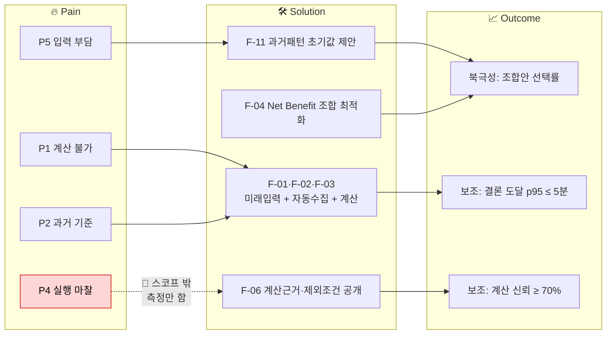
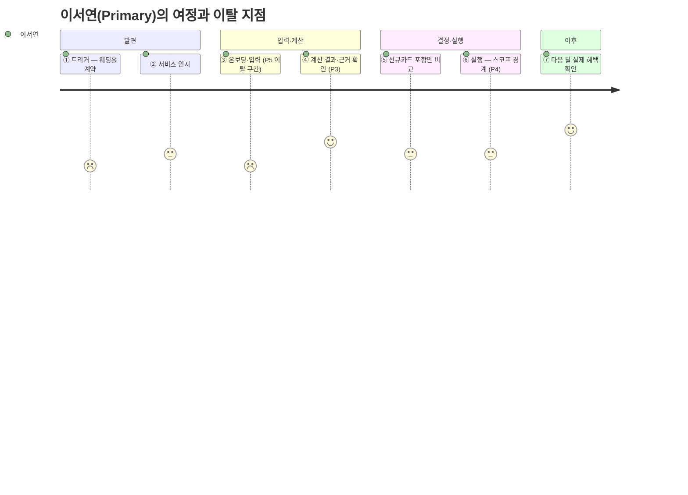
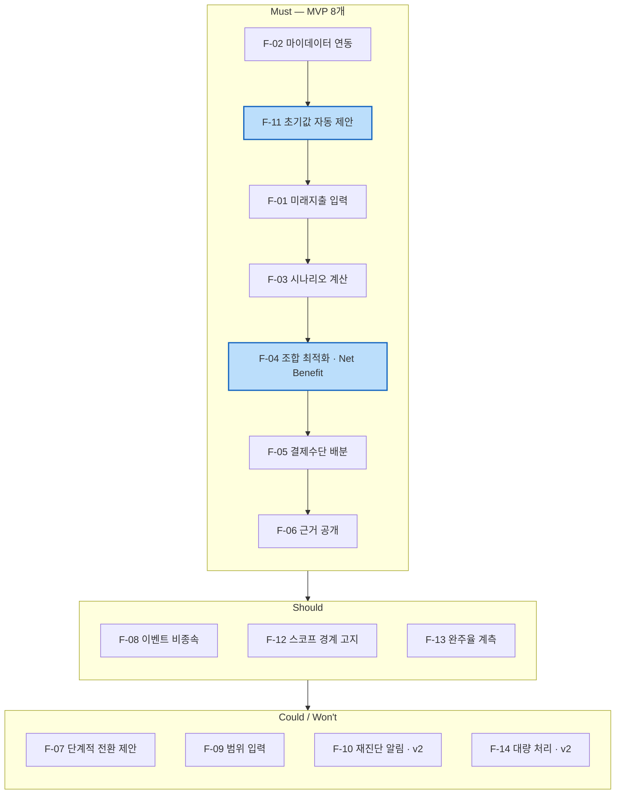
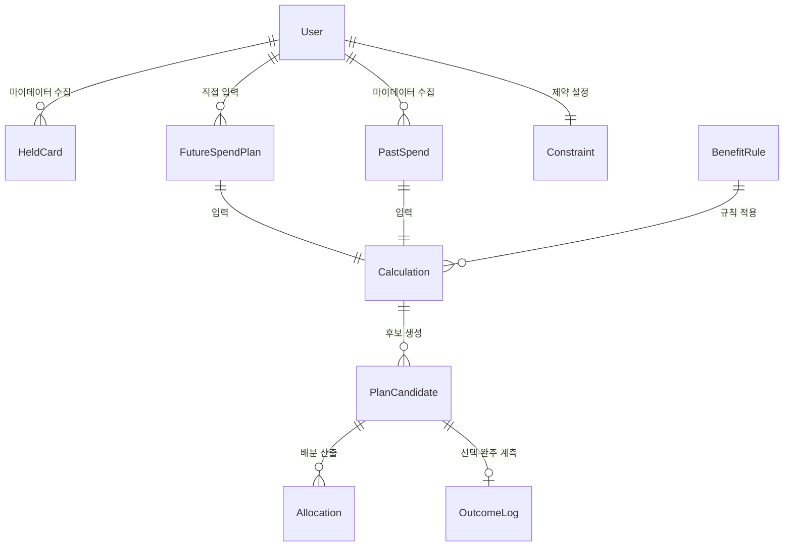
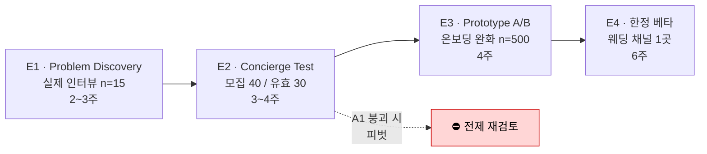

# CardFit — 미래지출 결제설계 서비스 PRD v0.1

- **Owner 팀**: 미정 (`master-deck/README.md` §3 B-8 팀명 확정 대기) · 문서 담당 효진(방법론 09)
- **최종 업데이트**: 2026-08-20
- **입력 문서**: `윤정/0820/VPS_Cross-Validation_Claude-vs-GPT.md`(확정안 A·B·C) · `윤정/0820/VPS_Claude-Sonnet-5_*.md` · `윤정/확정본/01~04·11` · `가람/확정본/05~07` · `가람/0820/경쟁사 분석 결과.md`

> **수치 표기 규칙** — 이 PRD의 모든 수치에 등급을 붙입니다.
> 🔵 **확인된 사실**(공개 통계·1차 출처) · ⚪ **추론**(확인된 사실에서 유도) · 🟡 **제안값**(이 PRD가 처음 제시 — 팀 승인 필요) · 🟠 **미측정**(기준선 없음)
>
> ⚠️ **기준선 대부분이 🟠입니다.** 서비스가 아직 없어 실측 기준선이 존재하지 않습니다. 목표값은 전부 🟡 제안값이며, Concierge Test(E2) 이후 재설정을 전제로 합니다. **AOS·DOS는 팀 추정 가설이고 JTBD에는 모의 인터뷰가 포함되어 있으므로 실측값처럼 인용하지 않습니다.**

---

## 1. 개요·목표

### 1.1 제품 한 줄 정의

> **CardFit은 결혼·이사처럼 소비구조가 바뀌기 전에, 과거 소비와 사용자가 입력한 미래 변화를 함께 계산하여 유지·정리·신규 카드의 최적 조합과 결제수단별 배분을 검증 가능한 근거로 제시한다. 전환비용을 제하고도 바꿀 가치가 있을 때만 변경을 권하고, 아니라면 현재 조합 유지를 결론으로 제시한다.**

### 1.2 문제 정의 — Pain별 실패 KPI

각 Pain은 **"이 수치를 넘으면 제품이 실패한 것"**이라는 실패 임계치와 함께 정의합니다.

| # | Pain (출처) | 실패 KPI (이 선을 넘으면 실패) | 기준선 | 근거 |
| :---: | --- | --- | :---: | :---: |
| **P1** | 전월실적 구간·혜택한도·연회비가 얽혀 **스스로 계산할 수 없다** — Core 5명 | 미래지출 입력 → 조합 결론 도달 **p95 > 5분**, 또는 결과 도달률 **< 60%** | 🟠 미측정 (수기 대안 약 240분 ⚪) | 최유리 *"제가 직접 하면 반나절"* |
| **P2** | 기존 추천이 **과거 소비만 본다** — 이서연·오세훈·강민재 | 결과 확인 후 **"내 상황과 맞지 않는다" 응답률 ≥ 40%** | 🟠 | 경쟁 5곳 중 미래 입력 단계 0곳 🔵 |
| **P3** | 카드사가 **근거 없이 자동대체를 실행한다** — 박서준 | 근거 화면 열람 후 **계산 신뢰 응답 < 70%**(5점 척도 4점 이상 비율) | 🟠 | 자동대체 혜택 불일치 민원 **2022→2025 +88.4%** 🔵 |
| **P4** | 계산이 맞아도 **실행이 안 된다** — 신은서·이서연·박서준 | 조합안 선택 후 **30일 내 실행 완주율 < 30%** | **0%** (신은서 3회 시도 0회 성공) ⚪ | 해지 절차 마찰 민원 🔵 · CJM 완주 실패 4명 중 2명이 실행 단계 |
| **P5** | 미래 지출 **예측·입력 자체가 부담**이다 — 조민아 | **온보딩 이탈률 ≥ 40%**(마이데이터 연동 동의 + 미래지출 입력 구간 합산) | 🟠 | 조민아 *"입력 수고 대비 가치 부족"* 🟡(모의) |
| **P6** | 처리 항목이 많으면 **정보 과부하로 포기한다** — 윤태호 | 보유카드 **10장 이상** 사용자의 결과 화면 이탈률 **≥ 50%** | 🟠 | 윤태호 CJM ⑤~⑥ 실행 포기 |
| **P7** | 이벤트가 끝나면 **계속 쓸 이유가 없다** — 김도윤·한지민·최유리 | **D+90 재방문율 ≤ 10%** | 🟠 | Job E, AOS·DOS 모두 후순위 |

### 1.3 목표 — Desired Outcome 수치화

| 목표 | 수치화된 정의 | 등급 |
| --- | --- | :---: |
| **G1. 계산을 대신한다** | 사용자가 수기로 240분 쓰던 판단을 **p95 5분 이내**에 하나의 결론으로 받는다 | 🟡 |
| **G2. 미래를 기준으로 삼는다** | 조합 계산에 **미래 입력값이 반영된 비율 100%** — 미래 입력 없이 산출된 결과는 결과로 취급하지 않는다 | 🟡 |
| **G3. 바꿀 가치가 있을 때만 권한다** | Net Benefit 임계 미달 케이스에서 **"현재 조합 유지" 결론 반환률 100%** — 신규카드를 끼워 넣지 않는다 | 🟡 |
| **G4. 검증 가능하게 만든다** | 결과 1건당 **적용 규칙·제외 조건 공개 항목 ≥ 6개**(실적구간·혜택한도·연회비·제외조건·계산 기준일·미반영 항목) | 🟡 |
| **G5. 실패를 보이게 만든다** | 실행 완주율을 **측정 지표로 상시 노출** — 개입은 하지 않되 사각지대를 없앤다 | 🟡 |

### 1.4 성공 지표 — 북극성 / 보조 / Guardrail

**북극성 KPI**

| 지표 | 정의 | 기준선 | 목표 | 측정 주기 |
| --- | --- | :---: | :---: | :---: |
| **Payment Plan Selection Rate** (조합안 선택률) | 결과 화면에 도달한 사용자 중 제시된 조합안을 **선택(저장·확정)**한 비율 | 🟠 미측정 | **≥ 40%** 🟡 | 주간 |

> **북극성의 알려진 한계** — 이 지표는 "선택"까지만 잽니다. 신은서 유형은 선택 후 실행에 실패하는데 **지표상 성공으로 집계**됩니다. 그래서 보조 KPI에 **실행 완주율(측정 전용)**을 두어 사각지대를 드러냅니다. 제품이 실행에 개입하지는 않습니다(§7 Out).

**보조 KPI**

| # | 지표 | 대응 Pain·Job | 기준선 | 목표 | 주기 |
| :---: | --- | :---: | :---: | :---: | :---: |
| S1 | 결론 도달 소요시간 p95 | P1 / A | 🟠 (수기 240분 ⚪) | **≤ 5분** 🟡 | 주간 |
| S2 | 온보딩 완료율 (연동 동의 → 미래입력 완료) | P5 / D | 🟠 | **≥ 60%** 🟡 | 주간 |
| S3 | 계산 근거 열람률 | P3 / B | 🟠 | **≥ 50%** 🟡 | 주간 |
| S4 | 계산 신뢰 응답률 (5점 중 4점 이상) | P3 / B | 🟠 | **≥ 70%** 🟡 | 실험 단위 |
| S5 | **실행 완주율 (측정 전용)** | P4 / C | **0%** ⚪ | 실측 후 설정 🟠 | 월간 |
| S6 | 이벤트 비종속 진입 비율 (이벤트 선택 없이 완주) | F | 🟠 | **≥ 20%** 🟡 | 월간 |
| S7 | D+90 재방문율 | P7 / E | 🟠 | **≥ 15%** 🟡 | 월간 |

**Guardrail** — 넘으면 롤아웃을 멈춥니다.

| # | 지표 | 임계 | 근거 |
| :---: | --- | :---: | --- |
| GR1 | 계산 오류율 (경계값 회귀 실패 건수 / 전체 케이스) | **≤ 0.1%** 🟡 | 규칙 엔진이 결정론적이므로 오류는 버그 |
| GR2 | 불필요 신규카드 추천 비율 (Net Benefit 임계 미달인데 변경 제안) | **0%** 🟡 | G3 위반 = 차별점 B 붕괴 |
| GR3 | 근거 미공개 결과 노출 건수 | **0건** 🟡 | 차별점 C의 전제 |
| GR4 | 실행 지원으로 오인될 문구 노출 | **0건** 🟡 | `윤정/확정본/02` 스코프 위반 = 규제 리스크 |
| GR5 | 데이터 최신성 경고 미표시율 (약관 갱신 지연 시) | **0%** 🟡 | Table Stakes 2 |

---

## 2. 사용자와 페르소나

### 2.1 대상 정의

| 층 | 정의 | 규모 | 등급 |
| --- | --- | --- | :---: |
| TAM | 마이데이터 서비스로 본인 지출을 능동적으로 확인하는 사용자 | 마이데이터 누적 가입 **1억 7,734만 건**(2025.10, 서비스별 중복 포함) | 🔵 |
| SAM | 향후 12개월 내 소비구조가 유의미하게 바뀔 사용자 | 혼인 **24만 건(+8.1%)** 등 대리지표 합산 | 🔵 |
| SOM | 혼인 Beachhead 채택자 | 비중·도달률·선택률 미확정 | 🟠 |

> ⚠️ **누적 가입 건수를 고유 인원으로 환산하지 않습니다**(`윤정/확정본/04` TAM 정의). TAM은 사람 수가 아닙니다.

### 2.2 핵심 페르소나와 Pain·Needs 연결

| 층 | 페르소나 | 여정 단절 지점 | Pain 링크 | Needs |
| :---: | --- | :---: | :---: | --- |
| 🔵 **Primary** | **이서연** (32·마케팅 대리, 3개월 뒤 혼인) | ③ 온보딩 · ⑥ 실행 | P1·P5·P4 | 미래 지출을 입력하면 카드별 배분이 계산되어 나올 것 |
| 🔵 Core | 박서준 (34·영업직, 자동대체 피해) | ④ 계산 결과 | **P3** | 카드사 결정 **이전에** 스스로 검증할 근거 |
| 🔵 Core | 최유리 (39·회계 과장, 발령) | ④ 계산 결과 | P1·P3 | 회계 지식으로 직접 검증 가능한 산출 근거 |
| 🔵 Core | 한지민 (36·프리랜서, 소득 불규칙) | ③ 온보딩 | P5 | 범위(최소/평균) 시나리오 입력 |
| 🟢 Secondary | 오세훈 (32·이직) · 강민재 (55·자녀 독립) | ② 인지 | P2 | 이벤트명 없이 지출 변화값만으로 반응 |
| 🔴 Boundary | 신은서 (29·해지 3회 실패) | **⑥ 실행 실패** | **P4** | 실행 지원 — **스코프 밖. 측정만 함** |
| 🔴 Boundary | 윤태호 (44·카드 20장+) | ⑤~⑥ 포기 | P6 | 단계 쪼갠 제시 |
| ⚪ **Excluded** | 배정호 (62·현금·체크카드) | ② 인지 이탈 | — | **대상 제외** — 마이데이터 미이용으로 TAM 자격 미달 |

### 2.3 서비스 고유 7단계 여정

**가장 취약한 전환점은 ③과 ⑥입니다.** ③에서 조민아가 이탈하고, ⑥에서 신은서·윤태호가 실패합니다. **③은 제품이 개입하고(F-11), ⑥은 개입하지 않고 측정만 합니다(S5).**

---

## 3. 사용자 스토리와 수용 기준(AC)

Job A~F를 사용자 스토리로 변환했습니다. 모든 AC는 Given/When/Then과 **측정 가능한 임계치**를 포함합니다.

### US-A. 미래 지출을 카드 혜택과 연결해 계산받기 (Job A · 우선순위 1)

> **As a** 3개월 내 혼인 예정인 마이데이터 이용자(이서연),
> **I want** 앞으로 발생할 지출의 카테고리·금액·시점을 입력해 카드 조합을 다시 계산받고,
> **so that** 놓치는 혜택 없이 결혼 준비 지출을 배분할 수 있다.

| AC | Given | When | Then (임계치) |
| :---: | --- | --- | --- |
| **AC-A1** | 마이데이터 연동이 완료되고 보유카드 ≥ 1장이 수집된 상태 | 미래지출 항목을 **1건 이상** 입력하고 계산을 요청 | 조합 결론이 반환된다 — **p95 ≤ 5초**(계산 응답), **입력 시작→결론 도달 p95 ≤ 5분**(세션 전체), 실패율 **< 0.5%** |
| **AC-A2** | 미래지출 입력이 0건인 상태 | 계산을 요청 | 결과를 반환하지 **않고** 입력을 요구한다 — 미래 입력 미반영 결과 노출 **0건**(G2) |
| **AC-A3** | 미래지출 3건 + 보유카드 5장이 입력된 상태 | 계산 결과를 확인 | 카드별 **역할·배분 금액**이 모두 표기된다 — 배분 합계와 입력 지출 총액 오차 **≤ 1원** |
| **AC-A4** | 마이데이터 API가 응답하지 않는 상태 | 계산을 요청 | **"최근 확인된 데이터 기준"** 경고를 표시하고 데이터 기준일을 노출한다 — 경고 미표시 **0건**(GR5) |

### US-B. 계산 근거를 직접 검증하기 (Job B · 우선순위 4)

> **As a** 회계 실무자(최유리) 또는 자동대체 피해 경험자(박서준),
> **I want** 결과 금액이 어떤 규칙으로 산출됐고 무엇이 제외됐는지 확인하고,
> **so that** 카드사 설명이나 감이 아니라 내가 검증한 숫자로 결정할 수 있다.

| AC | Given | When | Then (임계치) |
| :---: | --- | --- | --- |
| **AC-B1** | 조합 결론이 반환된 상태 | 근거 화면을 열람 | **적용 규칙·제외 조건 항목 ≥ 6개**가 표기된다(실적구간·혜택한도·연회비·제외조건·계산 기준일·미반영 항목) — 6개 미달 노출 **0건**(GR3) |
| **AC-B2** | 근거 화면을 열람한 상태 | 카드 1장의 산출 내역을 펼침 | 해당 카드의 **입력값 → 적용 규칙 → 산출 금액** 경로가 재현 가능하게 표시된다 — 동일 입력 재계산 시 결과 불일치 **0건**(결정론성) |
| **AC-B3** | 계산에 포함되지 않은 비용(포인트 소멸·자동납부 승계 등)이 존재하는 상태 | 근거 화면을 열람 | **"이 계산에는 포함되지 않았습니다"**가 항목별로 명시된다 — 미고지 누락 항목 **0건** |
| **AC-B4** | 근거 화면 열람을 완료한 상태 | 신뢰도 설문에 응답 | **5점 중 4점 이상 비율 ≥ 70%**(S4) |

### US-C. 실행까지 완주하기 (Job C · 우선순위 1 — **스코프 경계 스토리**)

> **As a** 계산상 해지가 유리하다고 확인한 사용자(신은서·이서연),
> **I want** 이 서비스가 어디까지 도와주는지 명확히 알고,
> **so that** 기대와 실제가 어긋나 신뢰를 잃지 않는다.

> ⚠️ **이 스토리는 실행을 지원하지 않습니다.** `윤정/확정본/02_Value_Chain.md`가 카드 신청·해지 안내·상담·신청 대행·콜센터 대응 지원을 **모두 제외**했습니다. Job C는 AOS·DOS 공동 1순위지만, **해소하지 않고 정직하게 남겨두는 것**이 교차검증된 결정입니다(`VPS_Cross-Validation` §2-C). 이 스토리의 목표는 실행 지원이 아니라 **기대 격차 방지 + 실패 측정**입니다.

| AC | Given | When | Then (임계치) |
| :---: | --- | --- | --- |
| **AC-C1** | 조합 결론에 "해지" 항목이 포함된 상태 | 결과 화면을 확인 | **"신청·해지는 카드사에서 직접 진행하셔야 합니다"** 경계 안내가 노출된다 — 미노출 **0건** |
| **AC-C2** | 결과 화면 전체 문구가 렌더링된 상태 | 문구 검수 자동 스캔을 실행 | **실행 지원으로 오인될 표현 0건**(GR4) — 금지어 사전(해지 대행·상담 연결·만류 대응 등) 기반 |
| **AC-C3** | 사용자가 조합안을 선택한 상태 | 30일 경과 후 후속 확인에 응답 | 실행 완주 여부가 **집계된다** — 응답 수집률 **≥ 30%**(계측 파이프라인 작동 최소선 🟡), 집계 실패 **0건**. **제품은 개입하지 않는다.** 별도로 **응답률 50% 미만이면 S5를 하한값으로만 해석**한다(값 해석 규칙 — `final/05_실험_설계서.md` §4) |
| **AC-C4** | 조합안을 선택한 상태 | 온보딩·결과 화면을 통과 | 서비스 범위를 **명시적으로 확인한 사용자 비율 ≥ 90%** 🟡 |

### US-D. 부담 없이 유연하게 입력하기 (Job D · 우선순위 5)

> **As a** 소득이 불규칙한 프리랜서(한지민) 또는 예측 자체가 부담스러운 사용자(조민아),
> **I want** 정확한 숫자를 몰라도 입력을 시작할 수 있고,
> **so that** 숫자를 모른다는 이유로 서비스를 포기하지 않는다.

| AC | Given | When | Then (임계치) |
| :---: | --- | --- | --- |
| **AC-D1** | 마이데이터 연동이 완료된 상태 | 미래지출 입력 화면에 진입 | 과거 소비 패턴 기반 **초기값이 자동 제안**된다(F-11) — 자동 제안 항목 **≥ 3개**, 제안 생성 실패율 **< 1%** |
| **AC-D2** | 초기값이 제안된 상태 | 값을 수정하지 않고 계산을 요청 | 계산이 정상 진행된다 — **입력 필수 항목 0개**(직접 입력 강제 없음) |
| **AC-D3** | 소득·지출이 불확실한 상태 | 범위(최소~평균)로 입력(F-09) | 시나리오별 결과가 **최소 2개** 반환된다 |
| **AC-D4** | 온보딩 세션이 시작된 상태 | 완료까지 진행 | **온보딩 완료율 ≥ 60%**(S2), 마이데이터 동의 구간 이탈률 **< 25%** 🟡 |

### US-E. 이벤트 종료 후에도 계속 쓰기 (Job E · 우선순위 5 · 비MVP)

> **As a** 혼인·이사를 마친 사용자(김도윤·한지민·최유리),
> **I want** 상황이 다시 바뀔 때 알림을 받고,
> **so that** 한 번 쓰고 잊는 도구가 되지 않는다.

| AC | Given | When | Then (임계치) |
| :---: | --- | --- | --- |
| **AC-E1** | 조합안 선택 후 90일이 경과한 상태 | 재진단 알림이 발송 | **D+90 재방문율 ≥ 15%**(S7) |
| **AC-E2** | 보유카드의 약관·혜택 조건이 변경된 상태 | 변경이 감지됨 | 영향받는 사용자에게 알림이 발송된다 — 감지→발송 **≤ 72시간** 🟡 |
| **AC-E3** | 알림을 수신한 상태 | 알림 설정을 변경 | 발송 중지가 즉시 반영된다 — 중지 후 오발송 **0건** |

### US-F. 이벤트명과 무관하게 인정받기 (Job F · 우선순위 3)

> **As a** 이직·자녀 독립처럼 정해진 이벤트로 분류되지 않는 사용자(오세훈·강민재),
> **I want** 이벤트를 고르지 않고 지출 변화값만 입력하고,
> **so that** 내 상황도 서비스 대상으로 인정받는다.

| AC | Given | When | Then (임계치) |
| :---: | --- | --- | --- |
| **AC-F-01** | 온보딩에 진입한 상태 | 입력 흐름 전체를 통과 | **이벤트 선택 단계가 0개**다 — 이벤트 분류 강제 화면 노출 **0건** |
| **AC-F-02** | 지출이 **감소**하는 변화를 입력한 상태 | 계산을 요청 | 정상 처리되고 **"정리 대상 카드"**가 제시된다 — 음수 변화값 처리 실패 **0건** |
| **AC-F-03** | 자유 카테고리로 입력한 상태 | 계산을 요청 | 사전 정의 카테고리와 동일한 정확도로 처리된다 — 자유 카테고리 미매칭률 **< 5%** 🟡 |
| **AC-F-04** | 서비스가 운영 중인 상태 | 월간 집계 | **이벤트 비종속 진입 비율 ≥ 20%**(S6) |

---

## 4. 기능 요구사항 (Functional) — MoSCoW

| ID | 기능 | Job | MoSCoW | 중요도 | 난이도 | 우선순위 근거 (대안 대비 가치) |
| :---: | --- | :---: | :---: | :---: | :---: | --- |
| **F-01** | 미래지출 입력 (카테고리·금액·시점) | A·F | **Must** | 5 | 2 | **경쟁 5곳 중 이 단계를 가진 곳 0곳** 🔵 — 차별점 A의 유일한 진입점 |
| **F-02** | 마이데이터 연동 — 과거 소비·보유카드 자동 수집 + 제약조건 입력 | A·D | **Must** | 5 | 4 | Table Stakes. 카드 이용내역은 마이데이터 API로만 제공(오픈뱅킹 불가) 🔵 — 없으면 계산 자체가 불성립 |
| **F-03** | 시나리오 계산 — 실적구간·혜택한도·연회비 반영 순혜택 산출 | A·B | **Must** | 5 | 4 | 뱅크샐러드는 **후보 카드 1장**과 비교 🔵 → 조합 단위로 확장 |
| **F-04** | 조합 최적화 — 해지·유지·신규추가 + **Net Benefit 게이팅** | A·B | **Must** | 5 | 5 | **경쟁자 체인에 없는 단계** 🔵. "유지"를 정답으로 반환하는 유일한 설계 |
| **F-05** | 결제수단 배분 — 카드별 역할·금액 배분 (**계산·배분까지만**) | B·C | **Must** | 4 | 2 | 경쟁자 체인 4단계 중 마지막. **실행 대행 아님** |
| **F-06** | 계산 근거 공개 — 적용 규칙 + **제외 조건**·기준일 | B | **Must** | 4 | 3 | 뱅크샐러드는 결과 금액만 공개 🔵 → **산출 과정·제외조건까지** 확장 |
| **F-11** | **과거 패턴 기반 초기값 자동 제안** | D·A 진입 | **Must** | 5 | 3 | **가장 큰 가정(E-05) 완화 장치.** ③ 온보딩 이탈이 P5의 실패 경로 — 기능 추가가 아니라 **MVP 성립 조건** |
| F-08 | 이벤트 비종속 입력 (자유 카테고리, 증감 양방향) | F | **Should** | 4 | 2 | Job F는 AOS 3.2이나 DOS 니치. 이벤트 선택 단계를 **두지 않는 것**만으로 대부분 충족 |
| F-12 | **스코프 경계 고지 + 금지어 자동 검수** | C | **Should** | 4 | 1 | GR4 위반은 규제 리스크. 난이도 1인데 리스크 차단 효과가 큼 |
| F-13 | **실행 완주율 계측 (측정 전용, 개입 없음)** | C | **Should** | 4 | 1 | 북극성의 사각지대를 드러냄. **대행이 아니라 측정이므로 스코프 위반 아님** |
| F-07 | 단계적 전환 제안 — 효과 큰 카드부터, 결론 하나로 압축 | C·P6 | **Could** | 4 | 3 | KSF④(전환율 제안 설계). 윤태호형 과부하 완화 — **실행 지원이 아니라 제시 방식** |
| F-09 | 소득·지출 범위(최소~평균) 입력 | D | **Could** | 3 | 3 | 한지민 이탈 방지. Job D는 두 지표 모두 후순위 |
| F-10 | 정기 재진단 알림 | E | **Won't (v1)** | 3 | 2 | Job E 후순위 — 교차검증에서 **비MVP 후속 기능**으로 합의 |
| F-14 | 카드 20장+ 대량 처리 최적화 | P6 | **Won't (v1)** | 2 | 4 | 윤태호는 Extreme·TAM 일반층으로 Market Relevance 최저 구간 |

### 4.1 차별 가치 — 기존 대안 대비 수치 비교

| 축 | 기존 대안 | CardFit 목표 | 개선폭 | 등급 |
| --- | --- | --- | --- | :---: |
| **성능 (판단 소요시간)** | 엑셀 수기 시뮬레이션 **약 240분**(최유리 *"반나절"*) | **p95 ≤ 5분** | **약 48배 단축** | 기준선 ⚪ / 목표 🟡 |
| **정확도 (비교 대상 폭)** | 뱅크샐러드 — 추천 카드 **1장**과 비교 🔵 | 보유카드 + 신규 후보의 **조합 단위**(해지·유지·추가 동시) | 비교 단위 **1장 → 조합** | 기준선 🔵 / 목표 🟡 |
| **정확도 (근거 공개 항목)** | 뱅크샐러드 결과 금액만, 산출 과정 **0개 항목** 🔵 | 적용 규칙·제외 조건 **≥ 6개 항목** | **0 → 6개** | 기준선 🔵 / 목표 🟡 |
| **비용 (전환비용 반영 항목)** | 연회비 **1개 항목**만 반영 🔵 | 연회비 + 실적 재적립 손실 + 발급 대기 비용 = **3개 항목** | **1 → 3개** | 기준선 🔵 / 목표 🟡 |
| **사용자 비용** | 무료 | 무료 (v1) | **차별 아님** — 경쟁 5곳 전부 무료 | 🔵 |

> **사용자 비용은 차별점이 아닙니다.** 경쟁 5곳이 전부 무료이므로 가격으로는 이길 수 없고, **정확도(비교 단위·근거 항목·전환비용 반영)** 축에서 이겨야 합니다.

---

## 5. 비기능 요구사항 (NFR)

### 5.1 성능

| 항목 | 목표 | 등급 |
| --- | --- | :---: |
| 조합 계산 응답 | **p95 ≤ 5,000ms**, p99 ≤ 10,000ms | 🟡 |
| 마이데이터 연동 수집 완료 | **p95 ≤ 30초**(보유카드 10장 기준) | 🟡 |
| 근거 화면 렌더 | **p95 ≤ 1,000ms** | 🟡 |
| 세션 전체 (입력 시작 → 결론) | **p95 ≤ 5분** | 🟡 |

### 5.2 신뢰성

| 항목 | 목표 | 등급 |
| --- | --- | :---: |
| 월 가용성 | **≥ 99.5%** | 🟡 |
| 계산 요청 오류율 | **≤ 0.5%** | 🟡 |
| **계산 정확도 (경계값 회귀)** | 실패 **≤ 0.1%**(GR1) — 필수 케이스: 전월실적 1원 부족 · 월 통합한도 초과 · 실적 충돌 · 정책혜택(K-패스 등)과 카드사 혜택 중복 | 🟡 |
| 결정론성 | 동일 입력·동일 기준일 재계산 시 결과 불일치 **0건** | 🟡 |
| 마이데이터 API 장애 시 | 추천 중단 + **"최근 확인된 데이터 기준"** 경고 노출률 **100%** | 🟡 |

### 5.3 보안·규제·비용

| 항목 | 내용 | 등급 |
| --- | --- | :---: |
| 규제 | 신용정보법·본인신용정보관리업 인가 또는 인가 사업자 제휴 **선행 필수**(자본금 최소 5억원 등) | 🔵 |
| **AI 사용 경계** | 혜택 금액 계산은 **결정론적 규칙 엔진**, AI는 **근거 설명에만** 사용. AI가 금액을 산출한 건수 **0건** — 위반 시 "혜택 보장" 오해로 규제 리스크 | 🔵 원칙 / 🟡 임계 |
| 개인정보 | 마이데이터 전송요구권 기반 최소 수집. 미래지출 입력값은 계산 목적 외 사용 금지 | 🔵 |
| 재현성 | 계산 과정·적용 규칙 로그 보존 — 보존 기간 **≥ 1년** 🟡 (분쟁·정정 대응) | 🟡 |
| 비용 | 마이데이터 API 과금 부담이 실재 — *"사용자 늘수록 적자 커져"* 🔵. **사용자당 API 호출 수 상한**을 설계 제약으로 둔다 | 🔵 |
| 수익모델 | **미정** — B2C 유료 / 발급 연계 / B2B2C 중 선택 필요(§7 의존성 D3) | 🟠 |

### 5.4 모니터링

| 구분 | 항목 |
| --- | --- |
| **로그** | 계산 요청·응답 시간, 적용 규칙 ID·버전, 입력 스냅샷, 마이데이터 응답 코드, 약관 데이터 기준일 |
| **대시보드** | 북극성(조합안 선택률) · 보조 S1~S7 · Guardrail GR1~GR5. 페르소나 층별(Primary/Secondary/Boundary) 분해 |
| **알림 기준** | GR1 > 0.1% → **즉시** · GR2·GR3·GR4 > 0건 → **즉시(롤아웃 중단)** · 가용성 < 99.5%(월 누적) → 일간 · S2 온보딩 완료율 < 50% → 일간 · 약관 갱신 지연 > 7일 → 일간 |

---

## 6. 데이터·인터페이스 개요

### 6.1 핵심 엔터티

| 엔터티 | 주요 필드 | 출처 |
| --- | --- | --- |
| **User** | user_id, 마이데이터 동의 상태·범위, 동의 일시 | 자체 |
| **HeldCard** | card_id, 카드사, 카드명, 연회비, 발급일, 실적 기준월 | 마이데이터 API |
| **PastSpend** | 가맹점, 업종코드, 금액, 결제일, card_id | 마이데이터 API |
| **FutureSpendPlan** | 카테고리(자유 입력 허용), 금액(단일 또는 최소~평균 범위), 시점, 확실도 | 사용자 입력 (F-01) |
| **Constraint** | 최대 보유 카드 수, 연회비 상한, 신규 발급 허용 여부 | 사용자 입력 (F-02) |
| **BenefitRule** | 카드사, 전월실적 구간, 통합할인한도, 적립·할인율, **제외 항목**, 적용 시작일·종료일, rule_version | 카드사 약관 **수집·버전관리** |
| **Calculation** | calc_id, 입력 스냅샷, 적용 rule_version 목록, 카드별 산출 내역, 기준일, **미반영 항목** | 규칙 엔진 |
| **PlanCandidate** | 조합 구성(해지·유지·추가), Gross Benefit, 전환비용 3항목, **Net Benefit**, 임계 통과 여부 | 규칙 엔진 (F-04) |
| **Allocation** | card_id, 배정 카테고리, 배분 금액 | 규칙 엔진 (F-05) |
| **OutcomeLog** | 선택 여부, 선택 일시, **30일 후 실행 완주 응답**(측정 전용) | 자체 (F-13) |

### 6.2 API 개요

| API | 방향 | 입력 | 출력 | 제약 |
| --- | :---: | --- | --- | --- |
| 마이데이터 카드 업권 API | 외부 수신 | 전송요구 동의 토큰 | 보유카드 목록, 결제내역 | **단일 채널 — 대체 공급자 없음** 🔵. 장애 시 대체 경로 없음. 호출당 과금 🔵 |
| 카드 혜택 Rule 데이터 | 외부 수집 | 카드사별 공식 약관 | 실적구간·한도·제외항목 | **공식 통합 API 없음** 🔵 — 8개 카드사·겸영은행 파편화, 수집·버전관리 필수 |
| `POST /calculate` | 내부 | FutureSpendPlan[], Constraint, 기준일 | PlanCandidate[], Allocation[], 근거 | p95 ≤ 5s. 미래 입력 0건이면 **400 반환**(AC-A2) |
| `GET /calculations/{id}/evidence` | 내부 | calc_id | 적용 규칙·제외 조건 ≥ 6항목, rule_version | 6항목 미달 시 **응답 거부**(GR3) |
| `POST /outcomes/{id}/completion` | 내부 | 완주 여부 응답 | 집계 결과 | **측정 전용 — 실행 개입 엔드포인트 없음** |

---

### 6.3 상태 전이

| 객체 | 상태값 | 전이 규칙 |
| --- | --- | --- |
| **마이데이터 동의** | 미동의 → 동의 → (만료 / 철회) | 만료·철회 상태에서 계산 요청은 **400**. 철회 시 수집 데이터 파기 |
| **Calculation** | 요청 → (성공 / 실패 / 부분) | **부분 = 필수 데이터 누락** → 결과로 취급하지 않고 추천 중단. 성공 건만 결과 열람 대상 |
| **PlanCandidate** | 제시 → (선택 / 미선택) → 만료 | **`rule_version` 변경 또는 기준일 +30일 경과 시 만료.** 만료 조합안은 재계산 없이 실행 대상이 되지 않는다 |
| **OutcomeLog** | 미발송 → 발송 → (응답 / 무응답) | 발송은 선택 +30일 **1회만**. **무응답은 미완주로 집계.** 재발송·독려 없음(GR4 위반) |

> ⚠️ **조합안 만료가 차별점 ③의 최소 조건이다.** 사용자가 3주 전 결과를 들고 실행하려는 사이 약관이 갱신되면 계산 근거가 이미 틀린 것이다. `rule_version` 변경을 만료 트리거로 둔다.

### 6.4 운영 역할

| 역할 | 담당 활동 | 주기 | 실패 시 |
| --- | --- | :---: | --- |
| **데이터 운영** | 카드사 8곳 약관 수집·`rule_version` 관리·최신성 경고 | 주간 + 변경 감지 시 | 갱신 지연 7일 초과 → GR5 알림 / 30일 초과 → **해당 카드 계산 대상 제외** |
| **계산 품질** | 경계값 회귀 테스트·결정론성 검증·오류 신고 정정 | `rule_version` 변경 시 | GR1 초과 → **중단 발의** |
| **제품(PM)** | 지표 집계·보고, 금지어 예외 승인, **중단 최종 결정** | 주간 / 월간 | — |
| **컴플라이언스·보안** | 동의 범위 점검, 오조회 감시, 문구 규제 검토 | 월간 + 사고 시 | 오조회 1건 → **서비스 중단 + 신고** |

**Guardrail 대응 경로**

| 지표 | 발의 | 결정 | 조치 |
| :---: | :---: | :---: | --- |
| GR1 · GR2 · GR3 | 계산 품질 | **PM** | 즉시 롤아웃 중단 |
| GR4 | 제품 | **PM** | 문구 회수 + 스캐너 패턴 추가 |
| GR5 | 데이터 운영 | 데이터 운영 | 경고 표시 복구 |
| **오조회** | 컴플라이언스 | **컴플라이언스 (PM 우회)** | **서비스 중단 + 감독당국 신고** |

> **오조회만 PM을 우회한다.** 타인 데이터 노출은 사업 판단 대상이 아니라 즉시 신고 의무 사항이다.

---

## 7. 범위 (In/Out), 리스크·가정·의존성

### 7.1 In / Out

**In Scope (v1)**
- 미래지출 입력 · 마이데이터 연동 수집 · 시나리오 계산 · 조합 최적화(Net Benefit 게이팅) · **결제수단별 금액 배분** · 계산 근거·제외 조건 공개 · 과거 패턴 초기값 제안 · 스코프 경계 고지 · 실행 완주율 **계측**
- Beachhead: **혼인 세그먼트**

**Out of Scope (v1) — 🚫 명시적 제외**

| 제외 항목 | 근거 |
| --- | --- |
| **카드 신청·해지 대행** | `윤정/확정본/02_Value_Chain.md` — 어떤 형태로도 제공하지 않음 |
| **카드 해지 안내·유의사항 안내** | 같은 문서 — 안내조차 제외(스코프가 한 차례 더 좁혀짐) |
| **해지 상담·콜센터 대응 지원·만류 대응 화법** | 같은 문서. 상담사 화법은 서비스가 통제 불가 |
| **AI의 혜택 금액 산출** | 계산은 규칙 엔진 전용. AI는 설명만 |
| **누적 가입 건수 → 고유 인원 환산** | `윤정/확정본/04` TAM 정의 |
| 정기 재진단 알림(F-10) · 카드 20장+ 대량 처리(F-14) | Job E·P6 후순위 — v2 |
| 디지털 비친화 사용자(배정호) 대응 | 마이데이터 미이용으로 TAM 자격 미달 |

### 7.2 리스크

| # | 리스크 | 영향 | 발생 신호 | 대응 |
| :---: | --- | --- | --- | --- |
| **R1** | **"가장 큰 가정" 붕괴** — 사용자가 미래 지출을 입력할 의향이 없다 | 🔴 F-01~F-06 동시 무효화. 제품 전제 소멸 | 온보딩 이탈률 ≥ 40%(P5) | F-11을 **Must**로 승격해 예측 부담 제거. E2 Concierge Test에서 최우선 검증 |
| **R2** | **뱅크샐러드가 미래입력 UI를 추가** | 🔴 차별점 A 소멸. 어려운 자산(마이데이터·Rule·사용자 130만)은 이미 보유 🔵 — 남은 격차는 미래입력 UI·재배치 로직 **2개뿐** | 경쟁사 릴리스 노트 | 방어선을 **조합 최적화 정확도 + 근거 공개 깊이**로 이동. 격차 자체는 크지 않음을 **인정된 리스크**로 관리 |
| **R3** | **선례 실패** — 유사 가치를 제공한 더쎈카드가 2026 종료(사유 미공개 🟠) | 🟠 사업 지속성 불확실 | — | 반증도 지지도 아님으로 표기. 확인 가능한 사실은 *"8개 카드사 약관 추적 비용을 3년간 감당한 사업자가 사라졌다"*뿐 |
| **R4** | **약관 Rule 최신성 붕괴** — 통합 API 없어 수집이 수작업 🔵 | 🔴 계산 오류 → 신뢰 붕괴(GR1) | 약관 갱신 지연 > 7일 | rule_version 관리 + 최신성 경고. MVP는 **트렌드 키워드별 대표 카드 1~2종**으로 범위 축소 |
| **R5** | **도달력 부족** — 경쟁자는 계산 정교함이 아니라 **전환 경로 길이**로 이김 (토스 카드라운지 1년 방문자 11배, 무료 광고 없이 🔵) | 🔴 정교하게 계산해도 발견되지 않음 | SOM 도달률 미달 | KSF⑤ — 웨딩업체 제휴 채널. **트래픽 1위 카드고릴라가 비마이데이터 모델**이라는 사실은 연동 요구가 최대 진입 마찰임을 뜻함 |
| **R6** | **Job C 기대 격차** — AOS·DOS 공동 1순위인데 기능이 없다 | 🟠 신뢰 손상 | 실행 완주율 < 30%(P4) | 해소하지 않고 **정직하게 고지**(F-12) + **측정**(F-13). 확장 해석 금지 |
| **R7** | **수익모델 미정 ↔ "유지도 정답" 충돌** | 🟠 선언과 인센티브 불일치 | — | 중개 수수료 모델에서 "유지"는 수익 0원. §7.4 D3 선결 |
| **R8** | **마이데이터 API 과금** — *"사용자 늘수록 적자"* 🔵 | 🟠 단위경제 악화 | 사용자당 호출 수 증가 | 호출 수 상한을 설계 제약으로 명시(§5.3) |

### 7.3 가정

| # | 가정 | 등급 | 무너지면 |
| :---: | --- | :---: | --- |
| A1 | 사용자가 미래 소비 변화를 입력할 의향·능력이 있다 (**가장 큰 가정**) | 🟡 | F-01~F-06 동시 무효 → R1 |
| A2 | 미래 입력 기반 계산이 과거 기반보다 사용자에게 더 유용하다 | 🟡 | 차별점 A 무의미 |
| A3 | 계산 근거 공개가 신뢰 → 선택으로 이어진다 | 🟡 | 차별점 C 무의미 |
| A4 | 혼인 세그먼트에 웨딩 채널로 도달 가능하다 | 🟡 | SOM 산정 붕괴 → R5 |
| A5 | AOS·DOS 우선순위(A·C 공동 1위)가 실제 사용자에게도 유지된다 | 🟡 **팀 추정** | 기능 우선순위 재배열 |
| A6 | Net Benefit 임계값을 사용자가 납득한다 | 🟠 **임계값 자체가 미정** | GR2 정의 불가 |

### 7.4 의존성 — 착수 전 선결

| # | 의존성 | 상태 | 막는 것 |
| :---: | --- | :---: | --- |
| **D1** | 마이데이터 **직접 인가 vs 제휴** 결정 | 🔴 미정 | F-02 전체 — 없으면 계산 불성립 |
| **D2** | **Net Benefit 절대·상대 임계값** 확정 | 🔴 미정 | F-04·GR2·G3 |
| **D3** | **수익모델** 선택 (B2C 유료 / 발급 연계 / B2B2C) | 🔴 미정 | R7·단위경제·"유지도 정답" 정합성 |
| **D4** | MVP 지원 **카드사·카드상품 범위**와 약관 갱신 운영 방식 | 🔴 미정 | F-03·R4 |
| **D5** | **Concierge Test 성공 기준** 확정 | 🔴 미정 | 이 PRD의 🟡 목표값 전부 |
| D6 | 재무자문 규제 분류 여부 | 🟠 미확인 | §5.3 규제 |
| D7 | 실제 사용자 인터뷰 (모의 인터뷰 대체) | ⬜ 미실시 | A5·JTBD 확정 |

> **ADR 링크**: 위 결정은 `decision-log/decision-log.md`에 기록됩니다. D1~D5는 `VPS_Cross-Validation_Claude-vs-GPT.md` §5 "제품 의사결정이 필요한 항목"과 동일 목록입니다.

---

## 8. 실험·롤아웃·측정

> 📐 **표본·기준의 검산 근거는 `효진/0820/final/05_실험_설계서.md`에 있다.** 2026-08-21 개정: E2 모집 40명·2군 기준 삭제, E3 기준 +15%p 상향, E7 두 갈래 분리 등 9건.

### 8.1 롤아웃 단계

### 8.2 실험 설계 — 가설 · 측정 · 성공 기준

| # | 실험 | 가설 | 설계 | 측정 도구·KPI | 성공 기준 |
| :---: | --- | --- | --- | --- | --- |
| **E1** | Problem Discovery 인터뷰 | A1·A2 — 미래 입력 의향이 실재한다 | 실제 사용자 **n=15**(혼인 3개월 내), JTBD Switch Interview 3그룹(신규·이탈·미인지) | 인터뷰 코딩 — Push/Pull/Habit/Anxiety 빈도, Job A·C 언급률 | Job A 언급률 **≥ 60%** 🟡 · **모의 인터뷰를 실제 응답으로 교체 완료** |
| **E2** | **Concierge Test** (최우선) | A1·A3 — 수동 계산 결과를 받으면 조합안을 선택한다 | 혼인 세그먼트 **모집 n=40 / 유효 n=30**(제외군 25% 가정), 사람이 직접 계산해 전달. 근거 공개 유/무 **2군 (15/15)** | **북극성: 조합안 선택률** · S3 근거 열람률 · S4 신뢰 응답(근거 열람 **전/후 대응표본**) · **제외군 비율**(유지 결론 반환률) | 선택률 **≥ 40%** 🟡 (중단선 20%) · 신뢰 점수 **전후 상승** 🟡 — 2군 비교는 **방향 관찰로만 보고, 판정 기준 아님**(15/15 검출력 13%) |
| **E3** | 온보딩 완화 A/B | F-11(초기값 자동 제안)이 P5 이탈을 줄인다 | **n=500** (250/250), A=직접 입력만 / B=과거 패턴 초기값 제안 | **S2 온보딩 완료율** · 이탈 구간 분해 · 평균 입력 소요시간(초) · **초기값 수정률** · **계산 재요청률** | B군 완료율 **≥ 60%** 및 A군 대비 **+15%p 이상** 🟡 (+10%p는 250/250에서 검출력 61%로 판정 불가) **및 수정률 정상** |
| **E4** | 계산 정확도 회귀 | 규칙 엔진이 경계값에서 정확하다 | 경계값 테스트 케이스 **≥ 200건** — 전월실적 1원 부족·월 한도 초과·실적 충돌·정책혜택 중복 | **GR1 계산 오류율** · 결정론성 재계산 불일치 건수 | 오류율 **≤ 0.1%** · 불일치 **0건** |
| **E5** | **경쟁 대안 벤치마크** | 동일 소비 데이터에서 CardFit이 더 정확한 조합을 낸다 | 동일 마이데이터 스냅샷 **n=20 케이스**로 뱅크샐러드 결과 vs CardFit 결과 비교 | 비교 후보 수(1장 vs 조합) · **근거 공개 항목 수(0 vs ≥6)** · 전환비용 반영 항목 수(1 vs 3) · 산출 순혜택 차액(원) | 3개 축 전부에서 우위 · 순혜택 차액 **> 0원**인 케이스 **≥ 70%** 🟡 |
| **E6** | 스코프 경계 인지 | F-12 고지가 기대 격차를 막는다 | E2·E4 참여자 대상 사후 설문 | **AC-C4 범위 인지율** · GR4 금지어 스캔 결과 | 인지율 **≥ 90%** 🟡 (n=30에서 신뢰구간 ±11%p — 엄격 판정은 어려움) · GR4 **0건** (표본과 무관하게 유효) |
| **E7a** | 실행 완주 실태 — **건수·사유** | 미완주 사유의 종류를 안다 | E2 선택자 전원, **30일 후** 후속 확인 (개입 없음) | **완주·미완주 건수 + 사유 코드** · 응답률 | 목표 없음. **비율은 산출하지 않는다**(응답 6명 수준이라 1명 차이가 17%p) 🟠 |
| **E7b** | 실행 완주 실태 — **비율** | S5 기준선을 확보한다 | **E4 한정 베타** 선택자 전원, 30일 후 확인 | **S5 실행 완주율** (무응답=미완주) · 응답률 별도 보고 | 목표 없음 — **기준선 확보가 목적**. 착수 **+21주 이후** 🟠 |

### 8.3 롤아웃 중단 조건

| 조건 | 조치 |
| --- | --- |
| GR1 > 0.1% / GR2·GR3·GR4 > 0건 | **즉시 중단** |
| E2에서 조합안 선택률 < 20% | **A1 재검토** — 전제 붕괴 가능성(R1) |
| E3에서 B군이 A군 대비 **+15%p 미달** | F-11 재설계 — 예측 부담 완화 방식 변경 |
| E3에서 완료율은 올랐으나 **초기값 수정률이 비정상적으로 낮음** | 자동 채움 → **"이 값이 맞나요?" 확인 단계**로 재설계 (완료율만 오르고 입력 정확도가 떨어지는 최악 조합) |
| E2에서 **제외군(유지 결론) 비율이 30% 초과** | 북극성 산식 재설계 — 유효 표본이 얇아져 값이 불안정해짐 |
| 마이데이터 인가·제휴(D1) 미확정 | 베타 진입 불가 |

---

## 9. 근거 (Proof)

### 9.1 주장 → 실험 → 측정 도구 매핑

| 주장 | 근거 등급 | 검증 실험 | 측정 도구 |
| --- | :---: | :---: | --- |
| 경쟁 5곳 중 미래소비반영·조합재배치·근거공개 **3조건 동시 충족 0곳** | 🔵 | **E5** | 벤치마크 비교표 — 비교 후보 수·근거 항목 수·전환비용 항목 수 |
| 카드사 자동대체 후 혜택 불일치 민원 **2022→2025 +88.4%** | 🔵 | E1·E2 | 인터뷰 코딩(불신 언급률) · S4 신뢰 응답 |
| 다중카드 병행("PIVOT") 확산 | 🔵 | E1 | 인터뷰 — 보유카드 수 분포 |
| 카드 이용내역은 **마이데이터 API로만** 제공(오픈뱅킹 불가) | 🔵 | — | 설계 제약(D1) |
| 혼인 **24만 건(+8.1%)**, 1인당 카드결제 대상 지출 **1,473만~2,203만원** | 🔵 | E4 베타 | 채널 도달률 · SOM 실측 |
| **A·C가 공동 1순위** (AOS 4.0 / 3.2, DOS SOM·SAM에서 순위 역전) | 🟡 **팀 추정** | **E1·E2** | Importance·Satisfaction 실측 설문 — 🟡 → 🔵 승격 목표 |
| JTBD 인터뷰에서 A·C 최상위 긍정 반응 | 🟡 **모의 인터뷰** | **E1** | 실제 응답으로 **전면 교체 필요** |
| 미래 입력이 조합 선택으로 이어진다 | 🟠 미검증 | **E2** | 북극성 조합안 선택률 |
| 근거 공개가 신뢰를 만든다 | 🟠 미검증 | **E2 (2군 비교)** | S4 신뢰 응답 차이 |
| F-11이 온보딩 이탈을 줄인다 | 🟠 미검증 | **E3** | S2 온보딩 완료율 |
| 실행 완주율이 낮다 | ⚪ (신은서 3회 시도 0회) | **E7** | S5 — 기준선 확보 |

### 9.2 출처 문서

| 구분 | 문서 |
| --- | --- |
| 가치 제안 확정안 | `윤정/0820/VPS_Cross-Validation_Claude-vs-GPT.md`(A·B·C, §3 최종 문장, §5 결정 5건) · `윤정/0820/VPS_Claude-Sonnet-5_*.md` · `윤정/0820/VPS_GPT-5.6_*.md` |
| 시장·경쟁 | `윤정/확정본/01_Five_Forces.md` · `04_TAM_SAM_SOM_Segment_Map.md` · `가람/0820/경쟁사 분석 결과.md` |
| **스코프 정의처** | `윤정/확정본/02_Value_Chain.md` — F-05 범위 및 명시적 제외 항목 |
| 성공 조건 | `윤정/확정본/03_KSF.md` — Table Stakes 2 + 차별화 KSF 3 |
| 메커니즘 | `윤정/확정본/11_Benchmark_Transfer.md` — Net Benefit 게이팅, To-Be 흐름 |
| 고객 | `가람/확정본/05_Persona_Spectrum_Journey.md`(12명·CJM 7단계) · `06_Opportunity_Score.md`(AOS·DOS) · `07_JTBD.md`(Job 선언·Outcome) |

### 9.3 이 PRD의 한계

1. **기준선이 대부분 🟠입니다.** 서비스가 없어 실측값이 없고, 목표값은 전부 🟡 제안값입니다. **E2 완료 후 재설정을 전제**로 합니다.
2. **AOS·DOS는 팀 추정, JTBD는 모의 인터뷰**입니다. E1·E2로 실측 교체 전까지 §3 스토리 우선순위는 **교차검증된 제품 가설**입니다 — "검증된 시장 가치"가 아닙니다.
3. **D1~D5가 미정인 상태로 작성됐습니다.** 특히 **Net Benefit 임계값(D2)이 없어 GR2를 정량 정의할 수 없고**, 수익모델(D3)이 없어 "유지도 정답"의 인센티브 정합성을 확인할 수 없습니다.
4. **Job C는 의도적으로 미해결입니다.** AOS·DOS 공동 1순위이지만 스코프 밖이며, 이 PRD는 이를 **고지(F-12)와 측정(F-13)**으로만 다룹니다.

---

**후속 문서**: `10_Evidence_Inference_Assumption.md` — 이 PRD의 🔵/⚪/🟡/🟠 등급 판정과 E1~E7 결과가 추적되어야 합니다.
