# CardFit — 서비스 역기획서 (Master Deck 원고)

> 제출물 01. 32p 구성. `master-deck/README.md` §1 페이지 계획을 그대로 따르고, 각 페이지의 근거 문서를 하단에 명시했다.
> 표기 — 근거: 🔵 확인된 사실 · ⚪ 추론 · 🟡 가정 · 🟠 미확인 / 충족도: ✔ 충족 · ◐ 부분 · ✗ 미충족

---

# p1 · 표지

## CardFit
### 소비가 바뀔 사람의 카드 조합을 다시 계산한다

| 항목 | 내용 |
| --- | --- |
| 기준 서비스 | 뱅크샐러드 — `카드 갈아타기 > 카드 탐색 > 내 카드보다 더 좋은 카드 보기` 🔵 |
| 개선 기능 | 이 플로우 위에 **미래지출 입력·조합 재계산**을 얹는다 (F-01~F-06) |
| 팀 | (팀명) · 김윤정 · 김가람 · 이효진 |
| 기간 | 2026.08.14 ~ 08.21 |

---

# p2 · Executive Summary

| 축 | 결론 |
| --- | --- |
| **시장 기회** | 경쟁 **6곳**(뱅크샐러드·카드고릴라·더쎈카드·토스·Credit Karma·NerdWallet) 중 "미래소비 반영 + 조합 재배치 + 근거 공개" 3조건을 동시에 만족하는 곳이 **0곳** 🔵. 가장 앞선 뱅크샐러드도 과거 1년 기준·단일 카드 비교·발급 연계에서 멈춘다 🔵 |
| **고객 문제** | 소비가 곧 바뀔 사람은 전월실적 구간·혜택한도·연회비가 얽혀 **스스로 계산할 수 없고**, 기존 추천은 과거만 보며, 결국 **카드사가 근거 없이 실행하는 자동대체**에 결제 포트폴리오를 맡긴다. 관련 민원은 2022→2025 **+88.4%** 🔵 |
| **개선안** | 미래지출을 입력받아 보유·신규카드를 **조합 단위로** 재계산하고, 바꿀 가치가 없으면 **"유지"를 정답으로 반환**하며(Net Benefit 게이팅), 계산 근거를 **6항목 이상 공개**한다 |
| **기대 가치** | 판단 시간 240분 → **p95 5분**(약 48배) · 비교 단위 1장 → **조합** · 근거 공개 0항목 → **6항목** · 전환비용 반영 1항목 → **3항목** |
| **핵심 KPI** | 북극성 **조합안 선택률 ≥ 40%** 🟡(팀 합의 임계치 — 외부 벤치마크 없음). 이 지표가 놓치는 실패를 **실행 완주율**(측정 전용, 목표값 없음)로 나란히 보고한다. Guardrail 5개 중 하나라도 넘으면 멈춘다 |
| **검증** | **Concierge Test n=40(유효 30)** 하나가 전제·기준선·근거 효과를 동시에 건다. 선택률 **20% 미달이면 피벗**한다 |
| **아직 없는 것** | 기준선 11개 전부 🟠 · 인터뷰는 모의 응답 · **Net Benefit 임계값 미정으로 GR2 정량 정의 불가** · 마이데이터 인가·제휴 미확정 |

> **한 줄** — 과거를 보고 카드를 고르는 게 아니라, 앞으로 쓸 돈을 기준으로 카드 조합을 다시 짠다 — 계산 근거까지 함께.

---

# p3 · 시장·경쟁 ① Porter's Five Forces

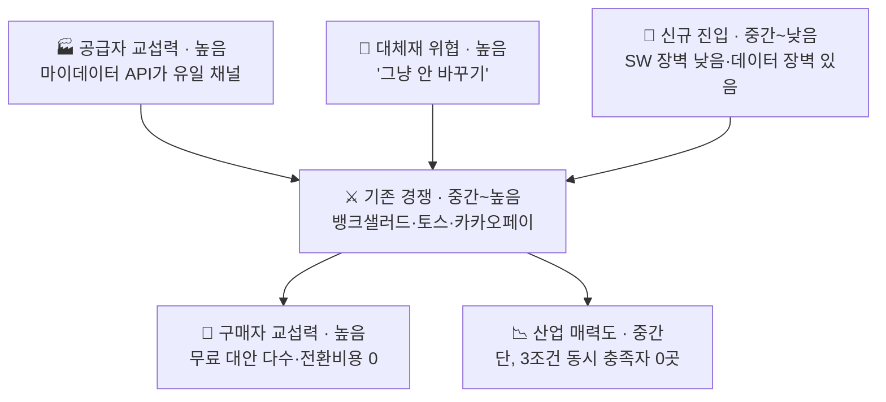

| 힘 | 강도 | 핵심 근거 |
| --- | :---: | --- |
| 공급자 | 높음 | 카드 이용내역은 **마이데이터 API로만** 제공, 오픈뱅킹 불가 🔵(금융위 2024.12.30). 카드 혜택 Rule은 8개 카드사·겸영은행 약관에 파편화, 통합 API 없음 🔵 |
| 구매자 | 높음 | 카드고릴라(MAU 140만)·뱅크샐러드(카드추천 130만)·토스·카카오페이 전부 무료 🔵 |
| 신규 진입 | 중간~낮음 | 계산 엔진은 규칙 기반 SW로 특허 장벽 없음. 마이데이터 인가(자본금 5억)가 실질 장벽 |
| 대체재 | **높음** | **"아무것도 안 하기"가 가장 강력한 대체재.** 카드사가 이미 단종카드 자동대체로 재배치를 대신하고 있음 🔵 |
| 기존 경쟁 | 중간~높음 | **6곳**(뱅크샐러드·카드고릴라·더쎈카드·토스·Credit Karma·NerdWallet) 중 3조건 동시 충족 **0곳** 🔵 (`윤정/확정본/01_Five_Forces.md` 5절). 마이데이터 실사용은 3곳(뱅크샐러드·카카오페이·토스), 트래픽 1위 카드고릴라는 비마이데이터 미디어 모델 🔵 |

**뱅크샐러드 3조건 판정** — 실행설계 ◐ 🔵(발급 연계까지, 재배치·배분 없음) · 미래소비반영 ✗(최근 1년 기준) · 근거공개 ◐ 🔵(결과 금액만, 산출 과정 비공개)

> ⚠️ **경쟁사별 3조건 판정을 개별로 채우지 않았다.** `윤정/확정본/01`이 상세 판정을 제공하는 것은 **뱅크샐러드 한 곳뿐**이고, 나머지 5곳은 "3조건 동시 충족 0곳"이라는 집계 결론만 있다(🔵). 개별 행을 추정으로 메우지 않는다.
>
> ⚠️ **단, 반례 후보 1건은 밝힌다.** `윤정/확정본/01` 5절이 **더쎈카드**를 *"유사 기능(미래 소비항목 반영)을 제공했던"*이라고 서술한다 — **"미래소비반영 0곳"이라는 우리 핵심 주장의 유일한 반례 후보**다. 그 더쎈카드는 2023년 출시 후 2026년 종료했고 **종료 사유는 미공개(🟠)**라, "미래소비반영만으로는 부족하다"는 해석도 추론에 머문다.

> **진입 정당화** — 어려운 자산(마이데이터·카드데이터·사용자 기반)은 뱅크샐러드가 이미 갖고 있고, 남은 격차는 **미래입력 UI와 재배치 로직 둘뿐**이다. 격차가 크지 않다는 것을 전제로 속도와 데이터 운영 역량으로 방어한다.

`근거: 윤정/확정본/01_Five_Forces.md`

---

# p4 · 시장·경쟁 ② TAM-SAM-SOM

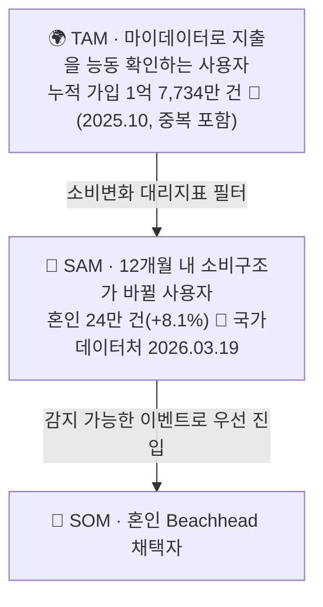

**산식**
```
SAM = [ Σ(연간 소비변화 이벤트 인원) − 중복 ] × 마이데이터 이용률
SOM = SAM × Beachhead 비중 × 초기 채널 도달률 × 조합안 선택률
```

| 결정 | 내용 |
| --- | --- |
| TAM 앵커 = 마이데이터 가입 건수 | 서비스 자격 조건과 그대로 맞물린다 — 마이데이터를 쓰지 않는 사람은 계산에 필요한 과거 소비를 제공할 수 없다 |
| **사람 수로 환산하지 않는다** | 1억 7,734만 건은 서비스별 중복 합산이다. 인구 5,170만 명을 크게 초과하므로 고유 인원이 아니다 ⚪. 임의 배수로 인원을 만들지 않는다 |
| 신용카드 발급매수(1억 3,466만 매, 2025)는 제외 | 카드 장수이지 사람 수가 아니고, 마이데이터 이용 여부와 무관하다. 개인카드 이용액 누계 275.97조원(🔵 여신금융협회 월간통계 2026.06)도 같은 이유로 제외 |
| 중복 제거 원칙 | 신혼 1쌍은 혼인+이사+출산에 모두 잡힌다 → **세대(가구) 단위**로 통일 |

민감도 3시나리오 — 보수(중복률 0.8) · 기본(0.65) · 공격(0.5)

**지출강도 1,473만~2,203만원의 산식** — 듀오 2026 결혼비용 조사 총계 5,912만원(주택자금 제외) 중 **카드결제 확실 항목**(신혼여행 1,030만 + 혼수 1,445만 + 웨딩패키지 471만 = 2,946만 → 1인당 **1,473만**), 예식홀 1,460만 조건부 포함 시 1인당 **2,203만**.

> ⚠️ 이사 대리지표는 **축소 국면**이다 — 2025년 주택사유 이동자가 전년 대비 **-10.5만 명**으로 가장 큰 감소다. Q2를 제외한 판단(다음 페이지)의 보조 근거다.

`근거: 윤정/확정본/04_TAM_SAM_SOM_Segment_Map.md`

---

# p5 · 시장·경쟁 ③ Market Segment Map

**축 선택: Trigger 감지가능성 × 1인당 지출강도** — 실측 데이터가 채워진 축이라서 채택했다. "예측가능성 × 보유카드 수" 축은 실측이 없어 버렸다.

| 세그먼트 | Trigger 감지 | 1인당 지출강도 | 판정 |
| --- | --- | --- | --- |
| **Q1 혼인** | 높음 (웨딩업체 신호) | **최고 — 1,473만~2,203만원** 🔵 | 🥇 **1차 표적(SOM)** |
| Q2 입주(이사) | 낮음 (중개 파편화) | 확인 안 됨 | 대상 아님 — 혼수 항목이 Q1 혼인 지출과 **정면 중복**, 독립 계상 불가 |
| Q3 해외여행(일반) | 낮음 | 낮음 (1건 약 102만원, 등급 미표기 🟠) | 대상 아님 — 신혼여행 1,030만원은 일반 해외여행의 약 10배로 Q1에 포함 |
| Q4 카드 갱신 일반군 | 매우 높음 | 낮음 (무차별) | 대상 아님 — **채널 후보로만** 참고 |

> 자녀 입학·유학·은퇴도 같은 수요를 만든다. 유학·은퇴처럼 **소비가 줄어드는 방향**의 이벤트는 별도 설계가 필요하다 — F-01의 양방향 입력 요건이 여기서 나온다.

`근거: 윤정/확정본/04` 6절, `decision-log` 08.19 19:36 (Q2 재분류)

---

# p6 · 기업·성공구조 ① 가치사슬

**경쟁자 체인 2단계 vs 우리 체인 5단계**

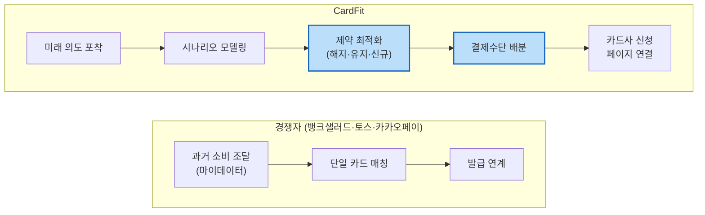

경쟁자 체인에는 **중간 두 단계(제약 최적화·결제수단 배분)가 아예 없다** 🔵. 마지막 단계(신청 페이지 연결)는 경쟁자도 하는 일이므로 차별점이 아니다 — 차별은 그 단계에 **도달하기 전에** 조합 재배치와 배분을 거치느냐다.

| 활동 | 핵심 결정 |
| --- | --- |
| 투입·조달 | 마이데이터 API(단일 채널, 대체 없음) + 카드 약관 직접 수집. 장애 시 "최근 확인된 데이터 기준" 경고로 완화 |
| 운영·생산 | **혜택 계산은 결정론적 규칙 엔진, AI는 근거 설명만.** 이 경계가 무너지면 "혜택을 보장한다"는 규제 리스크 |
| 산출·물류 | 결론 → 핵심 변화 → Trade-off → 근거 → 상세 Rule 순 계층화. 첫 화면은 순혜택만 |
| 마케팅·영업 | 혼인 Beachhead, 웨딩업체 제휴. Concierge Test로 선택률 실측 |
| 서비스 | **계산 오류 신고·정정이 유일한 사후지원.** 해지 상담·대행은 어떤 형태로도 제공하지 않는다 — 카드사 책임 영역 |

`근거: 윤정/확정본/02_Value_Chain.md`

---

# p7 · 기업·성공구조 ② KSF Top 5

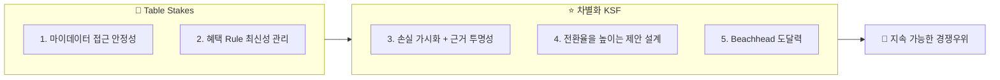

| # | KSF | 구분 | 자원 배분 시사점 |
| :---: | --- | :---: | --- |
| 1 | 마이데이터 접근 안정성 | 🧱 | **인가 vs 제휴를 가장 먼저 확정**해야 나머지가 성립. 기존 사업자는 이미 보유 = 경쟁우위 아님 |
| 2 | 혜택 Rule 최신성 관리 | 🧱 | 초기엔 대표 카드 1~2종으로 범위를 좁혀 관리 부담을 낮춘다 |
| 3 | **손실 가시화 + 근거 투명성** | ⭐ | **핵심 KSF.** ①동기(놓치는 금액을 손실로) + ②신뢰(근거 공개)가 함께여야 "유지하기"라는 대체재를 이긴다 |
| 4 | 전환율을 높이는 제안 설계 | ⭐ | 여러 카드를 한꺼번에 바꾸라 하지 않고, 결론을 하나로 압축 |
| 5 | Beachhead 도달력 | ⭐ | Concierge Test로 도달률·전환율 실측 |

> **①만 있으면** "과장 광고 아니냐"는 의심을 산다. **②만 있으면** 숫자는 투명한데 "그래서 뭐가 달라지나"는 무관심을 부른다. 둘이 같이 있어야 카드를 바꾸는 행동까지 이어진다.

`근거: 윤정/확정본/03_KSF.md`

---

# p8 · 고객 맥락 ① 페르소나 스펙트럼 12명

| 유형 | 인원 | 인물 | 이 층에서 배우는 것 |
| --- | :---: | --- | --- |
| **핵심 Core** | 5 | 이서연(혼인) · 김도윤(결혼+이사) · 박서준(자동대체 불신) · 한지민(프리랜서·이사) · 최유리(발령·회계 전문가) | 기준 수요 — Job A·B가 여기서 나온다 |
| **확장 Adjacent** | 3 | 정하늘(기존 서비스 이용자) · 오세훈(이직) · 강민재(자녀 독립·지출 **감소**) | Job F — 이벤트명에 안 걸리는 수요 |
| **극단 Extreme** | 2 | 윤태호(카드 20장+, 관리 포기) · **신은서(해지 3회 시도·0회 성공 ⚪ 단일 사례)** | 실패의 두 원인 — 내부 과부하 vs 외부 마찰 |
| **비활성 Non-user** | 2 | 배정호(디지털 비친화) · **조민아(예측 자체를 불신)** | 조민아 = **가장 큰 가정의 정면 반대** |

> 대표 4명으로 발표하되 12명 전원을 Workbook 05 탭에 남긴다. **신은서와 조민아가 이 프로젝트의 두 반증 사례**다 — 신은서는 지표 설계를(실행 완주율), 조민아는 온보딩 설계를(F-11 초기값 자동 제안) 바꿨다.

`근거: 가람/확정본/05_Persona_Spectrum_Journey.md`

---

# p9 · 고객 맥락 ② 2축 포지셔닝과 전환 시나리오

**축: 계산 신뢰도 × 관여도**

| 위치 | 인물 | 서비스가 만들 전환 |
| --- | --- | --- |
| 고신뢰·고관여 | 정하늘·최유리 | 이미 대안(엑셀·뱅크샐러드)을 쓴다 → **조합 단위 계산**으로 갈아타게 만든다 |
| 저신뢰·고관여 | 박서준·신은서 | 카드사 설명을 못 믿는다 → **근거 6항목 공개**로 신뢰를 만든다 |
| 고신뢰·저관여 | 이서연·김도윤 | 계산해 줄 사람만 있으면 맡긴다 → **결론 하나로 압축** |
| 저신뢰·저관여 | 조민아·배정호 | 예측·디지털 자체를 거부 → **v0.1 대상 아님**(명시적 제외) |

> 경계 3명(윤태호·조민아·배정호)의 처리를 암묵적 제외로 두지 않고 **PRD에서 명시적으로 선언**했다. VP 시트 미해결 #5의 해소다.

`근거: 가람/확정본/05` 1~3절, `효진/확정본/08` 5절

---

# p10 · 고객 맥락 ③ 고객 여정지도 — 서비스 고유 7단계

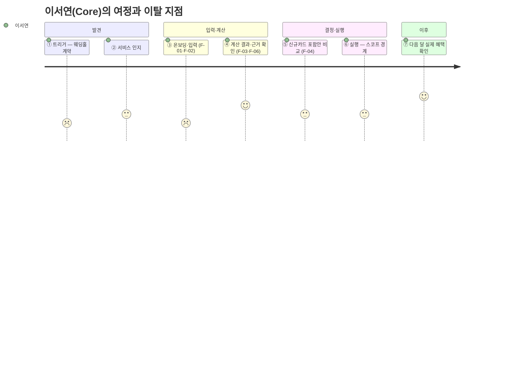

**12명 중 4명이 완주에 실패한다.**

| 인물 | 단절 지점 | 원인 | 우리 대응 |
| --- | :---: | --- | --- |
| 배정호 | ② 인지 | 디지털 채널 자체 거부 | ❌ 앱으로 해결 불가 — v0.1 제외 |
| **조민아** | ③ 온보딩 | 미래 예측 입력 자체를 불신 | ✅ **F-11 과거 패턴 기반 초기값 자동 제안** |
| 윤태호 | ⑤~⑥ | 카드 20장+ 정보 과부하 | 🔶 F-07 단계적 제시(Could) |
| **신은서** | ⑥ 실행 | 상담사 만류 (3회 시도 0회 성공 ⚪ 단일 사례) | 📊 **측정만** — 대행 권한 없음 |

> **가장 취약한 전환점은 ③과 ⑥이다. ③은 제품이 개입하고, ⑥은 개입하지 않고 측정만 한다.** 이 한 줄이 스코프 경계 전체를 요약한다.

`근거: 가람/확정본/05` 고객여정지도 13·14절

---

# p11 · 고객 맥락 ④ JTBD — Job 6개

| # | Job — 고객이 이루려는 진전 | 해당 인물 |
| :---: | --- | --- |
| **A** | 소비 구조가 곧 바뀔 때, 미래 지출을 카드 혜택과 미리 연결해 계산받기 | 이서연·김도윤·한지민·최유리·정하늘 |
| **B** | 계산 결과를 신뢰할 수 있는 근거로 직접 검증하기 | 이서연·박서준·최유리·정하늘 |
| **C** | 계산까지 마친 뒤 기존 카드를 실제로 해지·전환해 완주하기 | 이서연·박서준 (극단: 신은서) |
| **D** | 정확한 숫자를 몰라도 부담 없이 유연하게 입력하기 | 김도윤·한지민·정하늘·강민재 |
| **E** | 이벤트가 끝난 뒤에도 계속 쓸 이유를 갖기 | 김도윤·한지민·최유리 |
| **F** | 이벤트명과 무관하게 내 소비 변화를 대상으로 인정받기 | 오세훈·강민재 |

**가장 큰 가정이 두 번 좁아졌다.** 검증할 것은 이제 *"사용자가 미래 지출을 입력할까"*가 아니다 — 홈택스 연말정산 미리보기·은퇴 시뮬레이터·웨딩북 예산관리 등 **타 도메인에서 이미 작동하는 행동**이다(⚪ — 홈택스의 실제 이용자 수·입력 완료율은 🟠 미확보이므로 "대규모"라고 단정하지 않는다). 진짜 질문은 **"카드 혜택 최적화라는 보상이 입력 노동을 정당화할 만큼 큰가"**다.

`근거: 가람/확정본/07_JTBD.md` 0절, Evidence Log E-05`

---

# p12 · 시장기회 — AOS · DOS · 우선순위

`AOS = Importance × (1 − Satisfaction/5)`

| # | 후보 | Imp | Sat | **AOS** | DOS(SAM) | 순위 |
| :---: | --- | :---: | :---: | :---: | :---: | :---: |
| **A** | 미래지출–카드혜택 자동 연결 | 5 | 1 | **4.0** | 2.32 | 공동 1 |
| **C** | 실행(해지·전환) 완주 | 4 | 1 | **3.2** | **2.40** | 공동 1 |
| F | 이벤트 비종속·양방향 | 4 | 1 | **3.2** | 0.90 | 4 |
| B | 신뢰 가능한 계산 근거 | 4 | 2 | 2.4 | 1.26 | 3 |
| D | 입력 부담·유연성 | 3 | 2 | 1.8 | 0.48 | 5 |
| E | 지속 사용 동기 | 3 | 2 | 1.8 | 0.57 | 5 |

**핵심 발견 — A와 C의 순위가 모수 선택에 따라 뒤바뀐다.** SOM(낙관)에서는 A가 1위, SAM(보수)에서는 C(2.40)가 A(2.32)를 앞선다. 두 값이 항상 붙어 있다는 것 자체가 **"A·C는 사실상 공동 1위"**를 어떤 모수로도 지지한다.

**그리고 C는 6개 후보 중 유일하게 Importance 근거가 🔵 공식 통계(금감원 민원)다.** 나머지는 전부 팀 추정 🟡.

⚠️ **한계** — Importance·Satisfaction은 실측 설문이 아니라 Evidence Log와 CJM 감정곡선 기반 팀 추정 🟡이다. B·C·F가 정확히 동점이고 표본이 6개뿐이라 중앙값이 불안정하다. Concierge Test 실측으로 🔵 승격이 필요하다.

`근거: 가람/확정본/06_Opportunity_Score.md`

---

# p13 · 문제 구조 — Problem Statement

> **소비 구조가 바뀔 예정인 신용카드 사용자는 바뀐 지출에 맞게 카드 조합을 다시 짜고 싶지만, 전월실적 구간·혜택한도·연회비가 얽혀 스스로 계산할 수 없고, 기존 카드추천은 과거 소비 데이터만 보며, 계산이 맞아도 해지·전환 실행에 마찰이 커서 — 결국 카드사가 근거를 공개하지 않은 채 실행하는 자동대체에 자신의 결제 포트폴리오를 맡기게 된다.**

발표용 축약: *소비가 바뀔 사람은 카드 조합을 다시 짜야 하는데, 스스로 계산할 수도 없고 기존 서비스는 과거만 보기 때문에, 결국 카드사가 근거 없이 바꿔주는 대로 따라간다.*

| 장애물 절 | 근거 | 정당화하는 차별점 |
| --- | --- | --- |
| 스스로 계산할 수 없다 | 전월실적·혜택한도·연회비 복잡성 | (문제의 토대) |
| 기존 서비스는 과거만 본다 | 경쟁 6곳 미래소비반영 **0곳** 🔵 | ② 과거가 못 보는 소비 |
| 계산이 맞아도 실행이 안 된다 | 해지 절차 마찰 민원 🔵 + 신은서 ⚪ | ① 실행 설계자 |
| (결과) 근거 없는 자동대체에 위임 | 민원 2022→2025 **6,720 → 12,661건 (+88.4%)** 🔵 금감원 (발급매수 증가 +8.5%의 **약 10배 속도**) | ③ 검증 가능한 계산 |

> ⚠️ 결과절을 **"혜택을 얼마 놓친다"는 금액 표현으로 쓰지 않는다** — 미획득 혜택 규모는 🟠 미확보다. 내부 정답을 단정하지 않는다.
>
> ⚠️ **원본 내부 모순 1건** — `윤정/0815/국내 신용카드 시장 리서치.md`가 25행에서는 "10배 이상", 76행에서는 "(2배)"로 적었다. 산술상 88.4 ÷ 8.5 ≈ **10.4배**이므로 "10배"를 채택했고, 76행은 오기로 판단한다(원저자 확인 필요).

**시간축이 문제의 본질이다.**
- 현재 시스템이 푸는 질문: *"지금까지 이렇게 소비했다면 어떤 카드 구성이 유리했는가?"*
- CardFit이 푸는 질문: *"앞으로 이렇게 소비할 예정이라면 지금 어떤 카드 구성을 준비해야 하는가?"*

`근거: master-deck/README 0절, 윤정/확정본/11` 2절

---

# p14 · 주요 가정과 반증 설계

| # | 가정 | 등급 | 반증되면 무엇이 무너지나 | 검증 |
| :---: | --- | :---: | --- | :---: |
| **A1** | 미래 지출 입력의 수고가 혜택 최적화 보상으로 정당화된다 | 🟡 | **서비스 전체** — 온보딩이 성립하지 않는다 | **E2** |
| A2 | 사용자가 미래 지출을 숫자로 표현할 수 있다 | 🟡 | F-01 입력 설계 (F-11로 완화) | E1·E3 |
| A3 | 근거 공개가 신뢰를 만든다 | 🟠 | 차별점 ③ | E2 (2군 비교) |
| A4 | 계산상 유리하면 사용자가 선택한다 | 🟠 | 북극성 지표 자체 | E2 |
| A5 | 마이데이터 인가·제휴를 확보할 수 있다 | 🟠 | 계산 성립 자체 | 착수 전 선결 |
| A6 | 실행 완주율이 낮다 | ⚪ | 보조 지표의 존재 이유 | E7 |

> **가장 큰 가정(A1)이 두 번 좁아진 것을 기록한다.** ① 최초: "미래 지출을 입력할까" → ② 타 도메인 성립 확인 후: "카드 혜택 보상이 입력 노동을 정당화하나" → 이 좁혀진 형태가 E2 Concierge Test의 검증 대상이다.

`근거: 가람/0819/Evidence Log.md E-05, 효진/확정본/08` 5절

---

# p15 · 사례 ① 동일 산업 — 뱅크샐러드 (기준 서비스)

**현재 제공 가치** — 가계부·마이데이터에 축적된 실제 소비를 카드 상품 데이터와 비교해, 다른 카드를 썼다면 받았을 혜택을 시뮬레이션한다. 연회비·전월실적·통합할인한도가 계산에 반영되고, 예상 연 혜택의 계산 근거도 확인할 수 있다 🔵.

**As-Is 흐름**


**핵심 이탈 지점 5개**

| 단계 | 이탈 원인 | 등급 |
| --- | --- | :---: |
| 데이터 준비 | 소비 내역 1개월 미만이면 추천 정확도 저하 | 🔵 |
| 데이터 매칭 | 카드사 카드명 ≠ 서비스 DB 카드명이면 계산 불가 | 🔵 |
| 추천 확인 | 곧 발생할 고액지출·생활변화가 반영되지 않음 | ⚪ |
| **변경 판단** | "지금 굳이 새 카드를 만들 만큼 차이가 큰가" | 🟡 |
| **신뢰 판단** | 미래 소비가 아직 없는 상태에서 제시된 혜택을 확신하기 어려움 | 🟡 |

> 세 원인은 한 구조로 수렴한다 — **개인화 수준이 높아질수록 추천 품질이 행동 데이터의 양·질에 강하게 의존한다.** 그래서 진짜 경쟁자는 다른 추천 서비스가 아니라 **"그냥 지금 카드를 계속 쓰는 것"**이다.

`근거: 윤정/확정본/11` 1절

---

# p16 · 사례 ② 인접 산업 — 핀트 (투자 리밸런싱)

**가져오는 메커니즘** — 핀트는 리밸런싱 효익이 거래비용보다 작으면 매매를 미룬다 🔵. 가져오는 것은 투자상품이나 AI 모델이 아니다.

> **현재 상태와 목표 상태가 다르다고 해서 무조건 변경하지 않는다. 변경으로 얻는 효익이 변경 비용보다 충분히 클 때만 행동을 제안한다.**

**카드 문제로 번역 — Rebalancing Gate**
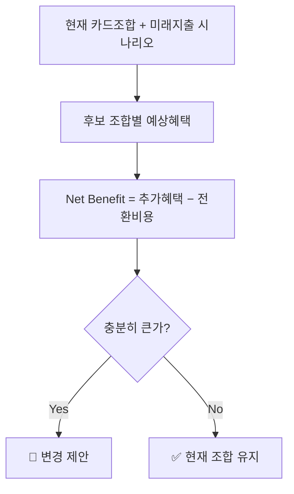

전환비용 3항목 = **연회비 + 실적 재적립 손실 + 발급 대기 비용**. 절대·상대 기준을 모두 넘는 조합만 제안하고, 못 넘으면 결론은 "유지"다.

**해결하는 이탈 지점** — "새 카드를 만들 만큼 가치가 있나". 추천의 목표를 *"더 좋은 카드 찾기"*에서 **"바꿀 가치가 있는 경우만 알려주기"**로 바꾼다.

`근거: 윤정/확정본/11` 3절

---

# p17 · 사례 ③ 교차 산업 — 토스 UX Writing, 그리고 검토 후 버린 둘

**토스에서 가져오는 것** — 해요체·능동형 표현이라는 UI 외형이 아니라 **정보 위계**다 🔵.

> 복잡한 계산을 사용자가 다시 해석하게 하지 않고, 지금 알아야 할 결과와 다음 행동을 먼저 이해시킨다.

첫 화면은 결론 하나. **"A카드는 유지하고, B카드는 정리하고, C카드를 추가하는 조합이에요 — 지금보다 연 34,000원 더 받을 수 있어요."** 카드별 혜택·실적·한도·전환비용·기준일은 눌러야 펼쳐진다.

**검토했지만 가져오지 않은 두 사례** — 버린 이유가 전이 판단의 근거다.

| 사례 | 구조 유사성 | 버린 이유 |
| --- | --- | --- |
| 통신 요금제 진단 (스마트초이스) | **높음** — 사용 패턴 기반 상품 재매칭은 카드 조합과 같은 구조 | 핀트에서 이미 채택한 메커니즘과 **겹친다.** 중복 반영은 설계에 아무것도 더하지 않는다 |
| TMAP TMS (배차·경로 최적화) | 낮음 | 이동거리·순서가 핵심인 구조다. **실적 구간을 채우는** 카드 조합 문제와 맞지 않아 배차·경로라는 은유를 가져오지 않았다 |

### 탐색 범위 커버리지 — 동일·인접·교차를 모두 봤다

| 탐색 영역 | 사례 | 판정 |
| --- | --- | :---: |
| 동일 금융 도메인 | 🏦 뱅크샐러드 | ✅ 채택 |
| 동일 금융 도메인 (UX) | 💬 토스 | ✅ 채택 |
| 인접 금융 도메인 | ⚖️ 핀트 | ✅ 채택 |
| **교차 산업 — 통신·유틸리티** | 📶 스마트초이스 (통신 요금제 진단) | 🔶 **제외 (중복)** |
| **교차 산업 — 물류** | 🚚 TMAP TMS (배차·경로 최적화) | 🔶 **제외 (구조 불일치)** |

### 믹스매치 6기준 점검 — 제외 사유가 서로 다르다

| 기준 | 뱅크샐러드 | 핀트 | 토스 | 스마트초이스 | TMAP TMS |
| --- | :---: | :---: | :---: | :---: | :---: |
| 문제 적합성 | ✅ 손실 인식 부재 | ✅ 개입 시점 불확실 | ✅ 정보 과부하 | ✅ 비교 복잡성 (구조 동일) | ❌ 연속비용·시퀀싱 구조 |
| 가치 적합성 | ✅ 전환 동기 | ✅ 불필요 전환 방지 | ✅ 실행률 | ✅ 계산 타당성 근거 | — |
| 맥락 적합성 | ✅ 저빈도·저리스크로 조정 | ✅ 정기 주기 제거 | ✅ 톤 검증 필요로 표기 | ✅ 과거→미래 축 변경 | ❌ 반영해도 구조 불일치 |
| 도메인 적합성 | ✅ 근거 공개로 설명의무 | ✅ 계산·설명 분리 | ✅ 순혜택 종속 표기 | ✅ 공적 신뢰 포지셔닝 제외 | — |
| 운영 가능성 | ✅ 오류 신고만으로 충분 | ✅ 임계치 하드코딩 후 튜닝 | ✅ A/B 검증 가능 | ✅ 규칙 엔진 재사용 | — |
| 검증 가능성 | ✅ 입력 완료율·채택률 | ✅ 트리거 대비 채택률 | ✅ 첫 화면 이탈률 | 🟠 전환율 미확보 | — |

**두 제외의 성격이 다르다는 것이 이 분석의 핵심이다.**

- **TMAP TMS는 첫 기준에서 탈락했다.** 문제 구조가 다르면 뒤의 5개 기준은 애초에 성립하지 않으므로 적용하지 않았다. 이동거리·시간창이라는 연속 비용과 방문 순서가 핵심인 구조인데, 카드 조합은 **실적 구간을 채우는** 문제다. 남는 건 "다대다 최적화를 자동화한다"는 일반론뿐이고, 이건 TMAP 고유 특징이 아니라 모든 최적화 엔진의 공통점이라 **이름과 은유를 가져오면 잘못된 직관을 심는다.**
- **스마트초이스는 6기준을 다 통과했는데도 제외했다.** 사용 패턴을 규칙에 대입해 최적 상품을 계산하는 구조가 카드 조합과 같다 — 그래서 통과한다. 그런데 그 메커니즘은 **이미 핀트에서 채택했다.** 기준 통과와 "기존 채택 사례에 없던 새 메커니즘을 주는가"는 다른 문제다. 교차 산업이라는 이유만으로 별도 사례로 남기면 **"이색 사례 수집"**이 된다.

> 서로 다른 이유로 제외된 두 사례를 지우지 않고 남긴 것 자체가, 교차 산업을 폭넓게 검토했다는 근거다.

> 산업이 멀다고 가져오고 가깝다고 버리지 않았다 — **문제 구조가 같은지, 그리고 이미 가진 메커니즘과 겹치지 않는지**로 판정했다.

`근거: 윤정/확정본/11` 4·5절, `윤정/0820/동일_인접_교차_산업_메커니즘_전이_분석.md` 0·2·3절

---

# p18 · 전이 판단 — 유지 · 변형 · 제외

| 축 | 벤치마크 | 유지할 원리 | 변형한 조건 | 제외한 요소 |
| --- | --- | --- | --- | --- |
| 현재 상태 진단 | 뱅크샐러드 | 실제 소비 데이터로 놓치는 금액을 **손실로 가시화** | 계산 기준을 과거 1년 → **과거 + 미래 입력** | 발급 연계를 종착점으로 삼는 설계 |
| 전환 판단 | 핀트 | **Net Benefit 게이팅** — 바꿀 가치가 있을 때만 제안 | 거래비용 → **연회비·실적 재적립 손실·발급 대기** 3항목 | 자동 실행(일임매매) — 카드에는 직권·대행 권한이 없다 |
| 결과 전달 | 토스 | 결론 우선 · **단계적 근거 공개** | 근거 항목을 **6개 이상 강제** | 해요체 문체 자체의 복제 |

**가장 중요한 변형은 "자동 실행"을 뺀 것이다.** 핀트는 판단 후 실제 매매까지 대행하지만, 마이데이터 기반 서비스에는 카드 해지·전환에 대한 직권·대행 권한이 없다. **메커니즘의 앞 절반(판단)만 가져오고 뒤 절반(실행)은 버렸다.** 그 공백을 기능으로 메우지 않고 **측정으로만** 대응한 것이 이 프로젝트의 핵심 스코프 결정이다.

`근거: 윤정/확정본/11` 5절, `윤정/확정본/02` 5절, `윤정/0820/동일_인접_교차_산업_메커니즘_전이_분석.md` 1절

---

# p19 · 믹스매치 종합 — 세 메커니즘의 결합

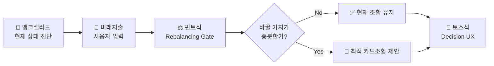

| 역할 | 벤치마크 | 전이 원리 | 상태 |
| --- | --- | --- | :---: |
| 현재 상태 진단 | 뱅크샐러드 | 소비 데이터 기준 혜택·손실 가시화 | ✅ 채택 |
| 전환 판단 + 배분 최적화 | 핀트 | Net Benefit 게이팅 | ✅ 채택 |
| 결과 전달 | 토스 | 결론 우선·단계적 근거 공개 | ✅ 채택 |
| — | 통신 요금제 진단 | 핀트와 메커니즘 중복 | 🔶 제외 |
| — | TMAP TMS | 구조 불일치 | 🔶 제외 |

**세 메커니즘이 각각 하나의 이탈 지점을 막는다** — 진단은 "왜 바꿔야 하나"(동기), 게이팅은 "굳이 바꿀 만한가"(변경 판단), Decision UX는 "이 숫자를 믿어도 되나"(신뢰 판단). p15에서 확인한 뱅크샐러드의 세 이탈 원인과 1:1로 대응한다.

`근거: 윤정/확정본/11` 5절

---

# p20 · Value Proposition Sheet

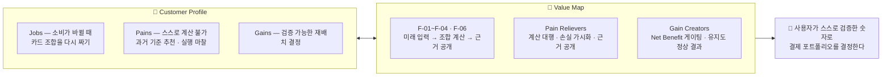

**Fit 검사 — 6개 중 3 ✅ / 2 🔶 / 1 🔴**

| 순위 | Outcome | 대응 기능 | Fit |
| :---: | --- | --- | :---: |
| 1 | A 미래지출 자동 연결 | F-01 · F-02 · F-03 | ✅ |
| 1 | **C 실행 완주** | **기능 없음 — 측정(F-13)으로만 대응** | 🔴 |
| 3 | F 이벤트 비종속 | F-01 (이벤트 선택 단계 자체 없음) | ✅ |
| 4 | B 검증 가능한 근거 | F-06 | ✅ |
| 5 | E 지속 사용 동기 | 없음 (Won't v1) | 🔶 |
| 5 | D 입력 부담·유연성 | F-02·F-11 부분 해소 | 🔶 |

> 🔴 **공동 1위 기회에 대응 기능이 없다는 것을 숨기지 않는다.** 근거가 세 방향에서 일치하는데(DOS 1위 · 유일한 🔵 Importance · CJM 실행 단계 2명 단절) 기능은 비어 있다. F-05를 좁힌 판단 자체는 합리적이다 — 상담사 화법은 통제할 수 없고 대행은 규제 리스크가 크다. **문제는 좁히면서 대안 설계를 안 하는 것이었고, 그래서 측정(F-13)을 신설했다.**

## 고객 가치 선언문

> **소비가 곧 바뀔 사람에게, CardFit은 과거 결제내역이 아니라 앞으로의 지출 계획을 기준으로 카드 조합을 다시 계산해, 지금 조합을 유지할 때와 바꿀 때의 차액을 계산 근거와 함께 보여준다. 그래서 사용자는 카드사의 권유나 감이 아니라, 자기가 검증한 숫자로 결제 포트폴리오를 결정한다.**

`근거: 효진/확정본/08_Value_Proposition.md`

---

# p21 · To-Be Concept — 개선축은 2개다

**08.19 팀 결정: 개선축을 2개로 분리했다.** 브리프 차별점은 시간축만 서술하고 조합 단위 차이는 "실행 설계자"에 섞여 있었는데, PDF 실측으로 As-Is가 **"후보 카드 한 장에 재적용"**임이 확인되어 조합축을 독립 축으로 분리했다 — 섞어 두면 방어력이 약해진다.

## 기준 서비스 ↔ 개선 기능 대비 (4항목 실측 대비)

| 항목 | 기준 서비스 (As-Is) | CardFit (To-Be) | 어느 축 |
| --- | --- | --- | :---: |
| 진입 경로 | `카드 갈아타기 > 카드 탐색 > 내 카드보다 더 좋은 카드 보기` 🔵 | **동일 지점** — 이 플로우 위에 얹는다 | — |
| **계산 입력** | **최근 1년 소비**를 후보 카드에 재적용 🔵 | **사용자가 입력한 미래 지출** + 마이데이터 과거 소비 | **ⓐ 시간축** |
| **계산 단위** | 후보 카드 **한 장**에 재적용 🔵 | **카드 조합 배분** (F-05 결제수단 배분 설계) | **ⓑ 조합축** |
| 산출물 | *"대신 쓸 때 혜택 많이 받는 카드 **순위**"* 🔵 | 실행 가능한 **조합안 + 계산 근거 공개** (F-06) | ⓐ+ⓑ |

> **4항목 전부 PDF 실측 근거(🔵)다** — `윤정/0818/경쟁사_유저플로우_뱅크샐러드.pdf` 1p "핵심 구조". 진입 경로는 **일부러 같게** 뒀다. 새 진입점을 만드는 게 아니라 **기존 플로우 위에 두 단계를 얹는 설계**다.

## 두 축이 각각 무엇에 걸리나

| | **ⓐ 시간축** | **ⓑ 조합축** |
| --- | --- | --- |
| 바뀌는 것 | 계산 기준 시점: 과거 1년 → **과거 + 미래 입력** | 계산 단위: 카드 1장 → **해지·유지·신규 조합** |
| 담당 기능 | **F-01** 미래지출 입력 · F-03 시나리오 계산 | **F-04** 조합 최적화 · **F-05** 결제수단 배분 |
| 경쟁 공백 근거 | 경쟁 **6곳 중 이 단계를 가진 곳 0곳** 🔵 | 경쟁자 체인에 **제약 최적화·결제수단 배분 두 단계가 없다** 🔵 |
| 지지하는 차별점 | ② 과거가 못 보는 소비 | ① 실행 설계자 |
| 대응 Job | A (AOS 4.0) | A · C |
| 무너지면 | **서비스 전체가 무너진다** — 진입점 자체가 사라진다 | 뱅크샐러드와 같은 서비스가 된다 |
| 검증 | **E2** — A1 전제 | **E5** — 동일 스냅샷 n=20 비교 |

**ⓐ가 진입점이고 ⓑ가 방어선이다.** ⓐ 없이는 시작할 수 없고, ⓑ 없이는 복제를 막을 수 없다. 뱅크샐러드에 남은 격차 두 가지(미래입력 UI·재배치 로직)가 정확히 이 두 축이다.

## As-Is 흐름 (확정본 6단계 원문)


## 두 원칙

1. 카드 한 장을 고르는 게 아니라 **해지·유지·신규추가를 함께 계산해 하나의 조합으로 압축**한다. (ⓑ)
2. **"유지"도 정상적인 추천 결과다.** 무조건 신규카드를 끼워 넣지 않는다. (Net Benefit 게이팅)

마지막 단계(M)는 신청서 작성·제출을 대신하지 않는다. 뱅크샐러드와 동일하게 카드사 공식 신청 페이지로 **이동 링크만** 제공하며, **해지는 이 단계 대상이 아니다.**

`근거: master-deck/README.md` 0-1절(4항목 실측 대비, 08.19 확정) · `decision-log` 08.19 15:44(개선축 2개 결정) · `윤정/확정본/11` 1·6절 · `윤정/0818/경쟁사_유저플로우_뱅크샐러드.pdf` 1p

---

# p22 · 사용자 흐름 — To-Be 흐름과 UX 블루프린트

## To-Be 흐름

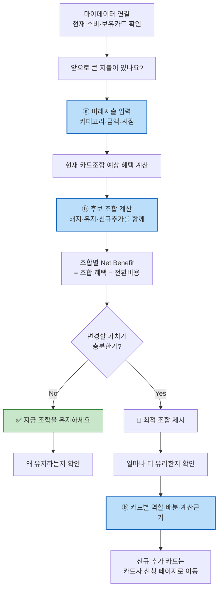

파란 칸이 As-Is에 **없는** 단계다 — ⓐ 1개, ⓑ 2개.


프로토타입 실물이 있다(`윤정/blueprint/blueprint_v0.2.html`, iPhone 17 논리화면 402×874px). 확정본 CJM 7단계를 **화면 단위 8스테이지**로 분해했다.

| 스테이지 | 화면 | 기능 | 사용자 생각 · 제품 판단 |
| :---: | --- | :---: | --- |
| **01** | 현재 카드 진단 — "나의 카드 찾기" | 진입 | *"돈 나갈 데가 한꺼번에 몰리는데 어떻게 대비하지?"* → 마이데이터 기반 **현재 상태 진단을 진입점**으로 (뱅크샐러드 IA 참고) |
| **02** | "앞으로 쓸 돈을 알려주세요" | **F-01** | **이벤트 이름을 묻지 않는다** — 카테고리·금액·시점만. *"이걸 다 입력해야 하나"* → **여기가 이탈 지점**(입력 노동 > 혜택 가치로 보이면 이탈) |
| **03** | "어느 정도까지 바꿔도 괜찮나요?" | **F-02** | 최대 보유 카드 수·신규카드 포함 여부를 **제약조건으로** 받는다. *"신규카드까지 만들 필요는 있나?"* → **'더 좋은 카드 찾기'가 아니라 '바꿀 가치가 있는가'를 먼저 판단** |
| **04** | 시나리오 계산 중 | **F-03** | 화면에 **"금액 산출은 규칙 엔진, AI는 근거 설명에 한정"**을 명시 → 혜택 보장 오해 방지. 필수 데이터 누락·Rule 노후 시 **추천 중단 또는 경고** |
| **A** | **"지금은 바꾸지 않아도 돼요"** | 게이팅 NO | 추가혜택 +₩31,000 / 추가 연회비 −₩38,000 / **Net Benefit −₩7,000** → **"유지"도 정상 결과**로 제시 |
| **B** | **"이 조합이면 ₩186,000 더 유리해요"** | **F-04** | 추가혜택 +₩224,000 − 연회비 ₩38,000. **A 유지 / B 정리 / C 신규**를 현재 유지안과 나란히 비교. 여러 안을 늘어놓지 않고 **최종 1안** |
| **06** | "이번 지출은 이렇게 나눠 결제하세요" | **F-05** | 가전·가구 8.4M(C 6.0M + A 2.4M) · 여행 3.2M(C) · 예식 4.8M(A). *"어떤 카드가 좋은가"에서 끝나지 않고 **"어디에 얼마를 쓸지"**까지* |
| **07** | "혜택이 왜 이렇게 계산됐는지" | **F-06** | 전월실적·혜택한도·연회비·**적용 기준일(2026.08.20)**을 카드별로 접었다 펼친다. **"계산에 포함되지 않은 항목"**(포인트 소멸·자동납부 승계)을 별도 블록으로 고지 |
| **08** | "이 조합을 적용하려면" | **스코프 경계** | ① C카드 신규 신청 → **카드사 공식 페이지로 이동** ② A카드 유지 ③ B카드 정리 → **"해지·전환은 카드사에서 직접 진행"**. 화면에 *"해지 상담·신청 대행은 제공하지 않습니다"*를 명시 |

> ⚠️ **UI 금액은 전부 프로토타입 예시값(demo data)이며 실제 혜택을 의미하지 않는다.**

`근거: 윤정/blueprint/blueprint_v0.2.html`

---

# p23 · 핵심 화면 — 정보 위계와 신뢰 장치

| 계층 | 화면에 보이는 것 | 근거 |
| :---: | --- | --- |
| **1. 결론** | "A 유지 · B 정리 · C 추가 — 지금보다 ₩186,000 더 유리해요" (또는 "지금은 바꾸지 않아도 돼요") — **금액은 예시값** | 토스식 결론 우선 |
| 2. 핵심 변화 | 카드별 역할과 배분 금액 | F-05 |
| 3. Trade-off | 순혜택 = 추가혜택 − 연회비·전환비용 | 핀트식 게이팅 |
| 4. 근거 | 실적구간·혜택한도·연회비·**제외 조건**·계산 기준일 (**≥ 6항목**) | F-06 |
| 5. 상세 Rule | 카드별 실적 충돌·한도 초과 구간 | F-06 |
| **경계 고지** | "해지 상담·신청 대행은 제공하지 않습니다" | **F-12** |

**블루프린트가 화면에 박아 넣은 신뢰 장치 3개**

| 장치 | 어느 화면 | 무엇을 막나 |
| --- | :---: | --- |
| **"금액 산출은 규칙 엔진, AI는 설명"** 명시 | 04 계산 | "AI가 혜택을 보장한다"는 오해 → 규제 리스크 |
| **"계산에 포함되지 않은 항목"** 별도 블록 | 07 근거 | 계산 정확성의 한계를 숨기는 것 → 차별점 ③ 붕괴 |
| **"CardFit의 실행 경계"** 별도 블록 | 08 적용 | 실행 대행 오인 → GR4 위반 |

> **첫 화면에 전환비용을 이미 뺀 숫자만 올린다.** 총혜택을 크게 보여주고 비용을 아래에 숨기는 방식은 차별점 ③을 스스로 무너뜨린다.

**블루프린트가 남긴 미해결 3건 (임의로 구현하지 않았다)**

| 성격 | 항목 | 상태 |
| --- | --- | --- |
| SCOPE BOUNDARY | 해지·전환 실행 대행 — 실제 핵심 Pain이지만 제공하지 않는다. **사용자 여정의 가장 큰 단절 위험으로 남는다** | 확정 제외 |
| **DECIDED (08.20)** | 실행 완주율 — **측정만 채택(F-13)**. VP가 남긴 4개 후보 중 나머지 3개(만류 대응 안내·실행 체크리스트·상태 추적)는 **채택하지 않는다** | ✅ 블루프린트·PRD 정본 **일치** |
| POST-MVP | 구매 후 혜택 확인·리텐션 (Job E) | 대응 기능 0 |

`근거: 윤정/blueprint/blueprint_v0.2.html`, `윤정/확정본/02` 3절

---

# p24 · 필요 데이터 · 인터페이스

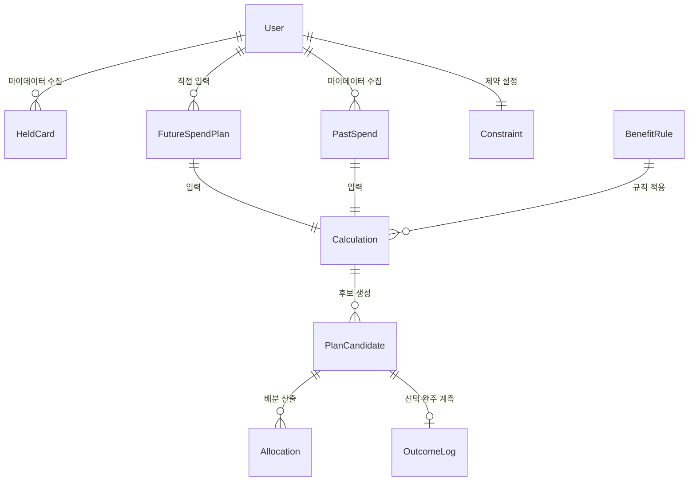

| 엔터티 | 주요 필드 | 출처 |
| --- | --- | --- |
| User | user_id, 마이데이터 동의 상태·범위·일시 | 자체 |
| HeldCard | 카드사, 카드명, 연회비, 발급일, 실적 기준월 | 마이데이터 API |
| PastSpend | 가맹점, 업종코드, 금액, 결제일 | 마이데이터 API |
| FutureSpendPlan | 카테고리(자유 입력 허용), 금액(단일 또는 범위), 시점, 확실도 | 사용자 (F-01) |
| Constraint | 최대 카드 수, 연회비 상한, 신규 발급 허용 여부 | 사용자 (F-02) |
| **BenefitRule** | 전월실적 구간, 통합할인한도, **제외 항목**, 적용 시작·종료일, **rule_version** | 카드사 약관 **수집·버전관리** |
| Calculation | 입력 스냅샷, 적용 rule_version 목록, 기준일, **미반영 항목** | 규칙 엔진 |
| PlanCandidate | 조합 구성, Gross Benefit, 전환비용 3항목, **Net Benefit**, 임계 통과 여부 | 규칙 엔진 |
| Allocation | 배정 카테고리, 배분 금액 | 규칙 엔진 |
| OutcomeLog | 선택 여부·일시, **30일 후 완주 응답** | 자체 (F-13) |

## API · 외부 연동


| 인터페이스 | 제약 |
| --- | --- |
| 마이데이터 카드 업권 API | **단일 채널 — 대체 공급자 없음** 🔵. 장애 시 우회 경로 없음. **호출당 과금** 🔵 |
| 카드 혜택 Rule 데이터 | **공식 통합 API 없음** 🔵 — 8개 카드사·겸영은행 파편화. 수집·버전관리 필수 |
| `POST /calculate` | p95 ≤ 5s. **미래 입력 0건이면 400 반환** |
| `GET /calculations/{id}/evidence` | 근거 6항목 미달 시 **응답 거부** |
| `POST /outcomes/{id}/completion` | **측정 전용 — 실행 개입 엔드포인트 없음** |

`근거: 효진/0820/09_PRD…v0.1` §6.1·§6.2

---

# p25 · 시스템 기능 · 상태 · 정책 · 예외

## 상태 전이 — 4개 객체

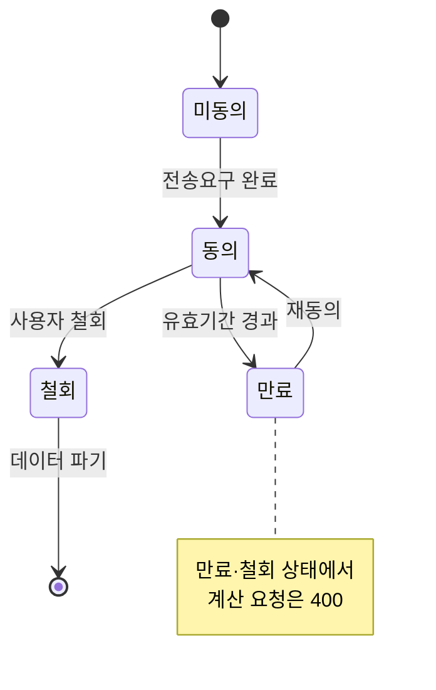

| 객체 | 상태값 | 전이 규칙 |
| --- | --- | --- |
| **마이데이터 동의** | 미동의 → 동의 → (만료 / 철회) | 만료·철회 시 **계산 요청 400**. 철회 시 수집 데이터 파기 |
| **계산(Calculation)** | 요청 → (성공 / 실패 / **부분**) | **부분 = 필수 데이터 누락** → 결과로 취급하지 않고 추천 중단. 성공 건만 `result_viewed` 대상 |
| **조합안(PlanCandidate)** | 제시 → (선택 / 미선택) → 만료 | **`rule_version` 변경 또는 기준일 +30일 경과 시 만료** — 만료된 조합안은 재계산 없이 실행 대상이 되지 않는다 |
| **완주 응답(OutcomeLog)** | 미발송 → 발송 → (응답 / **무응답**) | 발송은 선택 +30일 **1회만**. **무응답은 미완주로 집계**. 재발송·독려 없음(GR4 위반) |

> ⚠️ **조합안 만료가 실무상 중요하다.** 사용자가 3주 전 결과를 들고 실행하려는 사이 약관이 갱신되면 **계산 근거가 이미 틀린 것**이다. `rule_version` 변경을 만료 트리거로 두는 것이 차별점 ③(검증 가능한 계산)의 최소 조건이다.

## 정책 · 예외

| 상황 | 처리 |
| --- | --- |
| 마이데이터 응답 지연·장애 | "최근 확인된 데이터 기준" 경고와 함께 계산, 기준일 노출 |
| 약관 데이터가 오래됨 | 최신성 경고 표시 (갱신 지연 7일 초과 시 일간 알림) |
| 필수 데이터 누락 | **추천 중단** — 부분 데이터로 계산하지 않는다 |
| Net Benefit 임계 미달 | **"현재 조합 유지"를 결론으로 반환** (GR2 = 0%) |
| 계산에 못 넣은 비용 (포인트 소멸·자동납부 승계) | **"이 계산에는 포함되지 않았습니다"로 명시** |
| 경계값 (실적 1원 부족·한도 초과·실적 충돌·정책혜택 중복) | 회귀 테스트 케이스 ≥ 200건으로 상시 검증 |
| **동의 만료 후 계산 요청** | 400 반환 + 재동의 유도. **만료 데이터로 계산하지 않는다** |
| **조합안 만료 후 실행 시도** | 재계산 안내. 만료 근거를 노출하지 않는다 |

`근거: 윤정/확정본/02`, `효진/0820/09_PRD…v0.1` §5·§6.3, `방법론.md` 3장(사용자 행동 → 시스템 기능 → 데이터 → 판단 → **결과·상태** → 예외)

---

# p26 · PRD ① 목적과 범위

**목적** — 소비 구조가 곧 바뀔 사용자가, 미래 지출을 기준으로 카드 조합을 다시 계산받고, 그 계산을 스스로 검증해 결정할 수 있게 한다.

**목표 수치화 (Desired Outcome)**

| 목표 | 수치화된 정의 |
| --- | --- |
| G1 계산을 대신한다 | 수기 240분 판단을 **p95 5분 이내**에 결론 하나로 |
| G2 미래를 기준으로 삼는다 | 계산에 **미래 입력 반영률 100%** — 미래 입력 없는 산출물은 결과로 취급하지 않는다 |
| G3 바꿀 가치가 있을 때만 권한다 | 임계 미달 시 **"유지" 반환률 100%** |
| G4 검증 가능하게 만든다 | 결과 1건당 **공개 항목 ≥ 6개** |
| G5 실패를 보이게 만든다 | 실행 완주율을 **상시 노출** — 개입은 하지 않되 사각지대를 없앤다 |

**범위**

| In | Out |
| --- | --- |
| F-01 미래지출 입력 · F-02 마이데이터 연동 · F-03 시나리오 계산 · F-04 조합 최적화 · F-05 결제수단 배분 · F-06 근거 공개 · F-11 초기값 제안 · F-12 스코프 고지 · F-13 완주 계측 | **해지·전환 실행 대행·상담·만류 대응 안내** (직권·대행 권한 없음) · 신규카드 자동 발급 · 자동결제 · 대출·BNPL · 리텐션 전용 기능 · 카드 20장+ 대량 처리 최적화 |

> **핵심 기능 1개 = F-04 조합 최적화(Net Benefit 게이팅).** 나머지는 이 계산이 성립하기 위한 전후 단계다. 보조 기능 2개 = F-06 근거 공개, F-11 초기값 제안.

`근거: 효진/0820/09_PRD…v0.1` §1·§7`

---

# p27 · PRD ② 사용자 시나리오

| # | 스토리 | 우선순위 |
| :---: | --- | :---: |
| **US-A** | 소비가 곧 바뀔 사용자로서, 미래 지출을 카드 혜택과 연결해 계산받고 싶다 | 1 |
| **US-C** | 계산 결과대로 실제 해지·전환까지 완주하고 싶다 — **스코프 경계 스토리** | 1 |
| US-F | 이벤트명을 고르지 않고도 내 소비 변화를 인정받고 싶다 | 3 |
| US-B | 계산 근거를 직접 검증하고 싶다 | 4 |
| US-D | 정확한 숫자를 몰라도 부담 없이 입력하고 싶다 | 5 |
| US-E | 이벤트가 끝난 뒤에도 쓸 이유를 갖고 싶다 | 5 (비MVP) |

**정상 흐름** — 마이데이터 연동 → 초기값 제안 → 미래지출 입력 → 제약조건 → 계산 → 조합 제시 또는 유지 결론 → 근거 확인 → 선택

**실패·복구 흐름**

| 실패 | 복구 |
| --- | --- |
| 마이데이터 API 장애 | "최근 확인된 데이터 기준" 경고 + 기준일 노출로 계산 계속 |
| 미래 입력 0건 | 400 반환 — 과거만으로 계산한 결과를 내놓지 않는다 |
| 근거 6항목 미달 | 응답 거부 — 근거 없는 결과를 노출하지 않는다 |
| 임계 미달 | "유지" 결론 반환 (실패가 아니라 정상 결과) |
| **선택 후 실행 실패** | **제품은 개입하지 않는다.** F-13이 사유를 수집해 지표로만 집계한다 |

`근거: 효진/0820/09_PRD…v0.1` §3`

---

# p28 · PRD ③ 기능 요구사항 — MoSCoW

| ID | 기능 | Job | MoSCoW | 우선순위 근거 |
| :---: | --- | :---: | :---: | --- |
| **F-01** | 미래지출 입력 (카테고리·금액·시점) | A·F | **Must** | **경쟁 6곳 중 이 단계를 가진 곳 0곳** 🔵 (모집단 = p3 6곳) — 차별점의 유일한 진입점 |
| **F-02** | 마이데이터 연동 + 제약조건 입력 | A·D | **Must** | Table Stakes. 카드 내역은 마이데이터 API로만 🔵 — 없으면 계산 불성립 |
| **F-03** | 시나리오 계산 (실적구간·한도·연회비 반영) | A·B | **Must** | 뱅크샐러드는 후보 카드 **1장**과 비교 🔵 → 조합 단위로 확장 |
| **F-04** | 조합 최적화 + **Net Benefit 게이팅** | A·B | **Must** | **경쟁자 체인에 없는 단계** 🔵. "유지"를 정답으로 반환하는 유일한 설계 |
| **F-05** | 결제수단 배분 (계산·배분까지만) | B·C | **Must** | 경쟁자 체인에 없는 두 번째 단계. **실행 대행 아님** |
| **F-06** | 근거 공개 (적용 규칙 + **제외 조건**·기준일) | B | **Must** | 뱅크샐러드는 결과 금액만 🔵 → 산출 과정·제외조건까지 |
| **F-11** | 과거 패턴 기반 **초기값 자동 제안** | D·A | **Must** | **가장 큰 가정의 완화 장치.** ③ 온보딩 이탈이 실패 경로 — 기능 추가가 아니라 **MVP 성립 조건** |
| F-08 | 이벤트 비종속 입력 (자유 카테고리·양방향) | F | Should | 이벤트 선택 단계를 **두지 않는 것**만으로 대부분 충족 |
| F-12 | 스코프 경계 고지 + 금지어 자동 검수 | C | Should | 난이도 1인데 규제 리스크 차단 효과가 크다 |
| F-13 | **실행 완주율 계측** (측정 전용) | C | Should | 북극성의 사각지대를 드러냄. **대행이 아니라 측정이라 스코프 위반 아님** |
| F-07 | 단계적 전환 제안 (효과 큰 카드부터) | C | Could | 윤태호형 과부하 완화 — 실행 지원이 아니라 **제시 방식** |
| F-09 | 소득·지출 범위 입력 | D | Could | 한지민 이탈 방지 |
| F-10 | 정기 재진단 알림 | E | **Won't v1** | Job E 후순위 |
| F-14 | 카드 20장+ 대량 처리 | — | **Won't v1** | 윤태호는 Extreme·Market Relevance 최저 구간 |

**프레임 선택 근거** — 실측 데이터가 없어 RICE의 Reach·Confidence를 채울 수 없다. **범위 합의가 먼저 필요한 단계**라 MoSCoW를 골랐고, "Won't" 칸이 전략의 포기 선언을 담는다.

`근거: 효진/0820/09_PRD…v0.1` §4`

---

# p29 · PRD ④ Acceptance Criteria (핵심 4건)

| 스토리 | AC |
| --- | --- |
| **US-A** | ① 마이데이터 연동 사용자가 미래지출을 입력하면 **p95 ≤ 5s** 안에 결과가 표시된다<br/>② **미래 입력이 0건이면 400을 반환**한다 — 과거만으로 계산한 결과를 결과로 내놓지 않는다<br/>③ 결과에는 유지 시 예상혜택과 추천 조합 예상혜택의 **차액이 원 단위로** 표시된다 |
| **US-B** | ① "근거 보기"를 누르면 적용 실적구간·통합할인한도·연회비·**제외조건**·기준일·rule_version이 **≥ 6항목** 펼쳐진다<br/>② 계산에 못 넣은 비용이 있으면 **"이 계산에는 포함되지 않았습니다"가 누락률 0%로** 표시된다<br/>③ 6항목 미달이면 **응답을 거부**한다 (GR3 = 0건) |
| **US-C** | ① 조합안 선택 후 **30일**이 지나면 자기신고 또는 재방문으로 완주 여부를 집계한다<br/>② 완주율을 **북극성과 나란히** 리포트한다 — 격차 20%p 이상이면 경보<br/>③ 미완주 사유는 **집계에만** 쓰고 어떤 후속 액션도 자동 트리거하지 않는다<br/>④ **범위 인지율 ≥ 90%** — 사용자가 "이 서비스는 해지를 대신 하지 않는다"를 안다 |
| **US-F** | ① 지출 변화를 입력할 때 **이벤트 종류 필수 선택 단계는 0개**다<br/>② 증가·감소 **양방향**을 오류 없이 처리한다 (처리 오류율 0%)<br/>③ 자유 입력 카테고리도 계산에 반영된다 |

**Net Benefit 게이팅 AC** — 임계 미달 케이스에서 **"현재 조합 유지" 반환률 100%**. 임계 미달인데 변경을 제안한 건수는 **0건**이어야 하며, 1건이라도 나오면 롤아웃을 중단한다.

`근거: 효진/0820/09_PRD…v0.1` §3`

---

# p30 · KPI · Guardrail · 검증

**북극성 — 조합안 선택률 ≥ 40%** 🟡
결과 화면에 도달한 사용자 중 조합안을 저장·확정한 비율. **사람 단위**로 세고, 결과를 본 날부터 **7일 안에** 선택하면 인정하며, **"유지하세요" 결론을 받은 사용자는 분모에서 제외**한다 — 넣으면 G3를 잘 지킬수록 점수가 떨어지는 역설이 생긴다.

| 계열 | 지표 | 기준선 | 목표 |
| :---: | --- | :---: | :---: |
| 전환 | 결론 도달 소요시간 p95 | 🟠 (수기 240분 ⚪) | ≤ 5분 |
| 전환 | 온보딩 완료율 | 🟠 | ≥ 60% |
| 전환 | 근거 열람률 | 🟠 | ≥ 50% |
| 유지 | **실행 완주율 (측정 전용)** | **0%** ⚪ | **목표 없음 — 실태 파악** |
| 유지 | 이벤트 비종속 진입률 | 🟠 | ≥ 20% |
| 유지 | D+90 재방문율 | 🟠 | ⚠️ **검증 기간 내 측정 불가** |

**Guardrail — 넘으면 롤아웃을 멈춘다**

| # | 지표 | 임계 | 왜 |
| :---: | --- | :---: | --- |
| GR1 | 계산 오류율 | ≤ **0.1%** | 규칙 엔진은 결정론적이라 오류는 곧 버그 |
| GR2 | 불필요 신규카드 추천 | **0%** | G3 위반 = 차별점 붕괴 |
| GR3 | 근거 미공개 결과 노출 | **0건** | 차별점 ③의 전제 |
| GR4 | 실행 지원 오인 문구 노출 | **0건** | 스코프 위반 = 규제 리스크 |
| GR5 | 데이터 최신성 경고 미표시 | **0%** | Table Stakes 2 |

**검증 로드맵**

| 실험 | 가설 | 설계 | 성공 기준 |
| :---: | --- | --- | --- |
| **E2 Concierge** | 계산 결과를 받으면 조합안을 선택한다 | 혼인 **모집 40 / 유효 30**, 사람이 직접 계산. 근거 공개 유/무 2군 | 선택률 **≥ 40%** (중단선 20%) · 신뢰 점수 **전후 상승** |
| E1 인터뷰 | 미래 입력 의향이 실재한다 | 실제 사용자 n=15 (모의 인터뷰 **전면 교체**) | Job A 언급률 ≥ 60% |
| E3 A/B | F-11이 온보딩 이탈을 줄인다 | n=500 (250/250) | B군 ≥ 60% 및 A군 대비 **+15%p** 및 수정률 정상 |
| E4 회귀 | 규칙 엔진이 경계값에서 정확하다 | 경계값 케이스 ≥ 200건 | 오류율 ≤ 0.1% · 재계산 불일치 0건 |
| E5 벤치마크 | 동일 데이터에서 더 정확한 조합을 낸다 | 같은 스냅샷 n=20으로 뱅크샐러드 vs CardFit | 3축 전부 우위 · 순혜택 차액 > 0인 케이스 ≥ 70% |
| E7a 실태 | 미완주 **사유의 종류**를 안다 | E2 선택자, 30일 후 (**개입 없음**) | 목표 없음 · **비율 산출 안 함** |
| E7b 기준선 | 실행 완주 **비율**을 안다 | **베타 선택자**, 30일 후 | 목표 없음 — 기준선 확보 (**+21주**) |

**중단 조건** — GR1 초과 또는 GR2·GR3·GR4 1건 = **즉시 중단** / E2 선택률 < 20% = **A1 전제 재검토(피벗)** / **E2 제외군 비율 > 30% = 북극성 산식 재설계** / E3 +15%p 미달 또는 **수정률 비정상 = F-11 재설계** / 마이데이터 인가·제휴 미확정 = **베타 진입 불가**

> 📐 **표본 수는 목표값과 중단선의 간격에서 역산했다.** 40% vs 20%를 가르는 데는 30명이면 충분하다(오판 확률 1.7%). 반면 원안의 "근거 공개군 +15%p" 기준은 15/15에서 **검출력 13%**라 삭제하고 **군 내 전후 비교**로 바꿨다 — 있는 효과를 없다고 잘못 기록하는 것이 가장 나쁜 결과다. 상세는 `05_실험_설계서.md`.

`근거: 효진/0820/09-1_KPI_Design_Worksheet_v0.1.md`, `09_PRD…v0.1` §1.4·§8`

---

# p31 · 법 · 윤리 · 보안 · 운영 리스크와 운영 역할

| 축 | 리스크 | 대응 | 상태 |
| --- | --- | --- | :---: |
| **인가** | 마이데이터(본인신용정보관리업)가 MVP 전제인데 인가·제휴가 미확정. 최소 9개사가 허가를 반납한 추세 🔵 | 직접 인가(자본금 5억·물적설비·보안) 또는 기존 사업자 제휴 — **착수 전 선결** | 🔴 |
| **업역** | 카드사 신청 페이지 연결이 여신전문금융업법상 **모집인 등록 대상인지 미확인** | 링크 이동만 제공(신청서 작성·제출 대행 없음). 1차 출처 확인 과제 | 🟠 |
| **업역** | 재무자문·투자권유 분류 여부 미확인 | 혜택 계산·정보 제공에 한정, 상품 권유 문구 금지 | 🟠 |
| **스코프** | "실행을 대신 해준다"는 오인이 곧 규제 리스크 | **F-12 고지 + 금지어 자동 검수**, GR4 = 0건. **사전 작성 완료** — UI·푸시·FAQ·CS·발표자료까지 적용 | ✅ |
| **AI** | "AI가 혜택을 보장한다"는 오해 | **계산은 결정론적 규칙 엔진, AI는 근거 설명만.** 이 경계를 시스템 설계 단계에서 강제 | ✅ |
| **개인정보** | 마이데이터 전송요구 범위 초과 조회 | 동의 범위 최소화, 조회 목적·범위 로그, **오조회 1건 = 즉시 중단·신고** | ✅ 설계 |
| **보안·감사** | 사후 검증 불가 | 계산 요청·응답, 적용 rule_version, 입력 스냅샷, 마이데이터 응답 코드 전건 로그 보존 | ✅ 설계 |
| **운영** | 마이데이터 **호출당 과금** 🔵 — 사용자가 늘수록 적자 구조 | 계산 요청 건수를 성과 지표로 쓰지 않고 **비용으로 관리** | 🔶 |
| **인센티브** | **수익모델(D3) 미정.** 발급 연계 수수료 모델이면 **"유지" 결론은 수익 0원** — 차별점 ②와 매출이 정면 충돌 | **임계값(D2)을 먼저 확정하고 그에 정합한 모델을 고른다.** 순서를 뒤집으면 임계값이 수수료 쪽으로 왜곡된다 | 🔴 |
| **데이터** | 카드 약관 통합 API 없음 🔵 — 수집 실패 시 계산 신뢰도 붕괴 | rule_version 관리 + 최신성 경고(GR5) + 초기 범위 축소 | 🔶 |

## 운영 역할 — 누가 무엇을 하나

**즉시 중단 조건을 만들어놓고 중단 결정자를 정하지 않으면 그 조건은 작동하지 않는다.** 역할 4개로 나눈다.

| 역할 | 담당 활동 | 주기 | 실패 시 |
| --- | --- | :---: | --- |
| **데이터 운영** | 카드사 8곳 약관 수집·`rule_version` 관리·최신성 경고 해제 | 주간 + 약관 변경 감지 시 | 갱신 지연 7일 초과 → GR5 알림. 30일 초과 → **해당 카드 계산 대상 제외** |
| **계산 품질** | 경계값 회귀 테스트 실행·결정론성 검증·계산 오류 신고 정정 | `rule_version` 변경 시마다 | GR1 초과 → **즉시 롤아웃 중단 발의** |
| **제품(PM)** | 지표 집계·보고, 금지어 스캐너 예외 승인, **중단 최종 결정** | 주간(북극성·Input) / 월간(완주율) | — |
| **컴플라이언스·보안** | 마이데이터 동의 범위 점검, 오조회 감시, 문구 규제 검토 | 월간 + 사고 시 즉시 | 오조회 1건 → **서비스 중단 + 신고** |

**Guardrail별 대응 경로**

| 지표 | 발의 | 결정 | 조치 |
| :---: | :---: | :---: | --- |
| GR1 계산 오류율 | 계산 품질 | **PM** | 즉시 롤아웃 중단 |
| GR2 불필요 추천 | 계산 품질 | **PM** | 즉시 중단 + 임계값 재검토 |
| GR3 근거 미공개 | 계산 품질 | **PM** | 즉시 중단 |
| GR4 오인 문구 | 제품 | **PM** | 문구 회수 + 스캐너 패턴 추가 |
| GR5 최신성 경고 | 데이터 운영 | 데이터 운영 | 경고 표시 복구 |
| **오조회** | 컴플라이언스 | **컴플라이언스 (PM 우회)** | **서비스 중단 + 감독당국 신고** |

> **오조회만 PM을 우회한다.** 타인 데이터 노출은 사업 판단의 대상이 아니라 즉시 신고 의무 사항이다. 다른 Guardrail은 PM이 최종 결정하되, 이것만 컴플라이언스가 단독으로 중단할 수 있게 설계했다.

> **규제를 조문으로 나열하지 않고 다섯 축으로 옮겼다** — 제품 요구사항(F-06 근거 공개·F-12 고지) · 시스템 통제(6항목 미달 응답 거부·오조회 차단) · 운영 절차(약관 갱신 주기·중단 조건) · 책임성(스코프 판단 주체) · 감사 증적(rule_version·전건 로그).

`근거: 윤정/확정본/01·02, 효진/0820/09_PRD…v0.1` §5.3·§6.4·§7`

---

# p32 · 한계 · 추가 검증과제 · 최종 제안

**이 분석의 한계 — 숨기지 않는다**

| # | 한계 | 성격 |
| :---: | --- | :---: |
| 1 | **JTBD 인터뷰가 모의 응답이다** — 실제 사용자 응답으로 전면 교체가 필요하다 | 🟡 |
| 2 | **Importance·Satisfaction 전 점수가 팀 추정이다** — AOS·DOS 우선순위가 잠정적이다 | 🟡 |
| 3 | **KPI 기준선 11개가 전부 미측정이다** — 목표값 40%·60%·50%에 외부 벤치마크 근거가 없다 | 🟠 |
| 4 | **SAM·SOM 실수치가 없다** — 대리지표(혼인 24만 건)만 확보했고 합산·중복 제거를 못 했다 | 🟠 |
| 5 | **마이데이터 인가·제휴 경로가 미확정이다** — 이것 없이는 계산 자체가 성립하지 않는다 | 🔴 |
| 6 | **모집인 등록·재무자문 분류 여부가 미확인이다** | 🟠 |
| ~~7~~ | ~~GR4 금지어 사전 미작성~~ → **08.21 작성 완료.** 금지 7구역·검토 7항·허용 대치 9건·승인 예외 6건 | ✅ 해소 |
| 8 | **AOS와 DOS가 서로 다른 공식으로 계산돼 있다** — AOS는 `Imp × (1−Sat/5)`, DOS 표는 `(Imp − Sat) × MR`. 두 값을 직접 비교할 수 없다 | 원본 결함 |
| 9 | **경쟁사 모집단이 두 벌이다** — 6곳(해외 2곳 포함, 카카오페이 없음) vs 5곳(카카오페이 포함, 해외 없음). 주장마다 모집단을 명시했다 | 문서 간 불일치 |
| 10 | **더쎈카드 미래소비반영 판정이 충돌한다** — "미래소비반영 0곳"의 유일한 반례 후보 | 문서 간 불일치 |
| 11 | **Net Benefit 임계값(D2)이 미정이라 GR2를 정량 정의할 수 없다** — "불필요"의 기준선이 비어 있다. 전환비용 3항목 실측(E2)이 선행돼야 한다 | 🔴 |
| 12 | **수익모델(D3)이 미정이다** — 발급 연계 모델이면 "유지도 정답"과 매출이 충돌한다. 임계값 확정 후 결정하는 순서로 잡았다 | 🔴 |

**추가 검증과제 — 우선순위 순**

1. **E2 Concierge Test (n=30)** — 한 실험이 A1 전제·북극성 기준선·근거 공개 효과를 동시에 검증한다. 여기서 선택률 20% 미달이면 피벗한다
2. **마이데이터 인가 vs 제휴 확정** — 착수 전 선결. 미확정이면 베타 진입 불가
3. **E1 실제 인터뷰 n=15** — 모의 응답 전면 교체, Importance·Satisfaction 🟡 → 🔵 승격
4. ~~금지어 사전 작성~~ → **완료.** 잔여는 **문구 외부화** — 문구가 코드에 하드코딩되어 있으면 스캔 자체가 불가능하다
5. 모집인 등록·재무자문 분류 1차 출처 확인 (금융위·여신금융협회)

**최종 제안**

> 경쟁 6곳 중 "미래소비 반영 + 조합 재배치 + 근거 공개" 3조건을 동시에 만족하는 곳이 없다 🔵. 그런데 어려운 자산은 뱅크샐러드가 이미 갖고 있고 남은 격차는 두 가지뿐이다 — **이 창은 넓지 않고 오래 열려 있지도 않다.**
>
> 그래서 제안은 기능을 늘리는 방향이 아니다. **F-04 하나(Net Benefit 게이팅 조합 최적화)에 집중하고, 실행 대행처럼 권한 밖의 일은 측정으로만 대응하며, E2 Concierge Test로 A1 전제를 먼저 깨보는 것**이다. 전제가 깨지면 기능을 더 만들어도 소용이 없다.

**원본 링크** — 저장소 루트 `README.md` · `방법론.md` · `decision-log/` · `ai-usage-log/` · `master-deck/README.md`(페이지별 근거 인덱스) · `윤정·가람·효진/확정본/`
