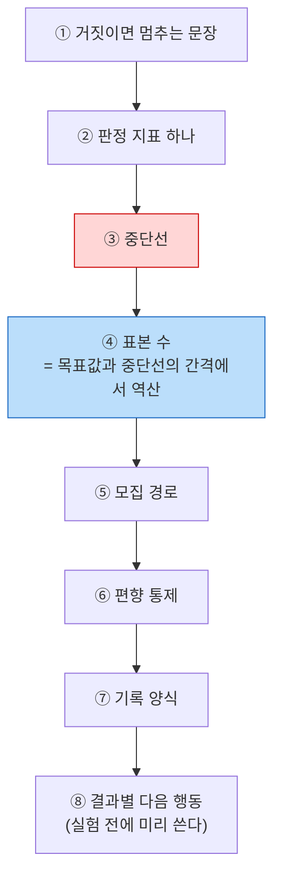
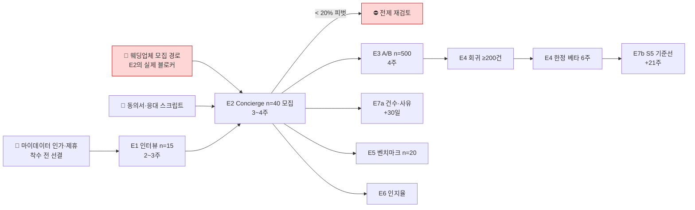

# CardFit 실험 설계서 v0.1

> 제출물 01 p30·02 탭09의 하위 실행 문서다. PRD가 "무엇을 검증한다"까지 정했고, 이 문서는 **"몇 명으로, 어떻게 재서, 어디서 멈추는가"**를 정한다.
> 작성: 효진 · 2026-08-21 · PRD §8.2 성공 기준을 이 문서 결론으로 개정했다(개정 이력 §6).

---

## 0. 설계 원칙 — 목표가 아니라 중단선에서 역산한다

실험은 "잘 되면 좋겠다"에서 설계하면 반드시 실패를 못 알아본다. **"무엇이 거짓이면 우리가 멈추는가"**에서 거꾸로 내려온다.

**④가 이 문서의 핵심이다.** 표본 수는 예산이 정하는 게 아니라 **목표값과 중단선의 간격**이 정한다. 목표 40%에 중단선 20%면 30명으로 되고, 중단선을 35%로 올리면 수백 명이 든다.

**⑧을 실험 전에 쓰는 이유** — 결과를 보고 나서 다음 행동을 정하면, 나쁜 결과를 "더 봐야 한다"로 넘기게 된다.

> 표기 — 🔵 확인된 사실 · 🟡 팀 추정 · 🟠 미확보

---

## 1. 검산 결과 — PRD 원안의 문제 3건

PRD §8.2 원안을 이항검정·검출력으로 검산했다. **주 판정은 괜찮고, 부수 기준 셋이 성립하지 않는다.**

| 실험 | 원안 기준 | 검산 | 판정 |
| :---: | --- | --- | :---: |
| **E2 주 판정** | 선택률 ≥ 40%, 중단선 20% | 참값 40%인데 20% 미달로 오판할 확률 **1.7%** / 참값 25%인데 40% 이상으로 오판할 확률 **5.1%** | ✅ **n=30 적정** |
| **E2 2군 비교** | 근거 공개군 신뢰 응답 **+15%p 이상** (15/15) | 검출력 **13%** — 실제로 차이가 있어도 87% 확률로 못 잡는다. 80% 검출력에 **군당 162명** 필요 | 🔴 **성립 불가** |
| **E3** | B군 ≥ 60% **및 A군 대비 +10%p** (250/250) | +10%p 검출력 **61%** / +15%p는 **93%** | 🔴 **과소 표본** |
| **E7** | 선택자 전원 30일 후 확인 → **S5 비율** | E2 선택자 12명 × 응답률 50% = **6명**. 1명 차이가 17%p — 비율 산출 불가 | 🔴 **성립 불가** |

### 왜 이게 위험한가

E2 2군 비교를 그대로 두면 **십중팔구 "차이 없음"이 나오고, 차별점 ③(근거 공개)이 근거 없이 기각된다.** 실제로는 검증 자체를 못 한 것인데 "검증했더니 효과 없었다"로 기록된다. **없는 결론을 만드는 것보다 나쁜 게, 있는 효과를 없다고 잘못 기록하는 것이다.**

E3도 같은 구조다 — 지금 설계는 **실패해도 실패인지 알 수 없다.**

---

## 2. E2 · Concierge Test — 유일한 관문

**이 실험 하나가 A1 전제·북극성 기준선·근거 공개 효과를 동시에 건다.** 여기서 20% 미달이면 뒤 실험을 할 이유가 없다.

### 8칸

| # | 칸 | 내용 |
| :---: | --- | --- |
| 1 | **거짓이면 멈추는 문장** | "미래 지출을 입력하고 계산 결과를 받으면, 사용자는 제시된 조합안을 선택한다" |
| 2 | **판정 지표** | **조합안 선택률** 하나 |
| 3 | **중단선** | **< 20% → A1 전제 붕괴로 판단, 피벗** |
| 4 | **표본** | **n=30** (유효 표본 기준 — §2.1) |
| 5 | **모집** | 혼인 3개월 내, 웨딩업체 제휴 채널 (**🟠 미확보 — 실제 블로커**) |
| 6 | **편향 통제** | §2.3 |
| 7 | **기록** | §2.4 참가자별 1행 시트 |
| 8 | **다음 행동** | §2.5 |

### 2.1 표본 수 — 유효 표본이 함정이다

n=30은 **"조합안을 제시받은 사람" 30명**이다. 그런데 우리 설계는 Net Benefit 임계 미달이면 **"현재 조합 유지"를 결론으로 반환**하고, 그 사람은 선택할 조합안이 없어 **분모에서 제외**된다.

| 제외군 비율 | 유효 표본 | 참값 40% → 20% 미달 오판 | 참값 25% → 40% 이상 오판 |
| :---: | :---: | :---: | :---: |
| 0% | 30 | 1.7% | 5.1% |
| 17% | 25 | 2.9% | 7.1% |
| **30%** | **21** | 3.7% | **13.0%** |

**제외군이 30%를 넘으면 오판 확률이 13%로 올라간다.** 그래서:

> **모집 목표를 30명이 아니라 40명으로 잡는다.** 제외군 25%를 가정한 유효 표본 30명 확보가 목적이다. 그리고 **제외군 비율 자체를 E2의 부수 산출물로 기록**한다 — 이 값은 GR2(불필요 신규카드 추천 0%)가 실제로 몇 %의 사용자에게 "유지"를 반환하는지 알려주는 첫 실측치다.

### 2.2 2군 비교를 방향 관찰로 재정의

**"+15%p 이상"이라는 성공 기준을 삭제한다.** 검출력 13%로는 판정할 수 없다. 대신 두 가지로 바꾼다.

| 무엇을 | 어떻게 |
| --- | --- |
| **① 군 내 전후 비교로 전환** (정량) | 같은 참가자에게 **근거를 보기 전 / 본 후** 신뢰 점수(5점)를 받는다. 대응표본이라 표본이 훨씬 덜 든다 — **n=30이면 효과크기 d≈0.53까지 검출**(검출력 83%). 5점 척도에서 d=0.53은 대략 **0.5~0.7점 상승**에 해당한다 |
| **② 이유 수집** (정성) | 근거 공개군에게 **"무엇을 확인하고 어디서 의심을 접었는지"**를 묻는다. 열어본 항목, 납득한 항목, 여전히 못 믿는 항목을 기록 |

> **n=30에서 뽑을 수 있는 건 비율이 아니라 이유다.** 2군 설계 자체는 유지한다(공개/미공개 15/15) — 다만 그 비교는 **검정이 아니라 방향 관찰**로만 보고하고, 정량 판정은 군 내 전후 비교로 한다.

### 2.3 편향 통제 — Concierge의 최대 위험

사람이 직접 응대하는 구조라 **결과가 부풀려지기 가장 쉽다.** 넷을 막는다.

| 편향 | 어떻게 새나 | 통제 |
| --- | --- | --- |
| **실험자 기대** | 계산해준 사람이 "어때요, 괜찮죠?"로 유도 | **계산자와 응대자를 분리.** 응대 스크립트를 문장 단위로 고정하고 **즉흥 설명 금지** |
| **호손 효과** | "누가 나를 위해 계산해줬으니" 예의상 선택 | 선택을 버튼 클릭이 아니라 **30일 후 실제 행동으로 재확인**(E7a) |
| **선택 편향** | 웨딩업체가 협조적인 고객만 소개 | **거절 건수를 함께 기록** — 30명 만나려고 몇 명에게 물었는지 |
| **결과 체리피킹** | 계산이 잘 나온 케이스만 전달 | **"유지" 결론 케이스도 반드시 전달**하고 제외군으로 기록. 전달 여부를 계산자가 정하지 않는다 |

**모집 퍼널을 미리 잡아둔다** — 승낙률 50%면 60명 접촉, 30%면 100명, 20%면 150명. **승낙률 자체가 수요 신호**이므로 반드시 기록한다.

### 2.4 기록 양식 — 실험 전에 만든다

참가자 1명당 1행. **나중에 만들면 기억으로 채우게 된다.**

| 열 | 내용 |
| --- | --- |
| 참가자 ID · 모집 경로 · 접촉일 | — |
| 혼인 예정 시점 · 보유 카드 수 | 세그먼트 확인 |
| 입력한 미래지출 (카테고리 수·총액·소요시간) | S2·S1 대리값 |
| **배정 군** | 근거 공개 / 미공개 |
| **계산 결과 유형** | 조합 제시 / **유지 결론(제외군)** |
| 제시 조합의 Net Benefit · 전환비용 3항목 실측 | 임계값 재조정 근거 |
| **조합안 선택 여부** | 북극성 분자 |
| 근거 열람 여부 · 열람 항목 수 | S3 |
| **신뢰 점수 (근거 보기 전 / 후)** | 정량 판정 |
| 못 믿은 항목 (자유 기술) | 정성 |
| 30일 후 완주 응답 · 미완주 사유 | E7a |

### 2.5 결과별 다음 행동 — 미리 쓴다

| 관측 선택률 | 판단 | 다음 |
| :---: | --- | --- |
| **≥ 40%** | A1 전제 성립 | E3 착수. 목표값을 실측치로 갱신 |
| **20 ~ 40%** | 판정 불가 구간 | **원인 분해 후 재설계** — 이탈이 ③ 입력인지 ④ 결과인지 ⑤ 비교인지. 표본을 늘리기 전에 어느 단계가 문제인지 먼저 확정 |
| **< 20%** | **A1 붕괴** | **피벗.** 기능을 더 만들지 않는다 |

---

## 3. E3 · 온보딩 A/B — 기준을 올린다

| # | 칸 | 내용 |
| :---: | --- | --- |
| 1 | 거짓이면 멈추는 문장 | "과거 패턴 기반 초기값 제안(F-11)이 온보딩 이탈을 줄인다" |
| 2 | 판정 지표 | **온보딩 완료율** (마이데이터 동의 → 미래지출 입력 저장) |
| 3 | 중단선 | A군과 **유의차 없음 → F-11 재설계** |
| 4 | **표본** | **250/250 유지하되 기준을 +15%p로 상향** (아래) |
| 5 | 모집 | 프로토타입 트래픽 |
| 6 | 편향 통제 | 무작위 배정, 배정 시점 고정, 중간 결과 열람 금지(peeking 금지) |
| 7 | 기록 | 이탈 구간 분해 · 평균 입력 소요시간(초) · 자유 입력 비율 |
| 8 | 다음 행동 | 아래 |

### 표본과 기준의 교환

| 선택지 | 표본 | +10%p 검출력 | 판정 |
| --- | :---: | :---: | :---: |
| 원안 | 250/250 | **61%** | 🔴 부족 |
| **A. 기준 상향 (채택)** | 250/250, 기준 **+15%p** | **93%** | ✅ |
| B. 표본 확대 | **388/388** (총 776) | 80% (+10%p) | 표본 확보 부담 |

**A를 채택한다.** F-11은 "MVP 성립 조건"으로 분류한 기능이라, **+10%p 정도의 미세한 효과라면 애초에 MVP 성립 근거가 되지 못한다.** 기준을 올리는 것이 논리적으로도 맞다.

### 반드시 함께 보는 가드레일

**완료율만 보면 안 된다.** 초기값을 자동으로 채워주면 사용자가 **틀린 값을 확인 없이 통과**시킬 수 있다. 완료율은 60%를 넘겼는데 계산이 엉뚱한 숫자로 돌아가는 게 최악이다.

| 감시 지표 | 악화 신호 |
| --- | --- |
| 초기값 **수정률** | B군에서 수정률이 극단적으로 낮으면 = 검토 없이 통과 |
| 평균 입력 소요시간 | B군이 비정상적으로 짧으면 = 같은 신호 |
| 계산 재요청률 | 결과를 보고 "이게 아닌데" 하고 되돌아오는 비율 |

### 다음 행동

| 결과 | 다음 |
| --- | --- |
| B군 ≥ 60% **및** A군 대비 +15%p **및** 수정률 정상 | F-11 확정 |
| 완료율은 올랐지만 **수정률이 비정상적으로 낮음** | **초기값 제안 방식 재설계** — 자동 채움이 아니라 "이 값이 맞나요?" 확인 단계로 |
| 유의차 없음 | F-11 재설계 (예측 부담 완화 방식 변경) |

---

## 4. E7 · 실행 완주 실태 — 두 갈래로 쪼갠다

원안은 "선택자 전원 30일 후 확인 → S5 비율"이지만, **E2 선택자 12명 × 응답률 50% = 6명**이다. 비율을 낼 수 없다.

| 단계 | 붙는 실험 | 산출물 | 목적 |
| :---: | :---: | --- | --- |
| **E7a** | E2 | **건수와 사유만** — "선택 12명 중 응답 6명, 완주 1명, 미완주 5명(상담사 만류 3·시간 부족 2)" | **미완주 사유의 종류를 아는 것.** 비율은 내지 않는다 |
| **E7b** | E4 한정 베타 | **비율 산출 — S5 기준선** | 여기서 처음으로 기준선이 나온다 |

> ⚠️ **실행 완주율의 기준선은 베타 이후에야 나온다.** PRD 원안의 "착수 +9~11주"는 낙관이었다. **+21주 이후**로 고친다(E4 베타 6주 + 30일 관측).

### 집계 규칙 (D-09 결정 반영)

| 응답 상태 | 처리 |
| --- | --- |
| 완주 응답 | 분자 O · 분모 O |
| 미완주 응답 | 분자 X · 분모 O — 사유 코드(상담사 만류 / 시간 부족 / 기타) 수집. **집계 전용, 후속 액션 자동 트리거 없음** |
| **무응답** | **분모 O · 분자 X (미완주로 간주)** — 낙관 편향 제거 |
| 응답률 | **별도 보고 필수.** 두 임계는 역할이 다르다 — **≥ 30%**는 계측 파이프라인이 작동하는가(PRD `AC-C3`, 미달 시 F-13 계측 설계 재검토), **< 50%**는 나온 값을 어떻게 읽는가(**하한값으로만 해석**). 상충이 아니라 층이 다르다 |

---

## 5. 나머지 실험 — 요약

| 실험 | 판정 지표 | 표본 | 중단선 | 검산 |
| :---: | --- | :---: | --- | :---: |
| **E1** 문제 발견 인터뷰 | Job A 언급률 | n=15 | Job A 언급률 < 60% → 문제 정의 재검토 | ⚪ 정성 실험이라 검출력 개념이 적용되지 않는다. **목적은 모의 응답을 실제 응답으로 교체하는 것** |
| **E4** 계산 정확도 회귀 | 계산 오류율 · 재계산 불일치 | 경계값 **≥ 200건** | 오류율 > 0.1% 또는 불일치 ≥ 1건 → **즉시 중단** | 🟡 **200건이 카드사 8곳을 덮는지 미검증** — 약관 실물 대조로 재산정 필요 |
| **E5** 경쟁 벤치마크 | 비교 후보 수 · 근거 항목 수 · 전환비용 항목 수 · 순혜택 차액 | 동일 스냅샷 **n=20** | 3축 중 하나라도 열위 → 차별점 재검토 | ✅ **비율이 아니라 항목 수 비교**라 표본 수 문제가 없다. 0 vs 6, 1 vs 3은 셈의 문제 |
| **E6** 스코프 경계 인지 | 범위 인지율 · 금지어 적발 | E2·E4 참여자 사후 설문 | 인지율 < 90% 또는 금지어 ≥ 1건 → F-12 재설계 | 🟡 E2 참여자 30명 기준이면 인지율 90%의 신뢰구간이 ±11%p — **"90% 이상"의 엄격한 판정은 어렵다.** 금지어 0건은 표본과 무관하게 유효 |

### 실행 순서와 의존성

---

## 6. 실험 착수 전 선결 조건

| # | 조건 | 왜 필수인가 | 상태 |
| :---: | --- | --- | :---: |
| **P1** | **웨딩업체 제휴 모집 경로** | 표본 수 계산보다 **이게 먼저 막힌다.** E2의 실제 블로커 | 🟠 미확보 |
| **P2** | **개인정보 수집·이용 동의서** | 마이데이터 없이 사람이 계산하려면 참가자에게 **카드 이용내역을 직접 받아야** 한다. 수집 범위·보관 기간·파기 시점 명시 필요. 없으면 **실험 자체가 규제 리스크** | 🟠 미작성 |
| **P3** | **응대 스크립트 + 고지 문구** | 사람이 계산해 "이 카드로 바꾸세요"라고 말하는 건 **재무자문 경계에 제품보다 더 가깝다**(🟠 미확인). *"계산 결과이고 권유가 아닙니다 / 해지는 대신 하지 않습니다"*를 스크립트에 넣어야 한다 | 🟠 미작성 |
| **P4** | **GR4 금지어 사전** | E6의 "금지어 적발 0건"을 판정할 기준 자체가 없다 | 🟠 미작성 |
| **P5** | 기록 시트 (§2.4) | 실험 후에 만들면 기억으로 채운다 | 🟠 미작성 |
| P6 | 경계값 테스트 케이스 ≥ 200건 | E4 전제 | 🟠 미작성 |

> **P2·P3이 가장 자주 잊히는 항목이다.** 표본 설계는 문서로 끝나지만, 동의서 없이 남의 카드 내역을 받으면 그 순간 실험이 아니라 사고다.

---

## 7. PRD 개정 이력

`효진/0820/09_PRD_Requirement_Trace_v0.1.md` §8.2·§8.3을 이 문서 결론으로 개정했다.

| # | 대상 | 원안 | 개정 | 이유 |
| :---: | :---: | --- | --- | --- |
| 1 | E2 표본 | n=30 | **모집 40명 / 유효 30명** | 제외군(유지 결론) 25% 가정. 30%를 넘으면 오판 확률이 13%로 상승 |
| 2 | E2 부수 기준 | 근거 공개군 신뢰 응답 **+15%p 이상** | **삭제.** 군 내 **전후 비교**(d≈0.53까지 검출)로 대체, 2군 비교는 **방향 관찰**로만 보고 | 15/15 검출력 13% — 있는 효과를 없다고 잘못 기록할 위험 |
| 3 | E2 산출물 | — | **제외군 비율**을 부수 산출물로 추가 | GR2가 몇 %에게 "유지"를 반환하는지 첫 실측 |
| 4 | E3 기준 | A군 대비 **+10%p 이상** | **+15%p 이상** | 250/250에서 +10%p 검출력 61%. F-11은 MVP 성립 조건이라 미세 효과면 근거가 못 된다 |
| 5 | E3 가드레일 | 이탈 구간·소요시간 | **초기값 수정률·계산 재요청률 추가** | 완료율만 오르고 입력 정확도가 떨어지는 최악 조합 감시 |
| 6 | E7 | 단일 실험, S5 비율 | **E7a(건수·사유, E2) / E7b(비율, E4 베타)** 분리 | 응답 6명으로 비율 산출 불가 |
| 7 | E7 시점 | 착수 +9~11주 | **+21주 이후** | 베타 6주 + 30일 관측 |
| 8 | E6 | 인지율 ≥ 90% | 유지, 단 **"신뢰구간 ±11%p, 엄격 판정 어려움" 주석 추가** | n=30에서 90% 판정의 한계 |
| 9 | §8.3 중단 조건 | "E3 유의차 없음" | **"+15%p 미달 또는 수정률 비정상"**으로 구체화 | 원안은 판정 불가 |

---

**한계** — 이 문서의 검출력 계산은 이항검정·정규근사·대응표본 t 기준이며, 실제 분석 시 분포 가정과 다중비교 보정을 다시 확인해야 한다. 그리고 **표본 설계가 맞아도 P1(모집 경로)이 없으면 실험은 시작되지 않는다** — 이 문서에서 가장 확실한 결론은 그것이다.
