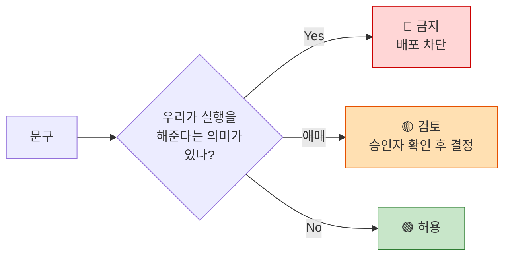

# GR4 금지어 사전 v0.1

> **무엇을 위한 문서인가** — Guardrail GR4는 *"실행 지원으로 오인될 문구 노출 **0건**, 초과 시 즉시 롤아웃 중단"*이다. 그런데 **무엇이 그 문구인지 정의가 없으면 "0건"을 판정할 수 없다.** 이 문서가 그 정의다.
>
> 작성: 효진 · 2026-08-21 · 대상: `효진/0820/09_PRD_Requirement_Trace_v0.1.md` GR4 · F-12(스코프 경계 고지 + 금지어 자동 검수)

---

## 0. 왜 사람의 주의력에 맡기지 않는가

**"해지·전환을 대행하지 않는다"는 결정(D-06)은 문서에 있고, 사용자는 문서를 보지 않는다. UI 문구만 본다.**

선의로 쓴 한 문장이면 원칙이 무너진다. *"해지 도와드릴게요"* — 문구를 쓴 사람은 친절하게 안내하려 했을 뿐이지만, 그 순간 서비스는 **권한 없는 일을 하겠다고 약속한 것**이 된다.

막는 것이 둘이다.

| 위험 | 내용 |
| --- | --- |
| **규제** | 해지·전환 대행 권한이 없다(`윤정/확정본/02` 5절). 카드사 신청 페이지 연결도 **모집인 등록 대상인지 미확인 🟠**. 재무자문 분류도 **미확인 🟠** |
| **기대 격차** | "대신 해줄 것"으로 믿고 온 사용자가 실패하면 그게 곧 민원이 된다 — **우리가 문제로 지목한 그 민원(+88.4% 🔵)과 같은 종류다** |

### 반대 방향도 막는다 — 단순 금지어 목록은 실패한다

**"해지"라는 단어 자체는 금지어가 아니다.** *"B카드는 정리하세요"*, *"이 카드를 해지하면 순혜택이 늡니다"*는 **우리 제품의 핵심 출력**이다. 단어를 막으면 제품이 자기 결론을 말할 수 없다.

> **금지 대상은 "해지"가 아니라 "해지 + 우리가 해준다는 의미"의 결합이다.**

그래서 이 사전은 단어 목록이 아니라 **패턴 목록**이다.

---

## 1. 3구역 판정

| 구역 | 처리 | GR4 집계 |
| :---: | --- | --- |
| 🔴 **금지** | 배포 차단. 이미 노출됐으면 **즉시 롤아웃 중단** | **1건으로 집계** |
| 🟡 **검토** | 승인자 확인 후 통과 또는 수정 | 집계하지 않음 (검토 이력만 남김) |
| 🟢 **허용** | 통과 | — |

---

## 2. 🔴 금지 패턴

### A. 해지·전환 대행 암시

| # | 금지 표현 | 검사 패턴 |
| :---: | --- | --- |
| A-1 | 해지를 **대행/대신** 한다 | `해지.{0,8}(대행|대신|처리해|진행해\s*드리|맡겨)` |
| A-2 | 해지를 **도와준다** | `(해지|정리|전환).{0,8}(도와|도움|지원해\s*드리|함께\s*진행)` |
| A-3 | 해지를 **쉽게/한번에** 해준다 | `(해지|카드\s*정리).{0,10}(한\s*번에|원클릭|버튼\s*하나|간편하게\s*(끝|완료))` |
| A-4 | 우리 앱에서 해지가 **완료된다** | `(여기|앱|CardFit).{0,10}(해지|전환).{0,6}(완료|끝)` |
| A-5 | 해지 **신청**을 우리가 넣는다 | `해지.{0,6}(신청.{0,4}(대신|드리|접수)|요청.{0,4}드리)` |

### B. 만류 대응·상담 개입

| # | 금지 표현 | 검사 패턴 |
| :---: | --- | --- |
| B-1 | 상담사 만류에 **이렇게 대응하라** | `(상담원|상담사|콜센터).{0,15}(대응|응대|대처|이렇게\s*말)` |
| B-2 | 만류를 **뚫어준다/막아준다** | `(만류|붙잡|설득).{0,10}(대응|대비|극복|무시|거절하는\s*방법)` |
| B-3 | 해지 **화법·스크립트** 제공 | `(해지|전환).{0,8}(화법|멘트|스크립트|말하는\s*법|요령)` |
| B-4 | 우리가 **카드사에 연락**한다 | `(카드사|고객센터).{0,10}(연락.{0,4}드리|문의.{0,4}드리|대신.{0,4}(연락|전화))` |

### C. 실행 상태 관리 암시

**D-09에서 명시적으로 채택하지 않은 기능이다.** 문구로 새어나가면 안 된다.

| # | 금지 표현 | 검사 패턴 |
| :---: | --- | --- |
| C-1 | 해지 **진행 상황을 추적**한다 | `(해지|전환).{0,10}(진행\s*(상황|상태)|현황|추적|트래킹)` |
| C-2 | 실행 **체크리스트**를 관리한다 | `(실행|해지).{0,8}(체크리스트|할\s*일\s*목록|단계별\s*관리)` |
| C-3 | 해지 완료를 **확인해준다** | `(해지|전환).{0,10}(확인해\s*드리|검증해\s*드리|처리\s*여부.{0,4}알려)` |
| C-4 | **알림으로 재촉**한다 | `(해지|전환|실행).{0,10}(리마인|재촉|독려|알림.{0,4}보내\s*드리)` |

> ⚠️ **F-13(실행 완주율 계측)과 구분해야 한다.** *"바꾸셨나요?"*라고 **한 번 묻는 것**은 측정이라 허용이다(§4 G-6). 반복 알림·상태 표시·진행률 표시는 **상태 관리**라 금지다.

### D. 혜택 보장·확정

| # | 금지 표현 | 검사 패턴 |
| :---: | --- | --- |
| D-1 | 혜택을 **보장/확정**한다 | `(혜택|절약|적립|할인).{0,10}(보장|확정|약속|틀림없|반드시\s*받)` |
| D-2 | **무조건/100%** 이득이다 | `(무조건|100%|절대|틀림없이).{0,10}(이득|유리|절약|받으)` |
| D-3 | AI가 계산했다 | `AI.{0,8}(계산|산출|금액.{0,4}(도출|산정))` |
| D-4 | **최적/최고**를 단정 | `(항상|언제나).{0,6}(최적|최고|가장\s*유리)` |

> **D-3의 이유** — 금액 계산은 결정론적 규칙 엔진이고 AI는 근거 설명에만 쓴다. 이 경계가 문구에서 무너지면 *"AI가 혜택을 보장한다"*는 오해가 되고, 그게 규제 리스크다(`윤정/확정본/02` 기술개발 절).

### E. 재무자문·투자권유 암시

**분류 여부가 미확인(🟠)이라 보수적으로 막는다.**

| # | 금지 표현 | 검사 패턴 |
| :---: | --- | --- |
| E-1 | **자문/컨설팅**을 제공한다 | `(재무|금융|자산).{0,6}(자문|컨설팅|상담해\s*드리|설계해\s*드리)` |
| E-2 | 상품을 **권유/추천 책임**진다 | `(카드|상품).{0,8}(권유|권합니다.{0,10}책임|보증)` |
| E-3 | **수익/이익률** 표현 | `(수익률|이익률|투자|재테크\s*수익)` |

### F. 발급 대행 암시

신규 카드는 **카드사 공식 페이지로 이동 링크만** 제공한다.

| # | 금지 표현 | 검사 패턴 |
| :---: | --- | --- |
| F-1 | 발급을 **대신 신청**한다 | `발급.{0,8}(대행|대신|신청해\s*드리|접수해\s*드리)` |
| F-2 | **앱에서 발급 완료** | `(여기|앱|CardFit).{0,10}발급.{0,6}(완료|가능|끝)` |
| F-3 | **자동 발급** | `자동.{0,4}발급` |

### G. 근거 없는 금액 단정

| # | 금지 표현 | 검사 패턴 |
| :---: | --- | --- |
| G-1 | 미획득 혜택 **총액**을 단정 | `(놓친|놓치고\s*있는|못\s*받은).{0,10}혜택.{0,10}[0-9,]+\s*(원|만원)` |
| G-2 | 예시 금액을 실측처럼 | `(평균|보통).{0,10}[0-9,]+\s*원.{0,10}(더\s*받|절약)` |

> **G-1의 이유** — 미획득 혜택 규모는 미확보(🟠)다. *"당신은 연 10만원을 놓치고 있습니다"* 같은 문구는 근거가 없다. **개별 계산 결과의 차액을 말하는 것은 허용**이다(§4 G-2).

---

## 3. 🟡 검토 구역 — 승인자 확인 후 결정

기계적으로 판정할 수 없어 사람이 봐야 하는 것들이다.

| # | 표현 | 무엇을 확인하나 |
| :---: | --- | --- |
| R-1 | "정리하세요" / "줄이세요" | 계산 결과 서술이면 허용. 실행 방법 안내로 이어지면 금지 |
| R-2 | "이제 카드사에서 진행하세요" | 경계를 밝히는 문장이면 허용. 절차를 단계별로 안내하면 금지(A-2) |
| R-3 | "쉽게 / 간편하게 / 한 번에" | **계산**이 쉽다는 뜻이면 허용. **해지·발급**이 쉽다는 뜻이면 금지(A-3) |
| R-4 | "관리" | 카드 조합 계산을 뜻하면 허용. 해지 상태 관리를 뜻하면 금지(C-2) |
| R-5 | "맞춤 / 최적화" | 계산 결과를 뜻하면 허용. 자문 성격이면 검토(E-1) |
| R-6 | "알려드릴게요" | 계산 결과 통지면 허용. 해지 방법 통지면 금지(B-3) |
| R-7 | 비교급 없는 "더 유리해요" | 무엇 대비인지 명시됐는지 — 근거 공개 원칙(F-06)과 연결 |

---

## 4. 🟢 허용 표현 — 대치표

**금지만 있으면 문구를 못 쓴다.** 같은 뜻을 안전하게 말하는 방법을 함께 둔다.

| # | ✗ 금지 | ○ 허용 |
| :---: | --- | --- |
| G-1 | "B카드 해지를 도와드릴게요" | **"B카드는 정리하는 게 유리해요"** (결과만 말한다) |
| G-2 | "연 10만원을 놓치고 있어요" | **"이 조합이면 지금보다 O원 더 유리해요"** (개별 계산 결과의 차액) |
| G-3 | "한 번에 해지 완료" | **"해지·전환은 카드사에서 직접 진행하셔야 해요"** |
| G-4 | "상담사가 만류하면 이렇게 하세요" | (대응 없음. **이 주제 자체를 다루지 않는다**) |
| G-5 | "AI가 계산했어요" | **"카드 혜택 규칙을 적용해 계산했어요"** / AI 언급은 근거 설명에만 |
| G-6 | "해지 진행 상황을 확인하세요" | **"바꾸셨어요?"** (30일 후 **한 번만** 묻는다 — F-13 측정) |
| G-7 | "혜택을 보장합니다" | **"실적·한도·연회비를 반영한 예상 순혜택이에요"** |
| G-8 | "앱에서 바로 발급하세요" | **"카드사 공식 신청 페이지로 이동해요"** |
| G-9 | "최적의 카드를 찾아드려요" | **"바꿀 가치가 있을 때만 알려드려요"** |

### 승인된 정본 문구 — 스캐너 예외 목록

블루프린트(`윤정/blueprint/blueprint_v0.2.html`)에 이미 들어간 경계 고지 문구다. **패턴에 걸리더라도 통과시킨다.**

| 문구 | 위치 |
| --- | --- |
| "해지 상담·신청 대행은 제공하지 않습니다" | 08 적용 화면 |
| "해지·전환은 카드사에서 직접 진행" | 08 적용 화면 |
| "이 서비스는 해지·전환을 대신 진행하지 않습니다" | F-12 고지 |
| "신규카드 신청은 공식 카드사 페이지로 연결합니다" | 08 적용 화면 |
| "금액 산출은 카드 혜택 Rule을 적용하는 규칙 엔진이 수행하고, AI는 계산 근거를 읽기 쉽게 설명하는 역할에 한정합니다" | 04 계산 화면 |
| "포인트 소멸, 자동납부 승계 등 카드사별 부수 비용은 이 계산에 포함되지 않았습니다" | 07 근거 화면 |

> **부정문은 허용이다.** "대행하지 않습니다"는 A-1 패턴(`해지.{0,8}대행`)에 걸리지만, **경계를 밝히는 문장이라 정본이다.** 스캐너가 부정 표현(`않|안\s|없|불가|제외`)을 감지하면 검토 구역으로 내린다.

---

## 5. 적용 범위

**UI만 검사하면 새어나간다.** 사용자·심사자가 보는 모든 텍스트가 대상이다.

| 대상 | 검사 시점 | 담당 |
| --- | --- | :---: |
| **앱 UI 문구** (버튼·안내·에러) | 배포 전 자동 스캔 | 개발 |
| **푸시·알림·이메일** | 발송 전 | 마케팅 |
| **도움말·FAQ·약관** | 게시 전 | PM |
| **CS 응대 스크립트** | 작성·개정 시 | CS |
| **Concierge 응대 스크립트** | **실험 착수 전 (D7 선결)** | PM |
| **랜딩·마케팅·앱스토어 설명** | 게시 전 | 마케팅 |
| **발표자료·투자자 자료** | 배포 전 | PM |

> 마지막 줄이 빠지기 쉽다. **발표에서 "해지까지 도와드립니다"라고 말하면 화면에 금지어가 0건이어도 GR4 위반이다.** 발표 시나리오 §6에 같은 목록을 넣어둔 이유다.

---

## 6. 검사 방식

| 단계 | 방법 |
| :---: | --- |
| 1 | 문구 문자열을 한 곳에 모은다 (하드코딩 금지 — 검사 대상을 만들 수 없다) |
| 2 | §2 패턴으로 정규식 스캔 → 🔴 매치 시 **빌드·배포 차단** |
| 3 | §3 패턴 매치 시 **승인 요청**으로 전환 (차단 아님) |
| 4 | §4 예외 목록과 부정 표현(`않|안|없|불가|제외`)은 검토 구역으로 내린다 |
| 5 | 릴리스 전 **전체 문구 재스캔** — 부분 스캔은 조합으로 생긴 위반을 놓친다 |

### 오탐을 어떻게 다루나

**오탐이 많으면 사람이 스캐너를 끈다.** 그게 최악이다.

| 원칙 | 내용 |
| --- | --- |
| 오탐은 **패턴을 좁혀서** 줄인다 | 문구를 우회 표현으로 바꾸게 하면 원칙만 남고 실질이 사라진다 |
| 🔴만 차단하고 🟡은 통과시킨다 | 차단 대상을 늘리면 신뢰를 잃는다 |
| **예외는 문구 단위로만** 등록한다 | 패턴 단위 예외는 구멍이 된다 |
| 예외 등록에 **승인자와 이유**를 남긴다 | 나중에 왜 통과됐는지 추적 가능해야 한다 |

---

## 7. GR4 판정 규칙

| 상황 | GR4 집계 | 조치 |
| --- | :---: | --- |
| 배포 전 스캔에서 🔴 적발 → 수정 | **0건** | 정상 동작. 차단이 목적이다 |
| 🔴이 **사용자에게 노출됨** | **1건** | **즉시 롤아웃 중단** |
| 🟡이 승인 없이 배포됨 | 0건 | 프로세스 위반으로 기록, 중단은 아님 |
| 예외 목록 문구가 적발 | 0건 | 오탐 — 패턴 조정 |
| 발표·마케팅 자료에서 🔴 발화 | **1건** | 자료 회수 + 정정 |

> **"배포 전에 잡은 것"과 "노출된 것"을 구분한다.** 전자는 스캐너가 일한 것이고 후자만 위반이다. 이 구분이 없으면 팀이 스캐너 결과를 숨기게 된다.

---

## 8. 운영

| 항목 | 내용 |
| --- | --- |
| 소유자 | PM (효진) |
| 갱신 주기 | 신규 패턴 발견 시 즉시 + 분기 전수 검토 |
| 신규 패턴 등록 | 누구나 제안 → PM 판정 → 🔴/🟡 구역 지정 → 결정 로그 기록 |
| 규제 해석 변경 시 | **모집인 등록·재무자문 분류(🟠 미확인 2건)가 확정되면 E·F 구역 전면 재검토** |

---

## 9. 한계

| # | 한계 |
| :---: | --- |
| 1 | **v0.1은 실사용 문구 없이 만든 예방 목록이다.** 실제 문구를 쓰기 시작하면 여기 없는 패턴이 나온다 |
| 2 | 정규식은 **의미가 아니라 형태**를 잡는다. 우회 표현("불편한 절차를 저희가 함께 살펴봐요")은 못 잡는다 — §3 검토 구역과 사람의 판정이 필요하다 |
| 3 | **모집인 등록·재무자문 분류가 미확인(🟠)**이라 E·F 구역은 보수적으로 넓게 잡았다. 확정되면 조정한다 |
| 4 | 검사 대상 문구가 코드에 하드코딩되어 있으면 **스캔 자체가 불가능하다** — 문구 외부화가 선결 조건이다 |
