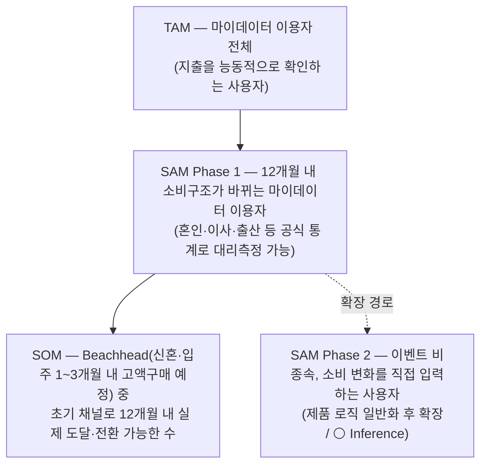

# TAM-SAM-SOM 정의 작업안

> **[08.19 갱신] TAM 앵커 재확정 — 마이데이터 이용자로 되돌림.** 이 문서가 제안한 "TAM=신용카드 실사용자"는 08.18 한때 팀에 채택되었으나, 같은 날 저녁 추가 논의(`윤정/0818_TAM 정의 재논의 정리.md`)에서 "신용카드 실사용자는 채택 가능성 낮은 인구·디지털 비친화 인구까지 과다포함한다"는 반박이 나와 08.19 팀이 TAM을 마이데이터 이용자로 재확정했습니다(옵션 A). 아래 0-3·2-1·3절은 이 갱신을 반영해 수정했습니다. 이 문서가 지적했던 쟁점 1과의 정합성 문제는, 같은 날 팀이 쟁점 1 자체를 "MVP부터 마이데이터 연동 포함"으로 정정하면서 **실제로 해소되었습니다** — TAM=마이데이터 이용자는 이제 채택 가능성 앵커가 아니라 문자 그대로의 이용 자격 기준입니다.
>
> 대상: 「미래지출 결제설계 서비스」 — `방법론.md` 5장 04번(TAM-SAM-SOM & Market Segment Map, 통합 위치: Market Scope) 산출물을 만들기 위한 **작업 절차서**입니다. 최종 숫자가 아니라 "무엇을 어떤 순서로 채워야 숫자가 근거를 갖는가"를 정의합니다.
>
> 근거 표기는 `방법론.md` 8장을 따릅니다 — 🔵 Fact · ⚪ Inference · 🟡 Assumption · 🟠 미확인(수집 필요)
>
> 참조: `윤정/국내 신용카드 시장 리서치.md`, `윤정/미래지출 결제설계 서비스 쟁점정리.md`(쟁점 3), `윤정/미래지출 결제설계 서비스 피치덱.md`

---

## 0. 시작 전에 정리해야 할 3가지 (이 프로젝트 고유 함정)

숫자를 찾기 전에 이 세 가지를 먼저 확정하지 않으면, 수집한 데이터가 전부 쓸모없어집니다.

### 0-1. SOM이 SAM보다 커지는 구조 오류

쟁점정리 쟁점 3의 다이어그램은 SOM을 "이벤트 무관, 소비 변화를 직접 입력하는 **전체** 사용자"로 그려두었습니다. 그런데 정의상 **SOM ⊂ SAM ⊂ TAM**이므로, 확장 시장을 SOM 칸에 넣으면 세 층의 포함관계가 깨집니다. 심사자·투자자 관점에서 가장 먼저 지적당하는 지점입니다.

**수정 구조** — 확장은 SOM 안이 아니라 SAM의 시간축(Phase 2)으로 옮깁니다.



> 쟁점 2(이벤트 비종속)의 제품 판단은 그대로 유지됩니다. 바뀌는 건 **시장 규모 슬라이드에서의 표현 위치**뿐입니다 — 이벤트 비종속은 "SOM"이 아니라 "SAM 확장 경로"로 서술.

### 0-2. 단위를 먼저 하나로 고정할 것

리서치 1-2의 경고(⚠️ 집계 기준이 달라 단순 비교·합산 금지)가 그대로 적용됩니다. 현재 손에 있는 숫자들의 기준이 전부 다릅니다.

| 수치 | 실제 기준 | TAM 모수로 쓸 수 있나 |
| --- | --- | --- |
| 승인금액 336.9조원 (2026 2Q) | 분기 거래액 | ✗ 사람 수 아님 |
| 개인카드 이용액 누계 275.97조원 | 누계 거래액 | ✗ 사람 수 아님 |
| 신용카드 발급매수 1억 3,466만 매 | **카드 장수** (1인 다중보유) | ✗ 그대로 쓰면 과대추정 |
| 신한 회원수 1,455만 명 | 카드사별 회원 (사별 중복) | ✗ 8개사 합산 시 중복 |
| 마이데이터 가입 1억 7,734만 건 | 서비스별 가입 누계 (중복 포함) | ✗ 0-3 참고 |

**권장** — 주(主) 단위는 **사용자 수(명)**, 종(從) 단위는 **금액(₩)**. 이유: BM이 아직 미정(쟁점정리 질문 7 — 일회성 vs 지속형)이라 매출 기준 TAM은 가정 위에 가정을 쌓게 됩니다. 금액은 매출이 아니라 **가치풀(value pool)** 개념으로 별도 산정합니다(2-1 참고).

### 0-3. [08.19 갱신] 마이데이터 수치를 다시 TAM 근거로 쓰는 이유

쟁점 1의 원래 판단("MVP는 마이데이터 연동 없이 사용자 직접 입력")을 근거로, 이 절은 원래 마이데이터 가입자 수를 TAM 근거로 쓰지 말라고 지적했습니다. 그러나 대안으로 채택했던 "신용카드 실사용자" 앵커는 08.19 재논의(`윤정/0818_TAM 정의 재논의 정리.md`)에서 다음 두 반박에 부딪혔습니다 — ① 신용카드 실사용자 대부분은 채택 가능성이 낮아 시장 규모가 부풀려짐, ② "신용카드 사용자"는 사실상 성인 전체라 필터링 기능이 없고 디지털 비친화 인구까지 포함함. 팀은 이 반박을 근거로 TAM을 마이데이터 이용자로 되돌렸습니다.

- **쟁점 1도 같은 날 함께 정정됨**: 팀은 서비스 정의 자체를 "마이데이터 연동으로 확보한 과거 소비 기록 + 사용자가 입력하는 미래 변화 지출값을 함께 쓰는 서비스"로 확정했습니다(MVP부터 마이데이터 연동 포함). 그 결과 이 절이 원래 지적했던 모순(마이데이터 가입 여부가 제품 이용 자격과 무관하다는 문제)은 **해소되었습니다** — TAM=마이데이터 이용자는 이제 문자 그대로의 자격 기준입니다.
- 새 리스크: 마이데이터 연동을 위한 직접 인가 취득 vs 기존 인가 사업자 제휴 경로가 미확정 — `윤정/0818_쟁점정리.md` 쟁점 1 참고
- 리서치 8장이 지적한 "TAM 재확인 필요"(1.77억 건 vs 1.65억 명 집계 기준 상이)는 그대로 유효 — 고유인원 환산 시 이 상이를 반영할 것
- 신용카드 실사용자 수치는 삭제하지 말고, TAM의 상한 참고치(마이데이터 미가입 잠재 확장 인구 규모 감각)로 위치를 옮길 것

---

## 1. 7단계 리서치 전략 → 이 작업에의 매핑

각 단계에서 **AI에 맡길 것**과 **직접 판단해야 할 것**을 분리합니다(`방법론.md` 9장 AI 활용 원칙).

| # | 단계 | 이 작업에서 던질 실제 질문 | AI 활용 방식 | 산출물 | 직접 판단 필수 |
| --- | --- | --- | --- | --- | --- |
| 1 | 광범위한 탐색 | "국내 신용카드 사용자 모수와 결제액은 어떤 지표들로 집계되는가" | Deep Research (정량 지표 후보 수집) | 후보 모수 지표 목록 + 각 지표의 집계 기준 | 출처의 실제 존재·신뢰성 |
| 2 | 범위 축소 | 단위(명/₩)·지역(국내)·기간(2026)·지표(활성 사용자 vs 발급매수) 확정 | 논리 정제 (제약조건 역질문) | **TAM 정의문 1문장 + 포함/제외 규칙** | 시장·세그먼트 전제 |
| 3 | 핵심 원인 분석 | "카드 조합 재설계 수요는 **언제** 발생하는가" — 소비구조 변화의 발생 원인 | Deep Research (생애이벤트·소득변화·물가 등) | SAM을 좁힐 축 후보 | 문제 적합성 |
| 4 | 가설 수립 | "SAM = 연간 소비구조가 유의미하게 바뀌는 카드 사용자" — 대리지표로 측정 가능한가 | 논리 정제 (스파링) | **대리지표 세트 확정** (혼인·이사·출생·이직) | 대리지표의 타당성 |
| 5 | 정량적 검증 | 각 대리지표의 실수치 수집 + 상충 데이터(중복 계산) 확인 | Deep Research + 시각화 | 3층 1차 숫자 + 중복 구간 차트 | 수치의 원자료 대조 |
| 6 | 반복적 정제 | 중복 제거, 보수/기본/공격 3시나리오, 민감도 | 시각화 + 논리 정제 | **최종 산식 + 시나리오 표** | 가정값의 합리성 |
| 7 | 솔루션 구체화 | Market Scope 슬라이드 + 2축 Segment Map | 브레인스토밍 + 문서화 | 슬라이드 1~2장 + Workbook 근거행 | 페르소나와의 정합성 |

> 2단계가 이 작업의 실질적 승부처입니다. "TAM을 뭘로 잡을지"를 먼저 못 박지 않으면 5단계에서 모은 숫자가 서로 합산 불가능해집니다(0-2 참고).

---

## 2. 산식 뼈대 — 채워 넣을 슬롯

현재 확보된 값은 채워두고, 수집이 필요한 칸은 🟠로 비워뒀습니다.

### 2-1. TAM (Top-down) — [08.19 갱신] 마이데이터 이용자 기준

**정의문 초안**: *마이데이터 서비스(뱅크샐러드·토스·카카오페이 등)를 이용해 본인 지출을 능동적으로 확인하는 사용자 전체.*

```
TAM_user = 마이데이터 이용 고유인원 수 (명, 서비스별 중복가입 제거)
TAM_₩    = TAM_user × 1인당 연간 개인 신용카드 결제액 × 평균 미획득 혜택률
```

| 변수 | 현재 값 | 구분 | 확보 방법 |
| --- | --- | --- | --- |
| 마이데이터 가입 건수 | 1억 7,734만 건 (2025.10, 중복포함) | 🔵 Fact | 금융위·마이데이터 종합포털 공시 |
| 마이데이터 고유인원 수 | 약 3,000만 명 추정 | ⚪ Inference | 서비스별 중복가입 제거 방식 확정 필요 — 리서치 8장이 지적한 1.77억 건 vs 1.65억 명 집계 기준 상이 문제 반영 |
| 1인당 연간 개인카드 결제액 | 개인카드 승인금액 273.7조원 (2026 2Q) ÷ 신용카드 실사용자 수 | 🔵 Fact(분자) / 🟠 미확보(분모) | 4개 분기 실적으로 연간 집계(⚠️ 단순 ×4 금지 — 계절성). 분모(신용카드 실사용자 수)는 발급매수 1억 3,466만 매 ÷ 1인당 평균 보유 장수, 또는 경제활동인구 × 신용카드 보유율로 교차검증 |
| 평균 미획득 혜택률 | 🟡 가정 | 🟡 | 전월실적 미달·통합할인한도 초과로 놓치는 비율. 카드사 약관 + 자체 시뮬레이션으로 하한선 추정 |

> **금액 TAM을 "매출"이 아니라 "가치풀"로 정의하는 이유**: 우리 서비스가 가져가는 건 결제액이 아니라 *그 결제에서 새는 혜택*입니다. "마이데이터 이용자의 연간 개인카드 결제액 ○○조원 중, 조건 미달로 놓치는 혜택이 △△조원 — 이것이 우리가 되찾아 주는 시장"이 훨씬 방어 가능한 서술입니다. 단, 미획득 혜택률은 🟡이므로 **보수적 하한값**만 쓸 것.
>
> **[08.19] 모순 해소**: 쟁점 1이 "MVP부터 마이데이터 연동 포함"으로 함께 정정되면서, TAM을 마이데이터 이용자로 잡아도 더 이상 자격 단계의 모순이 없습니다(0-3 참고). 신용카드 실사용자 수는 TAM 산식에서 결제액 분모로만 쓰이며, 더 이상 TAM 인원 앵커 자체는 아닙니다.

### 2-2. SAM (Bottom-up, 대리지표 합산 후 중복 제거) — [08.19 갱신] TAM(마이데이터 이용자) 내부 필터로 재정의

**정의문 초안**: *향후 12개월 내 소비 구조가 유의미하게 바뀔 것으로 예상되는 마이데이터 이용자.*

```
SAM_user = [ Σ(연간 소비변화 이벤트 발생 인원) − 중복 ] × 마이데이터 이용률
SAM_₩    = SAM_user × 1인당 이벤트 관련 카드결제 대상 지출 × 미획득 혜택률
```

> TAM이 이미 마이데이터 이용자로 좁혀졌으므로, 대리지표(혼인·이사·출산)의 모수도 "신용카드 보유율"이 아니라 **"마이데이터 이용률"**로 필터링합니다.

| 대리지표 | 출처 | 상태 | 주의점 |
| --- | --- | --- | --- |
| 혼인 건수 × 2 (양 당사자) | 통계청 KOSIS 「혼인·이혼통계」 | 🟠 수집 | 재혼 포함 여부 명시 |
| 주민등록 전입(이사) 세대 수 | 통계청 「국내인구이동통계」 / 행안부 주민등록 | 🟠 수집 | **개인이 아니라 세대 기준**으로 잡아야 중복 감소 |
| 출생아 수 (부모 기준) | 통계청 「출생통계」 | 🟠 수집 | 혼인·이사와 강하게 중복 |
| 이직·전직자 수 | 통계청 경제활동인구조사 | 🟠 수집 | 소비변화 유의성이 위 셋보다 약함 → 🟡로 분리 |
| 자녀 독립 | — | 🟠 공식 통계 없음 | 대리지표 없음. 서술로만 언급하고 숫자에 넣지 말 것 |
| 1인당 혼인 관련 카드결제 대상 지출 | 1,473~2,203만원 | 🔵 Fact (E-03~E-06) | **혼인 한정 수치** — 이사·출산에 그대로 전용 금지 |

> **중복 제거가 이 층의 핵심 난이도입니다.** 신혼 1쌍은 혼인 + 이사 + (경우에 따라) 출산에 모두 잡힙니다. 단순 합산하면 SAM이 2~3배 부풀려집니다. 실무적 처리: **"세대(가구) 단위"로 카운트 기준을 통일**하고, 중복률은 🟡 가정으로 명시한 뒤 3시나리오(0.5 / 0.65 / 0.8)로 민감도를 보여줄 것.

### 2-3. SOM (12개월 기준)

**정의문 초안**: *Beachhead(신혼·입주 등 1~3개월 내 고액구매 예정 카드 사용자) 중, 초기 확보 가능한 채널로 도달해 실제 Payment Plan을 선택하는 사용자.*

```
SOM_user = SAM_user × Beachhead 비중 × 초기 채널 도달률 × Payment Plan Selection Rate
```

| 변수 | 상태 | 채우는 방법 |
| --- | --- | --- |
| Beachhead 비중 (SAM 중 1~3개월 내 고액구매 예정 비율) | 🟡 | 자체 설문 / JTBD 인터뷰 |
| 초기 채널 도달률 | 🟡 | 카드고릴라 MAU 약 140만 명, 뱅크샐러드 카드추천 약 130만 명을 **상한 벤치마크**로 사용 (🔵 Fact) |
| Payment Plan Selection Rate | 🟡 | **피치덱 8장의 Primary Metric과 동일 지표** — 피치덱 9장 Concierge Test에서 실측 예정 |

> SOM 세 변수는 현 시점에 전부 🟡입니다. 이걸 그럴듯한 숫자로 메우지 말고, **"Validation Plan이 채울 칸"으로 명시**하는 편이 방법론 8장(피해야 할 패턴 — 내부 정답 단정)에 맞고 심사에서도 강합니다. 대신 벤치마크 기반 상한선(예: "국내 카드추천 서비스 최대 MAU가 약 140만 명 → 우리 SOM은 그 하위 한 자릿수 %")은 지금도 제시 가능합니다.

---

## 3. 데이터 출처 매핑

| 층 | 우리 프로젝트 정의 | 1순위 출처 | 2순위 |
| --- | --- | --- | --- |
| **TAM** | 마이데이터 이용 고유인원 / 1인당 연간 개인카드 결제액 | 금융위·마이데이터 종합포털 공시, 여신금융협회 월간 통계(crefia.or.kr) | 통계청 KOSIS, 한국은행 지급결제통계 |
| **SAM** | 12개월 내 소비구조 변화 이벤트 발생 마이데이터 이용자 | 통계청 KOSIS(혼인·이혼 / 국내인구이동 / 출생), 행안부 주민등록 | 한국은행 가계금융복지조사 |
| **SOM** | Beachhead 중 초기 채널 도달·전환 | 자체 설문 · JTBD 인터뷰 · Concierge Test | 카드고릴라·뱅크샐러드 MAU 벤치마크, 네이버 데이터랩 검색량 |

---

## 4. 최종 산출물 체크리스트

- [ ] **정의문 3줄** — 각 층 1문장, 포함/제외 규칙 명시
- [ ] **산식** — 변수별 값·출처·확인일·Fact/Inference/Assumption 태그
- [ ] **3시나리오 표** — 보수 / 기본 / 공격 (중복률·전환율 민감도)
- [ ] **2축 Segment Map** (방법론 04 필수 산출물) — 축 제안: X축 *소비 변화의 예측 가능성*(높음↔낮음), Y축 *보유 카드 수*(다장↔소장). 우상단(변화 예측 가능 + 다장 보유)이 Beachhead와 일치하는지 확인
- [ ] **Evidence & Analysis Workbook 행** — 방법론 8장 필드 8개 전부
- [ ] **정합성 확인** — 방법론 5장 연결 규칙: *"TAM-SAM-SOM → Segment Map → Persona가 같은 세그먼트를 가리키는가"* ← SOM의 Beachhead와 피치덱 2장 Target이 동일인지 대조

---

## 5. 다음 액션

| 순서 | 할 일 | 선행 조건 |
| --- | --- | --- |
| 1 | **0-1 구조 수정을 팀에 공유** — 쟁점 3 다이어그램의 SOM/확장 위치 교정 | 없음 (지금 가능) |
| 2 | **2단계(범위 축소) 확정** — TAM 단위·기간·지표 못 박기 | 팀 합의 |
| 3 | 통계청 KOSIS 대리지표 실수치 수집 (5단계) | 2번 완료 |
| 4 | 중복 제거 규칙 + 3시나리오 산정 (6단계) | 3번 완료 |
| 5 | Segment Map 작성 후 페르소나 담당과 정합성 대조 (7단계) | 4번 완료 |
| 6 | 결과를 `decision-log/decision-log.md`에 새 행으로 기록 | 5번 완료 |

> 담당 확인 필요 — 쟁점정리 5장은 쟁점 3을 시장분석 담당(윤정) 작업으로 배정해 두었습니다. 이 문서를 진행하기 전에 담당 범위를 팀에서 정리하세요.
