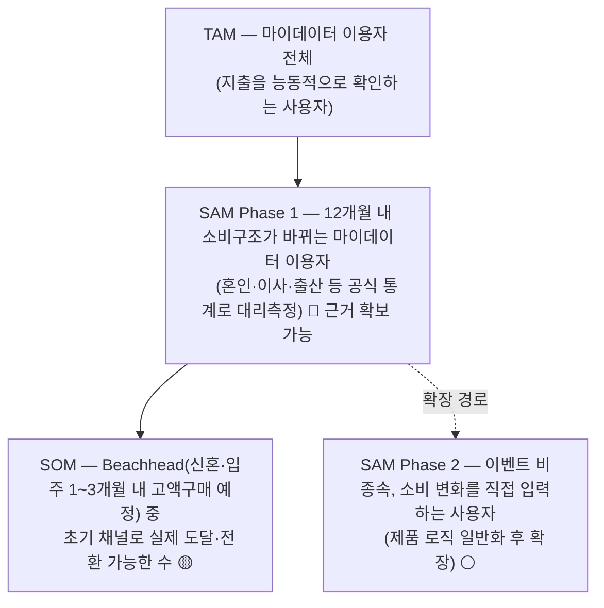

# 미래지출 결제설계 서비스 — 컨설팅 전 1페이지 브리프

> 08.18(화) "Question & Role Lock" 초기 컨설팅용 요약. 팀 기존 문서에서 확정·근거 있는 내용만 종합했습니다. 새로 판단한 것은 **항목 7(가장 큰 가정·확인 질문)의 우선순위**와 **항목 2의 세그먼트 구조 교정**뿐이며, 두 건 모두 팀 확정 대상입니다.
>
> 근거 표기는 `방법론.md` 8장 기준 — 🔵 Fact · ⚪ Inference · 🟡 Assumption · 🟠 미확인

---

## 1. 기준 서비스와 분석할 사용자 시나리오

| 항목 | 내용 |
| --- | --- |
| 기준 서비스 | **뱅크샐러드 "나에게 딱 맞는 카드 찾기"** — 마이데이터 기반 카드추천 + 발급연계(2026.05 출시). 실사용 캡처 12장 + 유저플로우 PDF로 As-Is Flow 확보 🔵 |
| 분석할 사용자 시나리오 | *"1~3개월 내 고액구매가 예정된 사용자가, 바뀔 소비에 맞게 보유 카드 조합을 다시 짜려고 카드추천을 받는다."* — 뱅크샐러드는 이 시나리오에서 **과거 소비 기준 단일 카드 추천**까지만 제공 |
| 선정 이유 | 경쟁 6곳(뱅크샐러드·카드고릴라·더쎈카드·토스·Credit Karma·NerdWallet) 중 실행설계·미래소비반영을 동시에 만족하는 곳이 없고, 그중 자료 접근성이 가장 좋은 대표 사례 |

## 2. 시장·주요 경쟁구도·예상 세그먼트

**시장** — 국내 카드시장 2026년 2분기 승인실적 336.9조원(전년 +7.6%) 🔵. 카드추천·비교 영역은 카드고릴라(MAU 약 140만)·토스 카드라운지·뱅크샐러드(카드추천 약 130만 명)·카카오페이가 경쟁 🔵. 2026 트렌드 키워드 "PIVOT"(PLCC·준프리미엄·선택형·트래블카드)으로 **카드 조합 전략의 필요성이 커지는 국면** 🔵

**경쟁구도** — 3조건 동시 충족 사업자 없음이 존재 근거

| 기업 | 실행 설계 | 미래 소비 반영 | 근거 공개 |
| --- | :---: | :---: | :---: |
| 뱅크샐러드 | ✗ | ✗ | ◐ |
| 카드고릴라 / 토스 / Credit Karma | ✗ | ✗ | ✗ |
| 더쎈카드 † | ✔ | ✗ | ？ |
| NerdWallet | ✗ | ✗ | ◐ |

† 2023년 미래 소비항목 반영 기능을 제공했으나 2026년 사업보고서에 서비스 종료 기재 — **종료 원인 🟠 미확인**

**예상 세그먼트** — 쟁점정리 쟁점 3의 투트랙 다이어그램은 확장시장을 SOM 칸에 넣어 `SOM ⊂ SAM ⊂ TAM` 포함관계가 깨져 있었습니다. 확장을 **SAM의 시간축(Phase 2)** 으로 옮긴 아래 구조로 교정해 서술합니다. **[08.19 갱신]** 이 문서 초안 당시(08.18) TAM은 신용카드 이용자로 잡혀 있었으나, 같은 날 밤 추가 논의(`윤정/0818_TAM 정의 재논의 정리.md`)에서 "채택 가능성 낮은 인구·디지털 비친화 인구 과다포함" 반박이 나와 08.19 팀이 TAM을 마이데이터 이용자로 되돌렸습니다(옵션 A) — 최신 버전은 `윤정/0818_1페이지 브리프.md` 2절 참고.

> **[08.19 확정]** TAM 모수는 마이데이터 가입건수(1.77억 건, 중복포함) → 고유인원 약 3,000만 명 추정으로 다시 잡습니다. 같은 날 팀은 쟁점 1도 함께 정정해 **MVP부터 마이데이터 연동(과거 소비 기록) + 사용자 직접 입력(미래 변화 지출값)을 함께 쓰는 서비스**로 확정했습니다 — 이로써 TAM=마이데이터 이용자는 더 이상 모순이 아니라 문자 그대로의 이용 자격 기준입니다. 대신 마이데이터 인가 취득 vs 제휴 경로 결정이 새 리스크로 남습니다(`윤정/0818_쟁점정리.md` 쟁점 1 참고).

## 3. 핵심 Value Proposition

> 사용자가 미래 소비 변화를 입력하면, 카드별 **전월실적 구간·혜택한도·연회비**를 반영해 **실행 가능한 결제조합(Payment Plan)을 계산 근거와 함께** 제시한다. 그 결과 카드사의 일방적 자동대체나 해지 유도가 아니라, **사용자가 스스로 검증 가능한 재배치 결정**을 내린다.

차별점 A 실행설계 · B 미래소비 반영 · C 검증 가능한 계산 근거 공개 / 1차 성과지표 = **Payment Plan Selection Rate**

## 4. 현재 관찰한 문제와 근거

| # | 관찰한 문제 | 근거 |
| --- | --- | --- |
| ① | 경쟁 6곳 중 실행설계·미래소비반영·근거공개 3조건 동시 충족 사업자 없음 | 경쟁사 비교표(항목 2) 🔵 |
| ② | 카드사의 일방적 "단종카드 자동대체" 후 혜택 불일치 민원이 실재 — 우리가 하려는 재배치를 카드사가 이미 하고 있고, 그 결과에 불만이 있음 | 소비자 민원 2022→2025 **88.4% 증가**, 민원 유형 ① 🔵 (유형별 정량 비중은 🟠 미공개) |
| ③ | 카드 해지는 계산상 맞아도 실행 마찰이 큼(상담사 만류, 절차 복잡) → 기대와 실제 서비스 능력 사이 괴리 위험 | 실사용 관찰 ⚪ |

## 5. 문제의 구조적 정의 (기능명 없음)

> **소비 패턴 변화가 예상되는 사용자가, 카드별 전월실적 구간·혜택한도·연회비 조건이 복잡하게 얽혀 있어 스스로 최적 조합을 판단하지 못하고, 결과적으로 카드사의 일방적 자동대체·과거 소비 기준 추천에 의존하게 된다.**

분해하면 세 개의 탐색 영역이 나옵니다 — ⓐ 조건 비교·선택지 축소 ⓑ 조건 변화 시 재계산 ⓒ 자동 재배치의 근거 공개

## 6. 탐색해 보고 싶은 다른 산업·서비스 후보

| 영역 | 후보 | 같은 문제 구조라고 보는 근거 |
| --- | --- | --- |
| 교차 산업 (1순위) | **대환대출 자동전환 · 통신 요금제 자동전환 · 전력 시간대 요금 최적화** | "조건이 바뀌면 최적안을 재계산해 근거와 함께 제안"하는 메커니즘이 F-03(시나리오 계산)과 구조적으로 동일 — ⓑⓒ 대응 |
| 인접 도메인 | 대출비교(핀다·토스), 보험비교(보험다모아) | 선택지가 많고 조건이 복잡해 사용자가 스스로 판단하기 어려운 동일 구조 — ⓐ 대응 |
| 동일 도메인 | 카드고릴라·토스·카카오페이 카드추천 UX | 같은 문제를 다루지만 미래소비반영·실행설계 공백이 이미 확인됨 (UX 캡처 🟠 5곳 미확보) |
| 보조 후보 | 배송추적형 상태 가시화 · SaaS 온보딩 단계화 | 결제조합 변경의 "진행상태"·"복잡한 혜택구조 설명"이라는 보조 문제 대응 |

## 7. 가장 큰 가정과 강사에게 확인받을 질문

**가장 큰 가정 🟡** — *"사용자가 미래 지출 변화를 스스로 입력할 것"*

마이데이터 미연동 MVP 전체가 이 가정 위에 서 있어, 무너지면 F-01~F-06이 동시에 무의미해집니다. 유사 기능을 제공했던 **더쎈카드가 서비스 종료**했고 원인이 🟠 미확인이라는 점이 이 가정의 최대 위험 신호입니다.
*차순위 가정*: 계산상 이득이 나면 사용자가 실제로 카드를 해지·재배치한다(문제 ③의 실행 마찰).

**확인받을 질문**

| # | 질문 | 왜 지금 물어야 하는가 |
| --- | --- | --- |
| 1 | 32시간 스코프에서 "미획득 혜택률"(금액 TAM의 🟡 가정)을 자체 시뮬레이션으로 추정해도 되는지, 아니면 **사용자 수 기준만으로** 시장 규모를 서술해야 하는지 | 04 TAM-SAM-SOM 산식의 단위를 오늘 못 박지 않으면 수집한 숫자가 합산 불가능해짐 |
| 2 | 더쎈카드 종료 원인이 확인 불가한데, 실패 사례를 **"원인 미확정" 표기로 존재 근거에 쓰는 것**이 허용되는지 | 평가항목 "근거와 추론의 투명성"(10점)에 직결 |
| 3 | 카드 혜택 계산의 **재무자문 규제 리스크**를 PRD 면책 문구·근거 공개 수준으로 처리하면 충분한지 | 평가항목 "실행 가능성과 도메인 책임"(10점) + 원칙 5(제약을 설계 조건으로) |

---

## 오늘 회의에서 함께 확정할 것

- [ ] 항목 2 세그먼트 교정 구조 승인 (쟁점정리 쟁점 3 다이어그램 대체)
- [ ] **담당 충돌 해소** — `역할·작업계획 확정.md`는 04 TAM-SAM-SOM을 윤정에게 배정했으나, 04 작업안은 효진이 작성 (`효진/TAM-SAM-SOM 정의 작업안.md`)
- [ ] 항목 7의 "가장 큰 가정" 1개와 질문 3개 최종 확정
- [ ] 위 결과를 `decision-log/decision-log.md` **2026-08-18 표(신규)** 에 새 행으로 기록 + `ai-usage-log/ai-usage-log.md` 반영

**연결 문서**: [`아이디어 구체화`](../윤정/미래지출%20결제설계%20서비스%20아이디어%20구체화.md) · [`기초 컨설팅 점검`](../윤정/미래지출%20결제설계%20서비스%20기초%20컨설팅%20점검.md) · [`역할·작업계획 확정`](../윤정/미래지출%20결제설계%20서비스%20역할·작업계획%20확정.md) · [`쟁점정리`](../윤정/미래지출%20결제설계%20서비스%20쟁점정리.md) · [`TAM-SAM-SOM 정의 작업안`](./TAM-SAM-SOM%20정의%20작업안.md)
