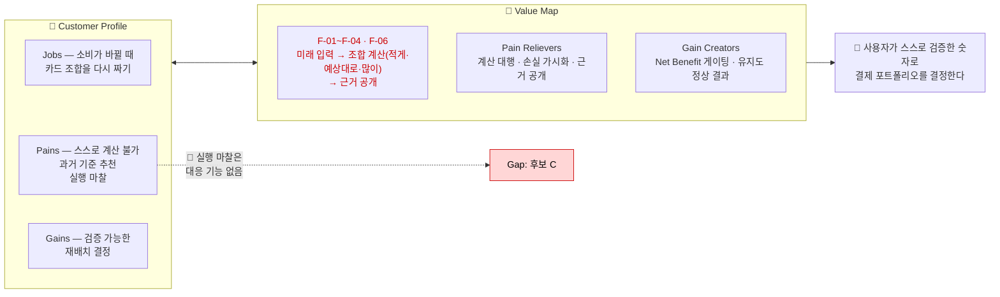

# 08. Value Proposition Sheet — CardFit

> **CardFit**은 소비가 곧 바뀔 사람을 위해 카드 조합을 다시 계산해주는 서비스다. 마이데이터로 확보한 과거 소비 기록과 사용자가 직접 입력한 미래 소비 변화를 함께 반영해, 보유·신규카드의 실적 구간·혜택한도·연회비를 계산 근거와 함께 공개하며 실행 가능한 카드 조합 재배치안을 제시한다.
>
> 표기 — 근거 등급: 🔵 확인된 사실 · ⚪ 추론 · 🟡 가정 · 🟠 미확인 / Fit 판정: ✅ 대응함 · 🔶 부분 대응 · 🔴 공백
>
> ⚠️ **기호 주의**: 이 문서에서 `A`~`F`는 **기회 후보(Outcome)** 이고, 브리프의 차별점은 혼동을 막기 위해 `①②③`으로 표기한다.

---

## 0. 한눈에 보기

---

## 1. Customer Profile

**대상**: Core 페르소나 **이서연**(혼인 예정, 마이데이터 이용자)을 기준으로 하고, Adjacent(정하늘·오세훈·강민재)까지 포함한 8명의 Job을 6개로 통합했다.

### 1-1. Customer Jobs

`가람/확정본/07_JTBD.md` 0절의 Job 단위 선언을 그대로 받는다.

| # | Job (고객이 이루려는 진전) | 해당 페르소나 |
| --- | --- | --- |
| **A** | 소비 구조가 곧 바뀔 때, 미래 지출을 카드 혜택과 미리 연결해 계산받기 | 이서연·김도윤·한지민·최유리·정하늘 |
| **B** | 계산 결과를 신뢰할 수 있는 근거로 직접 검증하기 | 이서연·박서준·최유리·정하늘 |
| **C** | 계산까지 마친 뒤 기존 카드를 실제로 해지·전환해 완주하기 | 이서연·박서준 (극단: 신은서) |
| **D** | 정확한 숫자를 몰라도 부담 없이 유연하게 입력하기 | 김도윤·한지민·정하늘·강민재 |
| **E** | 이벤트가 끝난 뒤에도 계속 쓸 이유를 갖기 | 김도윤·한지민·최유리 |
| **F** | 이벤트명과 무관하게 내 소비 변화를 대상으로 인정받기 | 오세훈·강민재 |

**경계 Job (대응 여부를 의식적으로 결정해야 하는 것)**

| Job | 인물 | 성격 |
| --- | --- | --- |
| 20장 이상을 한 번에 정리·우선순위 매기기 | 윤태호 | 규모가 커질 때의 정보 과부하 |
| 예측하지 않고 그때그때 대응하기 | 조민아 | **가장 큰 가정의 정면 반대** |
| 복잡한 조작 없이 현금·체크카드로 지내기 | 배정호 | 디지털 채널 자체 거부 |

### 1-2. Pains

| Pain | 근거 |
| --- | --- |
| 전월실적 구간·혜택한도·연회비가 얽혀 **스스로 계산할 수 없다** | 브리프 5절 문제 구조(ⓐ) |
| 기존 카드추천은 **과거 소비 데이터만** 본다 | 경쟁 6곳 중 미래소비반영 충족 0곳 🔵 |
| 계산이 맞아도 **상담사 만류로 실행에 실패한다** | 카드 해지 절차 마찰 민원 🔵 / 신은서 |
| 카드사가 **근거 없이 자동대체를 대신 실행한다** | 민원 2022→2025 **+88.4%** 🔵 |
| 미래 지출을 **예측해 입력하는 것 자체가 부담**이다 | 조민아 — "입력 수고 대비 가치 부족" |
| 처리 항목이 많으면 **정보 과부하로 포기한다** | 윤태호 (카드 20장+) |
| 이벤트 분류에 **내 상황이 해당되지 않는다** | 오세훈·강민재 |

### 1-3. Gains

`가람/확정본/07_JTBD.md` 2절 Outcome 표를 기회점수 순으로 정렬한다.

| Gain (원하는 결과) | Importance | Satisfaction | AOS | DOS(SAM) |
| --- | :---: | :---: | :---: | :---: |
| A. 미래 지출을 카드 혜택과 자동 연결해 계산받기 | 5 | 1 | **4.0** | 2.32 |
| C. 계산대로 실제 해지·전환까지 완주하기 | 4 | 1 | **3.2** | **2.40** |
| F. 이벤트명과 무관하게 소비 변화를 인정받기 | 4 | 1 | **3.2** | 0.90 |
| B. 계산 근거를 검증 가능한 형태로 확인하기 | 4 | 2 | 2.4 | 1.26 |
| E. 이벤트 종료 후에도 지속 사용하기 | 3 | 2 | 1.8 | 0.57 |
| D. 입력 부담 없이 유연하게 반영하기 | 3 | 2 | 1.8 | 0.48 |

> **A와 C가 공동 1위**다 — AOS는 A가 앞서지만 보수적 모수(SAM)를 쓰면 C(2.40)가 A(2.32)를 앞선다. 그리고 **C는 6개 후보 중 유일하게 Importance 근거가 🔵 공식 통계**(금감원 민원)다. 나머지는 팀 추정 🟡이다.

---

## 2. Value Map

### 2-1. Products & Services

| 기능 | 내용 | 대응 Job |
| --- | --- | --- |
| F-01 | 미래 지출 변화 입력 (카테고리·금액·시점) | A · F |
| F-02 | 마이데이터 연동으로 과거 소비·보유카드 자동 수집 + 제약조건 입력 | A · D |
| F-03 | 시나리오 계산 — 입력값 기준 외에 적게 쓴 경우·많이 쓴 경우 두 변형까지 함께 산출(실적 구간·한도·연회비 반영 순혜택) | A |
| F-04 | 보유카드 재배치안 vs 신규카드 포함안 비교, 최종 1안 제시 — 입력값 기준 시나리오를 기본으로 노출하고, 적게·많이 시나리오는 탭으로 확인 | A |
| F-05 | 결제수단 배분 설계 — **계산 근거 공개까지만**, 해지 상담·신청 대행은 제공하지 않음 | (C 부분) |
| F-06 | 계산 근거 공개 — 적용된 규칙과 제외된 조건까지 | B |

### 2-2. Pain Relievers

| Pain Reliever | 해소하는 Pain | 근거 |
| --- | --- | --- |
| **계산을 대신한다** — 조건 비교가 아니라 금액으로 답한다 | 스스로 계산 불가 | F-03 |
| **미래 지출을 기준으로 삼는다** — 과거 1년이 아니라 앞으로의 계획 | 과거 기준 추천의 한계 | F-01 · 경쟁 6곳 공백 🔵 |
| **계산 근거를 그대로 공개한다** | 근거 없는 자동대체 불신 | F-06 · 민원 +88.4% 🔵 |
| **Net Benefit 게이팅** — 변경 가치가 부족하면 "유지"를 권한다 | 불필요한 전환 유도 우려 | `윤정/확정본/11` 6절 |
| **마이데이터 자동 수집** — 과거 소비는 입력받지 않는다 | 입력 부담(일부) | F-02 |
| 🔴 **실행 마찰 대응 없음** | 상담사 만류로 실행 실패 | 후보 C — 3절 참고 |
| 🔴 **정보 과부하 대응 없음** | 20장+ 규모에서 포기 | 윤태호 — CJM이 "상위 3개 단계 제시"를 제안했으나 미반영 |

### 2-3. Gain Creators

| Gain Creator | 만드는 Gain |
| --- | --- |
| **손실 가시화** — "지금 조합을 유지하면 이번 지출에서 얼마를 놓치는지" 금액으로 제시 | A — 계산의 동기 |
| **유지도 정상 결과** — 무조건 신규카드를 추천하지 않는다 | B — 판단의 신뢰 |
| **카드별 역할·배분 제시** — 어느 카드를 어디에 쓸지까지 | A — 조합 단위 답 |
| **이벤트 선택 단계 없음** — 지출 변화값만 받는다 | F — 대상 인정 |
| **지출 변동 커버리지** — 적게·많이 시나리오를 탭으로 함께 제공해 예측 오차가 있어도 결과를 확인할 수 있다 | A — 계산의 신뢰 |

---

## 3. Fit 검사 — 우선 기회 ↔ 대응 기능

`방법론.md` 5장 연결규칙: **OS·JTBD → Value Proposition — 가치 제안이 우선 기회와 고객의 진전을 직접 지원하는가?**

| 우선순위 | Outcome | 대응 기능 | Fit |
| :---: | --- | --- | :---: |
| 1 | A 미래지출 자동 연결 | F-01 · F-02 · F-03 | ✅ |
| 1 | **C 실행 완주** | **없음** — F-05가 근거 공개까지만 담당 | 🔴 **공백** |
| 3 | F 이벤트 비종속 | F-01 (이벤트 선택 단계 자체를 두지 않음) | ✅ |
| 4 | B 검증 가능한 근거 | F-06 | ✅ |
| 5 | E 지속 사용 동기 | 없음 — 리텐션 설계 미착수 | 🔶 |
| 5 | D 입력 부담·유연성 | F-02 자동 수집으로 부분 해소 | 🔶 |

**검사 결과: 6개 중 3개 ✅, 2개 🔶, 1개 🔴.**

🔴 **공동 1위 기회에 대응 기능이 없다.** 이것이 이 VP의 가장 큰 결함이며, 근거는 세 방향에서 일치한다.

1. **정량**: C는 DOS(SAM) 1위이고, Importance 근거가 6개 후보 중 유일하게 🔵 공식 통계다
2. **정성**: 인터뷰에서 신은서·박서준 둘 다 *"계산 근거는 있어도 실행 단계 지원이 부족하다"*
3. **여정**: CJM 완주 실패 4명 중 **2명이 실행 단계**에서 끊긴다(신은서=외부 마찰, 윤태호=내부 과부하 — 원인이 달라 해법도 둘이어야 한다)

그리고 브리프 차별점 **①실행 설계자**(*"추천에서 끝나지 않고 전환 실행안까지 제시"*)가 바로 이 기회를 근거로 세워진 축이다. **근거는 가장 강하고 기능은 비어 있다.**

> F-05를 좁힌 판단 자체는 합리적이다 — 상담사 화법은 서비스가 통제할 수 없고 대행은 규제·운영 리스크가 크다. 문제는 **좁히면서 대안 설계를 하지 않은 것**이다. 대행 없이 정보 제공만으로 가능한 설계는 5절에 정리했다.

---

## 4. 고객 가치 선언문

> **소비가 곧 바뀔 사람에게, CardFit은 과거 결제내역이 아니라 앞으로의 지출 계획을 기준으로 카드 조합을 다시 계산해, 지금 조합을 유지할 때와 바꿀 때의 차액을 계산 근거와 함께 보여준다. 그래서 사용자는 카드사의 권유나 감이 아니라, 자기가 검증한 숫자로 결제 포트폴리오를 결정한다.**

발표용 축약:

> **과거를 보고 카드를 고르는 게 아니라, 앞으로 쓸 돈을 기준으로 카드 조합을 다시 짠다 — 계산 근거까지 함께.**

고객 대상 선언 문장(3종):

> **카드 추천, 과거의 지출이 아니라 이젠 미래의 지출을 기준으로 더 큰 고객 절약을 실현합니다.**

> **믿지 못할 묻지마 카드 추천, 이젠 투명한 근거로 고객의 확신과 신뢰를 가져옵니다.**

> **카드 선택, 얼마나 주도적으로 해오셨나요? 복잡한 카드 상품, 이젠 쉽게 다가옵니다.**

**핵심 축은 시간축과 의사결정 방식이다.** 카드 개수가 아니다 — 경쟁자도 조합을 다룰 수 있지만, **의사결정이 일어나기 전에 미래 의도를 입력받아 선제적으로 최적화하는 것**은 다르다(`윤정/확정본/11` 7절).

### 차별점 대응

| 차별점 | 내용 | 대응 | 상태 |
| :---: | --- | --- | :---: |
| ① | 실행 설계자 — 추천에서 끝나지 않고 전환 실행안까지 | F-04 최종 1안 제시 / **실행 완주 지원 없음** | 🔶 |
| ② | 과거가 못 보는 소비 — 미래 입력값 기준 재계산 | F-01 · F-03 | ✅ |
| ③ | 검증 가능한 계산 — 계산 근거 그대로 공개 | F-06 | ✅ |

---

## 5. 미해결 — 이 VP가 아직 답하지 못한 것

| # | 항목 | 성격 | 필요한 결정 |
| --- | --- | --- | --- |
| 1 | **후보 C 실행 완주** | 🔴 공동 1위 공백 | 대행 없이 가능한 4개 설계 중 채택 여부 — ⓐ**실행 완주율 지표 신설**(측정만, 대행 아님) ⓑ만류 대응 안내 ⓒ실행 체크리스트·상태 추적 ⓓ단계 쪼개기("이번 주 상위 3개") |
| 2 | KPI 사각지대 | 🔴 구조 문제 | Primary Metric이 **Payment Plan Selection Rate**라 "선택"까지만 잰다. 신은서는 선택 후 실행에 실패하는데 **지표상 성공으로 집계**된다 — 실행 완주율 없이는 이 실패가 영구히 보이지 않는다 |
| 3 | 가장 큰 가정 | 🟠 미해소 | 조민아 응답("입력 수고 대비 가치 부족")으로 인터뷰에서도 해소되지 않았다. 온보딩에 **과거 패턴 기반 초기값 자동 제안** 같은 완화 단계 필요 |
| 4 | 후보 E 리텐션 | 🔶 미설계 | 이벤트 종료 후 재사용 동기. 우선순위는 낮으나 대응 기능이 0이다 |
| 5 | 경계 Job 3개 | ⚪ 결정 필요 | 윤태호(과부하)·조민아(예측 거부)·배정호(디지털 거부)를 대상으로 삼을지 명시적으로 정해야 한다 — 지금은 암묵적 제외 상태다 |
| 6 | Importance·Satisfaction 실측 | 🟡 → 🔵 필요 | 전 점수가 팀 추정이다. Concierge Test로 A·C 우선순위를 실측해야 이 VP의 근거가 확정된다 |

---

**입력 문서**: `가람/확정본/06_Opportunity_Score.md`(AOS·DOS) · `가람/확정본/07_JTBD.md`(Job 선언·Outcome) · `가람/확정본/05_Persona_Spectrum_Journey.md`(CJM) · `윤정/확정본/03_KSF.md` · `윤정/확정본/11_Benchmark_Transfer.md`(To-Be 흐름·경쟁 재정의)
**후속**: `09_PRD_Requirement_Trace.md` — 이 문서의 Pain Reliever·Gain Creator가 Must 요구사항으로 추적되어야 한다(연결규칙 `Value Proposition → PRD`)
